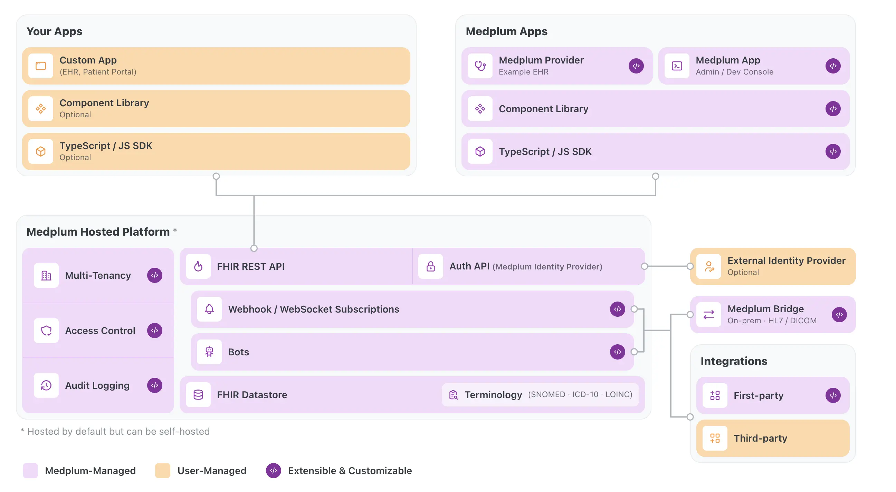

# [Medplum](https://www.medplum.com) &middot;     

Medplum is a developer platform that enables flexible and rapid development of healthcare apps.

We unify auth, access control, data, and automation into a single tenant-isolated system for your apps—whether built with our components and SDK or forked from our pre-built apps. Medplum Bridge connects on-prem systems, integrations extend your apps' capabilities, and our compliance and security are built in.

## Docs

- [Contributing](#contributing)
  - [Ground Rules](#ground-rules)

## Contributing

**We heartily welcome any and all contributions that match our engineering standards!**

That being said, this codebase isn't your typical open-source project because it's not a library or package with a
limited scope -- it's our entire product. As such, we're providing ground rules and paths to contributing below.

### Ground Rules

By making a contribution to this project, you are deemed to have accepted the [Developer Certificate of Origin](https://developercertificate.org/) (DCO).

All conversations and communities on Medplum are expected to follow GitHub's [Community Guidelines](https://help.github.com/en/github/site-policy/github-community-guidelines)
and [Acceptable Use Policies](https://help.github.com/en/github/site-policy/github-acceptable-use-policies). We expect
discussions on issues and pull requests to stay positive, productive, and respectful. Remember: there are real people on
the other side of the screen!

### Contributing Guidelines

- [Filing Issues](#filing-issues)
- [Writing Docs or Case Studies](#writing-documentation-or-case-studies)
- [Opening Pull Requests]

#### Filing Issues

If you found a technical bug on Medplum or have ideas for features we should implement, the [issue tracker](https://github.com/medplum/medplum/issues) is the best
place to discuss known issues and share new issues with us. ([Click here to open a new issue](https://github.com/medplum/medplum/issues/new)).

#### Writing Documentation or Case Studies

Did you learn how to do something using Medplum that wasn't obvious on your first try? By contributing your new knowledge
to our documentation, you can help others who might have a similar use case!

Our documentation is hosted on [medplum.com/docs](https://www.medplum.com/docs), but it is built from [Markdown](https://www.markdownguide.org/)
files in our [`docs` package](https://github.com/medplum/medplum/tree/main/packages/docs/docs).

For relatively small changes, you can edit files directly from your web browser on [GitHub.dev](https://github.dev/medplum/medplum/blob/main/packages/docs/docs/home.md)
without needing to clone the repository.

We are also always excited to showcase [case studies](https://www.medplum.com/case-studies), or to share relevant blog content! If you have built something cool on Medplum, please [reach out](mailto:support@medplum.com) for a case study/blog!

#### Opening Pull Requests

If there is an open issue that you would like to implement, feel free to follow the [local setup instructions](https://www.medplum.com/docs/contributing/local-dev-setup) and jump in! Our [Contributing documentation](https://medplum.com/docs/contributing) has
all the information you need to get started.

We have two labels for open issues where we would welcome community PR's:

- [Good first issue](https://github.com/medplum/medplum/issues?q=is%3Aissue%20state%3Aopen%20label%3A%22good%20first%20issue%22): good issues for beginners and newcomers
- [Open to commmunity](https://github.com/medplum/medplum/issues?q=is%3Aissue%20state%3Aopen%20label%3A%22open%20to%20community%22): reasonably well-scoped issues open to community PR's

## Thanks

Thanks to [Chromatic](https://www.chromatic.com/) for providing the visual testing platform that helps us review UI changes and catch visual regressions.

## License

[Apache 2.0](LICENSE.txt)
