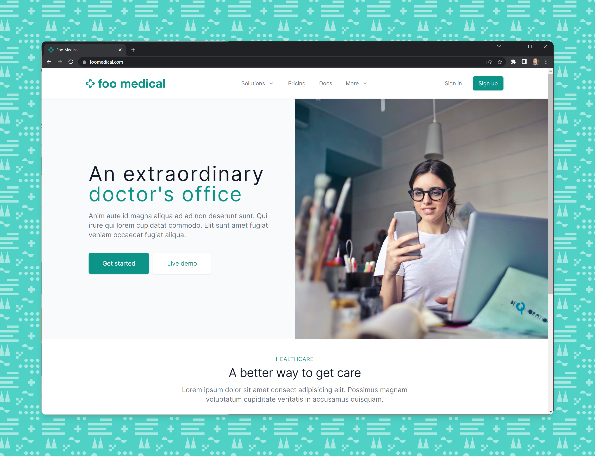

<h1 align="center">Foo Medical</h1>
<p align="center">A free and open-source healthcare webapp from the Medplum team.</p>
<p align="center">
  <a href="https://github.com/medplum/foomedical/actions">
    
  </a>
  <a href="https://github.com/medplum/foomedical/blob/main/LICENSE.txt">
    
  </a>
  <a href="https://sonarcloud.io/project/overview?id=medplum_foomedical">
    
  </a>
</p>



### What is Foo Medical?

[Foo Medical](https://foomedical.com/) is a **ready to use medical practice sample app** that's open source. It's meant for developers to clone, customize and run.

### Features

- Completely free and open-source
- Secure and compliant [Medplum](https://www.medplum.com) backend, which is also open source
- Patient registration and authentication
- Health records
  - Lab results
  - Medications
  - Vaccines
  - Vitals
- Patient-provider messaging
- Care plans
- Patient scheduling
- All data represented in [FHIR](https://hl7.org/FHIR/)

Foo Medical is designed to be forked and customized for your business' needs. Register on [foomedical.com](https://foomedical.com/) to see it in action.

### Getting Started

First, [fork](https://github.com/medplum/foomedical/fork) and clone the repo.

Next, install the app from your terminal

```bash
npm install
```

Then, run the app!

```bash
npm run dev
```

This app should run on `http://localhost:3000/`

Log into the app on localhost using the same credentials you created on [foomedical.com](https://foomedical.com/) and you are ready to start customizing.

### Deploying your app

To get started deploying your app we recommend making an account on [Vercel](https://vercel.com/), free accounts are available.

You can deploy this application by [clicking here](https://vercel.com/new/clone?s=https%3A%2F%2Fgithub.com%2Fmedplum%2Ffoomedical&showOptionalTeamCreation=false).

### Account Setup

By default, your locally running Foo Medical app is pointing to the hosted Medplum service. Foo Medical registers signups to a test project.

To send patients to your own organization you will need to [register a new Project on Medplum](https://docs.medplum.com/tutorials/app/register) and configure your environment variables to point to your own project (see [config.ts](https://github.com/medplum/foomedical/blob/main/src/config.ts) for an example).

If you are using the Medplum Hosted service, you can login to your Medplum Instance and add the following identifiers to your [Project Site Settings](https://app.medplum.com/admin/sites)

- Google Client Id
- Google Client Secret
- Recaptcha Site Key
- Recaptcha Secret Key

Contact the medplum team ([support@medplum.com](mailto:support@medplum.com) or [Discord](https://discord.gg/medplum])) with any questions.

### Data Setup

When you log into Foo Medical a set of sample FHIR records is created on your behalf. The ability to run automations is part of the Medplum platform using a framework called [Bots](https://docs.medplum.com/app/bots). For reference, Bot that created the records in Foo Medical can be found [here](https://github.com/medplum/medplum-demo-bots/blob/main/src/examples/sample-account-setup.ts).

### Compliance

Medplum backend is HIPAA compliant and SOC 2 certified. Getting an account set up requires registering on [medplum.com](https://www.medplum.com/). Feel free to ask us questions in real time on our [Discord Server](https://discord.gg/medplum).

### About Medplum

[Medplum](https://www.medplum.com/) is an open-source, API-first EHR. Medplum makes it easy to build healthcare apps quickly with less code.

Medplum supports self-hosting and provides a [hosted service](https://app.medplum.com/). [Foo Medical](https://foomedical.com/) uses the hosted service as a backend.

- Read our [documentation](https://docs.medplum.com/)
- Browse our [React component library](https://docs.medplum.com/storybook/index.html?)
- Join our [Discord](https://discord.gg/medplum)
