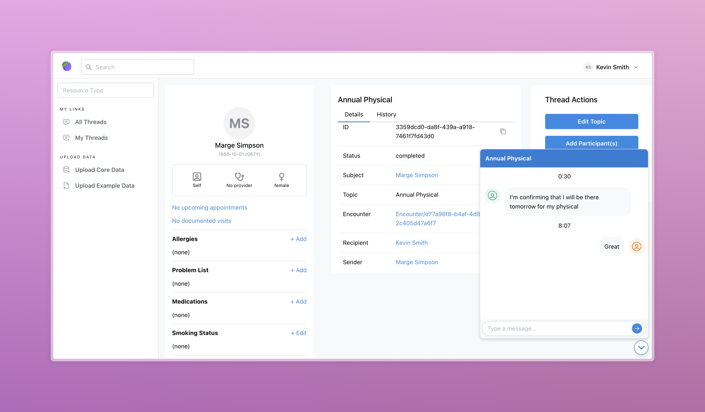

<h1 align="center">Medplum Chat Demo</h1>
<p align="center">A starter application for using the Medplum platform.</p>
<p align="center">
<a href="https://github.com/medplum/medplum-hello-world/blob/main/LICENSE.txt">
    
  </a>
</p>

This example app demonstrates the following:

- Creating a new React app with Vite and TypeScript to demonstrate [`Communication`](/packages/docs/api/fhir/resources/communication)-based workflows.
- A threaded [`Communiaction`](/docs/api/fhir/resources/communication) model.
- Creating thread-level and message-level [`Communication`](/packages/docs/api/fhir/resources/communication) resources.
- Sending and replying to messages.
- Realtime communication via WebSockets.
- Adding new participants to existing threads.
- Editing thread topics and categories.



### Code Organization

This repo is organized into two main directories: `src` and `data`.

The `src` directory contains the app, including a `pages` and `components` directory. In addition, it contains a `bots` directory, which has [Medplum Bots](/packages/docs/docs/bots/bot-basics.md) for use.

The `data` directory contains data that can be uploaded for use in the demo. The `example` directory contains data that is meant to be used for testing and learning, while the `core` directory contains resources, terminologies, and more that are necessary to use the demo.

### Getting Started

If you haven't already done so, follow the instructions in [this tutorial](https://www.medplum.com/docs/tutorials/register) to register a Medplum project to store your data.

[Fork](https://github.com/medplum/medplum/fork) and clone the main Medplum repo.

Move into the `medplum-chat-demo` directory.

```bash
cd examples/medplum-chat-demo
```

Next, install the dependencies

```bash
npm install
```

Then, run the app

```bash
npm run dev
```

This app should run on `http://localhost:3000/`

### About Medplum

[Medplum](https://www.medplum.com/) is an open-source, API-first EHR. Medplum makes it easy to build healthcare apps quickly with less code.

Medplum supports self-hosting, and provides a [hosted service](https://app.medplum.com/). Medplum Hello World uses the hosted service as a backend.

- Read our [documentation](https://www.medplum.com/docs)
- Browse our [react component library](https://docs.medplum.com/storybook/index.html?)
- Join our [Discord](https://discord.gg/medplum)
