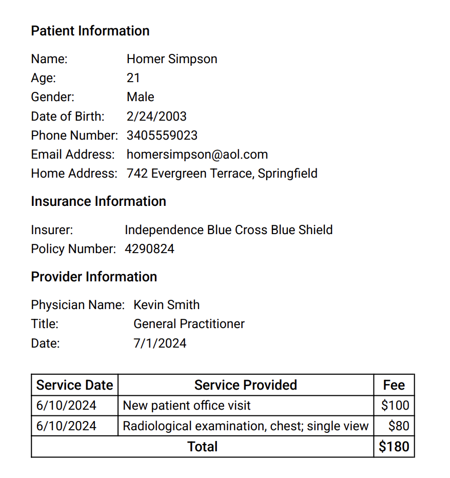

# Medplum Billing Demo Bots

This directory contains an example bot that can be used to implement billing workflows by creating representations of common forms. This includes a Superbill.

The implementation consists of a Superbill bot that creates a PDF of a superbill that can be provided to a client.

## Superbill

A Superbill is an itemized list of all services provided to a patient. The Superbill bot takes a [`QuestionnaireResponse`](../../../../packages/docs/docs/api/fhir/resources/questionnaireresponse.mdx) resource as an input. This questionnaire should provide all of the relevant encounters that are to be included on the Superbill.

To use this bot, you must have proper [`ChargeItemDefinition`](../../../../packages/docs/docs/api/fhir/resources/chargeitemdefinition.mdx) resources in your system. These are used to find the correct fee that should be charged for a given service. This should be mapped from the `serviceType` on the [`Encounter`](../../../../packages/docs/docs/api/fhir/resources/encounter.mdx) resource to the `useContext` of the [`ChargeItemDefinition`](../../../../packages/docs/docs/api/fhir/resources/chargeitemdefinition.mdx). Two [`ChargeItemDefinition`](../../../../packages/docs/docs/api/fhir/resources/chargeitemdefinition.mdx) resources are created as examples in the [Superbill test file](./superbill.test.ts).

The Superbill bot returns a simple PDF that has information about the patient, provider, and insurance as well as a table of the fees to be paid.

