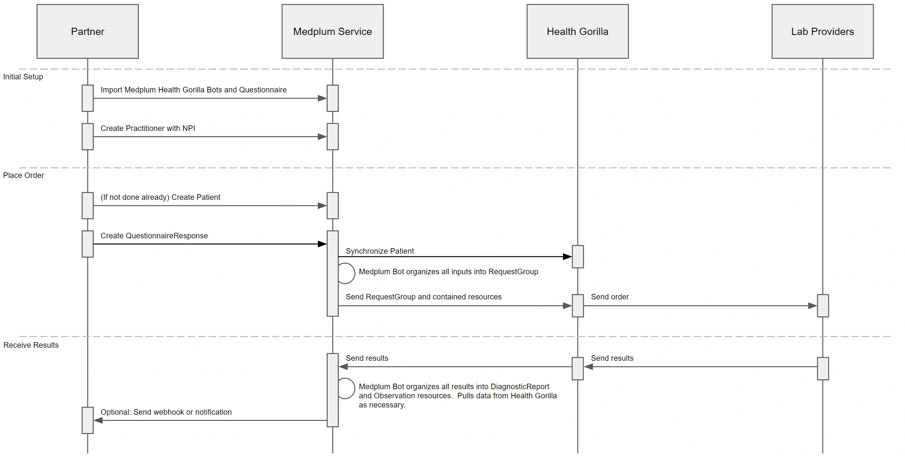

# Health Gorilla and Medplum

[Health Gorilla](https://www.healthgorilla.com/) is an interoperability platform providing permitted access to actionable patient data. Customers use Health Gorilla to improve outcomes, streamline workflows, and create a more equitable healthcare ecosystem.

## Overview

Lab ordering is a multistep process.



## Prerequisites

### Secrets

The demo bots expect a number of configuration settings in your Medplum Project Secrets. All of these values are available from the Health Gorilla portal.

| Secret Name                             | Description                                                  | Example                                         |
| --------------------------------------- | ------------------------------------------------------------ | ----------------------------------------------- |
| HEALTH_GORILLA_BASE_URL                 | API endpoint                                                 | `https://sandbox.healthgorilla.com`             |
| HEALTH_GORILLA_AUDIENCE_URL             | Audience URL                                                 | `https://sandbox.healthgorilla.com/oauth/token` |
| HEALTH_GORILLA_CLIENT_ID                | Client ID from Health Gorilla                                |                                                 |
| HEALTH_GORILLA_CLIENT_SECRET            | Client secret from Health Gorilla                            |                                                 |
| HEALTH_GORILLA_CLIENT_URI               | Client URI                                                   | `https://www.medplum.com`                       |
| HEALTH_GORILLA_USER_LOGIN               | User login of the API account                                | `medplum.api`                                   |
| HEALTH_GORILLA_PROVIDER_LAB_ACCOUNT     | The ordering provider lab account number                     |                                                 |
| HEALTH_GORILLA_TENANT_ID                | Your Health Gorilla tenant ID                                |                                                 |
| HEALTH_GORILLA_SUBTENANT_ID             | Your Health Gorilla subtenant ID                             |                                                 |
| HEALTH_GORILLA_SUBTENANT_ACCOUNT_NUMBER | The subtenant account number                                 |                                                 |
| HEALTH_GORILLA_SCOPES                   | OAuth scopes                                                 | `user/_._`                                      |
| HEALTH_GORILLA_CALLBACK_BOT_ID          | The bot ID of your bot with `receive-from-health-gorilla.ts` |                                                 |
| HEALTH_GORILLA_CALLBACK_CLIENT_ID       | Client ID of the Health Gorilla API user in Medplum          |                                                 |
| HEALTH_GORILLA_CALLBACK_CLIENT_SECRET   | Client secret of the Health Gorilla API user in Medplum      |                                                 |

### Organizations

You will also need a FHIR `Organization` resource representing each performing lab. For example:

```js
{
  "resourceType": "Organization",
  "name": "Testing Lab Facility",
  "identifier": [
    {
      "system": "https://www.healthgorilla.com",
      "value": "f-123412341234" // This value will be provided by Health Gorilla
    }
  ]
}
```

If you use multiple performing labs, you will need to create a separate `Organization` resource for each one.

## Sending Orders

The `send-to-health-gorilla.ts` demonstrates how to convert a `QuestionnaireResponse` into a Health Gorilla order.

The expected answers in the `QuestionnaireResponse` include:

1. `patient` - reference to the `Patient` resource
2. `practitioner` - reference to the `Practitioner` resource representing the ordering physician
3. `performer` - referenc to the `Organization` resource representing the performing lab facility
4. TODO: test details

The bot then does the following:

1. Gathers `Patient`, `Practitioner`, and order details
2. Validates the input data
3. Connects to the Health Gorilla API via JWT bearer token
4. Synchronizes the `Patient` in Medplum with the `Patient` in Health Gorilla
5. Retrieves the `Practitioner` from Health Gorilla
6. Asynchronously creates a FHIR `RequestGroup` in Health Gorilla

Once the `RequestGroup` is accepted, the order is "received". You can now wait for the results.

## Receiving Results

The `receive-from-health-gorilla.ts` demonstrates how to convert a Health Gorilla webhook into FHIR `DiagnosticReport` and `Observation` resources.

TODO
