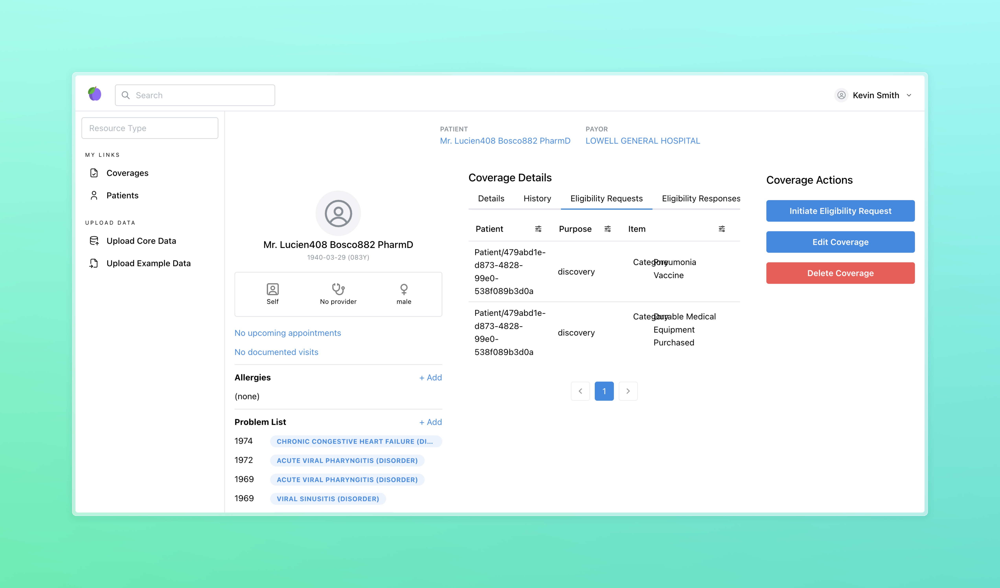

<h1 align="center">Medplum Eligibility Demo</h1>
<p align="center">A demo application for insurance coverage and related workflows.</p>
<p align="center">
<a href="https://github.com/medplum/medplum-hello-world/blob/main/LICENSE.txt">
    
  </a>
</p>

This example app demonstrates the following:

- Creating a new React app with Vite and TypeScript to demonstrate [`Coverage`](/docs/api/fhir/resources/coverage)-based workflows.
- Managing the insurance eligibility check workflow.
  - Initiating checks with the [`CoverageEligibilityRequest`](/docs/api/fhir/resources/coverageeligibilityrequest) resource.
  - Managing the status of [`CoverageEligibilityRequests`](/docs/api/fhir/resources/coverageeligibilityrequest)
  - Receiving and reviewing responses with the [`CoverageEligibilityResponse`](/docs/api/fhir/resources/coverageeligibilityresponse) resource.
- Creating [`Coverage`](/docs/api/fhir/resources/coverage) and [`CoverageEligibilityRequest`](/docs/api/fhir/resources/coverageeligibilityrequest) resources.
- Editing a [`Coverage`](/docs/api/fhir/resources/coverage) resource.
- Deleting a [`Coverage`](/docs/api/fhir/resources/coverage) resource.

In addition, the demo provides an example [`Bot`](/docs/api/fhir/medplum/bot) that mimics the workflow of an insurance eligibility check. It takes a [`CoverageEligibilityRequest`](/docs/api/fhir/resources/coverageeligibilityrequest) and returns a dummy [`CoverageEligibilityResponse`](/docs/api/fhir/resources/coverageeligibilityresponse).



### Code Organization

This repo is organized into two main directories: `src` and `data`.

The `src` directory contains the app, including `pages` and `components` directories. In addition, it contains a `bots` directory, which has [Medplum Bots](/packages/docs/docs/bots/bot-basics.md) for use. The bots in this directory are intended as an example, and will need to be modified by users for real-world use.

The `data` directory contains data that can be uploaded to use in the demo. The `example` directory contains data that is meant to be used for learning and testing, while the `core` directory contains resources, terminologies, and more that are required to use the demo.

### Getting Started

If you haven't already done so, follow the instructions in [this tutorial](https://www.medplum.com/docs/tutorials/register) to register a Medplum project to store your data.

[Fork](https://github.com/medplum/medplum-eligibility-demo/fork) and clone the repo.

Next, install the dependencies

```bash
npm install
```

Then, build the bots
```bash
npm run build:bot
```

Then, run the app

```bash
npm run dev
```

This app should run on `http://localhost:3000/`

### About Medplum

[Medplum](https://www.medplum.com/) is an open-source, API-first EHR. Medplum makes it easy to build healthcare apps quickly with less code.

Medplum supports self-hosting, and provides a [hosted service](https://app.medplum.com/). Medplum Hello World uses the hosted service as a backend.

- Read our [documentation](https://www.medplum.com/docs)
- Browse our [react component library](https://docs.medplum.com/storybook/index.html?)
- Join our [Discord](https://discord.gg/medplum)
