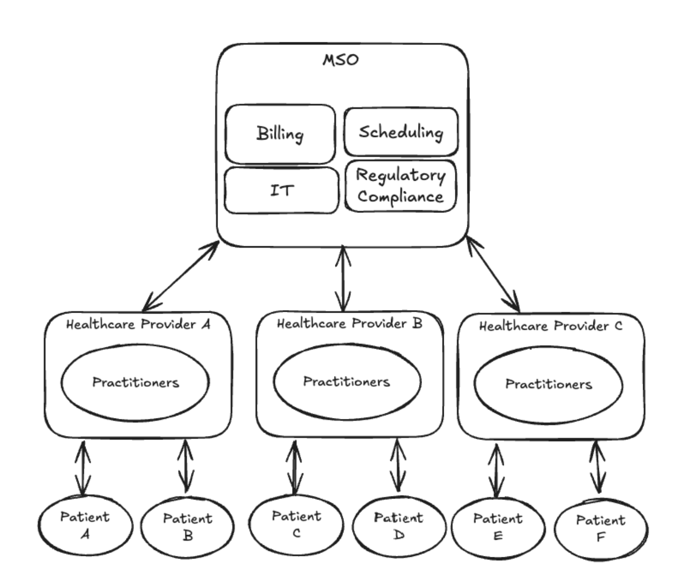
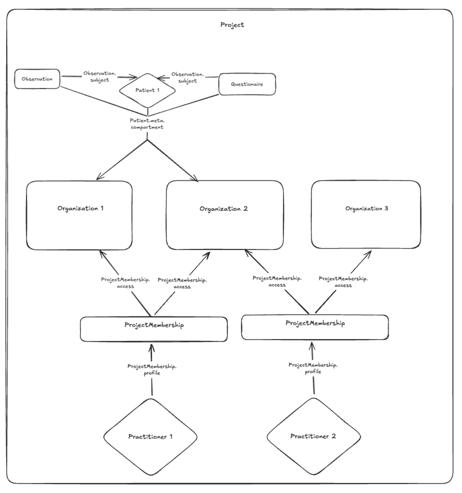

<h1 align="center">Medplum Managed Service Organization (MSO) Demo</h1>
<p align="center">A starter application for building a multi-tenant healthcare platform on Medplum.</p>
<p align="center">
<a href="https://github.com/medplum/medplum-mso-demo/blob/main/LICENSE.txt">
    
  </a>
</p>

This example app demonstrates the following:

- How to implement a multi-tenant healthcare platform where clinicians can work across multiple clinics
- How to use AccessPolicy to control data access based on organizational affiliations
- How to enroll and unenroll clinicians and patients in different organizations with automatic access policy updates


## Background
What is a Managed Service Organization (MSO)?

A Managed Service Organization (MSO) is a healthcare organization that provides services to multiple different healthcare organizations. 



For Managed Service Organizations (MSOs), complexity stems from practitioners potentially working across multiple tenants and patients potentially receiving care from multiple healthcare partners.

This demo implements a solution where:
- Tenants are separated as Organizations(clinics) within a single Medplum Project
- AccessPolicy controls limit clinician access to resources only within shared clinics
- Patients and clinicians can each be enrolled in multiple clinics



## Features

### Admin Features
- Create new clinics (Organizations)
- Create new clinicians (Practitioners)
- Enroll practitioners in one or more clinics
- Enroll patients in one or more clinics
- Manage access policies

### Clinician Features
- View patients, observations, diagnostic reports, encounters, and communications affiliated with their clinics - simulating what they would see in their EHR


## Code Organization

This repo is organized into several main directories:

- `src/pages`: Contains the React components for each page in the application
- `src/components`: Contains reusable UI components
- `src/data`: Contains the AccessPolicy definition and other core FHIR resources that can be uploaded
- `src/utils`: Contains utility functions for MSO enrollment methods and admin status checking

## Key Workflows

1. **Creating a new clinic**: Admins can create new Clinics to represent clinics
2. **Creating a new clinician**: Admins can create new Practitioners and assign them to Clinics
3. **Enrolling a practitioner in a clinic**: Configures access policies for that Practitioner to be able to read/write to all Patients in that Clinic
4. **Enrolling a patient in a clinic**: Configures access policies for Clinicians in that Clinic to be able to read/write to that Patient
5. **Viewing patient data**: Practitioners can only see patients and their clinical data if they share an organizational affiliation

## Getting Started

If you haven't already done so, follow the instructions in [this tutorial](https://www.medplum.com/docs/tutorials/register) to register a Medplum project to store your data.

[Fork](https://github.com/medplum/medplum-mso-demo/fork) and clone the repo to your local machine.

Next, install the dependencies.

```bash
npm install
```

Then, run the app

```bash
npm run dev
```

This app will run on `http://localhost:3000` and connect to a hosted Medplum project at `https://api.medplum.com/` by default.

## Setting Up Your Demo

1. **Upload Access Policy**: Navigate to "Upload Access Policy" in the sidebar and upload the default AccessPolicy
2. **Create Clinics**: Create multiple Clinics to represent different clinics
3. **Create Clinicians**: Create Clinicians and assign them to one or more Clinics
4. **Create Patients**: Create Patients and enroll them in one or more Clinics
5. **Test Access Control**: Log in as different clinicians to verify they can only see patients and data from their affiliated clinics

## Resources Used

This demo uses the following FHIR and Medplum resources:
- **AccessPolicy**: Defines the access rules for clinicians to resources across the project
- **Organization**: Represents a clinic
- **Practitioner**: Represents a clinician
- **ProjectMembership**: Stores references to the clinics that the clinician can access
- **Patient**: Represents an individual receiving care
- **Observation**: Represents clinical measurements and findings
- **DiagnosticReport**: Represents diagnostic test results
- **Encounter**: Represents patient visits
- **Communication**: Represents communications between clinicians

## About Medplum

[Medplum](https://www.medplum.com/) is an open-source, API-first EHR. Medplum makes it easy to build healthcare apps quickly with less code.

Medplum supports self-hosting and provides a [hosted service](https://app.medplum.com/). Medplum MSO Demo uses the hosted service as a backend.

- Read our [documentation](https://www.medplum.com/docs)
- Browse our [react component library](https://storybook.medplum.com/)
- Join our [Discord](https://discord.gg/medplum) 