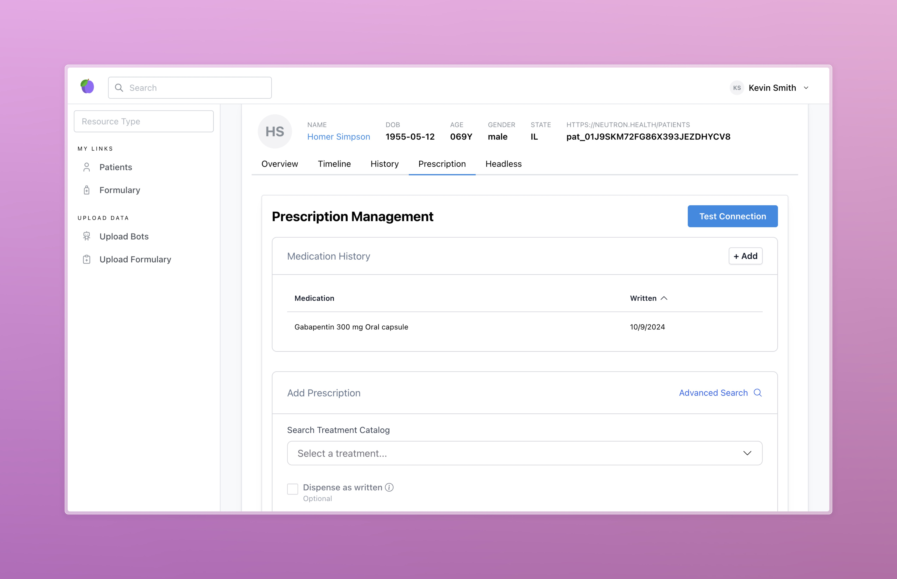
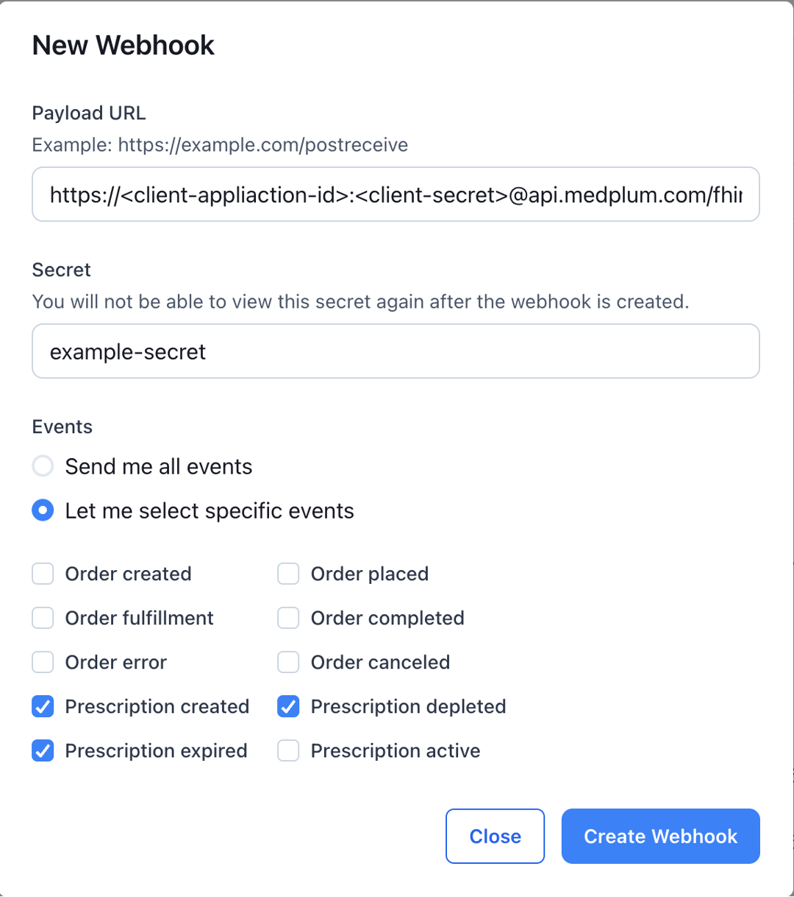

<h1 align="center">Medplum Photon Integration</h1>
<p align="center">A starter application for integrating the Medplum platform with Photon Health.</p>
<p align="center">
<a href="https://github.com/medplum/medplum-hello-world/blob/main/LICENSE.txt">
    
  </a>
</p>

This example app demonstrates the following:

- Creating a new React app with Vite and TypeScript
- Syncing your patients to your Photon project
- Syncing your drug formulary or catalog to your Photon project. For more details on formularies, see the [Modeling a Formulary docs](/packages/docs/docs/medications/formulary/index.mdx)
- Writing prescriptions and medication orders in Photon from within your Medplum project



### Code Organization

This demo is organized into two main directories: `src` and `data`.

The `src` directory contains the React app that implements the prescription UI. In addition it contains a `bots` directory, which has [Medplum Bots](/packages/docs/docs/bots/bot-basics.md) to implement syncing patients, syncing your formulary, and receiving webhooks from Photon.

The `data` directory contains sample data that can be uploaded for use in the demo app.

### Getting Started

If you haven't already done so, follow the instructions in [this tutorial](https://www.medplum.com/docs/tutorials/register) to register a Medplum project to store your data.

[Fork](https://github.com/medplum/medplum/fork) and clone the main Medplum repo.

Move into the `medplum-photon-integration` directory

```bash
cd examples/medplum-photon-integration
```

If you want to change any environment variables from the defaults, copy the `.env.defaults` file to `.env`

```bash
cp .env.defaults .env
```

And make the changes you need. You should add your PHOTON_CLIENT_ID and PHOTON_ORG_ID to the `.env` file.

Next, install the dependencies

```bash
npm install
```

Then, run the app

```bash
npm run dev
```

This app should run on `http://localhost:3000/`

### Setting Up Photon

To use this app, you will also need to sign up for a Photon Health account, which can be done [here](https://photon.health/sign-up).

This app interfaces with Photon's sandbox environment, called Neutron Health. Follow their [Getting Started guide](https://docs.photon.health/docs/getting-started) to set up a Neutron App project.

Once your Neutron project is created, you will need to set up credentials for the following items to ensure it works properly with Medplum:

- Photon Auth Token
- Photon Elements
- Photon Webhooks

#### Photon Auth Token

This app reads and writes from Neutron's API, which requires the auth token from your Nuetron project. Authentication is handled by bots, but the necessary secrets must be set up in your Medplum project.

These credentials can be accessed in your [Neutron project](https://app.neutron.health) by navigating to your project settings and clicking on the Developers Tab. Copy the Client ID and Client Secret from the Machine to Machine Application section. If this section does not appear in your settings, you will need to reach out to Photon Support at `support@photon.health` to ensure that it is properly set up.

Once you have copied your Client ID and Client Secret you will need to add these as secrets in your Medplum project. This can be done in the [Medplum App](https://app.medplum.com). Navigate to admin page by clicking on `Project` in the Admin section of the sidebar. In the `Secrets` tab, click `Add Secret` and create secrets for your Client ID and Secret with names of `PHOTON_CLIENT_ID` and `PHOTON_CLIENT_SECRET`. **These names are used in this app to access these values, so if you use different names, you will need to manually update the code to reflect your own names.**

#### Photon Elements

To enable Photon Elements you will need the Single Page Application Client ID and the Organization ID from your Neutron project. These can be found in the settings section of the [Neutron App](https://app.neutron.health). The Client ID is found in the Single Page Application section of the Developers tab, while the Organization ID is found in the Organization tab.

Copy these values into the corresponding variables in the [config file](./src/config.ts) in this project's `src` directory. These values will link Photon elements to your project, allowing you to log in and authenticate to create prescriptions from within this demo.

#### Photon Webhooks

This demo listens for webhooks from Photon Health and executes bots when an order or prescription is created or updated. This requires setting up the webhooks in your Neutron project using information from your Medplum project.

**Note: Your bots must be deployed and uploaded to your Medplum project prior to setting up webhooks.**

To set up webhooks, access the [Neutron App](https://app.neutron.health) and navigate to the Developers tab of the Settings page. At the bottom of the page is a Webhooks section. Click on `Add Webhook` to open a modal that will allow you to set up your webhooks.

The Payload URL should be the execute endpoint for the bot that will handle this webhook. This is formatted as `https://<client-application-id>:<client-secret>@api.medplum.com/fhir/R4/Bot/<bot-id>/$execute`. The client application ID and client secret in this url refer to your Medplum application ID and client secret. These can be found in the [Medplum App](https://app.medplum.com) in the details for your [`ClientApplication`](/packages/docs/docs/api/fhir/medplum/clientapplication.mdx) resource. Note that only admins can access this resource. For more details on the execute endpoint see the [Bot Execute docs](/packages/docs/docs/api/fhir/operations/bot-execute.mdx).

The Secret can be any string, but it is recommended to use a UUID. **Medplum currently does not pass along the webhook header to the executing bot. Because of this, this secret will not be used to verify the event. In the future, this will be updated to include the header so we can verify webhooks as they come through. Since this is not used, you can set the secret to an empty string if you wish.**

In the events section, select `Let me select specific events.` This demo implements two bots: one for prescription events and one for order events. For your order events bot, select all of the events corresponding to orders. For the prescription bot, select all prescription events **except for the `photon:prescription:active` event.** This is an uncommon edge case that is not supported by this demo.



### About Medplum

[Medplum](https://www.medplum.com/) is an open-source, API-first EHR. Medplum makes it easy to build healthcare apps quickly with less code.

Medplum supports self-hosting, and provides a [hosted service](https://app.medplum.com/). Medplum Hello World uses the hosted service as a backend.

- Read our [documentation](https://www.medplum.com/docs)
- Browse our [react component library](https://storybook.medplum.com/)
- Join our [Discord](https://discord.gg/medplum)
