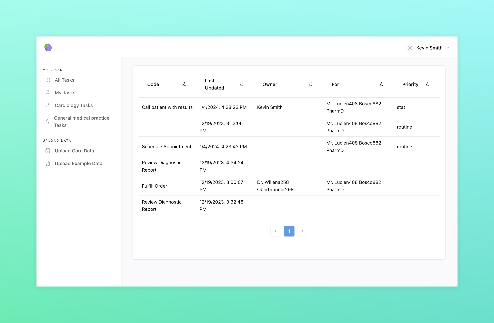

<h1 align="center">Medplum Task Demo App</h1>
<p align="center">A starter application for using the `Task` resource and related workflows with the Medplum platform.</p>
<p align="center">
<a href="https://github.com/medplum/medplum-hello-world/blob/main/LICENSE.txt">
    
  </a>
</p>

This example app demonstrates the following:

- Creating a new React app with Vite and TypeScript to demonstrate [`Task`](/docs/api/fhir/resources/task)-based workflows
- Managing the [`Task`](/docs/api/fhir/resources/task) lifecycle: Creating, assigning, and completing tasks
- Creating a [`Task`](/docs/api/fhir/resources/task)
- Editing a [`Task`](/docs/api/fhir/resources/task)
- Deleting a [`Task`](/docs/api/fhir/resources/task)
- Viewing [`Task`](/docs/api/fhir/resources/task) queues that are relevant to the user



### Code Organization

This repo is organized in two main directories: `src` and `data`.

The `src` directory contains the entire app, including `pages` and `components` directories. In addition, it contains a `bots` directory which has [Medplum Bots](/packages/docs/docs/bots/index.md) for use. The bots in the `example` directory are intended to be modified or extended by users, while those in `core` can be used to handle core workflows without modification.

The `data` directory contains data that can be uploaded to use the demo. In the `example` directory is data that is meant to be used for learning and testing, not production. The `core` directory contains resource, terminologies, and more that are required to use this demo.

### Getting Started

If you haven't already done so, follow the instructions in [this tutorial](https://www.medplum.com/docs/tutorials/register) to register a Medplum project to store your data.

[Fork](https://github.com/medplum/medplum-task-demo/fork) and clone the repo.

Next, install the dependencies

```bash
npm install
```

Then, build the bots
```bash
npm run build:bots
```

Then, run the app

```bash
npm run dev
```

This app should run on `http://localhost:3000/`

### About Medplum

[Medplum](https://www.medplum.com/) is an open-source, API-first EHR. Medplum makes it easy to build healthcare apps quickly with less code.

Medplum supports self-hosting, and provides a [hosted service](https://app.medplum.com/). Medplum Hello World uses the hosted service as a backend.

- Read our [documentation](https://www.medplum.com/docs)
- Browse our [react component library](https://docs.medplum.com/storybook/index.html?)
- Join our [Discord](https://discord.gg/medplum)
