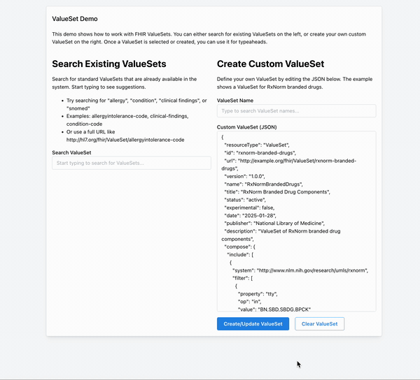

# ValueSet Demo Project

## Overview

This demo project showcases how to work with FHIR ValueSets in a React application using the Medplum SDK. It demonstrates two key functionalities:

1. Searching and using existing ValueSets
2. Creating and registering custom ValueSets



## Getting Started

If you haven't already done so, follow the instructions in [this tutorial](https://www.medplum.com/docs/tutorials/register) to register a Medplum project to store your data.

[Fork](https://github.com/medplum/medplum-valueset-selector/fork) and clone the repo to your local machine.

If you want to change any environment variables from the defaults, copy the `.env.defaults` file to `.env`

```bash
cp .env.defaults .env
```

And make the changes you need.

Next, install the dependencies

```bash
npm install
```

Then, run the app

```bash
npm run dev
```

This app should run on `http://localhost:3000/`

## Features

### ValueSet Search

- Search for standard ValueSets using their URLs
- Built-in examples of common ValueSets (allergyintolerance-code, clinical-findings)
- Real-time search results with error handling
- Integration with Medplum's CodingInput component for selecting codes

### Custom ValueSet Creation

- Create custom ValueSets using a JSON editor
- Pre-filled example template for common allergies
- Validation of ValueSet structure
- Duplicate URL checking
- Immediate availability of created ValueSets

## Technical Implementation

### Dependencies

- @medplum/react - Core Medplum React components
- @medplum/fhirtypes - FHIR type definitions
- @mantine/core - UI component library

### Key Components

```typescript
// Main imports
import { CodingInput, Document, ResourceName, useMedplum } from '@medplum/react';
import { ValueSet } from '@medplum/fhirtypes';
import { Title, Group, TextInput, Box, Textarea, Button, Alert, Grid } from '@mantine/core';
```

### ValueSet Structure

The demo uses the following FHIR ValueSet structure:

```json
{
  "resourceType": "ValueSet",
  "url": "http://example.org/custom-allergies",
  "name": "CustomAllergies",
  "title": "Custom Allergies Value Set",
  "status": "active",
  "expansion": {
    "identifier": "http://example.org/custom-allergies",
    "timestamp": "2024-01-21T00:00:00Z",
    "contains": [
      {
        "system": "http://example.org/custom-allergies",
        "code": "apple",
        "display": "Apple"
      }
      // ... additional codes
    ]
  }
}
```

### Important Functions

#### Search ValueSet

```typescript
const searchValueSet = async (term: string) => {
  const result = await medplum.search('ValueSet', {
    url: term,
  });
  // Process results...
};
```

#### Create ValueSet

```typescript
const handleCreateValueSet = async () => {
  // Validate JSON and check for duplicates
  const valueSetData = JSON.parse(customValueSet);
  const newValueSet = await medplum.createResource(valueSetData as ValueSet);
  // Handle success/error...
};
```

## Usage Guide

### Searching for ValueSets

1. Enter a ValueSet URL in the search box
2. The system will attempt to find the ValueSet
3. If found, you can use it with the CodingInput component

### Creating Custom ValueSets

1. Edit the JSON in the textarea on the right
2. Ensure your ValueSet has a unique URL
3. Click "Create ValueSet"
4. The new ValueSet will be immediately available for use

### Tips

- Always ensure your custom ValueSet URLs are unique
- Make sure all codes in a custom ValueSet have a system, code, and display value
- Use the expansion block for better compatibility with ValueSet operations
- Test your custom ValueSet by searching for it after creation

## Common Issues and Solutions

### 404 Errors

If you get 404 errors when expanding a ValueSet:

- Ensure the system URLs in your concepts match the ValueSet's URL
- Verify the ValueSet structure follows the FHIR specification
- Check that all required fields are present

### Duplicate URLs

If you get a duplicate URL error:

- Choose a different URL for your custom ValueSet
- Or update the existing ValueSet instead of creating a new one

## Next Steps

Possible enhancements for this demo:

- Add ValueSet validation against FHIR profiles
- Implement ValueSet version control
- Add support for hierarchical ValueSets
- Include more advanced search options
- Add export/import functionality
