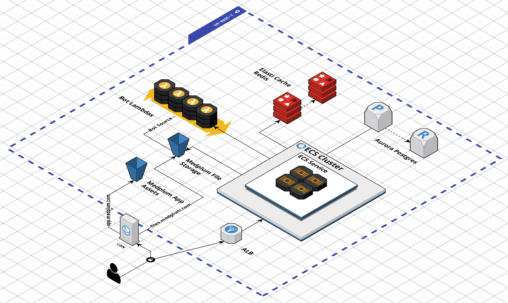

# Medplum Infra

CDK scripts to setup the full stack:

- S3 + CloudFront for static site
- VPC for private network
- Fargate for backend server
- Aurora RDS for database



### Install

Medplum uses [npm workspaces](https://docs.npmjs.com/cli/v8/using-npm/workspaces) for a monorepo configuration.

See [Developer Setup](https://www.medplum.com/docs/contributing) for cloning the repository and installing dependencies.

### Deploy

First, create a configuration file.

Next, it is strongly recommended to `diff` changes before deploying.

```bash
npx cdk diff -c config=my-config.json
```

```bash
npx cdk deploy -c config=my-config.json
```

### Destroy

```
npx cdk destroy
```

### Front End

Based on: https://github.com/aws-samples/aws-cdk-examples/tree/master/typescript/static-site

Creates:

- S3 Bucket
- CloudFront distribution
- SSL Certificate
- Route 53 Entries

### Back End

Based on: Based on: https://github.com/aws-samples/http-api-aws-fargate-cdk/blob/master/cdk/singleAccount/lib/fargate-vpclink-stack.ts

Creates:

- VPC
- Security Groups
- Fargate Task and Service
- CloudWatch Log Groups
- Load Balancer
- SSL Certificate
- Route 53 Entries

### Storage

Based on:

The CloudFront distribution requires a public key for signature verification.

Generate a 2048 bit RSA key:

```sh
openssl genrsa -des3 -out private.pem 2048
```

Export the public key to a file:

```sh
openssl rsa -in private.pem -outform PEM -pubout -out public.pem
```

Open the `public.pem` file and ensure that it starts with `-----BEGIN PUBLIC KEY-----`. This is how you know that this file is the public key of the pair and not a private key.

Add the public key to the CDK infrastructure configuration.

Add the private key to the server configuration settings (JSON, AWS Parameter Store, etc).

### GuardDuty Malware Protection for S3

`buildGuardDutyMalwareProtection` attaches GuardDuty Malware Protection for S3 to an existing bucket, creates the required IAM scan role, and adds a tag-based bucket policy that can deny reads until GuardDuty tags an object with `GuardDutyMalwareScanStatus=NO_THREATS_FOUND`.

Example:

```ts
import { aws_iam as iam, aws_s3 as s3 } from 'aws-cdk-lib';
import { buildGuardDutyMalwareProtection } from '@medplum/cdk';

const bucket = new s3.Bucket(this, 'Uploads', {
  encryption: s3.BucketEncryption.S3_MANAGED,
});

buildGuardDutyMalwareProtection(this, 'UploadsGuardDuty', {
  bucket,
  consumerPrincipals: [new iam.AccountRootPrincipal()],
  scanPrefixes: ['uploads/', 'bulk-import/'],
});
```

GuardDuty can scan all objects or up to 5 prefixes. Prefix scoping reduces cost when only part of a bucket receives untrusted uploads. Tagging must be enabled when the protection plan is created; objects uploaded before the plan exists are not retroactively tagged.
