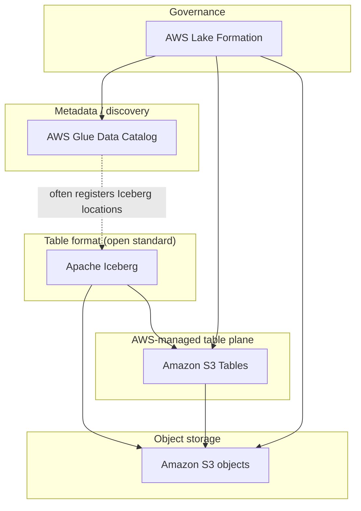

# AWS data lake components

## Background

This package exports Postgres `AuditEvent` data to **Apache Iceberg** tables, either into a normal **S3** bucket or into **Amazon S3 Tables** (managed Iceberg). The sections below clarify how **Iceberg**, **S3**, **AWS Glue**, **S3 Tables**, and **AWS Lake Formation** relate so they are easier to tell apart.

### Apache Iceberg

**Iceberg** is an open table format, not an AWS product. It defines how data files (often Parquet), manifests, snapshots, and schema evolution are laid out and committed. Query engines (DuckDB in this package, Spark, Athena, and others) use Iceberg to read and write **consistent** tables on top of object storage.

In short: **Iceberg is the contract for what a “table” is on top of files.**

### Amazon S3

**S3** is object storage: the durable bytes (Parquet files, Iceberg metadata JSON, etc.). The README’s unmanaged export path (`--s3-bucket`) writes Iceberg-compatible layout into a bucket you control without requiring other AWS data-lake services.

### Amazon S3 Tables

**S3 Tables** is AWS’s **managed** surface for **Iceberg** tables: AWS runs the table bucket, APIs, and integrations so clients target a **table bucket ARN** (for example `arn:aws:s3tables:us-east-1:123456789012:bucket/my-bucket`) instead of you wiring every catalog detail yourself. Storage is still ultimately on S3; the difference is **who owns the table-management and integration story** (you vs AWS).

The README’s S3 Tables path uses `--aws-s3-table-arn` for this mode.

### AWS Glue

**Glue** is a family of services; the name often refers to different layers:

| Piece | Role |
| --- | --- |
| **AWS Glue Data Catalog** | A Hive-compatible **metastore**: databases, tables, columns, partitions. Athena, EMR, and Glue jobs often use it so engines know *where* tables are. |
| **Glue ETL / Crawlers** | **Jobs** that move or transform data and **crawlers** that infer schema and register tables in the catalog. |

Iceberg tables **can** be registered in the Glue Data Catalog (a common pattern: Iceberg + S3 + catalog in Glue). They **do not** require Glue ETL; this export tool uses DuckDB, not Glue Spark.

**Glue Data Catalog** is the metadata phone book; **Glue jobs** are optional compute to populate or transform data.

### AWS Lake Formation

**Lake Formation** is a **governance and access-control** layer: it can **register** data lake resources (S3 locations, Glue catalog resources, and integrations such as S3 Tables), manage **permissions** (often finer than raw IAM on prefixes), and work with IAM and LF-tags.

You may register **S3 Tables** with Lake Formation so central policies apply to those table buckets alongside classic S3 prefixes.

### How they fit together

### Quick reference

| Question | Answer |
| --- | --- |
| Is Iceberg the same as Glue? | **No** — Iceberg is an open format; Glue is AWS (catalog and optional jobs). |
| Do I need Glue to use Iceberg on S3? | **No** — the unmanaged bucket export path does not depend on Glue. |
| Is S3 Tables the same as “tables in S3”? | **Not exactly** — S3 Tables is a **specific AWS product** for managed Iceberg with `s3tables` ARNs, as opposed to a generic bucket you manage end to end. |
| Where does Lake Formation sit? | **Above** storage and table resources: **registration and access control**, including S3 Tables when registered. |
