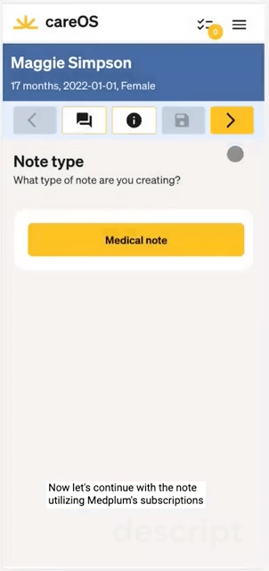

# Digital Health is an Operations Game

Digital health companies are at the forefront of revolutionizing patient experience by combining quality care, at lower costs, and at national scale. Typically, they target a specific healthcare niche, concentrating on _top-notch execution_. Their ultimate goal? To merge an exceptional patient experience with smooth operations behind the scenes.

When operations are executed right, patients have a seamless experience - everything Just Works TM. At Medplum, we've worked with many excellent digital health implementations, and there are four foundational elements that make their operations truly stand out:

1. [Well-defined Service Menu](#well-defined-service-menu)
2. [Top of License Care](#top-of-license-care)
3. [Fifty-state Workflow](#fifty-state-workflow)
4. [Asynchronous / Hybrid Care Models](#asynchronous-care)

To implement these elements, companies need IT infrastructure that can be tailored to their service niche.

_Traditional EHRs weren't built for this_ - rather, they were built to serve a broad healthcare domain at a smaller scale, typically within the four walls of a single site.

## Well-Defined Service Menu

Successful digital health operations start with a crystal-clear understanding of their clinical service menu. From an IT standpoint, this means defining your codes:

- [ICD-10](https://www.icd10data.com/) and [CPT](https://www.ama-assn.org/practice-management/cpt/cpt-overview-and-code-approval) codes for services
- [LOINC](/docs/careplans/loinc) codes for diagnostics
- [RXNorm](/docs/medications/medication-codes#rxnorm) codes for medications

A well-defined scope not only sets the stage for streamlined integration and billing, but also paves the way for a superior clinical experience. Instead of using one-size-fits-all EHRs, developers can build dedicated interfaces for physicians, highlighting only the necessary data for that specific care context.

The result? Reduced data entry, no physician burnout, and easier clinician recruitment. That's why Medplum provides a truly headless platform - to empower developers to create purpose-built physician experiences.

:::tip Example: Summer Health

[Summer Health](https://www.summerhealth.com/) had clear understanding of their service menu: **non-acute, pediatric care over SMS**. They built a provider charting experience from the ground up, with a focus on fast, mobile-first charting.

Some of their design innovations were:

- Using **buttons, not drop-downs**, to select from the most common patient complaints reduced data entry mistakes.
- Integrating an **LLM summarization** of the SMS exchange between provider / patient exchange significantly reduced typing time.
- Implementing a **paginated workflow** for each encounter made efficient use of the mobile screen real estate and reduced physician frustration.

The cumulative effect of these changes was to convert charting from a chore to a delight. Physicians spent more time on patient care, and less time and energy on charting.

:::

## Top of License Care

Delivering high quality care at reasonable cost means that everyone is working at the "top of their license". MDs and NPs focus diagnosing, prescribing, and designing care plans; care coordinators handle administrative inquiries.

To implement this model at scale, operations teams need to [develop a clear ontology](https://www.forbes.com/sites/sachinjain/2022/04/04/the-great-american-healthcare-labor-arbitrage/?sh=591613766133) of clinical tasks and roles that mirrors their care model, and manage them in a unified task system. The challenge is ensuring tasks are automatically directed to the professional, while still being able to escalate when needed.

Many traditional EHRs make offer a fixed clinical workflow, or offer limited configurability. Most of them cater to MDs, but don't account for care coordinators, customer success representatives, fulfillment teams, and the host of other roles that make up the digital health care workforce.

Platforms like Medplum offer a layer of programmability on top of the [FHIR Task model](/docs/careplans/tasks), which allows developers to implement the precise clinical workflow model. Tasks can be organized into queues and assigned based on credentials and availability. And by integrating these automations (i.e. [Bots](/docs/bots)) into the [software development lifecycle](/docs/bots/bots-in-production), operations teams can test workflow changes before deploying and release with confidence.

For a deeper dive, check out our [guide on Task-based workflows](/docs/careplans/tasks).

## Fifty-State Workflow

One of the game-changing innovations of digital health was the ability to serve patients across all 50 states. But this evolution brought with it a significant challenge: managing physician licensure and credentials nationwide.

Operations teams need to make sure that enough physicians with the correct licenses are staffed to serve their patient population. They need to account for differing physician specialties, regulatory restrictions, and vacations across service lines.

The key to managing this complexity is having the right data model. How can you manage physician coverage if you don't even know which licenses they have? Traditional EHRs fall short here, as they presume a single-site deployment.

Leveraging the FHIR standard, platforms like Medplum offer the building blocks for tracking physician credentials, specialties, and care teams. For more insights, take a look at our guides on provider [organizations](/docs/administration/provider-directory/provider-organizations), [credentials](/docs/administration/provider-directory/provider-credentials), and [payor networks](/docs/administration/provider-directory/provider-networks).

## Asynchronous Care

The rise of telehealth, catalyzed by the pandemic, was the first step in unlocking the potential of digital care. But digital health is more than just video calls. Not every patient concern needs to be handled face-to-face.

Allowing physicians to deliver care asynchronously allows them to scale themselves more effectively. It also opens up a number of different interaction media for patients: SMS, video message, in-app chat, etc.

While many traditional EHRs have chat functionality, their visit-centric model makes them ill-suited to async-first care. What is considered a "visit" in the age of day-long text chains?

Platforms like Medplum present the tools to craft your care delivery, even if it adopts a partially or completely asynchronous model. Our [guide on asynchronous encounters](/docs/communications/async-encounters) provides an example of how you can build your async care model from FHIR primitives.

## The Digital Health Operations Playbook

1. **Define your Service Menu:** For each clinical service line, clearly outline the relevant CPT, ICD-10, RxNorm, and LOINC codes. Focus on the essential data entry requirements from patients and physicians and prioritize data-entry efficiency.

2. **Diagram your Operations:** Map out the clinical tasks required, identify the roles responsible for each task, and determine data access restrictions for each role. A visual representation, such as a flow-chart, of your end-to-end clinical operations can be immensely beneficial.

3. **Map out your Provider Organization:** Have a keen understanding of the availability and qualifications of each provider to ensure availability and access to care.

4. **Define the Encounter Model:** In the digital age, redefining the patient encounter is crucial. Understand the mediums, methods, and tools at your disposal and craft a model that best serves your patients and practitioners alike.

Remember, in the rapidly evolving world of digital health, operations are more than just a behind-the-scenes affair. It's the backbone that defines patient experience and sets the stage for a future of healthcare that is efficient, effective, and truly global.
