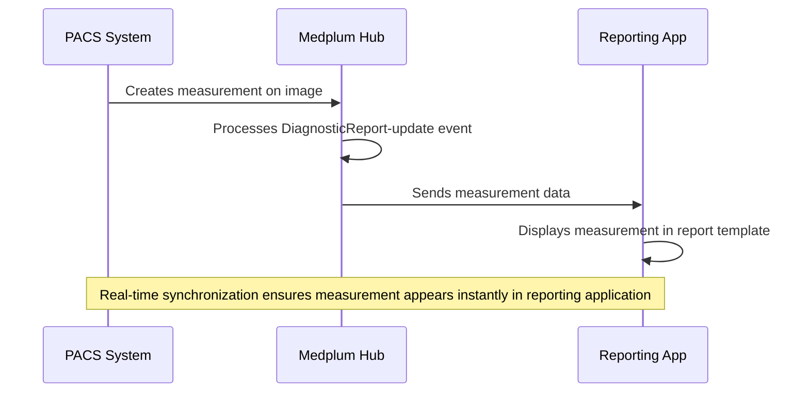
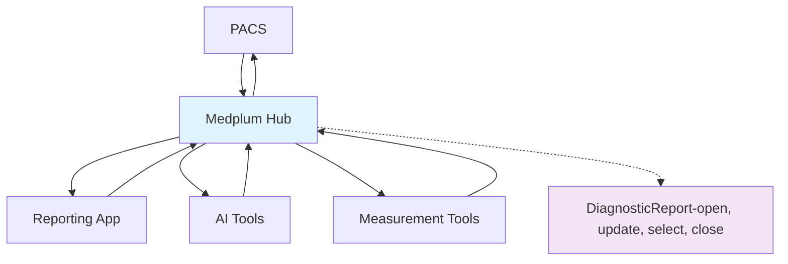

# Medplum Achieves IRA Certification for Radiology Interoperability

Medplum has become one of the first platforms to achieve certification for the **Hub role** in the Integrated Reporting Applications (IRA) IHE Profile, marking a milestone in radiology workflow interoperability. This certification positions Medplum as a central orchestrator for real-time synchronization between radiology applications, addressing one of healthcare's most persistent challenges: fragmented diagnostic workflows.

The IRA profile, published in October 2023 by Integrating the Healthcare Enterprise (IHE), represents a **transformative approach** to radiology interoperability. Built on [FHIRcast](/docs/fhircast) 3.0.0 and FHIR R5 standards, IRA enables different applications—from PACS systems to AI tools—to share context and content seamlessly during diagnostic reporting. For Medplum, certification as a FHIRcast Hub means our platform can now coordinate complex radiology workflows where multiple applications must work together in harmony.

<!-- truncate -->

## The Radiology Workflow Challenge IRA Solves

Today's radiologists navigate **disconnected systems** during their daily work. A typical workflow involves juggling between three to five applications simultaneously: PACS for image viewing, RIS for patient scheduling, dictation systems for reporting, and increasingly, AI tools for analysis/reporting. Each system operates in isolation, requiring manual synchronization that costs radiologists 1-2 minutes per patient—time that adds up to significant productivity losses across thousands of daily studies.

Manual data entry between systems introduces errors, while the **cognitive burden** of constant context switching contributes to radiologist burnout.

IRA addresses these challenges through **intelligent application synchronization**. When a radiologist opens a chest CT in their PACS system, IRA automatically synchronizes the reporting application, AI tools, and any other connected systems to the same patient and study. This seemingly simple capability eliminates thousands of manual clicks daily while dramatically reducing the risk of context-related errors.

## Understanding IRA's Technical Architecture

At its core, IRA leverages **FHIRcast**, a modern publish-subscribe protocol designed for real-time healthcare application communication. As the certified Hub, Medplum serves as the central nervous system for radiology workflows, managing multiple concurrent sessions and ensuring all connected applications stay synchronized.

The profile defines **five key actors** in the radiology ecosystem. Image Display applications present studies for diagnostic review. Report Creators handle dictation and structured reporting. Content Creators generate clinical evidence like measurements and annotations. Evidence Creators perform advanced visualization and AI analysis. The Hub—Medplum's certified role—orchestrates communication between all these actors through standardized events.

Four primary events drive the **synchronization workflow**. `DiagnosticReport-open` fires when a radiologist selects a study, establishing the anchor context for all connected applications. `DiagnosticReport-update` shares clinical content like measurements or AI findings across the ecosystem. `DiagnosticReport-select` indicates when specific content needs attention, enabling features like synchronized highlighting. `DiagnosticReport-close` cleanly terminates the session when reporting completes.

## How FHIRcast Powers Real-Time Synchronization

FHIRcast provides the **underlying communication infrastructure** that makes IRA possible. Using WebSocket connections for real-time notifications and OAuth 2.0 for secure authentication, FHIRcast enables applications to subscribe to relevant workflow events and respond instantly to context changes.

The protocol distinguishes between **driving applications** that initiate context changes and subscribing applications that follow along. In a typical scenario, a PACS system acts as the driving application when a radiologist opens a study. The reporting system, AI tools, and advanced visualization applications subscribe to these events, automatically updating their context to match. This publish-subscribe model ensures all applications remain synchronized without requiring point-to-point integrations between each system.

Version control mechanisms using `context.versionId` and `context.priorVersionId` ensure events process in the **correct sequence**, even in distributed environments where network delays might otherwise cause synchronization issues. When synchronization errors occur, the protocol includes sophisticated error handling and recovery mechanisms, allowing applications to query the Hub for the latest context and self-correct.

## Real-World Scenarios Enabled by IRA

The true power of IRA emerges in **everyday radiology workflows**. Consider a radiologist reviewing a complex oncology case requiring measurements across multiple imaging series. With IRA, measurements created in the PACS automatically appear in the reporting system as structured FHIR Observation resources. The radiologist can reference these measurements in their report without manual transcription, while the measurements remain linked to their precise anatomical locations for future reference.

**AI integration** represents another transformative use case. When an AI algorithm detects a pulmonary nodule, it creates an ImagingSelection resource highlighting the specific region of concern. Through IRA's `DiagnosticReport-update` event, this finding immediately appears in both the PACS and reporting system. The radiologist sees the AI annotation overlaid on the image while simultaneously having access to quantitative measurements and confidence scores in their report template.

For interrupted workflows—a constant reality in busy radiology departments—IRA enables **seamless suspend and resume** capabilities. A radiologist called away for an urgent case can return later to find all applications automatically restored to the exact context where they left off. This session persistence eliminates the frustrating and error-prone process of manually reopening studies and relocating specific findings across multiple systems.

## Medplum's Unique Position in Healthcare Interoperability

Medplum's achievement of IRA Hub certification represents a **natural evolution** of our FHIR-native platform strategy. As an open-source platform released under Apache 2.0 license, through open source Medplum makes integrations possible that weren't before. The Medplum architecture combines the flexibility developers need with the compliance healthcare requires, including HIPAA compliance, SOC 2 Type 2 certification, and ONC certification for patient API services.

The Hub certification adds a **critical capability** to Medplum's platform: the ability to orchestrate complex, multi-vendor radiology workflows. Unlike traditional integration approaches requiring custom interfaces between each application pair, Medplum's IRA Hub provides a standards-based switchboard that any compliant application can connect to. This dramatically reduces integration complexity while enabling true plug-and-play interoperability between best-of-breed radiology solutions.

## The Big Picture

IRA represents more than incremental improvement—it's a **fundamental reimagining** of how radiology applications interact. As the profile matures from experimental status to production readiness over the next 2-3 years, we can expect transformative changes in radiology workflows.

**Radiology has always been a bellwether** in healthcare IT, early to adopt digital systems, scribing technologies, and AI use cases. This type of real-time event context synchronization is emblematic of what scribes will need in the future as healthcare workflows become more complex and AI-driven.

Near-term developments will focus on **stabilizing the underlying** FHIRcast 3.0.0 specification and incorporating feedback from early implementations. As more vendors achieve certification, the network effects will accelerate adoption—each new IRA-compliant application increases the value proposition for all participants in the ecosystem.

The convergence of IRA with related IHE profiles promises **even greater capabilities**. The AI Workflow for Imaging (AIW-I) profile standardizes how AI algorithms integrate into diagnostic workflows. The AI Results (AIR) profile defines how AI findings are stored and communicated. Together with IRA, these profiles create a comprehensive framework for intelligent, AI-augmented radiology workflows where human expertise and machine analysis seamlessly combine.

Looking further ahead, IRA lays the groundwork for **autonomous reporting systems** where AI generates preliminary reports that save radiologists time and busy work. Real-time quality assurance could flag potential errors before reports are finalized. Predictive analytics might optimize workflow routing based on case complexity and radiologist expertise. These advances all depend on the real-time, standards-based interoperability that IRA enables.

For radiology departments struggling with fragmented workflows and disconnected systems, **IRA offers a standards-based path** forward. For vendors building next-generation radiology applications, Medplum's certified Hub provides the interoperability infrastructure needed to participate in modern, integrated workflows. For radiologists themselves, IRA promises workflows where technology enhances rather than hinders their ability to provide excellent patient care.

As healthcare continues its digital transformation, **standards like IRA** and platforms like Medplum that embrace them will prove essential. The future of radiology lies not in monolithic, single-vendor solutions, but in ecosystems of specialized, interoperable applications working in concert. With IRA Hub certification, Medplum has positioned itself at the center of this transformation, ready to enable the next generation of radiology workflows.

## Related Reading

- [Medplum IRA Seal as PDF](https://drive.google.com/file/d/13GSEGd5pXSn9M8gN8skKpwPRUIuLTz3U/view?usp=sharing)
- [IHE Integrated Reporting Applications (IRA) Profile](https://profiles.ihe.net/RAD/IRA/)
- [FHIRcast Specification](https://fhircast.org/)
- [AGFA HealthCare IHE 2024 Connectathon Results](https://www.agfahealthcare.com/news/connectathon-2024/)
- [Rad AI Evolution of Radiology Reporting](https://www.radai.com/blogs/the-evolution-of-radiology-reporting-embracing-fhircast-for-seamless-integration)
- [RSNA AI Integration in Radiology Workflows](https://pubs.rsna.org/doi/abs/10.1148/radiol.232653)
- [IHE North America Connectathon 2025](https://infocentral.infoway-inforoute.ca/en/forum/223-integrating-the-healthcare-enterprise-ihe/5987-register-today-ihe-north-america-connectathon-week-2025)
- [Radiology Information Systems Market Analysis](https://media.market.us/radiology-information-systems-market-news/)
- [GE Healthcare IHE Interoperability](https://www.gehealthcare.com/products/interoperability/ihe)
