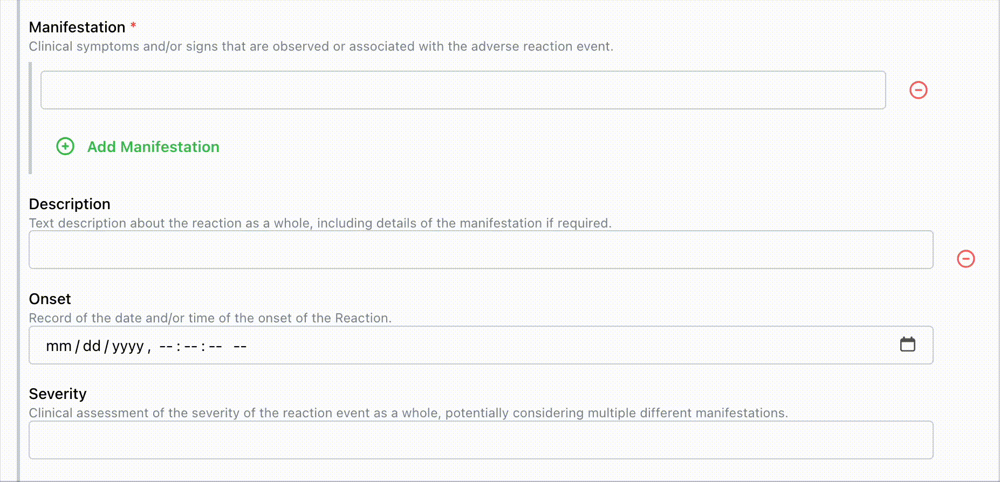
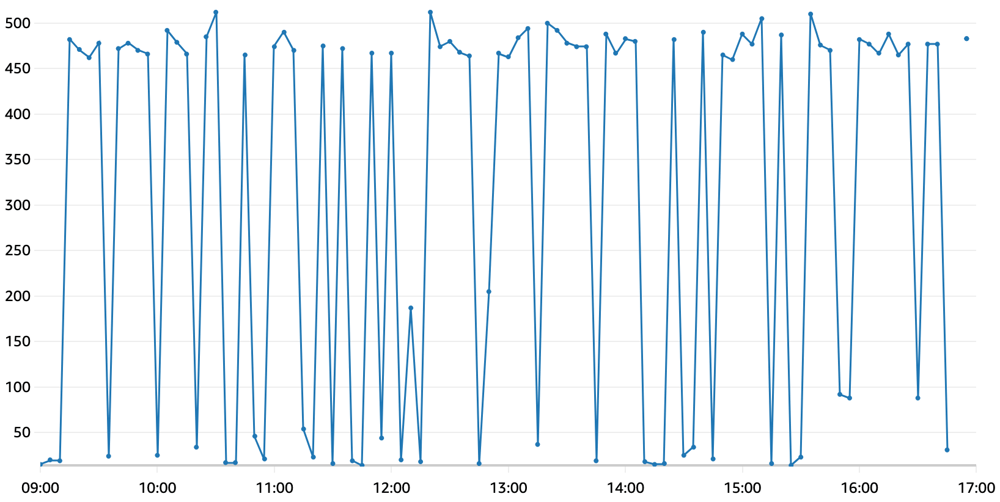
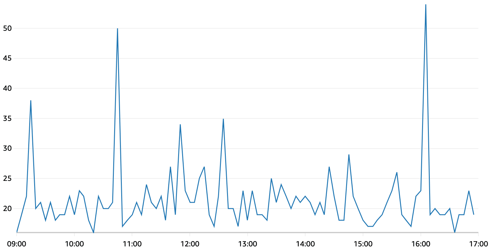

# Terminology Service Updates in Medplum v5

As part of the [Medplum v5 release][v5], we've been hard at work delivering several key improvements to our
[FHIR Terminology Services][fhir-terminology], which power Medplum's rich features for handling coded values:

- [Supporting synonyms][pr-synonyms] in `ValueSet/$expand`, allowing users to find codes by a number of different search terms
- [Scaling our implementation][pr-translate] of the `ConceptMap/$translate` operation to handle maps with over a million entries
- Updating our library of UMLS code systems with their [latest release][umls-release], including several new code
  systems around medications and supplements and a mapping between related code systems and RxNorm
- A collection of [performance enhancements][pr-perf1] that [speed up ValueSet expansion][pr-perf2] and
  [code validation][pr-perf3] by a significant margin
- (In beta) The option to [validate all required terminology bindings][pr-validation] in resources on write

[fhir-terminology]: https://hl7.org/fhir/R4/terminology-service.html

Below we'll discuss each of these changes in more detail and give examples of the features available in
Medplum's Terminology Services today.

[v5]: /blog/v5-release
[pr-synonyms]: https://github.com/medplum/medplum/pull/7151
[pr-translate]: https://github.com/medplum/medplum/pull/7579
[umls-release]: https://www.nlm.nih.gov/research/umls/knowledge_sources/metathesaurus/release/notes.html
[pr-perf1]: https://github.com/medplum/medplum/pull/7010
[pr-perf2]: https://github.com/medplum/medplum/pull/7570
[pr-perf3]: https://github.com/medplum/medplum/pull/7571
[pr-validation]: https://github.com/medplum/medplum/pull/7666

<!--truncate-->

## Coding Synonyms

Many codes are known by multiple different related names or terms, and users may use different search terms in different
contexts when trying to find the right code for a clinical concept. For example, consider a provider populating
information about a patient allergy, who wants to fill in the [`AllergyIntolerance.reaction.manifestation` field][allergy-manifestation]
with the SNOMED CT&reg; code for hives using the [Clinical Findings ValueSet][clinical-findings]. The relevant code in
SNOMED is `247472004`, but its display string is "Wheal (finding)" — not "hives"! If the user doesn't know the more
technical term, finding the correct code would be difficult.

Fortunately, most code systems record multiple names (synonyms) for their codes. These are stored as metadata properties
on the coding, which can be seen by [looking up the code][codesystem-lookup]:

```json
{
  "resourceType": "Parameters",
  "parameter": [
    { "name": "name", "valueString": "SNOMED CT (US Edition)" },
    { "name": "display", "valueString": "Wheal (finding)" },
    {
      "name": "property",
      "part": [
        { "name": "code", "valueCode": "SY" },
        { "name": "value", "valueString": "Hives" }
      ]
    },
    {
      "name": "property",
      "part": [
        { "name": "code", "valueCode": "SY" },
        { "name": "value", "valueString": "Urticarial rash" }
      ]
    },
    {
      "name": "property",
      "part": [
        { "name": "code", "valueCode": "SY" },
        { "name": "value", "valueString": "Welt" }
      ]
    },
    {
      "name": "property",
      "part": [
        { "name": "code", "valueCode": "SY" },
        { "name": "value", "valueString": "Weal" }
      ]
    },
    {
      "name": "property",
      "part": [
        { "name": "code", "valueCode": "SY" },
        { "name": "value", "valueString": "Nettle rash" }
      ]
    }
    // ...
  ]
}
```

Medplum now supports searching against these synonyms in addition to the primary display string when searching with the
`filter` parameter of the [`ValueSet/$expand` operation][valueset-expand]. Specifically, any coding properties with a
special [`uri` value][property-uri] of `http://hl7.org/fhir/concept-properties#synonym` will be indexed for search as a
synonym for the given code. The `SY` property shown above is defined in the corresponding `CodeSystem` resource:

```json
{
  "code": "SY",
  "type": "string",
  "description": "Designated synonym",
  // Properties with this `uri` will have their values included when searching for codes
  "uri": "http://hl7.org/fhir/concept-properties#synonym"
}
```

You can see the feature working as intended below, using Medplum's [`<CodeableConceptInput>` React component][code-input]:



[allergy-manifestation]: https://hl7.org/fhir/R4/allergyintolerance-definitions.html#AllergyIntolerance.reaction.manifestation
[clinical-findings]: https://hl7.org/fhir/R4/valueset-clinical-findings.html
[codesystem-lookup]: /docs/api/fhir/operations/codesystem-lookup
[valueset-expand]: /docs/api/fhir/operations/valueset-expand
[property-uri]: https://hl7.org/fhir/R4/codesystem-definitions.html#CodeSystem.property.uri
[code-input]: https://storybook.medplum.com/?path=/story/medplum-codeableconceptinput--basic

## Scalable Concept Mapping

Some of the largest code systems in common clinical use contain hundreds of thousands of different codes, and mappings
between them also operate on that scale. Our existing implementation of the [`ConceptMap/$translate`][conceptmap-translate]
operation relied on the data present inside the `ConceptMap` JSON, which limited the number of mappings that could
be supported to the amount that would fit in a single resource.

To enable large mappings between complex code systems, we rebuilt our system for handling `ConceptMap` resources from
the ground up. Existing mappings contained in the resource JSON were indexed into an optimized lookup table, and we
added a new `ConceptMap/$import` endpoint similar to the [one for CodeSystems][codesystem-import] to facilitate loading
maps with a million entries or more into the system.

For example, we can query a large map of drugs from many different code systems to get their corresponding RxNorm code:

```bash
$ curl -H "Authorization: Bearer $ACCESS_TOKEN" \
  'https://api.medplum.com/fhir/R4/ConceptMap/$translate?url=$RXNORM&system=http://snomed.info/sct&code=9500005'
```

```json
{
  "resourceType": "Parameters",
  "parameter": [
    { "name": "result", "valueBoolean": true },
    {
      "name": "match",
      "part": [
        { "name": "equivalence", "valueCode": "equivalent" },
        {
          "name": "concept",
          "valueCoding": {
            "system": "http://www.nlm.nih.gov/research/umls/rxnorm",
            "code": "8123"
          }
        }
      ]
    }
  ]
}
```

Our Postgres database is able to serve translations like this robustly, with a typical request executing in just
10 – 50 ms on our server! The ability to convert codes efficiently from one system to another is expected to be a
foundational capability for supporting cross-coding and partner integrations at scale in the future.

This development paves the way for us to support complex mappings between large, commonly-used code systems. Next on our
roadmap for this feature is to ingest the entire [SNOMED to ICD-10][snomed-to-icd] mapping and make it available to
customers for testing. This map is both large (~250,000 entries) and complex, containing dependency requirements and
descriptive notes that ensure codes are mapped correctly in context.

[conceptmap-translate]: /docs/api/fhir/operations/conceptmap-translate
[codesystem-import]: /docs/api/fhir/operations/codesystem-import
[snomed-to-icd]: https://www.nlm.nih.gov/research/umls/mapping_projects/snomedct_to_icd10cm.html

## Updated UMLS Library with 2025AA Release

Medplum maintains a library of full code systems imported from the semiannual [UMLS releases][umls-release], which
includes several widely-used systems like SNOMED CT, ICD-10, and LOINC. We've created an updated version of the library
from the latest release (2025AA), containing over 10,000 new codes and several new code systems:

- [FDB MedKnowledge][fdb]
- [Gold Standard Drug Database][gs]
- [FDA Structured Product Labels][spl] for drugs and active substances
- [Manufacturers of Vaccines][mvx]
- [Medical Subject Headings (MeSH)][mesh]

In tandem with the updates to scale `ConceptMap/$translate` described above, the mapping of several
[medication terminologies to RxNorm][rxnorm-sources] was extracted from the UMLS data set. This ConceptMap,
containing about a quarter million mappings, was used as the foundation of our testing for the changes to `ConceptMap`.
The following code systems are currently mapped in whole or part to RxNorm via this resource:

- CVX (vaccines)
- Gold Standard (drugs)
- MeSH (drugs and substances subset)
- FDA Structured Product Labels (drugs)
- FDB MedKnowledge (drugs)
- SNOMED CT (drugs subset)

Contact [support@medplum.com](mailto:support@medplum.com) for access to the updated 2025AA release resources, in either
our hosted cluster or your own self-hosted install.

[fdb]: http://www.fdbhealth.com/fdb-medknowledge/
[gs]: https://www.elsevier.com/solutions/drug-database
[spl]: http://www.fda.gov/ForIndustry/DataStandards/StructuredProductLabeling/default.htm
[mvx]: https://www2a.cdc.gov/vaccines/iis/iisstandards/vaccines.asp?rpt=mvx
[mesh]: https://www.nlm.nih.gov/mesh/
[rxnorm-sources]: https://www.nlm.nih.gov/research/umls/rxnorm/docs/techdoc.html#s3_1

## ValueSet Performance Improvements

Expanding a ValueSet to find matching codes is the most common terminology operation on Medplum: every time a user
uses an autocomplete to fill in a coded value, the relevant ValueSet definition is being queried and filtered to provide
them with a list of matching options. However, the database queries to power the autocomplete expansion can and often
do contain complicated recursive joins in combination with text filters to find all the correct codes. While working on
some of the other features listed here, we noticed a few ways to improve the relevant SQL queries. We were able to
significantly boost performance across multiple terminology operations by combining a few different optimizations:

1. Improving index usage for text filters
2. Updating indexes on coding properties
3. Preloading property IDs to eliminate a JOIN

By replacing conditions of the form `LOWER(display) LIKE '%filtertext%'` with the equivalent `display ILIKE '%filtertext%'`,
we enabled better use of existing indexes in our lookup tables and made text search in `ValueSet/$expand` more efficient.

Since many terminology queries also involve property metadata (for example, to determine whether one code is a child of
another), optimizing that part of our database queries had the potential to impact multiple different operations including
code validation. With a combination of minor changes to our query structure, and updates to our lookup table indexes,
we were able to make these queries up to 20x faster!

The effect these changes had was dramatic: the median latency for our `ValueSet/$expand` operation improved by 95%, as
shown below (endpoint latency in milliseconds):

**Before**



**After**



## Terminology Validation

Last but not least, we've finally unlocked a long-requested feature: validating all terminology requirements for
FHIR resources on write. Most resources contain some coded values, and the FHIR specification or a custom resource
profile can require that those values are drawn from a specific allowed set. Medplum server now includes the option to
check that any `required` [terminology bindings][terminology-binding] are satisfied in resources being written to the
server. Since this involves potentially tens of [validation queries][validate-code] to the terminology service per
resource, all the performance work we did over the past few months was instrumental in making it possible.

By enabling the `validate-terminology` feature for your Project, you can opt into the new validation process. It
provides assurance that your data is fully compliant with the FHIR specification, and maximizes the interoperability of
data stored in Medplum. This does come with a small performance cost to perform the validation, but we will be
continuing to monitor and optimize this functionality in the coming months.

If you're interested in helping us test out terminology validation in your development or staging Project, contact
[support@medplum.com](mailto:support@medplum.com) to have the feature enabled. If you operate a self-hosted cluster,
you will need to upgrade to Medplum v5 before the feature will be available.

[terminology-binding]: https://hl7.org/fhir/R4/terminologies.html#binding
[validate-code]: /docs/api/fhir/operations/valueset-validate-code
