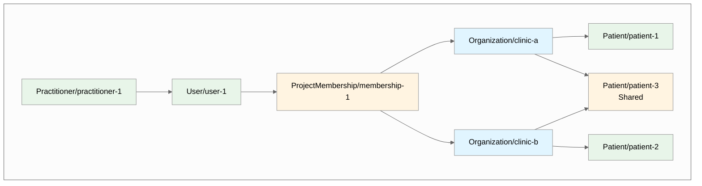
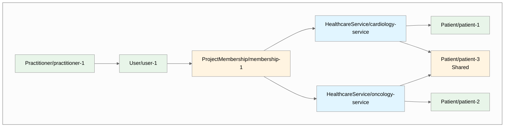
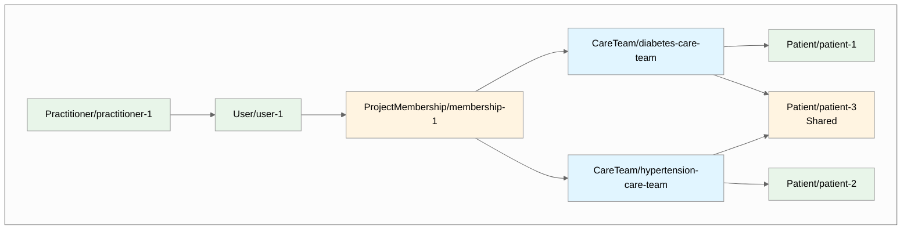

import Tabs from '@theme/Tabs';
import TabItem from '@theme/TabItem';

# Tenant Isolation Approaches in Medplum

In Medplum, you can build your tenancy model around any FHIR resource. Common examples include using `Organization`, `HealthcareService`, or `CareTeam` as tenants. 

But what happens when a user belongs to multiple tenants? This is a common scenario when a user works for multiple organizations, services or teams. 

And in that case, how can you make sure the user can only access the data for the tenant they are currently logged in to?

In this post, we'll explore two main concepts:
* **Concept 1: How to Design a Model to Represent Your Tenants as Different Resource Types**
* **Concept 2: How to Ensure Your Application Can Be Contained to Just One Tenant at a Time When a User Belongs to Multiple Tenants**

<!-- truncate -->

## Concept 1: How to Design a Model to Represent Your Tenants as Different Resource Types {#concept-1-how-to-design-a-model-to-represent-your-tenants-as-different-resource-types}

The foundation of Medplum's [standard multi tenancy model](/blog/multi-tenant-mso) is built on two key patterns:

1. **Tenant references stored on resources**: You add tenant references to Patient resources (and propagate them to that Patient's related resources) using the [`$set-accounts`](/docs/api/fhir/operations/patient-set-accounts) operation. This stores references in both `meta.accounts` and `meta.compartment`, which can then be queried using the `_compartment` search parameter.

   _Note: for resources that are not related to the Patient (as defined by the Patient's [compartment definition](https://hl7.org/fhir/R4/compartmentdefinition-patient.html)), you can use the `$set-accounts` operation directly on the resource itself to add the tenant reference to that resource._

2. **AccessPolicy parameters**: [`ProjectMembership`](/docs/api/fhir/medplum/projectmembership) resources reference the affiliated User's enrolled tenants via AccessPolicy parameters, which are then used in the AccessPolicy to restrict access.

   _The most common pattern is using `Organization` resources as tenants (standard for Managed Service Organizations), but the following examples show how to use `HealthcareService` (for service-based access) or `CareTeam` (for care coordination scenarios). The same patterns can be applied to other resource types._


Here is how you the [standard MSO multi tenancy model](/blog/multi-tenant-mso) could be used to organize your resources into tenants as either `Organization`, `HealthcareService`, or `CareTeam` resources:

<Tabs groupId="tenant-type">
  <TabItem value="organization" label="Organization">



  </TabItem>
  <TabItem value="healthcare-service" label="HealthcareService">



  </TabItem>
  <TabItem value="careteam" label="CareTeam">



  </TabItem>
</Tabs>

### Enrolling Patients in Tenants with `$set-accounts`

Use the `$set-accounts` operation to enroll Patients in tenants. The `propagate` parameter ensures all resources in the Patient compartment inherit the tenant reference:

<Tabs groupId="tenant-type">
  <TabItem value="organization" label="Organization">

```typescript
//Enrolling a Patient into clinic-a
await medplum.post(`fhir/R4/Patient/${patientId}/$set-accounts`, {
  resourceType: 'Parameters',
  parameter: [
    {
      name: 'accounts',
      valueReference: { reference: 'Organization/clinic-a' }
    },
    {
      name: 'propagate',
      valueBoolean: true  // Propagates to all resources in Patient compartment
    }
  ]
});
```

  </TabItem>
  <TabItem value="healthcare-service" label="HealthcareService">

```typescript
//Enrolling a Patient into cardiology-service
await medplum.post(`fhir/R4/Patient/${patientId}/$set-accounts`, {
  resourceType: 'Parameters',
  parameter: [
    {
      name: 'accounts',
      valueReference: { reference: 'HealthcareService/cardiology-service' }
    },
    {
      name: 'propagate',
      valueBoolean: true
    }
  ]
});
```

  </TabItem>
  <TabItem value="careteam" label="CareTeam">

```typescript
//Enrolling a Patient into diabetes-care-team
await medplum.post(`fhir/R4/Patient/${patientId}/$set-accounts`, {
  resourceType: 'Parameters',
  parameter: [
    {
      name: 'accounts',
      valueReference: { reference: 'CareTeam/diabetes-care-team' }
    },
    {
      name: 'propagate',
      valueBoolean: true
    }
  ]
});
```

  </TabItem>
</Tabs>

### Configuring AccessPolicy with Tenant Parameters

Your AccessPolicy uses parameterized variables (like `%organization`, `%healthcare_service`, or `%care_team`) that get replaced at runtime with the tenant references from the user's ProjectMembership:

<Tabs groupId="tenant-type">
  <TabItem value="organization" label="Organization">

```json
{
  "resourceType": "AccessPolicy",
  "name": "MSO Access Policy",
  "resource": [
    {
      "resourceType": "Patient",
      "criteria": "Patient?_compartment=%organization"
    },
    {
      "resourceType": "Observation",
      "criteria": "Observation?_compartment=%organization"
    }
  ]
}
```

  </TabItem>
  <TabItem value="healthcare-service" label="HealthcareService">

```json
{
  "resourceType": "AccessPolicy",
  "name": "Service-Based Access Policy",
  "resource": [
    {
      "resourceType": "Patient",
      "criteria": "Patient?_compartment=%healthcare_service"
    },
    {
      "resourceType": "Encounter",
      "criteria": "Encounter?_compartment=%healthcare_service"
    }
  ]
}
```

  </TabItem>
  <TabItem value="careteam" label="CareTeam">

```json
{
  "resourceType": "AccessPolicy",
  "name": "Care Team Access Policy",
  "resource": [
    {
      "resourceType": "Patient",
      "criteria": "Patient?_compartment=%care_team"
    },
    {
      "resourceType": "CarePlan",
      "criteria": "CarePlan?_compartment=%care_team"
    }
  ]
}
```

  </TabItem>
</Tabs>

### Setting Tenant Parameters on ProjectMembership

The user's ProjectMembership references their enrolled tenants via the `access.parameter` array. Each parameter name must match the variable name used in the AccessPolicy:

<Tabs groupId="tenant-type">
  <TabItem value="organization" label="Organization">

```json
{
  "resourceType": "ProjectMembership",
  "access": [
    {
      "policy": { "reference": "AccessPolicy/mso-policy" },
      "parameter": [
        {
          "name": "organization",
          "valueReference": { "reference": "Organization/clinic-a" }
        }
      ]
    }
  ]
}
```

  </TabItem>
  <TabItem value="healthcare-service" label="HealthcareService">

```json
{
  "resourceType": "ProjectMembership",
  "access": [
    {
      "policy": { "reference": "AccessPolicy/service-policy" },
      "parameter": [
        {
          "name": "healthcare_service",
          "valueReference": { "reference": "HealthcareService/cardiology-service" }
        }
      ]
    }
  ]
}
```

  </TabItem>
  <TabItem value="careteam" label="CareTeam">

```json
{
  "resourceType": "ProjectMembership",
  "access": [
    {
      "policy": { "reference": "AccessPolicy/careteam-policy" },
      "parameter": [
        {
          "name": "care_team",
          "valueReference": { "reference": "CareTeam/diabetes-care-team" }
        }
      ]
    }
  ]
}
```

  </TabItem>
</Tabs>

## Concept 2: How to Ensure Your Application Can Be Contained to Just One Tenant at a Time When a User Belongs to Multiple Tenants {#concept-2-how-to-ensure-your-application-can-be-contained-to-just-one-tenant-at-a-time-when-a-user-belongs-to-multiple-tenants}

### The Challenge: Multiple Tenant Memberships

When a Practitioner user belongs to multiple tenants, their `ProjectMembership` will have multiple entries in the `access` array, each with different tenant parameters:

**In this scenario, the user's API-level access includes data from both clinics. But how do you ensure your application is contained to just one tenant at a time?**

<Tabs groupId="tenant-type">
  <TabItem value="organization" label="Organization">

```json
{
  "resourceType": "ProjectMembership",
  "access": [
    {
      "parameter": [
        {
          "name": "organization",
          "valueReference": {
            "reference": "Organization/clinic-a",
            "display": "Downtown Clinic"
          }
        }
      ],
      "policy": {
        "reference": "AccessPolicy/mso-policy"
      }
    },
    {
      "parameter": [
        {
          "name": "organization",
          "valueReference": {
            "reference": "Organization/clinic-b",
            "display": "Uptown Clinic"
          }
        }
      ],
      "policy": {
        "reference": "AccessPolicy/mso-policy"
      }
    }
  ]
}
```

  </TabItem>
  <TabItem value="healthcare-service" label="HealthcareService">

```json
{
  "resourceType": "ProjectMembership",
  "access": [
    {
      "parameter": [
        {
          "name": "healthcare_service",
          "valueReference": {
            "reference": "HealthcareService/cardiology-service",
            "display": "Cardiology Department"
          }
        }
      ],
      "policy": {
        "reference": "AccessPolicy/service-policy"
      }
    },
    {
      "parameter": [
        {
          "name": "healthcare_service",
          "valueReference": {
            "reference": "HealthcareService/oncology-service",
            "display": "Oncology Department"
          }
        }
      ],
      "policy": {
        "reference": "AccessPolicy/service-policy"
      }
    }
  ]
}
```

  </TabItem>
  <TabItem value="careteam" label="CareTeam">

```json
{
  "resourceType": "ProjectMembership",
  "access": [
    {
      "parameter": [
        {
          "name": "care_team",
          "valueReference": {
            "reference": "CareTeam/diabetes-care-team",
            "display": "Diabetes Care Team"
          }
        }
      ],
      "policy": {
        "reference": "AccessPolicy/careteam-policy"
      }
    },
    {
      "parameter": [
        {
          "name": "care_team",
          "valueReference": {
            "reference": "CareTeam/hypertension-care-team",
            "display": "Hypertension Care Team"
          }
        }
      ],
      "policy": {
        "reference": "AccessPolicy/careteam-policy"
      }
    }
  ]
}
```

  </TabItem>
</Tabs>

## Tenant Isolation Approaches: Comparison Table

| Approach | API-Level Isolation (Enrolled Tenants) | API-Level Isolation (Per Tenant) | Application-Level Isolation | Use Case |
|----------|-------------------|-------------------|-------------------|----------|
| **[Option 1: All Tenants](#option-1-allow-access-to-all-enrolled-tenants)** | Yes | No | No | Cross-tenant visibility acceptable |
| **[Option 2: `_compartment` Parameter](#option-2-frontend-level-restriction-with-_compartment)** | Yes | No | Yes | Need UI-level tenant restriction acceptable, API level access to all enrolled tenants |
| **[Option 3: Multiple Memberships](#option-3-multiple-projectmemberships)** | Yes | Yes | Yes | Need strict API-level tenant isolation |

**Column Descriptions:**

- **API-Level Isolation (All Enrolled Tenants)**: Whether the API restricts access to only the tenants the user is enrolled in via their ProjectMembership.

- **API-Level Isolation (Per Tenant)**: Whether the API restricts a User's access to only one tenant at a time, even if the User is enrolled across multiple tenants.

- **Application-Level Isolation**: Whether the UI restricts what's displayed to a single tenant.

### Choosing the Right Approach

**Choose [Option 1](#option-1-allow-access-to-all-enrolled-tenants)** if cross-tenant visibility is acceptable and you want the simplest implementation.

**Choose [Option 2](#option-2-frontend-level-restriction-with-_compartment)** if you need UI-level tenant isolation but want users to be able to switch between tenants without re-authenticating. This approach maintains API-level access to all tenants and is also able to restrict what's displayed in the UI to only a single tenant at a time. It is much easier to implement [Option 2](#option-2-frontend-level-restriction-with-_compartment) than [Option 3](#option-3-multiple-projectmemberships). 

**Choose [Option 3](#option-3-multiple-projectmemberships)** if you need strict API-level single tenant access for security or compliance reasons. This is the most secure approach but requires users to sign in separately for each tenant they need to access with a separate ProjectMembership.


## Option 1: Allow Access to All Enrolled Tenants {#option-1-allow-access-to-all-enrolled-tenants}

**Description**: The user can view Patients and resources from all enrolled tenants simultaneously.

**Implementation**: No additional restrictions needed. The AccessPolicy already grants access to all enrolled tenants, and your application can display data from all tenants.

**Use Case**: This approach works well when cross-tenant visibility is acceptable or desired. *For example, a care coordinator who needs to see all patients across multiple clinics they manage.*


## Option 2: Frontend-Level Restriction with `_compartment`

**Description**: Keep the ProjectMembership and AccessPolicy configuration the same, but add the `_compartment` search parameter to all frontend queries to scope results to a specific tenant. The `_compartment` search parameter may look familiar because it is used in the AccessPolicy critertia. **We can also use `_compartment` on the query itself**, in combination with the AccessPolicy criteria, to further restrict the data that is returned to the user to only the data for the currently selected tenant.

**Implementation**: At the application level, maintain state for the currently selected tenant, and append `_compartment=<current_tenant_ref>` to all search queries.

**Example:**

```typescript
// User selects "Downtown Clinic" in the UI
const currentTenant = 'Organization/clinic-a';

// All queries include _compartment filter
const patients = await medplum.search('Patient', {
  _compartment: currentTenant
});

const observations = await medplum.search('Observation', {
  _compartment: currentTenant
});
```

**Use Case**: When you need UI-level tenant isolation but want to maintain API-level access to all tenants. This allows users to switch between tenants in the UI without re-authenticating, while ensuring the UI only displays data from the selected tenant.

## Option 3: Multiple ProjectMemberships

**Description**: Create a separate `ProjectMembership` for each tenant. Each membership has its own AccessPolicy with a single tenant parameter, enforcing isolation at the API level.

::warning
Multiple ProjectMemberships is an **advanced Medplum feature**. ProjectMemberships are a crucial part of access control to the Medplum data store and determine what resources a user can read, write, or modify. Misconfiguring ProjectMemberships or AccessPolicies can result in Users being locked out of necessary resources or gaining unauthorized access to data.

**Before implementing multiple memberships:**
- Thoroughly understand [AccessPolicies](/docs/access/access-policies) and how they work
- Test extensively in a development environment
- Consider consulting with Medplum support or the community if you're unsure
::

**Implementation**: Use the [`/admin/projects/:projectId/invite`](/docs/api/project-admin/invite) endpoint with `forceNewMembership: true` to create additional memberships for the same user.

With multiple ProjectMemberships, each membership grants access to only one tenant, ensuring strict API-level isolation:

<Tabs groupId="tenant-type">
  <TabItem value="organization" label="Organization">


  </TabItem>
  <TabItem value="healthcare-service" label="HealthcareService">


  </TabItem>
  <TabItem value="careteam" label="CareTeam">


  </TabItem>
</Tabs>

**Example:**

<Tabs groupId="tenant-type">
  <TabItem value="organization" label="Organization">

```typescript
// First membership - Downtown Clinic
await medplum.post('admin/projects/:projectId/invite', {
  resourceType: 'Practitioner',
  firstName: 'Jane',
  lastName: 'Smith',
  email: 'dr.smith@example.com',
  password: 'secure-password',
  membership: {
    access: [
      {
        policy: { reference: 'AccessPolicy/mso-policy' },
        parameter: [
          {
            name: 'organization',
            valueReference: { reference: 'Organization/clinic-a' }
          }
        ]
      }
    ],
    identifier: [
      {
        system: 'https://medplum.com/identifier/label',
        value: 'Downtown Clinic'
      }
    ]
  }
});

// Second membership - Uptown Clinic
await medplum.post('admin/projects/:projectId/invite', {
  resourceType: 'Practitioner',
  firstName: 'Jane',
  lastName: 'Smith',
  email: 'dr.smith@example.com',
  forceNewMembership: true,  // Required for creating additional membership
  membership: {
    access: [
      {
        policy: { reference: 'AccessPolicy/mso-policy' },
        parameter: [
          {
            name: 'organization',
            valueReference: { reference: 'Organization/clinic-b' }
          }
        ]
      }
    ],
    identifier: [
      {
        system: 'https://medplum.com/identifier/label',
        value: 'Uptown Clinic'
      }
    ]
  }
});
```

  </TabItem>
  <TabItem value="healthcare-service" label="HealthcareService">

```typescript
// First membership - Cardiology Service
await medplum.post('admin/projects/:projectId/invite', {
  resourceType: 'Practitioner',
  firstName: 'Jane',
  lastName: 'Smith',
  email: 'dr.smith@example.com',
  password: 'secure-password',
  membership: {
    access: [
      {
        policy: { reference: 'AccessPolicy/service-policy' },
        parameter: [
          {
            name: 'healthcare_service',
            valueReference: { reference: 'HealthcareService/cardiology-service' }
          }
        ]
      }
    ],
    identifier: [
      {
        system: 'https://medplum.com/identifier/label',
        value: 'Cardiology Service'
      }
    ]
  }
});

// Second membership - Oncology Service
await medplum.post('admin/projects/:projectId/invite', {
  resourceType: 'Practitioner',
  firstName: 'Jane',
  lastName: 'Smith',
  email: 'dr.smith@example.com',
  forceNewMembership: true,  // Required for creating additional membership
  membership: {
    access: [
      {
        policy: { reference: 'AccessPolicy/service-policy' },
        parameter: [
          {
            name: 'healthcare_service',
            valueReference: { reference: 'HealthcareService/oncology-service' }
          }
        ]
      }
    ],
    identifier: [
      {
        system: 'https://medplum.com/identifier/label',
        value: 'Oncology Service'
      }
    ]
  }
});
```

  </TabItem>
  <TabItem value="careteam" label="CareTeam">

```typescript
// First membership - Diabetes Care Team
await medplum.post('admin/projects/:projectId/invite', {
  resourceType: 'Practitioner',
  firstName: 'Jane',
  lastName: 'Smith',
  email: 'dr.smith@example.com',
  password: 'secure-password',
  membership: {
    access: [
      {
        policy: { reference: 'AccessPolicy/careteam-policy' },
        parameter: [
          {
            name: 'care_team',
            valueReference: { reference: 'CareTeam/diabetes-care-team' }
          }
        ]
      }
    ],
    identifier: [
      {
        system: 'https://medplum.com/identifier/label',
        value: 'Diabetes Care Team'
      }
    ]
  }
});

// Second membership - Hypertension Care Team
await medplum.post('admin/projects/:projectId/invite', {
  resourceType: 'Practitioner',
  firstName: 'Jane',
  lastName: 'Smith',
  email: 'dr.smith@example.com',
  forceNewMembership: true,  // Required for creating additional membership
  membership: {
    access: [
      {
        policy: { reference: 'AccessPolicy/careteam-policy' },
        parameter: [
          {
            name: 'care_team',
            valueReference: { reference: 'CareTeam/hypertension-care-team' }
          }
        ]
      }
    ],
    identifier: [
      {
        system: 'https://medplum.com/identifier/label',
        value: 'Hypertension Care Team'
      }
    ]
  }
});
```

  </TabItem>
</Tabs>

**Sign-In Flow**: When a user with multiple ProjectMemberships signs in, Medplum automatically prompts them to choose which membership to use for their session. Each membership can have a custom label (via the `https://medplum.com/identifier/label` identifier system) to help users distinguish between them.


**Use Case**: When you need strict API-level tenant isolation. This ensures that once authenticated, the user's API access is limited to only the selected tenant's data. This is the most secure approach and is ideal for scenarios where regulatory requirements or organizational policies mandate strict data isolation.
