# Complete Guide to Medplum FHIR Operations

While standard CRUD operations let you create, read, update, and delete individual FHIR resources, real-world healthcare workflows often demand more sophisticated capabilities. 

- How do you export an entire patient's medical history for a care transition? 
- How do you validate that a lab result code actually exists in LOINC? 
- How do you convert clinical codes between different terminology systems when integrating with external partners?

This is where **FHIR Operations** come in. Medplum supports **over 30 specialized operations** that handle complex healthcare scenarios—from terminology management and bulk data export to clinical decision support and AI-assisted documentation.

This guide walks through every operation available in Medplum, organized by category, with practical examples showing how they solve real integration challenges.

<!-- truncate -->

## What Are FHIR Operations?

FHIR operations are the "dollar sign endpoints" — APIs like `$validate`, `$expand`, or `$everything` that perform specialized functions beyond basic resource manipulation. Think of them as pre-built functions for common healthcare computing tasks.

Unlike standard REST endpoints that operate on individual resources, operations can:
- **Aggregate data** across multiple resources (like `$everything` gathering a patient's complete record)
- **Transform data** between formats (like `$translate` converting ICD-10 codes to SNOMED)
- **Perform complex validations** (like `$validate-code` checking if a code exists in a terminology system)
- **Trigger workflows** (like `$apply` generating a care plan from a protocol template)

Each operation is formally defined by an [`OperationDefinition`](http://hl7.org/fhir/R4/operationdefinition.html) resource that specifies its name, inputs, outputs, and invocation patterns.

### Invocation Levels

Operations can be invoked at three different levels, depending on what scope of data they need to operate on:

- **System level** (`[base]/$operation`): Operations that work across all data, like bulk exports
- **Type level** (`[base]/[ResourceType]/$operation`): Operations on a resource type, like validating a Patient structure
- **Instance level** (`[base]/[ResourceType]/[id]/$operation`): Operations on a specific resource, like getting everything for a particular patient


---

## Authentication & Security

Healthcare applications must integrate with existing EHR systems, manage credentials securely, and handle user account lifecycle. These operations support authentication flows and security maintenance—foundational capabilities you'll need before working with other operations.

| Operation | Description | Common Use Case |
|-----------|-------------|-----------------|
| [ClientApplication/$rotate-secret](/docs/api/fhir/operations/rotate-client-secret) | Rotate client credentials | Regular security maintenance, incident response |
| [ClientApplication/$smart-launch](/docs/api/fhir/operations/clientapplication-smart-launch) | Initiate SMART on FHIR launch | Launching apps from within EHR systems |
| [User/$update-email](/docs/api/fhir/operations/user-update-email) | Update user email | Account management, user profile updates |

**Example: SMART on FHIR launch**

[SMART on FHIR](https://docs.smarthealthit.org/) is the standard for launching third-party applications from within EHR systems. When a clinician clicks your app's icon in their EHR, the `$smart-launch` operation initiates the authorization flow:

```bash
GET /fhir/R4/ClientApplication/my-app/$smart-launch?patient=patient-123
```

This redirects to your app's registered launch URI with `iss` (the FHIR server URL) and `launch` (an opaque context token) parameters. Your app then completes the OAuth 2.0 authorization flow to obtain an access token scoped to the launched patient's data.

**Example: Rotating client secrets**

Security best practices recommend regular credential rotation. The `$rotate-secret` operation generates a new client secret while optionally keeping the old one valid for a grace period:

```bash
POST /fhir/R4/ClientApplication/my-app/$rotate-secret
Content-Type: application/json

{
  "expiresIn": 86400
}
```

The `expiresIn` parameter (in seconds) specifies how long the old secret remains valid, giving you time to update your application configuration before the old secret expires. The response includes the new secret.

---

## Terminology Operations

Healthcare runs on coded data. A diagnosis isn't just "diabetes"—it's `E11.9` in ICD-10 or `44054006` in SNOMED CT. Lab results reference LOINC codes. Medications use RxNorm. When systems exchange data, they need to speak the same coded language.

Medplum's terminology operations help you manage, query, and translate between these code systems—essential for building interoperable healthcare applications.

### CodeSystem Operations

| Operation | Description | Common Use Case |
|-----------|-------------|-----------------|
| [CodeSystem/$import](/docs/api/fhir/operations/codesystem-import) | Bulk load codes into a CodeSystem | Loading SNOMED, LOINC, or custom code systems |
| [CodeSystem/$lookup](/docs/api/fhir/operations/codesystem-lookup) | Get full details for a code | Displaying code descriptions in UI |
| [CodeSystem/$subsumes](/docs/api/fhir/operations/codesystem-subsumes) | Test parent-child relationships | Checking if one diagnosis is a subtype of another |
| [CodeSystem/$validate-code](/docs/api/fhir/operations/codesystem-validate-code) | Check if a code exists | Validating user input before saving |

**Example: Looking up a LOINC code**

When displaying lab results to clinicians, you need human-readable descriptions—not just codes. The `$lookup` operation retrieves the full details:

```bash
GET /fhir/R4/CodeSystem/$lookup?system=http://loinc.org&code=8867-4
```

This returns the code's display name ("Heart rate"), its formal definition, and any associated properties—giving your UI everything it needs to present the information meaningfully.

### ConceptMap Operations

| Operation | Description | Common Use Case |
|-----------|-------------|-----------------|
| [ConceptMap/$import](/docs/api/fhir/operations/conceptmap-import) | Bulk load mappings | Importing terminology crosswalks |
| [ConceptMap/$translate](/docs/api/fhir/operations/conceptmap-translate) | Map codes between systems | Converting from ICD-10 to SNOMED |

**Example: Translating between code systems**

When integrating with external systems, you'll often receive data coded in one terminology but need to store or display it in another. The `$translate` operation handles this conversion:

```bash
GET /fhir/R4/ConceptMap/$translate?system=http://hl7.org/fhir/sid/icd-10&code=E11.9&target=http://snomed.info/sct
```

This translates the ICD-10 code `E11.9` (Type 2 diabetes mellitus without complications) to its SNOMED CT equivalent, enabling seamless data exchange across systems using different terminology standards.

### ValueSet Operations

| Operation | Description | Common Use Case |
|-----------|-------------|-----------------|
| [ValueSet/$expand](/docs/api/fhir/operations/valueset-expand) | Get all codes in a ValueSet | Populating dropdown menus |
| [ValueSet/$validate-code](/docs/api/fhir/operations/valueset-validate-code) | Check if code is in ValueSet | Form field validation |

**Example: Expanding a ValueSet for a dropdown**

ValueSets define allowed values for specific fields. When building a patient registration form, you need to populate the gender dropdown with valid options:

```bash
GET /fhir/R4/ValueSet/$expand?url=http://hl7.org/fhir/ValueSet/administrative-gender&filter=f
```

The `filter` parameter enables typeahead search—as users type, you can call `$expand` with their input to show matching options, making large ValueSets (like diagnosis codes) practical to use in UIs.

---

## Patient Operations

One of the most common needs in healthcare applications is accessing a patient's complete medical record. Whether you're building a patient portal, facilitating a care transition, or responding to a records request, you need to gather data from across multiple resource types into a coherent view.

Patient operations provide standardized ways to aggregate and export patient data, eliminating the need to manually query dozens of resource types.

| Operation | Description | Common Use Case |
|-----------|-------------|-----------------|
| [Patient/$everything](/docs/api/fhir/operations/patient-everything) | Get all patient-related resources | Patient data export, chart review |
| [Patient/$summary](/docs/api/fhir/operations/patient-summary) | Generate International Patient Summary | Care transitions, referrals |
| [Patient/$ccda-export](/docs/api/fhir/operations/ccda-export) | Export as C-CDA XML document | Health information exchange |

**Example: Fetching everything for a patient**

The `$everything` operation is invaluable when you need a complete picture of a patient's health record. Instead of making separate queries for encounters, conditions, medications, observations, and dozens of other resource types, a single call retrieves it all:

```bash
GET /fhir/R4/Patient/patient-123/$everything?_count=100
```

The response is a searchset Bundle containing all resources in the patient's compartment—plus referenced resources like the Organizations where they received care, the Practitioners who treated them, and the Medications they were prescribed.

You can use additional parameters to scope the results:
- `_since`: Only include resources modified after a specific date
- `_type`: Limit to specific resource types (e.g., `_type=Condition,MedicationRequest`)
- `start` and `end`: Filter by clinical date range

```mermaid
flowchart TB
    subgraph Compartment["Patient Compartment"]
        Patient["🧑 Patient"]
        Encounter["📋 Encounter"]
        Condition["🩺 Condition"]
        Observation["📊 Observation"]
        MedicationRequest["💊 MedicationRequest"]
        DiagnosticReport["🔬 DiagnosticReport"]
        Procedure["⚕️ Procedure"]
        Immunization["💉 Immunization"]
        AllergyIntolerance["⚠️ AllergyIntolerance"]
    end
    
    subgraph Referenced["Referenced Resources"]
        Organization["🏥 Organization"]
        Practitioner["👨‍⚕️ Practitioner"]
        Medication["💊 Medication"]
        Location["📍 Location"]
    end
    
    Patient --> Encounter
    Patient --> Condition
    Patient --> Observation
    Patient --> MedicationRequest
    Patient --> DiagnosticReport
    Patient --> Procedure
    Patient --> Immunization
    Patient --> AllergyIntolerance
    
    Encounter -.-> Organization
    Encounter -.-> Practitioner
    Encounter -.-> Location
    MedicationRequest -.-> Medication
    MedicationRequest -.-> Practitioner
    DiagnosticReport -.-> Practitioner
    
    style Compartment fill:#e8f5e9
    style Referenced fill:#fff8e1
```



---

## Resource Validation & Transformation

Before submitting data to external systems—whether payers, HIEs, or regulatory bodies—you need confidence that your resources conform to expected structures. And when fetching data for complex UIs, you often need related resources in a single round trip rather than dozens of sequential requests.

These operations address data quality and efficient retrieval.

| Operation | Description | Common Use Case |
|-----------|-------------|-----------------|
| [Resource/$validate](/docs/api/fhir/operations/validate-a-resource) | Validate against profiles | Pre-submission checks, data quality |
| [Resource/$graph](/docs/api/fhir/operations/resource-graph) | Fetch related resources via GraphDefinition | Complex data retrieval in one request |
| [GraphQL](/docs/api/fhir/operations/graphql) | Query with GraphQL | Frontend data fetching, flexible queries |
| [StructureDefinition/$expand-profile](/docs/api/fhir/operations/structuredefinition-expand-profile) | Expand nested profiles | Profile validation setup |

**Example: Validating a resource before submission**

When integrating with external systems that enforce specific FHIR profiles (like US Core for ONC certification), validate resources before sending them:

```bash
POST /fhir/R4/Patient/$validate?profile=http://hl7.org/fhir/us/core/StructureDefinition/us-core-patient
Content-Type: application/fhir+json

{
  "resourceType": "Patient",
  "name": [{"given": ["John"], "family": "Doe"}]
}
```

The response includes an OperationOutcome detailing any validation errors—missing required fields, incorrect code bindings, or cardinality violations—so you can fix issues before they cause integration failures.

**Example: Fetching a patient dashboard with GraphQL**

GraphQL queries are submitted via POST to the `/fhir/R4/$graphql` endpoint. Instead of making separate requests for a patient, their conditions, recent encounters, and active medications, GraphQL lets you fetch exactly what your UI needs in one call:

```bash
POST /fhir/R4/$graphql
Content-Type: application/json

{
  "query": "{ Patient(id: \"patient-123\") { name { given family } birthDate ConditionList(_count: 10, _sort: \"-onset-date\") { code { coding { display } } onsetDateTime } MedicationRequestList(status: \"active\") { medicationCodeableConcept { text } dosageInstruction { text } } } }"
}
```

This returns a shaped response matching your query structure—perfect for building responsive healthcare UIs without over-fetching data.

---

## Data Export & Import

Healthcare data doesn't stay in one system. You need to feed analytics platforms, generate reports for stakeholders, submit claims to payers, and exchange data with partners. FHIR's JSON format is great for APIs, but sometimes you need CSV for spreadsheets, NDJSON for data pipelines, or PDFs for paper-based workflows.

Medplum's export operations transform FHIR data into the formats your downstream systems require.

| Operation | Description | Common Use Case |
|-----------|-------------|-----------------|
| [Bulk FHIR API](/docs/api/fhir/operations/bulk-fhir) | Export large datasets asynchronously | Analytics pipelines, data warehousing |
| [Resource/$csv](/docs/api/fhir/operations/csv) | Export resources as CSV | Spreadsheet analysis, simple reporting |
| [Claim/$export](/docs/api/fhir/operations/claim-export) | Generate CMS-1500 PDF | Billing, claims submission |
| [QuestionnaireResponse/$extract](/docs/api/fhir/operations/extract) | Extract structured data from forms | Converting form responses into FHIR resources |

**Example: Exporting patients as CSV**

For quick reports or sharing data with non-technical stakeholders, the `$csv` operation flattens FHIR resources into a downloadable spreadsheet:

```bash
GET /fhir/R4/Patient/$csv?_fields=name,birthDate,gender,address&active=true
```

The `_fields` parameter lets you specify exactly which fields to include as columns, and you can combine it with standard FHIR search parameters (like `active=true`) to filter the results.

**Example: Bulk export for analytics**

When you need to export thousands or millions of resources for a data warehouse, the Bulk FHIR API handles it asynchronously:

```bash
POST /fhir/R4/$export
Prefer: respond-async

# Response includes a polling URL to check export status
# When complete, you receive URLs to download NDJSON files
```

This follows the [SMART Bulk Data](https://hl7.org/fhir/uv/bulkdata/) specification, producing newline-delimited JSON files that tools like Apache Spark, BigQuery, or Databricks can efficiently process.

---

## Bot Operations

Every healthcare organization has unique workflows that can't be handled by generic FHIR operations. Maybe you need to send appointment reminders via SMS, calculate medication dosages based on patient weight, or transform incoming HL7v2 messages into FHIR resources.

[Medplum Bots](/docs/bots) are serverless TypeScript functions that run inside your Medplum project. Bot operations let you deploy, execute, and expose these custom functions as FHIR-compliant endpoints.

| Operation | Description | Common Use Case |
|-----------|-------------|-----------------|
| [Bot/$deploy](/docs/api/fhir/operations/bot-deploy) | Deploy bot code to the server | CI/CD pipelines, development workflows |
| [Bot/$execute](/docs/api/fhir/operations/bot-execute) | Run a bot with custom input | Webhook handlers, on-demand processing |
| [Custom Operations](/docs/api/fhir/operations/custom-operations) | Create custom FHIR operations backed by Bots | Domain-specific APIs |

**Example: Executing a bot**

Bots can be triggered via `$execute` with any JSON payload your logic requires. For instance, a patient reminder bot might accept a patient ID and action type:

```bash
POST /fhir/R4/Bot/my-bot-id/$execute
Content-Type: application/json

{"patientId": "patient-123", "action": "send-reminder"}
```

The bot receives this input, executes your TypeScript code, and returns a response—all within Medplum's security context with full access to the FHIR API.

**Custom Operations: Extending FHIR with your own endpoints**

Beyond ad-hoc execution, you can register bots as custom FHIR operations. This creates clean, discoverable endpoints like:

- `MedicationRequest/$calculate-dose` — Calculate dosing based on patient weight and renal function
- `Appointment/$find-available-slots` — Find open appointment slots matching specific criteria
- `Patient/$risk-score` — Calculate a patient's risk score using your proprietary algorithm

These custom operations appear alongside standard FHIR operations, making your domain-specific logic feel native to the API.

---

## Clinical Decision Support

Modern healthcare increasingly relies on automated decision support—care protocols that standardize treatment, quality measures that track outcomes, and AI that assists with documentation. These operations bridge the gap between clinical knowledge (encoded in FHIR resources) and actionable workflows.

| Operation | Description | Common Use Case |
|-----------|-------------|-----------------|
| [Parameters/$ai](/docs/api/fhir/operations/ai) | Interface with LLMs (GPT, Claude) | Clinical decision support, documentation assistance |
| [ChargeItemDefinition/$apply](/docs/api/fhir/operations/chargeitemdefinition-apply) | Calculate pricing for charges | Automated billing, cost estimation |
| [Measure/$evaluate-measure](/docs/api/fhir/operations/evaluate-measure) | Calculate quality measures | HEDIS, CMS reporting, population health |
| [PlanDefinition/$apply](/docs/api/fhir/operations/plandefinition-apply) | Generate CarePlans from protocols | Instantiating evidence-based care pathways |

**Example: Applying a care protocol**

PlanDefinitions encode clinical protocols—the series of actions, assessments, and interventions that should happen for a given condition. The `$apply` operation instantiates these protocols for a specific patient:

```bash
POST /fhir/R4/PlanDefinition/diabetes-protocol/$apply
Content-Type: application/fhir+json

{
  "resourceType": "Parameters",
  "parameter": [
    {"name": "subject", "valueString": "Patient/patient-123"}
  ]
}
```

This returns a CarePlan populated with Tasks based on the protocol's actions—perhaps an HbA1c lab order, a nutrition counseling referral, and a follow-up appointment. The clinical logic lives in the PlanDefinition; `$apply` operationalizes it for individual patients.

**Example: Evaluating quality measures**

Healthcare organizations must report on quality measures like HEDIS (Healthcare Effectiveness Data and Information Set). The `$evaluate-measure` operation calculates these metrics against your patient population:

```bash
GET /fhir/R4/Measure/diabetes-eye-exam/$evaluate-measure?periodStart=2025-01-01&periodEnd=2025-12-31&subject=Group/diabetic-patients
```

This evaluates how many patients in the specified group received their annual diabetic eye exam, returning a MeasureReport with numerator, denominator, and compliance rate.

---

## Project & System Administration

Running a healthcare platform involves more than just clinical data. You need to manage multi-tenant environments, handle data retention policies, retry failed integrations, and maintain system health. These administrative operations provide the control plane for your Medplum deployment.

| Operation | Description | Common Use Case |
|-----------|-------------|-----------------|
| [AsyncJob/$cancel](/docs/api/fhir/operations/asyncjob-cancel) | Cancel running async jobs | Stopping runaway exports or long-running operations |
| [Project/$clone](/docs/api/fhir/operations/project-clone) | Clone entire projects | Creating test environments from production templates |
| [Project/$init](/docs/api/fhir/operations/project-init) | Initialize new projects | Multi-tenant SaaS provisioning |
| [Resource/$expunge](/docs/api/fhir/operations/expunge) | Permanently delete resources | GDPR right-to-erasure, data cleanup |
| [Resource/$resend](/docs/api/fhir/operations/resend) | Resend subscription notifications | Retrying failed webhook deliveries |
| [Resource/$set-accounts](/docs/api/fhir/operations/set-accounts) | Manage resource access controls | Multi-tenant access management |

**Example: Permanently expunging a resource**

Standard FHIR delete is a "soft delete"—the resource is marked as deleted but its history is preserved for audit purposes. When you need true data erasure (for GDPR compliance or cleaning up test data), `$expunge` permanently removes the resource and all its history:

```bash
POST /fhir/R4/Patient/patient-123/$expunge
Authorization: Bearer <admin-token>
```

:::warning
The `$expunge` operation permanently deletes resources and their history. This action is irreversible and requires admin privileges. Use with extreme caution in production environments.
:::

**Example: Retrying a failed webhook**

When a Subscription notification fails to deliver (perhaps the receiving system was temporarily down), `$resend` lets you retry without waiting for another triggering event:

```bash
POST /fhir/R4/Patient/patient-123/$resend
```

This re-evaluates all active Subscriptions for the resource and sends notifications to matching endpoints—useful for recovering from transient integration failures.

---

## Getting Started

Ready to start using FHIR operations in your project? Here's how to get hands-on:

1. **Explore the operations**: Each operation linked above has detailed documentation with request/response examples and parameter descriptions
2. **Try in sandbox**: Test operations interactively in your [Medplum project](https://app.medplum.com) using the API tab or built-in tools
3. **Use the SDK**: The [MedplumClient](/docs/sdk/core.medplumclient) provides TypeScript methods for common operations, with full type safety and IntelliSense support

**SDK Example:**

```typescript
import { MedplumClient } from '@medplum/core';

const medplum = new MedplumClient();

// Expand a ValueSet for a dropdown
const expansion = await medplum.searchValueSet('http://hl7.org/fhir/ValueSet/administrative-gender', 'fem');

// Get everything for a patient
const bundle = await medplum.readPatientEverything('patient-123');

// Validate a resource before saving
const outcome = await medplum.validateResource({
  resourceType: 'Patient',
  name: [{ given: ['Jane'], family: 'Doe' }]
});
```

For the complete technical reference, see the [FHIR Operations documentation](/docs/api/fhir/operations).

## Related Resources

- [FHIR Operation Framework](/docs/api/fhir/operations) - Complete technical reference for all operations
- [Bots Documentation](/docs/bots) - Building custom automation and extending FHIR with your own operations
- [Terminology Guide](/docs/terminology) - Deep dive into working with code systems, ValueSets, and ConceptMaps
- [Search Documentation](/docs/search) - Querying FHIR resources with search parameters and modifiers
