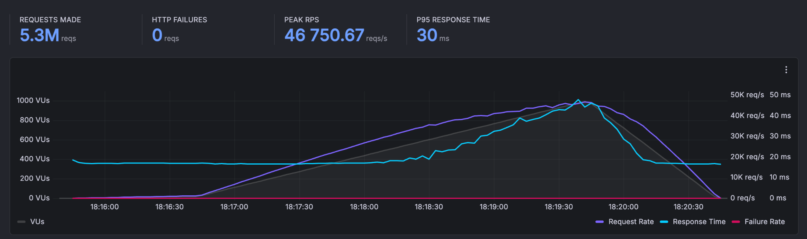
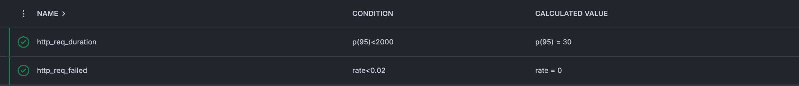
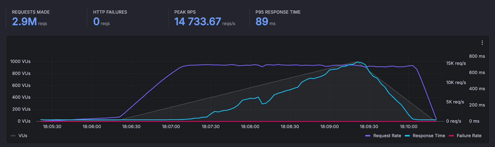
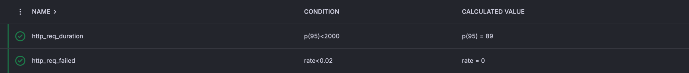
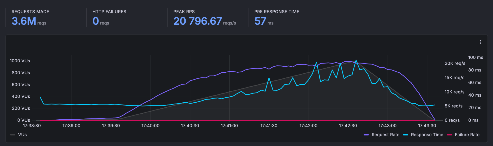
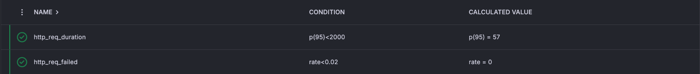
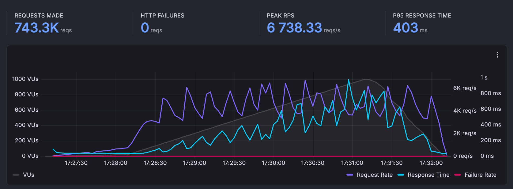
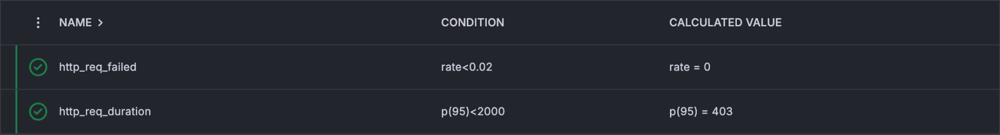
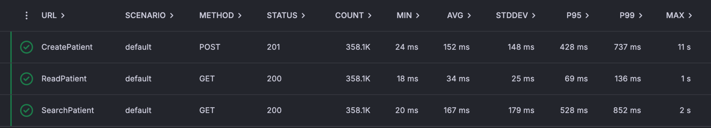

One of the most common questions we hear from teams evaluating Medplum is: *"Can it handle our scale?"* We wanted to answer that question with real data. We recently ran a formal performance evaluation against a self-hosted Medplum deployment that mirrors one of our largest production clusters, and the results speak for themselves - peak throughput exceeding **46,000 requests per second** for read-only traffic and nearly **7,000 requests per second** for full read/write/search FHIR workflows, with zero HTTP failures across all scenarios.

<!-- truncate -->

## Executive Summary

| Scenario | Description | Max Throughput | Avg Response Time |
|---|---|---|---|
| 1 | Unauthenticated, read-only, no database access | 46,750.67 reqs/s | 18 ms |
| 2 | Unauthenticated read-only, database access | 14,733.67 reqs/s | 40 ms |
| 3 | Authenticated, read-only, database access | 20,796.67 reqs/s | 34 ms |
| 4 | Authenticated, read, write, and search | 6,738.33 reqs/s | 167 ms |

## Cluster Configuration

The cluster used for this evaluation mirrors one of Medplum's most extensive managed production clusters, making these results grounded in real-world infrastructure rather than a synthetic benchmark environment.

| Component | Detail |
|---|---|
| **AWS Region** | ca-central-1 |
| **Server Instance Count** | 15 |
| **Server Instance Type** | Fargate Linux/X86 |
| **Server CPU** | 4096 (4 vCPU) |
| **Server Memory** | 16384 (16 GB) |
| **Database** | PostgreSQL 16.8, r6gd.4xlarge |
| **Database vCPU** | 16 |
| **Database Memory** | 128 GiB |
| **Database Storage** | 950 GiB NVMe SSD |
| **Database Network** | 10 Gbps |
| **Cache** | Redis 6.2.6, m4.2xlarge |
| **Cache vCPU** | 8 |
| **Cache Memory** | 30 GiB |

## Testing Methodology

All tests were run using [Grafana's hosted k6 testing framework](https://grafana.com/docs/k6/latest/testing-guides/running-large-tests/), which is purpose-built for generating massive load through efficient script optimization. Key aspects of the methodology:

- Operating system configurations were adjusted to raise default network and user limits
- The load generator was monitored continuously to ensure optimal resource utilization
- Test scripts were crafted to account for k6 scripting nuances, options, and file handling
- A single k6 instance was configured to utilize all available CPU cores, enabling simulation of thousands of virtual users and hundreds of thousands of HTTP requests per second

Each scenario was configured to ramp up to **1,000 virtual users (VUs)** over a **5 minute 30 second** test window.

## Scenario 1: Unauthenticated, Read-Only, No Database Access

**Endpoint:** `HTTP GET /`

This scenario tests the raw serving capacity of the Medplum API tier with no database involvement - reflecting performance for cached or statically resolved responses.

A total of **5,767,860 requests** were made with a peak throughput of **46,750.67 reqs/s**. The p95 response time was **30 ms**, and zero HTTP failures were recorded. At steady state, the system handled an average of **16,972 requests/second**.

[View full run on Grafana k6](https://medplum.grafana.net/a/k6-app/runs/7108814)

## Scenario 2: Unauthenticated, Read-Only, Database Access

**Endpoint:** `HTTP GET /healthcheck`

This scenario introduces database reads into the picture without authentication overhead, testing the throughput of simple DB-backed responses.

A total of **2,916,547 requests** were made with a peak throughput of **14,733.67 reqs/s**. The p95 response time was **89 ms**, and the average request rate was **9,408 requests/second**.

[View full run on Grafana k6](https://medplum.grafana.net/a/k6-app/runs/7108706)

## Scenario 3: Authenticated, Read-Only, Database Access

**Endpoint:** `HTTP GET /fhir/R4/Patient/{id}`

This scenario adds JWT authentication to a FHIR read operation, reflecting the typical performance profile for reading a single FHIR resource in a production application.

A total of **3,641,640 requests** were made with a peak throughput of **20,796.67 reqs/s**. The p95 response time was **57 ms**, and the average request rate was **11,747 requests/second**.

[View full run on Grafana k6](https://medplum.grafana.net/a/k6-app/runs/7108454)

## Scenario 4: Authenticated, Read, Write, and Search

This is the most realistic scenario - simulating a real-world application workflow that creates, reads, and searches for FHIR Patient resources under load.

**Endpoints (executed in sequence per VU):**
1. `HTTP POST /fhir/R4/Patient` - CreatePatient
2. `HTTP GET /fhir/R4/Patient/{id}` - ReadPatient
3. `HTTP GET /fhir/R4/Patient?name={name}` - SearchPatient

A total of **743,313 requests** were made with a peak throughput of **6,738.33 reqs/s**. The p95 response time was **403 ms**, and the average request rate was **2,398 requests/second**.

Zero HTTP failures were recorded across all three endpoint types.

[View full run on Grafana k6](https://medplum.grafana.net/a/k6-app/runs/7108360)

## Summary

These results demonstrate that a properly configured self-hosted Medplum deployment can handle demanding production workloads with strong latency characteristics and zero error rates. The cluster configuration used here - 15 Fargate instances backed by a high-memory PostgreSQL node and a Redis cache - represents a realistic mid-to-large production setup.

For teams evaluating Medplum for high-throughput applications, these benchmarks provide a concrete baseline for capacity planning. Questions about sizing, configuration, or performance optimization? Join the conversation on [Discord](https://discord.gg/medplum) or reach out to the Medplum team.
