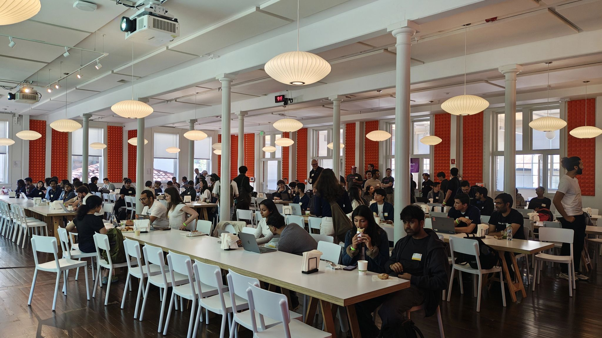
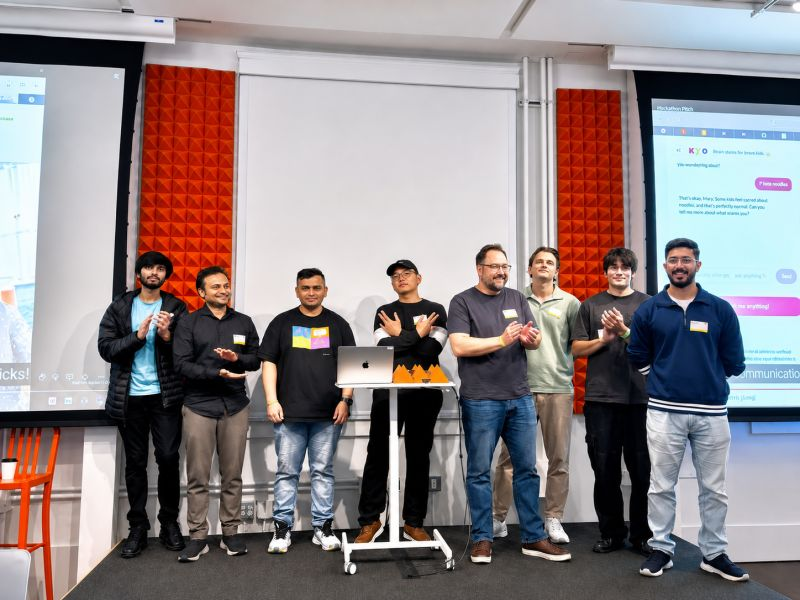

# That’s a Wrap: The YC x Medplum Hackathon

On **Saturday, August 1, 2026**, the Y Combinator office in San Francisco filled up with 160+ hackers for the
[**Agentic Healthcare Hackathon**](https://events.ycombinator.com/medplum-hackathon-26), co-hosted by Medplum and Y Combinator.

This post is a celebration of that day, and to express our heartfelt appreciation to every single hacker who showed up and
shipped. You are the reason events like this exist, thank you all!

{/* truncate */}

## Celebrating the Hacks and the Winners

Every team brought something worth celebrating, and our judges had a genuinely hard job.

Congratulations to the teams recognized at the awards ceremony — here are their demos.

### First Place

_Lamina: Linkedin for Healthcare AI Agents_

  <iframe
    width="560"
    height="315"
    src="https://www.youtube.com/embed/Mw8AnRAy0R8?si=YRxOhpYPg7YUNJNO"
    title="Hackathon First Place Demo"
    frameborder="0"
    allow="accelerometer; autoplay; clipboard-write; encrypted-media; gyroscope; picture-in-picture; web-share"
    allowfullscreen
  ></iframe>

### 🥈 Second Place

_CareLoop: Pre-Visit Voice AI Agent for Chronic Care_

  <iframe
    width="560"
    height="315"
    src="https://www.youtube.com/watch?v=M-HoV_RH2Rs"
    title="Hackathon Second Place Demo"
    frameborder="0"
    allow="accelerometer; autoplay; clipboard-write; encrypted-media; gyroscope; picture-in-picture; web-share"
    allowfullscreen
  ></iframe>

### 🥉 Third Place

_LinkaChart Action Plan_

  <iframe
    width="560"
    height="315"
    src="https://youtu.be/xTUUgOhvdAA"
    title="Hackathon Third Place Demo"
    frameborder="0"
    allow="accelerometer; autoplay; clipboard-write; encrypted-media; gyroscope; picture-in-picture; web-share"
    allowfullscreen
  ></iframe>

### 🏆 People's Choice

_MedTrace AI — From patient conversation to the right care, at the right cost_

  <iframe
    width="560"
    height="315"
    src="https://www.youtube.com/watch?v=A15wWTqn194"
    title="Hackathon People's Choice Demo"
    frameborder="0"
    allow="accelerometer; autoplay; clipboard-write; encrypted-media; gyroscope; picture-in-picture; web-share"
    allowfullscreen
  ></iframe>

To see all hacks submitted, visit [our playlist](https://www.youtube.com/playlist?list=PLKMKXQQFc9aI)!

## Thank You to Our Judges

This hackathon would not have been possible without a panel of judges who gave their time, energy, and expertise:

- **[Diana Hu](https://www.linkedin.com/in/sdianahu)** — Partner at Y Combinator
- **[Cody Ebberson](https://www.linkedin.com/in/codyebberson/)** — Co-founder and CTO of Medplum
- **[Ana Yoon Faria de Lima](https://www.linkedin.com/in/ana-yoon-faria-de-lima/)** — Co-founder of Pavoot
- **[Naomi Carrigan](https://www.linkedin.com/in/naomi-lgbt/)** — Developer Community at Deepgram
- **[Victor Wang](https://www.linkedin.com/in/vwang1111/)** — Staff Software Engineer at Deepgram
- **[Sri Raghu Malireddi](https://www.linkedin.com/in/r4ghu/)** — Co-founder of Moss

Thank you all for the thoughtful feedback and for making the awards ceremony one to remember.

## Thank You to Our Sponsors

A huge thank you to our sponsors, whose technology and support powered every hack in the room:

- **[Y Combinator](https://www.ycombinator.com/)** — for hosting us and putting a YC interview on the line
- **[Deepgram](https://deepgram.com/)** — speech-to-text, text-to-speech, and voice agent APIs, plus generous credits for every builder
- **[Moss](https://moss.dev/)** — real-time semantic search for voice agents and copilots
- **[Stedi](https://www.stedi.com/)** — healthcare APIs and test mode for building against real payer workflows

## Thank You for Building With Us

More than anything, this event was a celebration of a community that cares about the future of healthcare. Agentic healthcare is being built right now, and this day proved just how much a room of motivated people can create when they come together. Whether you placed, demoed, mentored, or simply showed up with an idea and a laptop — thank you. You made this day what it was.

The building doesn't have to stop here. Join us on the [Medplum Discord](https://discord.gg/medplum) to keep the momentum going. We can't wait to do it again — and we can't wait to see what you build next.
