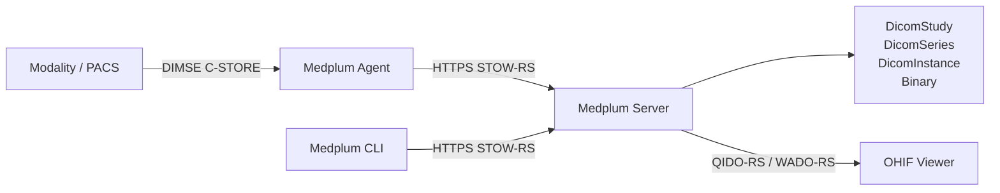

Medical imaging has been the part of the patient record that lives somewhere else. A digital health
company builds its charting, ordering, and results workflows on FHIR, and then imaging arrives and
the answer is a separate PACS, a separate login, a separate access control model, and a link out to a
viewer that knows nothing about the rest of the chart.

Today we are releasing [DICOM and DICOMweb support](/docs/dicom) in
[Beta](/docs/compliance/alpha-beta). A modality on a hospital network can send a study to Medplum over
the DICOM network protocol, the study is stored as ordinary Medplum resources under the project's
existing access policies, and a DICOMweb viewer can read it back out — with no image server in the
middle.

{/* truncate */}

## What's in the box

Three things arrived together, because none of them is useful alone.

**The DICOMweb service.** Medplum serves [DICOMweb](/docs/dicom/dicomweb-api) at `/dicomweb` on the
same host as the FHIR API, with the same OAuth2 bearer tokens and the same
[access policies](/docs/access/access-policies). STOW-RS accepts stored instances. QIDO-RS and
WADO-RS serve the study list, series metadata, and pixel frames that a viewer needs.

**DIMSE support in the Medplum Agent.** Imaging equipment does not speak DICOMweb. It speaks DIMSE —
the DICOM message service over raw TCP — on a hospital network with no route to the internet. The
[Medplum Agent](/docs/dicom/agent-dimse) already runs inside that firewall for HL7 v2 and ASTM
traffic; it now also presents itself to a modality as a DICOM Storage SCP, accepts `C-STORE`, and
forwards each instance to Medplum over an outbound HTTPS connection. No inbound firewall rule.

**A CLI command.** [`medplum dicomweb stow`](/docs/dicom/cli) uploads a file through STOW-RS, so you
can get imaging into a project in one command without standing up any infrastructure to try it.

```bash
npm install --global @medplum/cli
medplum login
medplum dicomweb stow MRBRAIN.DCM
```

## Why we modeled DICOM natively

The obvious approach is to translate imaging into FHIR at the door — map each incoming study onto an
`ImagingStudy` and be done. We didn't, and the reason is worth explaining, because it is the decision
that determines what you can build on this.

DICOM and FHIR disagree about what an image is. A DICOM instance carries hundreds of attributes —
acquisition geometry, windowing defaults, pixel spacing, frame-of-reference UIDs, the private tags a
particular scanner vendor uses to record its own acquisition parameters. FHIR's `ImagingStudy` models
the fraction of that a clinical workflow needs to reference a study; it was never meant to carry
enough to *render* one. Translate at ingest and you throw away exactly the attributes a viewer needs,
and you cannot get them back.

So Medplum stores the DICOM hierarchy directly, as three resource types that mirror it:

- [`DicomStudy`](/docs/api/fhir/medplum/dicomstudy) — study UID, accession number, study date, patient demographics
- [`DicomSeries`](/docs/api/fhir/medplum/dicomseries) — series UID, modality, series description
- [`DicomInstance`](/docs/api/fhir/medplum/dicominstance) — instance attributes, the full DICOM JSON metadata, and references to the stored binaries

The original `.dcm` file is preserved unmodified as a [`Binary`](/docs/api/fhir/resources/binary), and
a background worker extracts pixel data into one `Binary` per frame. Nothing is lossy, and a DICOMweb
response can be reconstructed faithfully from what was stored.

What you get in exchange for keeping the DICOM shape is that these are still Medplum resources. They
are searchable with the [FHIR search API](/docs/dicom/data-model#search-parameters), readable through
the [TypeScript SDK](/docs/sdk/), governed by
[access policies](/docs/access/access-policies), audited like everything else, and able to trigger
[Bots](/docs/bots) on create or update.

```ts
const studies = await medplum.searchResources('DicomStudy', {
  'accession-number': 'A12345',
});
```

That last one is the interesting part. A Bot that fires when a `DicomStudy` is created is where the
imaging pipeline meets the rest of your application — reconciling a study against an order, matching
the DICOM Patient ID to your MRN identifier system, kicking off an AI inference job, notifying a
radiologist's worklist. The imaging data and the workflow logic are finally in the same system.

## The path from a scanner to a browser



Adding a DICOM channel to an Agent takes one `Endpoint` whose address names the scheme, the port, and
where instances should land:

```
dicom://0.0.0.0:8104?storage=dicomweb
```

`storage=dicomweb` routes each received instance to the STOW-RS endpoint, which files it into the
DICOM resources. The default, `storage=binary`, uploads a FHIR `Binary` instead — that is what DICOM
channels did before this release, and it keeps working unchanged. Either way, a Bot is notified with
the association's AE titles and the instance's DICOM JSON metadata, minus the pixel data.

On the way out, [OHIF](/docs/dicom/ohif-viewer) reads studies directly from `/dicomweb`. Medplum's
hosted cloud is preconfigured with an OHIF instance at
[viewer.medplum.com](https://viewer.medplum.com), so there is nothing to deploy — sign in and your
studies are there. It is the same server, the same tokens, and the same access policies as the FHIR
API: a user who cannot read a `DicomStudy` cannot open it in the viewer either. There is no second
authorization model to keep in sync, which is the failure mode most imaging integrations eventually
produce.


## What's next

This is a [Beta](/docs/compliance/alpha-beta) release: the end-to-end path works, the resource model
is stable enough to build against, and breaking changes will come with notice and a migration path
where practical.

Linking imaging into the chart is the next thing we are building — a `DicomStudy` that references a
`Patient` directly, so a study is reachable by navigating from the record rather than by DICOM
Patient ID. After that, richer QIDO-RS querying and broader coverage of the DICOMweb retrieval
surface.

The [documentation](/docs/dicom) describes the implemented API in detail if you want to see exactly
what you can build on today.

## Try it

The fastest path is three commands and a browser:

1. `medplum dicomweb stow MRBRAIN.DCM` — [store a file](/docs/dicom/cli)
2. Open [viewer.medplum.com](https://viewer.medplum.com) and sign in
3. Open the study

Then, when you are ready for real equipment, add a
[DICOM channel to an Agent](/docs/dicom/agent-dimse) and send a `C-ECHO` from the modality.

## Tell us what you need

Which parts of this we build out next depends on what people actually hit. If QIDO filtering is
blocking a migration, if you need `C-MOVE` to pull from an existing archive, if chart linkage is the
thing standing between you and a pilot — that is exactly what we want to hear.

Reach us at [hello@medplum.com](mailto:hello@medplum.com), open a
[GitHub issue](https://github.com/medplum/medplum/issues), or find us in
[Discord](https://discord.gg/medplum).

- [DICOM & DICOMweb documentation](/docs/dicom)
- [DICOMweb API reference](/docs/dicom/dicomweb-api)
- [DICOM data model](/docs/dicom/data-model)
- [Medplum Agent](/docs/agent)
