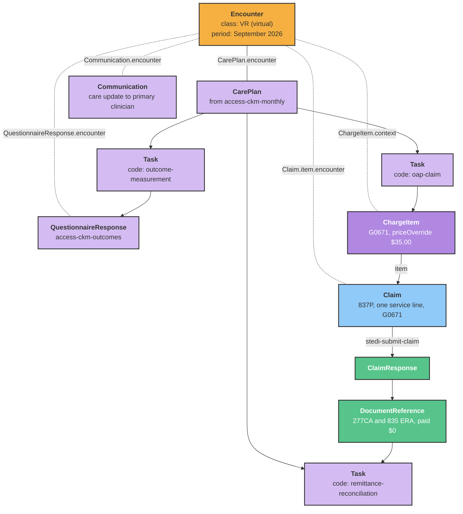
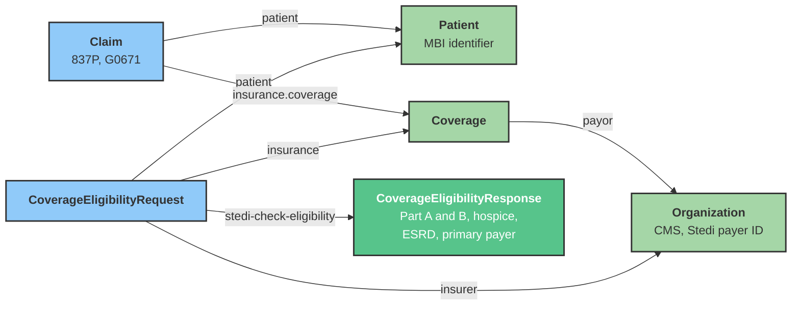
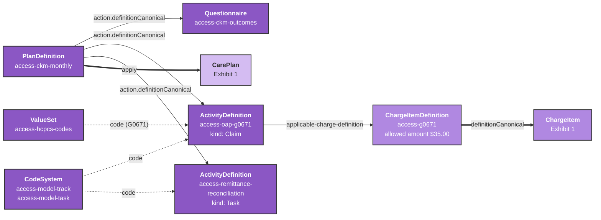

Medicare's [ACCESS Model](https://www.cms.gov/priorities/innovation/innovation-models/access) went live on July 5, 2026 and runs for ten years. It pays practices a recurring monthly amount for managing a patient's chronic condition, and it pays that patient's regular clinician separately for co-managing the care.

If you are an approved ACCESS Participant, the operational questions are tangible. How do you screen a patient before you open a billing period? Which code do you bill this month? What do you do when the remittance comes back at $0?

This post answers those in Medplum terms, and it ships with a FHIR bundle you can load into a project today: the task types, the plan definitions for all four clinical tracks, the charge item definitions for every allowed amount, and the HCPCS value sets.

{/* truncate */}

:::note[Work in progress]

This post and the accompanying bundle are under active development and are meant to be informational. They describe one reasonable way to model ACCESS in FHIR. Different implementations will have variations, and the program details should be confirmed against current CMS guidance.

:::

## What ACCESS pays for

ACCESS is billed under Medicare Part B. Patients on Medicare Advantage are not eligible. The model runs four clinical tracks:

| Track                                | Conditions                                                                                      |
| ------------------------------------ | ----------------------------------------------------------------------------------------------- |
| Early cardio-kidney-metabolic (eCKM) | Hypertension, dyslipidemia, obesity or overweight with a marker of central obesity, prediabetes |
| Cardio-kidney-metabolic (CKM)        | Diabetes, chronic kidney disease (stage 3a or 3b), atherosclerotic cardiovascular disease       |
| Musculoskeletal (MSK)                | Chronic musculoskeletal pain                                                                    |
| Behavioral health (BH)               | Depression and anxiety                                                                          |

There are two payment types, and they belong to two different parties:

**Outcome-Aligned Payments (OAPs)** go to the ACCESS Participant. You bill one professional claim per patient per month, with a single service line and one unit of service. CMS does not pay that claim: the remittance shows $0, and the payment arrives separately. The base OAP is 80 percent of the claim's allowed amount. The remaining 20 percent is tied to how much of your panel hit its outcome targets, so it is a panel-level result rather than a per-patient one.

**Co-Management Payments (CMPs)** go to the patient's primary care physician or referring clinician for reviewing your care update and doing at least one care-coordination activity. They are capped at three payments per patient, per track, every 12 months, and they carry no patient cost-sharing.

## What an eligibility check can and cannot tell you

A standard CMS eligibility check isn't sufficient to confirm ACCESS eligibility. CMS does not return ACCESS information in an eligibility response, and two of the five criteria (a qualifying diagnosis, and the alignment process that matches a patient to a specific Participant) are not in the 271 at all. Those come from the chart and from the CMS ACCESS Model APIs.

What the check does screen is the other three, and that is worth running before you open a billing period:

| ACCESS criterion              | Where it shows up in the eligibility response                        |
| ----------------------------- | -------------------------------------------------------------------- |
| Enrolled in Part A and Part B | Benefit code `1` (Active Coverage) with insurance type `MA` and `MB` |
| Not receiving hospice care    | Benefit code `X` with service type `45` (Hospice)                    |
| No end-stage renal disease    | Benefit code `D` with service type `RN` (Renal)                      |
| Medicare is the primary payer | Benefit code `R` (Other or Additional Payor)                         |

Two considerations on the negative results. If ESRD does not appear, the patient may still have it: a recent diagnosis may not have reached CMS records yet. And if no other payer appears, Medicare may still be secondary, because CMS only reports the coverage it knows about.

## Sample data model

ACCESS is well modeled by FHIR. Each month of care is an [asynchronous encounter](/docs/communications/async-encounters), the clinical activity inside it is the outcome questionnaire response, and the claim bills that encounter. The program rules are the same for every patient, so they live in definitional resources that you load once and apply.

The three diagrams below trace one patient on the CKM track through one month. The first is what your application creates each month. The second is the coverage and eligibility context that both the eligibility check and the claim reference. The third is what ships in the bundle: the workflow, modeled as a PlanDefinition.

### Exhibit 1: One patient, one month

The month is an [Encounter](/docs/api/fhir/resources/encounter) with class `VR` (virtual) and a period covering the month, following the [asynchronous encounters](/docs/communications/async-encounters) pattern. The activity that justifies the claim is the [QuestionnaireResponse](/docs/api/fhir/resources/questionnaireresponse) capturing that month's outcome measures, linked to the encounter. The ChargeItem and the Claim line both reference the same encounter, so every claim traces back to documented clinical activity. The tasks come from applying the monthly protocol, and the claim response loops back into a reconciliation task. Dotted lines are references back to the encounter, labeled with the element that holds them.



### Exhibit 2: Coverage and eligibility

The eligibility check and the claim share the same Patient, Coverage, and payer Organization. The bundle ships the CMS Organization with its Stedi network identifier so the references resolve without setup.



### Exhibit 3: The workflow as a PlanDefinition

This is how the monthly workflow in Exhibit 1 is modeled: as a [PlanDefinition](/docs/api/fhir/resources/plandefinition), following Medplum's [clinical protocols](/docs/careplans/protocols) pattern. The PlanDefinition points at the outcome questionnaire and the month's activities. Applying it creates the CarePlan and Tasks. Each billing activity points at the ChargeItemDefinition that carries its allowed amount, which is what prices the ChargeItem. These resources are the same for every patient, so they ship in the bundle and load once.



A few design choices worth calling out.

The **Encounter is the billable unit**. One virtual encounter per patient per month, with the QuestionnaireResponse as the clinical activity inside it, gives the claim something concrete to point at. The application creates the encounter, because FHIR does not generate encounters from a PlanDefinition.

The **Task** is the unit of work, and its code comes from the ActivityDefinition it was generated from. That is why the bundle codes every ActivityDefinition against `access-model-task`: a work queue is then a search, `Task?code=oap-claim&status=ready`, rather than a convention your application has to remember.

The **price never lives in application code**. The ChargeItem points at the ChargeItemDefinition through `definitionCanonical`, and `$apply` writes the allowed amount onto the ChargeItem. When CMS revises an allowed amount, you update one definitional resource.

The **835 loops back into a Task rather than closing the claim**. The ERA arrives paid at $0, which is an acknowledgment rather than a payment, so it opens the reconciliation task instead of completing the billing one.

## Sample bundle

[Download cms-access-model-bundle.json](/examples/cms-access-model-bundle.json), then upload it to the [batch tool](https://app.medplum.com/batch). It is a transaction Bundle of 51 definitional resources, written as conditional updates keyed on canonical URL, so it is safe to re-run.

| Resource type                                                         | Count | What it covers                                                                    |
| --------------------------------------------------------------------- | ----- | --------------------------------------------------------------------------------- |
| [ValueSet](/docs/api/fhir/resources/valueset)                         | 7     | The HCPCS G-codes, split by payment type, plus the clinical tracks and task types |
| [CodeSystem](/docs/api/fhir/resources/codesystem)                     | 2     | Clinical tracks and ACCESS task types                                             |
| [ChargeItemDefinition](/docs/api/fhir/resources/chargeitemdefinition) | 11    | One per billable code, carrying its allowed amount                                |
| [ActivityDefinition](/docs/api/fhir/resources/activitydefinition)     | 20    | Ten workflow task types and ten billing activities                                |
| [PlanDefinition](/docs/api/fhir/resources/plandefinition)             | 6     | Onboarding, the monthly cycle for each of the four tracks, and co-management      |
| [Questionnaire](/docs/api/fhir/resources/questionnaire)               | 4     | Monthly outcome capture, one per track                                            |
| [Organization](/docs/api/fhir/resources/organization)                 | 1     | CMS as payer, carrying the Stedi network identifier                               |

### Value sets for the HCPCS codes

ACCESS bills on track-specific G-codes that CMS maintains as [HCPCS](/docs/terminology/common-terminologies) Level II codes, under the system `https://www.cms.gov/Medicare/Coding/HCPCSReleaseCodeSets`.

Initial 12-month period, billed by the Participant:

| Track | Code    | Allowed amount |
| ----- | ------- | -------------- |
| eCKM  | `G0669` | $30.00         |
| CKM   | `G0671` | $35.00         |
| MSK   | `G0673` | $15.00         |
| BH    | `G0674` | $15.00         |

Follow-on 12-month periods. The MSK track has no follow-on period:

| Track | Code    | Allowed amount |
| ----- | ------- | -------------- |
| eCKM  | `G0670` | $15.00         |
| CKM   | `G0672` | $17.50         |
| BH    | `G0675` | $7.50          |

Co-Management Payments, billed by the primary or referring clinician. `G0676` covers both the eCKM and CKM tracks:

| Track     | Code    | Allowed amount |
| --------- | ------- | -------------- |
| eCKM, CKM | `G0676` | $30.00         |
| MSK       | `G0677` | $30.00         |
| BH        | `G0678` | $30.00         |

The bundle ships these as four narrow value sets (`access-oap-initial-codes`, `access-oap-followon-codes`, `access-cmp-codes`, `access-cmp-modifiers`) plus `access-hcpcs-codes`, which composes the first three. Use the narrow ones to validate a claim line against the period the patient is actually in, and the composed one for reporting across the whole program.

The `AC` modifier is in its own value set because it behaves differently. Appending it to the first CMP claim per patient per track adds a one-time $10 onboarding payment.

### Charge item definitions

Every billable code gets a [ChargeItemDefinition](/docs/api/fhir/resources/chargeitemdefinition) carrying its allowed amount, so pricing lives in the datastore rather than in application code. Point a [ChargeItem](/docs/api/fhir/resources/chargeitem) at one through `definitionCanonical` and the [`$apply` operation](/docs/api/fhir/operations/chargeitemdefinition-apply) prices it:

```json
{
  "resourceType": "ChargeItemDefinition",
  "url": "https://www.medplum.com/fhir/ChargeItemDefinition/access-g0671",
  "title": "ACCESS OAP - Cardio-kidney-metabolic, initial period (G0671)",
  "status": "active",
  "code": {
    "coding": [
      {
        "system": "https://www.cms.gov/Medicare/Coding/HCPCSReleaseCodeSets",
        "code": "G0671",
        "display": "Monthly outcome-aligned payment for managing cardio-kidney-metabolic conditions, initial 12-month period"
      }
    ]
  },
  "useContext": [
    {
      "code": { "system": "http://terminology.hl7.org/CodeSystem/usage-context-type", "code": "program" },
      "valueCodeableConcept": {
        "coding": [
          {
            "system": "https://www.medplum.com/fhir/CodeSystem/access-model-track",
            "code": "ckm",
            "display": "Cardio-kidney-metabolic"
          }
        ]
      }
    }
  ],
  "propertyGroup": [
    {
      "priceComponent": [
        {
          "type": "base",
          "factor": 1,
          "amount": { "value": 35, "currency": "USD" }
        }
      ]
    }
  ]
}
```

The allowed amount is the full amount, not the 80 percent base. The outcome-tied 20 percent is settled at the panel level after the fact, so it does not belong on a per-claim price.

### Task types

The bundle defines ten workflow task types as [ActivityDefinitions](/docs/api/fhir/resources/activitydefinition), each coded against `https://www.medplum.com/fhir/CodeSystem/access-model-task`. Because the code is on the definition, the [Tasks](/docs/api/fhir/resources/task) generated from it are searchable with `Task?code=`, which is what you want for a work queue.

| Task type                   | Kind                 | What it is for                                                                                            |
| --------------------------- | -------------------- | --------------------------------------------------------------------------------------------------------- |
| `mbi-lookup`                | Task                 | Find the Medicare Beneficiary Identifier when it is not on file. Every CMS eligibility check requires one |
| `eligibility-check`         | Task                 | Run the check and record Part A/B, hospice, ESRD, and primary payer                                       |
| `diagnosis-review`          | Task                 | Confirm a qualifying diagnosis for the track from the chart                                               |
| `alignment-verification`    | Task                 | Confirm alignment to this Participant through the CMS ACCESS Model APIs                                   |
| `roster-check`              | Task                 | Confirm the rendering clinician is on the Participant's Clinician Roster                                  |
| `enrollment`                | EnrollmentRequest    | Open the initial 12-month period                                                                          |
| `remittance-reconciliation` | Task                 | Reconcile the $0 ERA against the separate OAP payment                                                     |
| `care-update`               | CommunicationRequest | Send the monthly care update to the primary clinician                                                     |
| `comanagement-review`       | Task                 | Clinician reviews the update and does a care-coordination activity                                        |
| `followon-transition`       | Task                 | Move the patient to the follow-on G-code at 12 months                                                     |

Ten more ActivityDefinitions cover billing, one per G-code. Each carries a `kind` of `Claim` and an `applicable-charge-definition` extension pointing at its ChargeItemDefinition, which is the same [care template](/docs/charting/visit-templates) pattern Medplum already uses for visits.

### Plan definitions

Six [PlanDefinitions](/docs/api/fhir/resources/plandefinition) assemble those task types into runnable [protocols](/docs/careplans/protocols).

`access-patient-onboarding` runs once per patient per track and covers everything that has to be true before you open a billing period: MBI lookup, eligibility check, qualifying diagnosis, alignment, roster check, enrollment.

`access-eckm-monthly`, `access-ckm-monthly`, `access-msk-monthly`, and `access-bh-monthly` each run once per patient per month: capture outcomes, submit the claim, reconcile the remittance, send the care update. The billing step nests the initial-period and follow-on codes under a `selectionBehavior` of `exactly-one`, so the protocol carries the choice rather than leaving it to application logic:

```json
{
  "id": "oap-claim",
  "title": "Submit the monthly OAP claim",
  "description": "Bill the code for the period the patient is currently in.",
  "selectionBehavior": "exactly-one",
  "action": [
    {
      "id": "bill-initial",
      "title": "Bill the initial-period OAP (G0671)",
      "definitionCanonical": "https://www.medplum.com/fhir/ActivityDefinition/access-oap-g0671"
    },
    {
      "id": "bill-followon",
      "title": "Bill the follow-on-period OAP (G0672)",
      "definitionCanonical": "https://www.medplum.com/fhir/ActivityDefinition/access-oap-g0672"
    }
  ]
}
```

The MSK protocol has no such choice, because that track has no follow-on period.

`access-comanagement` is the clinician side: review the care update, do the care-coordination activity, bill the CMP for the patient's track.

## Running the eligibility check with Stedi

Medplum's [Stedi integration](/docs/integration/stedi) sends real-time eligibility and benefits checks as X12 270/271. You build a [CoverageEligibilityRequest](/docs/api/fhir/resources/coverageeligibilityrequest) and invoke `$stedi-check-eligibility` on it, and the benefits come back as a [CoverageEligibilityResponse](/docs/api/fhir/resources/coverageeligibilityresponse):

```bash
POST {base}/fhir/R4/CoverageEligibilityRequest/{id}/$stedi-check-eligibility
```

The bundle includes the CMS payer [Organization](/docs/api/fhir/resources/organization) with the Stedi network identifier already on it, so the `insurer` reference resolves without any extra setup:

```json
{
  "resourceType": "Organization",
  "name": "Centers for Medicare & Medicaid Services",
  "identifier": [{ "system": "https://www.stedi.com/healthcare/network", "value": "CMS" }]
}
```

Service type `30` (Health Benefit Plan Coverage) is the right request here, and it is the default when no X12 service type coding is present. See the [eligibility checks guide](/docs/integration/stedi/insurance-eligibility/eligibility-checks) for the full resource model, and the [general eligibility guide](/docs/billing/insurance-eligibility-checks) for how FHIR models the request and response pair.

Transaction enrollment with CMS is required before you can run these checks at all, and it is separate from the enrollment you complete with your MAC for claims.

## Submitting the monthly OAP claim

OAP and CMP claims are ordinary professional claims (X12 837P). They go to the [Medicare Administrative Contractor](https://www.cms.gov/medicare/coding-billing/medicare-administrative-contractors-macs/who-are-macs) for the patient's jurisdiction, not to CMS. Build a [Claim](/docs/api/fhir/resources/claim) and invoke `$stedi-submit-claim`:

```bash
POST {base}/fhir/R4/Claim/{id}/$stedi-submit-claim
```

An OAP claim has exactly one service line:

```json
{
  "resourceType": "Claim",
  "status": "active",
  "type": { "coding": [{ "system": "http://terminology.hl7.org/CodeSystem/claim-type", "code": "professional" }] },
  "use": "claim",
  "item": [
    {
      "sequence": 1,
      "productOrService": {
        "coding": [
          {
            "system": "https://www.cms.gov/Medicare/Coding/HCPCSReleaseCodeSets",
            "code": "G0671"
          }
        ]
      },
      "servicedDate": "2026-09-01",
      "quantity": { "value": 1 }
    }
  ]
}
```

Three rules to enforce in code rather than in a runbook, because each one silently costs you the payment:

1. The date of service is the **first day you provided ACCESS services that month**, not the date you submit. Claims filed more than 90 days after the date of service are not payable.
2. The **rendering provider** (`Claim.careTeam` with role `primary`) must be on the Participant's Clinician Roster.
3. The **billing provider** (`Claim.provider`) must use the Participant's Type 2 NPI.

The [professional claims guide](/docs/integration/stedi/claim-submission/professional-claims) has the full resource model, including how `Claim.provider` and `Claim.careTeam` separate the billing relationship from the clinical one.

A CMP claim is the same shape with two differences: it may carry additional service lines for non-ACCESS services such as an office visit, and the first one per patient per track takes the `AC` modifier in `item.modifier`.

## Reconciling a $0 remittance

This is the part that breaks naive posting logic. The 835 for an accepted OAP claim shows a payment of $0, and the Outcome-Aligned Payment arrives as a separate transaction. If your reconciliation treats a $0 ERA as a denial, every ACCESS claim you file will look like a failure.

Medplum ingests 277CA acknowledgments and 835 ERAs through [claim responses](/docs/integration/stedi/claim-submission/claim-responses), storing each report verbatim as a [DocumentReference](/docs/api/fhir/resources/documentreference) and recording the submission as a [ClaimResponse](/docs/api/fhir/resources/claimresponse). For ACCESS, treat the $0 ERA as acknowledgment that the claim was accepted, and reconcile the OAP against the month's accepted claims rather than against individual remittances. That is what the `remittance-reconciliation` task type in the bundle is for.

## What you still have to get from CMS

The bundle covers what is stable and published. Three things are yours to source, and we have deliberately left them out rather than guess:

- **The qualifying diagnosis list per track.** CMS publishes it, it is not in an eligibility response, and it changes. Load it as a value set of ICD-10 codes and reference it from the `diagnosis-review` task.
- **Outcome measures and targets.** The four outcome questionnaires in the bundle are a reasonable starting point built on standard instruments (blood pressure, HbA1c, eGFR and urine albumin/creatinine ratio, a 0-10 pain rating, PHQ-9 and GAD-7). Confirm the measures and thresholds against the CMS OAP billing guidelines for your performance year before you rely on them.
- **Alignment status.** Only the CMS ACCESS Model APIs can tell you a patient is aligned to you. Nothing in the 270/271 will.

For self-hosters, everything above is ordinary FHIR. The bundle loads into a self-hosted project exactly as it does into a hosted one. The Stedi operations run as [bots](/docs/bots), so the clearinghouse credentials stay in your own project secrets.

## Related reading

Stedi published a guide to the transaction layer, [Claims and eligibility checks for CMS ACCESS](https://www.stedi.com/blog/claims-and-eligibility-checks-for-cms-access), which is the source for the code and allowed-amount tables above. This post is the FHIR modeling layer that sits on top of it.

- [ACCESS Model](https://www.cms.gov/priorities/innovation/innovation-models/access) and the [ACCESS Technical FAQ](https://www.cms.gov/priorities/innovation/access-technical-frequently-asked-questions) from CMS
- [Who are the MACs](https://www.cms.gov/medicare/coding-billing/medicare-administrative-contractors-macs/who-are-macs), to find the Medicare Administrative Contractor for a patient's jurisdiction
- [Medplum Stedi integration](/docs/integration/stedi): [eligibility checks](/docs/integration/stedi/insurance-eligibility/eligibility-checks), [professional claims](/docs/integration/stedi/claim-submission/professional-claims), and [claim responses](/docs/integration/stedi/claim-submission/claim-responses)
- [Insurance eligibility checks](/docs/billing/insurance-eligibility-checks), for how FHIR models the request and response pair
- [Clinical protocols](/docs/careplans/protocols) and [care templates](/docs/charting/visit-templates), the PlanDefinition patterns the bundle is built on
- [Common terminologies](/docs/terminology/common-terminologies), including the canonical system URL for HCPCS

## Get started

Planning this build? The [RCM & Billing Decision Guide](/docs/decision-guides/rcm-billing) walks through the requirements questions and modeling decisions for charge capture, eligibility, claims, and remittance, and it is the right place to start if you are deciding how much of the revenue cycle to run in Medplum.

To learn more about anything in this post, or to talk through how it applies to what you are building, contact us at [hello@medplum.com](mailto:hello@medplum.com).
