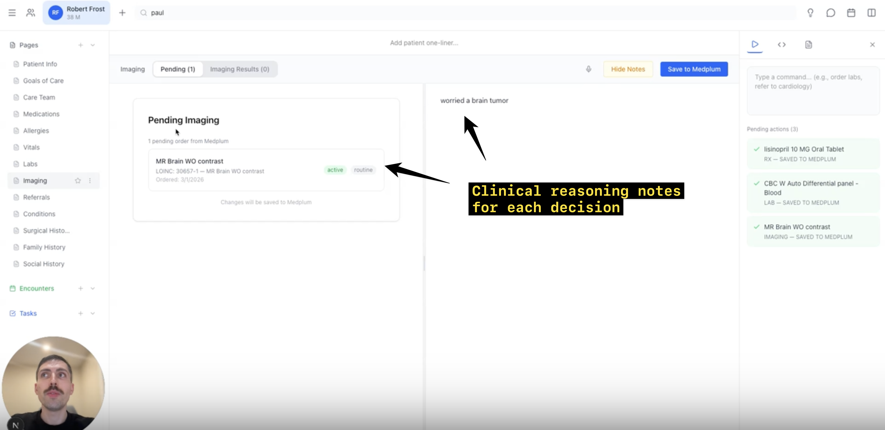
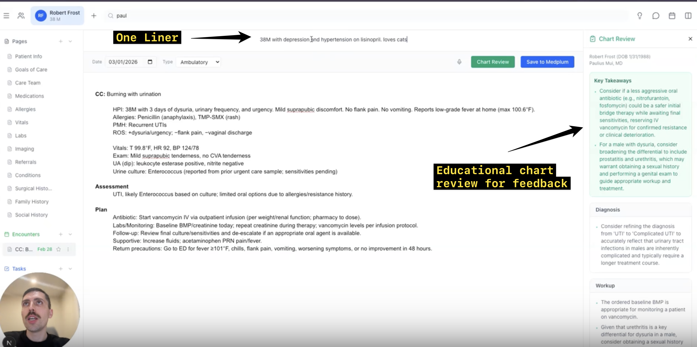

# An EHR That Teaches: Building an AI-Powered Clinical Learning Environment with Medplum

## Building an open-source, AI-enabled clinical learning environment with Medplum and PhenoML

Electronic health records were designed primarily to support patient care, documentation, and billing. But what would an EHR look like if we designed it specifically for teaching? We’ve been [thinking and writing about this topic](https://www.xprimarycare.com/p/rethinking-clinical-training) for years. That's the question we set out to explore with this project.

As a family physician who has spent time working on both clinical education and EHR development, I've long been interested in how technology can help clinicians become better at their craft. We spend years teaching medical students and residents how to gather information, develop differential diagnoses, and make clinical decisions. Yet the software they use every day rarely makes that reasoning visible.

Most EHRs capture what a clinician documents or orders, but very little about why they made those decisions. We wanted to experiment with something different: an EHR that makes it easy to work with clinical information, captures the thinking behind decisions, and provides feedback that helps clinicians learn. Using [Medplum](https://www.medplum.com/) as our FHIR-based backend and [PhenoML](https://phenoml.com/) to translate natural language into structured clinical information, we built an early prototype of an AI-enabled EHR designed around clinical education. And we've [made it open-source](https://github.com/xprimarycare/xpc-emr) so others can explore, build on, and improve it. 

# Starting with a blank canvas

One of our first design decisions was to rethink the interface itself. Rather than replicate the dense screens, nested menus, and rigid forms of traditional EHRs, we took inspiration from [Google Docs](https://docs.google.com/). The interface is organized around simple, navigable pages representing familiar parts of a patient chart: medications, allergies, vital signs, laboratory results, conditions, medical history, encounters, and more.

Clinicians can navigate between these pages much like they would navigate between sections of a document. A persistent patient summary, which we call the "one-liner," provides a quick reminder of who the patient is, including relevant medical history and even personal details that matter to their care.

Behind this simplified interface, Medplum manages the underlying clinical data using FHIR resources. Creating a patient in our application creates a corresponding patient record in Medplum. Adding medications, conditions, observations, orders, appointments, and tasks similarly updates the underlying structured record. This separation lets us experiment with the clinician experience without having to build the underlying healthcare data infrastructure from scratch.

# Making structured data entry feel like writing

One of the biggest frustrations with traditional EHRs is the amount of effort required to enter structured information. A clinician may know exactly what they want to document, but still need to navigate multiple fields, dropdowns, and search interfaces to enter it. We wanted to see whether natural language could replace much of that interaction. Our prototype includes an AI-enabled action panel that interprets free-text clinical instructions and translates them into structured data.

* For example, a user can type:  
* "Metoprolol — hives" to record a medication allergy and its associated reaction.  
* "Brother had a heart attack at age 55" to populate family history fields.  
* "Smokes one pack per week" to document tobacco use.  
* "Order CBC" to prepare a laboratory order.  
* "Refer to cardiology" to create a referral.

The system interprets the request, presents an appropriate structured entry for confirmation, and saves the information to the patient chart. We also experimented with more complex entries, such as capturing a patient's goals of care or identifying members of the care team and their roles. What makes this possible is our integration with PhenoML, which helps translate natural-language clinical instructions into structured FHIR resources.

Rather than requiring us to manually map every possible user input to the appropriate FHIR resource, field, and terminology, PhenoML handles much of that translation. A clinician can express what they want to document or order in plain language, review the structured result, and confirm it. Medplum then serves as the underlying FHIR data platform, allowing that information to be stored and retrieved in a standardized format. Together, Medplum and PhenoML let us combine the flexibility of natural-language interaction with the interoperability of structured clinical data.

The important design principle is that clinicians should be able to express clinical information naturally, while the software handles much of the work of structuring it. AI isn't replacing structured data here. It's making structured data easier to create.

# Capturing clinical reasoning, not just clinical facts

Perhaps the most important educational feature is also one of the simplest. Every section of the chart has an optional notes panel. While the structured part of the chart records clinical information, this separate space allows learners to document what they're thinking about that information. For example, while reviewing a patient's laboratory results, a learner might write:

* "I'm concerned that these findings could represent an evolving kidney injury, but I need to review the medication list and prior creatinine values."   
* Or, while placing an imaging order: "I'm considering intracranial pathology because of the new headache pattern and associated neurological symptoms."

These notes don't need to fit into a particular diagnostic or billing field. They're a scratchpad for clinical reasoning.

We also added browser-based speech transcription so learners can talk through their thinking instead of typing everything. This creates an interesting educational opportunity. In traditional clinical training, preceptors often have to reconstruct a learner's reasoning by asking questions after the encounter. If learners can capture their thought process while reviewing a chart, educators can better understand how they interpreted the available information and arrived at a decision. The goal isn't to create more documentation. It's to make the reasoning process easier to observe and discuss.

# Closing the loop with AI-generated feedback

Capturing clinical reasoning is only half of the equation. The other half is providing meaningful feedback. To explore this, we integrated our clinical chart review technology from [Distillemr](https://distillemr.com/) directly into the encounter workflow. After documenting a simulated clinical encounter, a learner can request a chart review.

The system evaluates the encounter and generates educational feedback across several dimensions of clinical care, including diagnosis and clinical reasoning, diagnostic workup, treatment decisions, and follow-up planning. In our demonstration, we deliberately included an inappropriate treatment choice in a simulated encounter. The review identified the concern and provided feedback about what the clinician should consider instead.

This begins to approximate an experience that has traditionally required substantial faculty time: having an experienced clinician review an encounter and explain where the learner's reasoning or management could be improved. Of course, AI-generated feedback isn't infallible and should not be treated as a substitute for clinical supervision. But it introduces the possibility of giving learners more frequent, individualized feedback than is feasible through manual chart review alone.

Rather than waiting until a scheduled chart review or preceptor discussion, learners can receive formative feedback shortly after completing an encounter. And because the feedback is connected to the underlying clinical record, we can begin exploring how learning needs change across multiple encounters.

# Making the chart interactive

We also wanted the EHR to serve as an interactive learning environment rather than simply a repository of information. The prototype includes a conversational interface that allows users to ask questions about the patient's chart. For example:

* "Summarize this patient's medical history."  
* Or: "What was this patient's highest recorded blood pressure?"

Instead of manually searching through different sections, users can query the available chart information. We also built support for reusable note templates, including SOAP notes and follow-up visits, and the ability to insert chart variables directly into an encounter.

This makes it possible to bring existing clinical information into a note without repeatedly copying and pasting it. Alongside these AI-enabled features, we implemented more conventional workflows, including appointment scheduling, task creation, and patient messaging, all connected to Medplum. These features matter because our goal isn't to build a disconnected educational simulator. We're interested in whether an EHR can support familiar clinical workflows while also being optimized for teaching.

# Why we built on Medplum

One of the biggest advantages of building on Medplum was the ability to focus our development effort on the user experience and educational functionality rather than the foundational infrastructure. Medplum gives us a FHIR-native backend for storing and managing clinical information. PhenoML provides a natural-language interface for translating user instructions into interoperable FHIR resources. Together, they create a powerful foundation for experimentation. For example, when a clinician types "brother had a heart attack at age 55," we can use PhenoML to interpret the statement and organize it into appropriate structured data, which can then be saved to Medplum. Similarly, natural-language medication requests, diagnoses, laboratory orders, and other clinical information can be translated into structured resources without forcing clinicians to navigate traditional forms.

The architecture is conceptually simple: a clinician enters information in natural language, PhenoML interprets it and helps generate structured FHIR data, and Medplum stores and manages the resulting resources. For us, this meant we could spend more time exploring the questions we actually cared about:

* Can an EHR feel as intuitive as a modern document editor?  
* Can AI reduce the friction of structured data entry?  
* Can we make clinical reasoning visible without adding documentation burden?  
* Can routine clinical encounters become opportunities for individualized learning?  
* Can we do all of this while maintaining standardized, interoperable clinical data?

Medplum and PhenoML gave us a practical way to start answering these questions without building every part of the technology stack ourselves.

# Built in the open

We also decided to make the project open-source. The application is available on GitHub at [https://github.com/xprimarycare/xpc-emr](https://github.com/xprimarycare/xpc-emr).

The project is built with Next.js, React, and TypeScript, using Medplum for FHIR-based clinical data management and PhenoML for natural-language interactions with structured clinical information. Our intention isn't to present this as a finished EHR. It's an evolving prototype and an invitation to experiment. 

We hope other clinicians, educators, and developers can use it as a starting point for their own ideas, whether that's creating simulated patient encounters, experimenting with AI-assisted documentation, developing clinical reasoning exercises, or exploring entirely new approaches to medical education. One of the advantages of open-source healthcare infrastructure is that we don't all have to solve the same foundational problems independently. By sharing what we've built, we hope to encourage others to explore what becomes possible when modern interfaces, AI, and interoperable clinical data come together.

If you're interested in building on the project, exploring the code, or contributing ideas, we'd love to hear from you.

[Click here](https://www.loom.com/share/66c4a02ef82247e49a9a05361c6a113a) to view a video walkthrough of the prototype.

# Where we want to take this next

This is still an early prototype, and there's plenty left to build and validate. But we're excited about what it suggests. Imagine a medical student practicing on a simulated patient, documenting an encounter, explaining their reasoning, and receiving immediate feedback. Imagine a resident completing a series of encounters and being able to see recurring gaps in diagnostic reasoning, treatment selection, or follow-up planning. Or imagine an educator being able to identify patterns across a group of learners and use those insights to guide teaching. Beyond traditional clinical training, similar capabilities could support onboarding, continuing medical education, and longitudinal professional development.

The broader idea is to make the EHR more than a tool for recording care. It could also become a place where clinicians learn from the decisions they make. What if every patient encounter could also be a learning opportunity? We're still early in answering that question, but building on Medplum and PhenoML has made it possible to move from an idea to a working prototype. And by making the project open-source, we're inviting others to help explore what a teaching-first EHR could become.