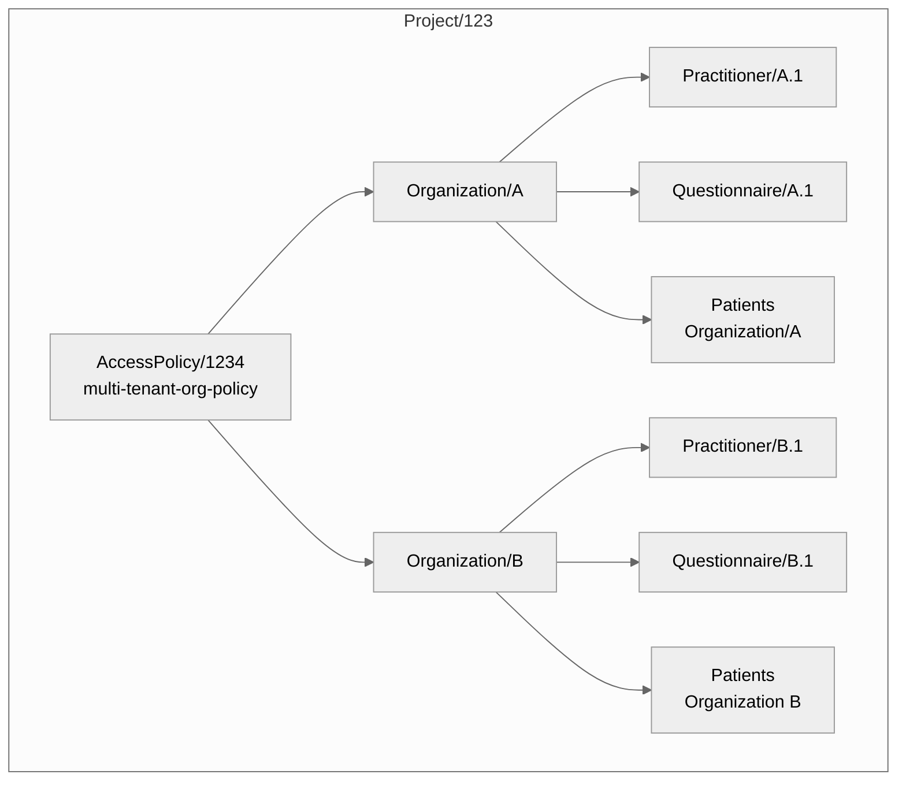

# Multi-Tenant Access Control

## Overview

This guide explains how to implement multi-tenant access control in Medplum projects using `AccessPolicy` and `Organization` FHIR resources. This approach allows you to restrict access to resources based on organizational membership, making it ideal for scenarios where you need to separate data access between different organizations or practices within the same project.

## Architecture

The multi-tenant access control system is built on these key components:

1. An `AccessPolicy` that defines access rules with [parameterized variables](/docs/access/access-policies#parameterized-policies)
2. `Organization` resources that represent different tenants
3. Resources (like `Practitioner`, `Patient`, `Questionnaire`) that are associated with specific organizations
4. The `meta.accounts` field that links resources to organizations

## Visual Architecture



A multi-tenant system where one AccessPolicy controls access for multiple organizations and their associated resources (practitioners, questionnaires, and patients)

## Implementation Guide

### 1. Create the Access Policy

In `AccessPolicy` we use the parameterized variable `%current_organization` in the [compartment](/docs/access/access-policies#compartments) section and then we use `%current_organization` again  for [Criteria-based Access Control](/docs/access/access-policies#compartments).


```json
{
    "resourceType": "AccessPolicy",
    "id": "multi-tenant-org-policy",
    "name": "Multi-Tenant Organization Access Policy",
    "compartment": {
        "reference": "%current_organization"
    },
    "resource": [
        {
            "resourceType": "ValueSet"
        },
        {
            "resourceType": "CodeSet"
        },
        {
            "resourceType": "Organization",
            "criteria": "Organization?_id=%current_organization",
            "readonly": true
        },
        {
            "resourceType": "Practitioner",
            "criteria": "Practitioner?organization=%current_organization"
        },
        {
            "resourceType": "Questionnaire",
            "criteria": "Questionnaire?_compartment=%current_organization"
        },
        {
            "resourceType": "Patient",
            "criteria": "Patient?organization=%current_organization",
            "readonly": true
        }
    ]
}
```

### 2. Create the Organizations

Create separate organizations for each tenant:

```json
{
    "resourceType": "Organization",
    "name": "Organization A"
}
```

```json
{
    "resourceType": "Organization",
    "name": "Organization B"
}
```

### 3. Associate Resources with Organizations

When creating resources, associate them with their respective organizations using the `meta.accounts` field. Here are examples for `Questionnaire` resources:


#### Questionnaire for Organization A
```json
{
    "resourceType": "Questionnaire",
    "meta": {
        "accounts": [
            {
                "reference": "Organization/{{organization_a}}"
            }
        ]
    },
    "title": "Experience Rating Questionnaire",
    "status": "active",
    "item": [
        {
            "linkId": "1",
            "text": "How would you rate your overall experience?",
            "type": "choice",
            "answerOption": [
                {
                    "valueCoding": {
                        "system": "http://example.org/rating",
                        "code": "5",
                        "display": "Excellent"
                    }
                }
            ]
        }
    ]
}
```

#### Questionnaire for Organization B
```json
{
    "resourceType": "Questionnaire",
    "meta": {
        "accounts": [
            {
                "reference": "Organization/{{organization_b}}"
            }
        ]
    },
    "title": "Experience Rating Questionnaire",
    "status": "active",
    "item": [
        {
            "linkId": "1",
            "text": "How would you rate your overall experience?",
            "type": "choice",
            "answerOption": [
                {
                    "valueCoding": {
                        "system": "http://example.org/rating",
                        "code": "5",
                        "display": "Excellent"
                    }
                }
            ]
        }
    ]
}
```


### Create Users and attach AccessPolicy

First create a `Practitioner` User associated with **Organization A** via the [`/admin/invite` endpoint](/docs/api/project-admin/invite)

```json
{
    "resourceType": "Practitioner",
    "firstName": "Practitioner",
    "lastName": "A.1",
    "email": "practitioner.a.1@example.com",
    "sendEmail": "false",
    "password": "foobar",
    "membership": {
        "access": [
            {
                "policy": {
                    "reference": "AccessPolicy/{{access_policy}}"
                },
// highlight-start
                "parameter": [
                    {
                        "name": "current_organization",
                        "valueReference": {
                            "reference": "Organization/{{organization_a}}"
                        }
                    }
                ]
 // highlight-end
            }
        ]
    }
}
```

Then create a Practitioner resource associated with **Organization B**

```json
{
    "resourceType": "Practitioner",
    "firstName": "Practitioner",
    "lastName": "B.1",
    "email": "practitioner.b.1@example.com",
    "sendEmail": "false",
    "password": "foobar",
    "membership": {
        "access": [
            {
                "policy": {
                    "reference": "AccessPolicy/{{access_policy}}"
                },

// highlight-start
                "parameter": [
                    {
                        "name": "current_organization",
                        "valueReference": {
                            "reference": "Organization/{{organization_b}}"
                        }
                    }
                ]
// highlight-end
            }
        ]
    }
}
```


Now Practitioners should only be able to read or write resources mentioned in the `AccessPolicy` that belong to an `Organization` they are a member of. 

## Postman example

To see a full example of this set up using cURL, you can visit this postman collection - [Multi-Tenancy Project](https://documenter.getpostman.com/view/38540571/2sAYBa99dR#intro).
