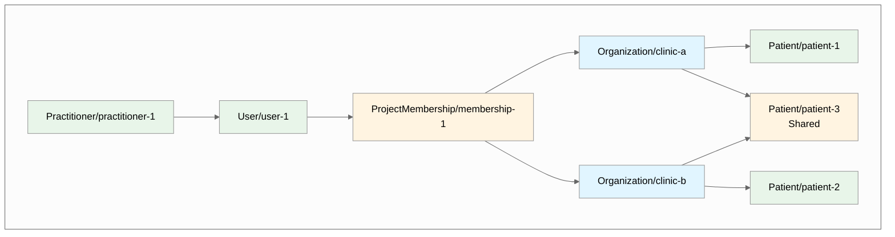
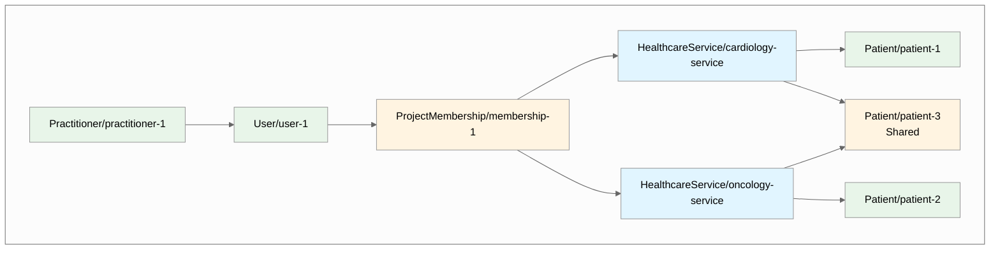
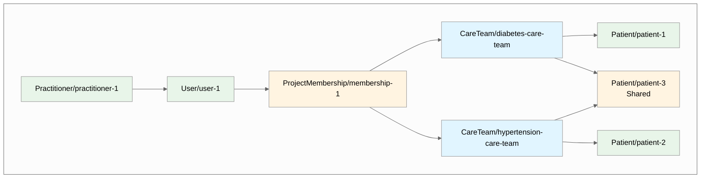

# Multi-Tenant Access Control

import Tabs from '@theme/Tabs';
import TabItem from '@theme/TabItem';

## Overview

In healthcare applications, practitioners often work across multiple organizational boundaries. A doctor might work at multiple clinics, a nurse might be part of several care teams, or a care coordinator might manage patients across different healthcare services. Each of these—clinics, care teams, and healthcare services—represents a distinct **tenant** in your system: a collection of resources (patients, observations, encounters, etc.) that should be logically grouped together.

**Why tenants matter**: Tenants are powerful for enforcing permissions and data isolation. They allow you to:
- Restrict access so users only see data for the organizations, services, or teams they belong to
- Maintain data separation between different clinics, departments, or care teams
- Support complex scenarios where practitioners and patients belong to multiple tenants simultaneously

This guide walks you through implementing multi-tenant access control in Medplum projects. It's organized into three core concepts:

1. **Data Modeling**: How to represent tenants in FHIR using different resource types
2. **Compartments & Propagation**: How to associate data with tenants using `$set-accounts` and compartments
3. **User Registration & Management**: How to associate users with tenants via ProjectMembership and AccessPolicy

For information on handling users who belong to multiple tenants and ensuring your application restricts access to one tenant at a time, see our [blog post on tenant isolation approaches](/blog/tenant-isolation-approaches-in-medplum).


## Concept 1: Data Modeling — How to Represent Tenants in FHIR

The first step in implementing multi-tenancy is deciding which FHIR resource type most accurately represents what your tenants are. This is purely a data modeling decision—we'll address authorization and access control in later concepts.

### Choosing Your Tenant Resource Type

The first step is to decide which FHIR resource type most accurately describes what the tenants in your multi-tenant model are.

Common choices include:

- **`Organization`**: Best for Managed Service Organizations (MSOs) where tenants represent different clinics, practices, or healthcare organizations.

- **`HealthcareService`**: Best for service-based access control where tenants represent different departments or services (e.g., Cardiology Department, Oncology Department).

- **`CareTeam`**: Best for care coordination scenarios where clinical data needs to be tightly contained to small care teams that work directly with a patient.

**You are not limited to these resource types.** You can use any FHIR resource type that accurately models your tenants. The implementation patterns shown in the following steps apply regardless of your choice.

Here's how the multi-tenancy model organizes resources when using different tenant types:

<Tabs groupId="tenant-type">
  <TabItem value="organization" label="Organization">



  </TabItem>
  <TabItem value="healthcare-service" label="HealthcareService">



  </TabItem>
  <TabItem value="careteam" label="CareTeam">



  </TabItem>
</Tabs>

Once you've chosen your tenant resource type, use it consistently throughout your implementation.

### Creating Tenant Resources

Create separate tenant resources for each tenant in your system:

<Tabs groupId="tenant-type">
  <TabItem value="organization" label="Organization">

```json
{
    "resourceType": "Organization",
    "name": "Clinic A"
}
```

```json
{
    "resourceType": "Organization",
    "name": "Clinic B"
}
```

  </TabItem>
  <TabItem value="healthcare-service" label="HealthcareService">

```json
{
    "resourceType": "HealthcareService",
    "name": "Cardiology Service"
}
```

```json
{
    "resourceType": "HealthcareService",
    "name": "Oncology Service"
}
```

  </TabItem>
  <TabItem value="careteam" label="CareTeam">

```json
{
    "resourceType": "CareTeam",
    "name": "Diabetes Care Team"
}
```

```json
{
    "resourceType": "CareTeam",
    "name": "Hypertension Care Team"
}
```

  </TabItem>
</Tabs>

## Concept 2: Compartments & Propagation — How to Associate Data with Tenants

Once you've created your tenant resources, you need to associate your data (patients, observations, encounters, etc.) with those tenants. This is done using compartments and the `$set-accounts` operation.

### Understanding Compartments

Compartments are a FHIR concept that groups related resources together. When you assign a tenant reference to a Patient resource, Medplum can automatically propagate that reference to all resources in the Patient's compartment (observations, encounters, medications, etc.). This ensures that all related clinical data is associated with the same tenant.

### Step 1: Create the Access Policy

Your AccessPolicy uses parameterized variables (like `%organization`, `%healthcare_service`, or `%care_team`) that get replaced at runtime with the tenant references from the user's ProjectMembership. These variables are used in the [compartment](/docs/access/access-policies#compartments) section and for [Criteria-based Access Control](/docs/access/access-policies#compartments).

In `AccessPolicy` we use parameterized variables (like `%organization`, `%healthcare_service`, or `%care_team`) that get replaced at runtime with the tenant references from the user's ProjectMembership. These variables are used in the [compartment](/docs/access/access-policies#compartments) section and for [Criteria-based Access Control](/docs/access/access-policies#compartments).

<Tabs groupId="tenant-type">
  <TabItem value="organization" label="Organization">

```json
{
  "resourceType": "AccessPolicy",
  "name": "MSO Access Policy",
  "resource": [
    {
      "resourceType": "Patient",
      "criteria": "Patient?_compartment=%organization"
    },
    {
      "resourceType": "Observation",
      "criteria": "Observation?_compartment=%organization"
    }
  ]
}
```

  </TabItem>
  <TabItem value="healthcare-service" label="HealthcareService">

```json
{
  "resourceType": "AccessPolicy",
  "name": "Service-Based Access Policy",
  "resource": [
    {
      "resourceType": "Patient",
      "criteria": "Patient?_compartment=%healthcare_service"
    },
    {
      "resourceType": "Encounter",
      "criteria": "Encounter?_compartment=%healthcare_service"
    }
  ]
}
```

  </TabItem>
  <TabItem value="careteam" label="CareTeam">

```json
{
  "resourceType": "AccessPolicy",
  "name": "Care Team Access Policy",
  "resource": [
    {
      "resourceType": "Patient",
      "criteria": "Patient?_compartment=%care_team"
    },
    {
      "resourceType": "CarePlan",
      "criteria": "CarePlan?_compartment=%care_team"
    }
  ]
}
```

  </TabItem>
</Tabs>

### Step 2: Enroll Patients in Tenants with `$set-accounts`

Use the `$set-accounts` operation to enroll Patients in tenants. The `propagate` parameter ensures all resources in the Patient compartment inherit the tenant reference:

<Tabs groupId="tenant-type">
  <TabItem value="organization" label="Organization">

```typescript
// Enrolling a Patient into clinic-a
await medplum.post(`fhir/R4/Patient/${patientId}/$set-accounts`, {
  resourceType: 'Parameters',
  parameter: [
    {
      name: 'accounts',
      valueReference: { reference: 'Organization/clinic-a' }
    },
    {
      name: 'propagate',
      valueBoolean: true  // Propagates to all resources in Patient compartment
    }
  ]
});
```

  </TabItem>
  <TabItem value="healthcare-service" label="HealthcareService">

```typescript
// Enrolling a Patient into cardiology-service
await medplum.post(`fhir/R4/Patient/${patientId}/$set-accounts`, {
  resourceType: 'Parameters',
  parameter: [
    {
      name: 'accounts',
      valueReference: { reference: 'HealthcareService/cardiology-service' }
    },
    {
      name: 'propagate',
      valueBoolean: true
    }
  ]
});
```

  </TabItem>
  <TabItem value="careteam" label="CareTeam">

```typescript
// Enrolling a Patient into diabetes-care-team
await medplum.post(`fhir/R4/Patient/${patientId}/$set-accounts`, {
  resourceType: 'Parameters',
  parameter: [
    {
      name: 'accounts',
      valueReference: { reference: 'CareTeam/diabetes-care-team' }
    },
    {
      name: 'propagate',
      valueBoolean: true
    }
  ]
});
```

  </TabItem>
</Tabs>

The `$set-accounts` operation stores tenant references in both `meta.accounts` and `meta.compartment`, which can then be queried using the `_compartment` search parameter.

### Step 3: Associate Other Resources with Tenants

For resources that are not related to the Patient (as defined by the Patient's [compartment definition](https://hl7.org/fhir/R4/compartmentdefinition-patient.html)), you can use the `$set-accounts` operation directly on the resource itself, or associate them with their respective tenants using the `meta.accounts` field.

Here are examples for `Questionnaire` resources:

<Tabs groupId="tenant-type">
  <TabItem value="organization" label="Organization">

```json
{
    "resourceType": "Questionnaire",
    "meta": {
        "accounts": [
            {
                "reference": "Organization/clinic-a"
            }
        ]
    },
    "title": "Experience Rating Questionnaire",
    "status": "active",
    "item": [
        {
            "linkId": "1",
            "text": "How would you rate your overall experience?",
            "type": "choice",
            "answerOption": [
                {
                    "valueCoding": {
                        "system": "http://example.org/rating",
                        "code": "5",
                        "display": "Excellent"
                    }
                }
            ]
        }
    ]
}
```

  </TabItem>
  <TabItem value="healthcare-service" label="HealthcareService">

```json
{
    "resourceType": "Questionnaire",
    "meta": {
        "accounts": [
            {
                "reference": "HealthcareService/cardiology-service"
            }
        ]
    },
    "title": "Experience Rating Questionnaire",
    "status": "active",
    "item": [
        {
            "linkId": "1",
            "text": "How would you rate your overall experience?",
            "type": "choice",
            "answerOption": [
                {
                    "valueCoding": {
                        "system": "http://example.org/rating",
                        "code": "5",
                        "display": "Excellent"
                    }
                }
            ]
        }
    ]
}
```

  </TabItem>
  <TabItem value="careteam" label="CareTeam">

```json
{
    "resourceType": "Questionnaire",
    "meta": {
        "accounts": [
            {
                "reference": "CareTeam/diabetes-care-team"
            }
        ]
    },
    "title": "Experience Rating Questionnaire",
    "status": "active",
    "item": [
        {
            "linkId": "1",
            "text": "How would you rate your overall experience?",
            "type": "choice",
            "answerOption": [
                {
                    "valueCoding": {
                        "system": "http://example.org/rating",
                        "code": "5",
                        "display": "Excellent"
                    }
                }
            ]
        }
    ]
}
```

  </TabItem>
</Tabs>

## Concept 3: User Registration & Management — How to Associate Users with Tenants

Once you've modeled your tenants and associated data with them, you need to give users access to specific tenants. This is done through ProjectMembership and AccessPolicy configuration.

### Understanding User-Tenant Relationships

A user can belong to multiple tenants simultaneously. For example, a practitioner might work at multiple clinics, or a patient might receive care from multiple care teams. The ProjectMembership resource manages these relationships by referencing the user's enrolled tenants via AccessPolicy parameters.

### Step 1: Configure Tenant Parameters on ProjectMembership

The user's ProjectMembership references their enrolled tenants via the `access.parameter` array. Each parameter name must match the variable name used in the AccessPolicy (e.g., if your AccessPolicy uses `%organization`, the ProjectMembership parameter should be named `"organization"`).

Create `Practitioner` Users associated with their respective tenants via the [`/admin/invite` endpoint](/docs/api/project-admin/invite):

<Tabs groupId="tenant-type">
  <TabItem value="organization" label="Organization">

```json
{
  "resourceType": "ProjectMembership",
  "access": [
    {
      "policy": { "reference": "AccessPolicy/mso-policy" },
      "parameter": [
        {
          "name": "organization",
          "valueReference": { "reference": "Organization/clinic-a" }
        }
      ]
    }
  ]
}
```

  </TabItem>
  <TabItem value="healthcare-service" label="HealthcareService">

```json
{
  "resourceType": "ProjectMembership",
  "access": [
    {
      "policy": { "reference": "AccessPolicy/service-policy" },
      "parameter": [
        {
          "name": "healthcare_service",
          "valueReference": { "reference": "HealthcareService/cardiology-service" }
        }
      ]
    }
  ]
}
```

  </TabItem>
  <TabItem value="careteam" label="CareTeam">

```json
{
  "resourceType": "ProjectMembership",
  "access": [
    {
      "policy": { "reference": "AccessPolicy/careteam-policy" },
      "parameter": [
        {
          "name": "care_team",
          "valueReference": { "reference": "CareTeam/diabetes-care-team" }
        }
      ]
    }
  ]
}
```

  </TabItem>
</Tabs>

Once configured, Practitioners should only be able to read or write resources mentioned in the `AccessPolicy` that belong to the tenant they are a member of.

## Key Points to Remember

1. **Parameter naming**: The parameter name in your AccessPolicy (e.g., `%organization`, `%healthcare_service`, or `%care_team`) must match the parameter name in the ProjectMembership (e.g., `"name": "organization"`, `"name": "healthcare_service"`, or `"name": "care_team"`).

2. **Tenant references**: Use the `$set-accounts` operation to associate Patients (and their related resources) with tenants. This automatically populates both `meta.accounts` and `meta.compartment`.

3. **Compartment queries**: The `_compartment` search parameter is used in AccessPolicy criteria to restrict access based on tenant membership.

4. **Multiple tenants per user**: A single ProjectMembership can reference multiple tenants by including multiple entries in the `access` array, each with different tenant parameters. See the [blog post on tenant isolation approaches](/blog/tenant-isolation-approaches-in-medplum) for strategies on handling users who belong to multiple tenants.

## Postman Example

To see a full example of this setup using cURL, you can visit this Postman collection - [Multi-Tenancy Project](https://documenter.getpostman.com/view/38540571/2sAYBa99dR#intro).
