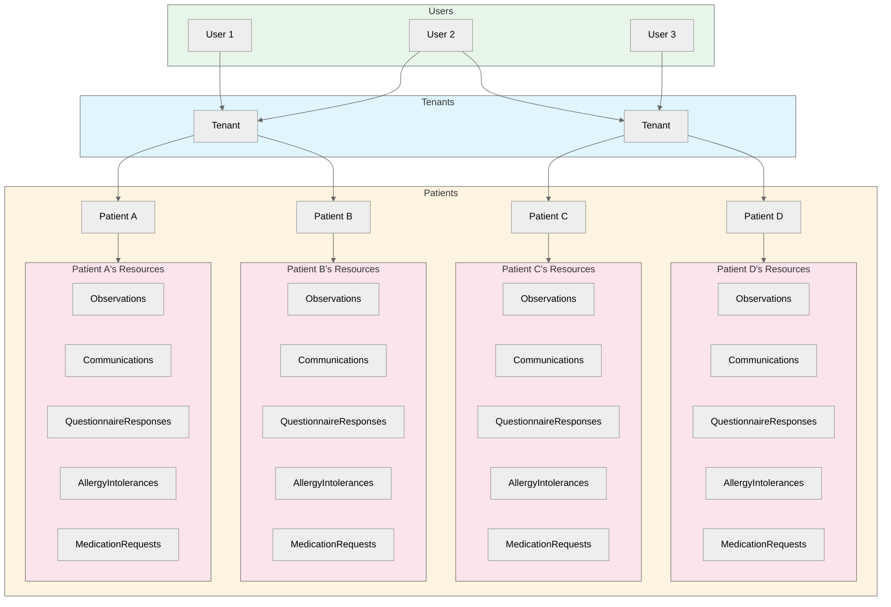
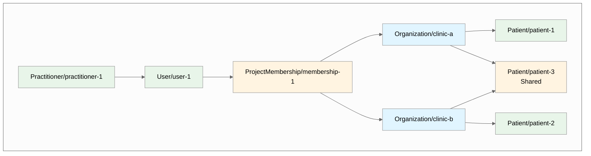
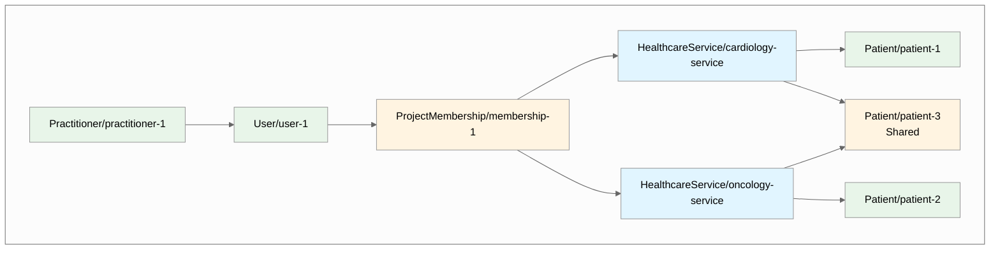
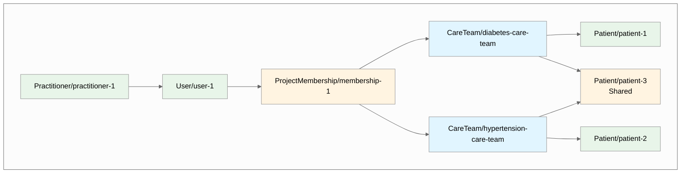

# Multi-Tenant Access Control

import Tabs from '@theme/Tabs';
import TabItem from '@theme/TabItem';

## Overview


### What is a tenant?
In healthcare applications, Practitioners often work across multiple organizational boundaries. A doctor might work at multiple clinics, a nurse might be part of several care teams, or a care coordinator might manage patients across different healthcare services. Each of these logical groupings represents a distinct **tenant** in your system: a collection of FHIR resources (Patients, Observations, Encounters, etc.) that should be logically grouped together. 

Using this model will allow you to restrict Users' access to only the resources that are part of the tenant(s) that you assign them to. This diagram shows how your User's access is determined by the tenant(s) that you assign them to and the Patients that belong to those tenants.


_User 1 can access Patient A and Patient B. User 2 can access all four Patients. User 3 can only access Patient C and Patient D._


This guide walks you through implementing multi-tenant access control in a single Medplum project. You will learn which questions you need to answer to build your tenancy model and how to implement it. Here is an overview of the steps you will take:

1. **Data Modeling**: How to represent tenants in FHIR using different resource types.
2. **Assigning data to tenants**: How to label your FHIR resources with the tenant(s) they belong to.
3. **User Registration & Management**: How to grant Users access to the tenant(s) they are enrolled in.


## Step 1: Modeling your tenants

The first decision you need to make is which FHIR resource type semantically models your tenants. Common choices include:

- **`Organization`**: Best for Managed Service Organizations (MSOs) where tenants represent different clinics, practices, or healthcare organizations.

- **`HealthcareService`**: Best for service-based access control where tenants represent different departments or services (e.g., Cardiology Department, Oncology Department).

- **`CareTeam`**: Best for care coordination scenarios where clinical data needs to be tightly contained to small care teams that work directly with a patient.

**You are not limited to these resource types.** You can use any FHIR resource type that accurately models your tenants. The implementation patterns shown in the following steps apply regardless of your choice.

Here's how the multi-tenancy model organizes resources when using different tenant types:

<Tabs groupId="tenant-type">
  <TabItem value="organization" label="Organization">



  </TabItem>
  <TabItem value="healthcare-service" label="HealthcareService">



  </TabItem>
  <TabItem value="careteam" label="CareTeam">



  </TabItem>
</Tabs>

Once you've chosen your tenant resource type, use it consistently throughout your implementation.

## Step 2: Assigning data to tenants

Once you've decided on your tenant resource type and created your tenant resources, you need to associate your data (patients, observations, encounters, etc.) with those tenants. This is done using compartments and the `$set-accounts` operation.

Most implementations will be able to just assign Patients to tenants. This is because Patient is the only resource where _"propagation"_ is supported to the Patient's _"related"_ resources. See [Why Patient is a special case?](#why-patient-is-a-special-case) for more details.

:::info
If your Patient is also a User that can log in, this will not impact what that Patient User can access. Instead, this impacts who can access that Patient.
:::

<details>
  <summary>Example Method: Assigning a Patient to an Organization Tenant</summary>

```ts
import { createReference, getReferenceString, normalizeErrorString, resolveId } from '@medplum/core';
import type { MedplumClient } from '@medplum/core';
import { Patient, Organization } from '@medplum/fhirtypes';

/**
 * Enrolls a patient in an organization. This is done by adding a reference to the organization to the patient using the $set-accounts operation.
 *
 *  1. Get the patient's pre-existing accounts
 *  2. Check if already enrolled, and if so, return
 *  3. Construct the Parameters resource with the existing accounts and the new organization
 *  4. Call the $set-accounts operation with the Parameters resource. It will update the patient resource and all other resources in the patient's compartment.
 *     See docs: https://www.medplum.com/docs/api/fhir/operations/patient-set-accounts
 *
 * @param medplum - The Medplum client.
 * @param patient - The patient to enroll.
 * @param organization - The organization to enroll the patient in.
 */
export async function enrollPatient(
  medplum: MedplumClient,
  patient: Patient,
  organization: Organization
): Promise<void> {
  // 1. Get the patient's pre-existing accounts
  const accounts = patient.meta?.accounts || [];
  const orgReference = getReferenceString(organization);

  // 2. Check if already enrolled, and if so, return
  if (accounts.some((a: Reference) => a.reference === orgReference)) {
    return;
  }

  // 3. Construct the Parameters resource with the existing accounts and the new organization
  const parameters: Parameters = {
    resourceType: 'Parameters',
    parameter: [
      // Include all existing accounts
      ...accounts.map((account) => ({
        name: 'accounts',
        valueReference: {
          reference: account.reference,
        },
      })),
      // Add the new organization
      {
        name: 'accounts',
        valueReference: createReference(organization),
      },
      // Propagate changes to all resources in the Patient compartment
      {
        name: 'propagate',
        valueBoolean: true,
      },
    ],
  };

  try {
    // 4. Call the $set-accounts operation with the Parameters resource. It will update the patient resource and all other resources in the patient's compartment.
    await medplum.post(`fhir/R4/Patient/${patient.id}/$set-accounts`, parameters);
  } catch (error) {
    throw new Error(normalizeErrorString(error));
  }
}
```

</details>

Find other example enrollment methods [here](https://github.com/medplum/medplum-mso-demo/blob/main/src/utils/enrollment.ts).

### Understanding Compartments

Compartments are an advanced FHIR concept that gives you a way to label a resource with a reference to a tenant that the resource belongs to. For example, this would be the basic structure of a Patient that belongs to a tenant __(Organization, HealthcareService, or CareTeam)__:

<Tabs groupId="tenant-type">
  <TabItem value="organization" label="Organization">

```json
//This Patient belongs to the clinic-a tenant
{
  "resourceType": "Patient",
  "meta": {
    "compartment": [
      { "reference": "Organization/clinic-a" }
    ]
  },
  //...
}
```

  </TabItem>
  <TabItem value="healthcare-service" label="HealthcareService">
  
```json
//This Patient belongs to the cardiology-service tenant
{
  "resourceType": "Patient",
  "meta": {
    "compartment": [
      { "reference": "HealthcareService/cardiology-service" }
    ]
  },
  //...
}
```

  </TabItem>
  <TabItem value="careteam" label="CareTeam">

```json
//This Patient belongs to the diabetes-care-team tenant
{
  "resourceType": "Patient",
  "meta": {
    "compartment": [
      { "reference": "CareTeam/diabetes-care-team" }
    ]
  },
  //...
}
```

  </TabItem>
</Tabs>

### Adding references to the meta.compartment field

In all resources, the `meta.compartment` field is **readonly**. You cannot modify it directly. Instead, you need to use the [$set-accounts](/docs/api/fhir/operations/patient-set-accounts) operation to add references to the **meta.compartment** field.


<Tabs groupId="tenant-type">
  <TabItem value="organization" label="Organization">

```ts
//Assigning a specific Patient to the clinic-a tenant
await medplum.post(`fhir/R4/Patient/${patientId}/$set-accounts`, {
  resourceType: 'Parameters',
  parameter: [
    {
      name: 'accounts',
      valueReference: { reference: 'Organization/clinic-a' }
    }
  ]
});
```

This will update the **meta.compartment** field of the Patient resource to include the reference to the Organization. Here is what the updated Patient resource will look like:

```json
{
  "resourceType": "Patient",
  "meta": {
    "compartment": [
      { "reference": "Organization/clinic-a" }
    ]
  },
  //...
}
```

  </TabItem>
  <TabItem value="healthcare-service" label="HealthcareService">

```ts
//Assigning a specific Patient to the cardiology-service tenant
await medplum.post(`fhir/R4/Patient/${patientId}/$set-accounts`, {
  resourceType: 'Parameters',
  parameter: [
    {
      name: 'accounts',
      valueReference: { reference: 'HealthcareService/cardiology-service' }
    }
  ]
});
```

This will update the **meta.compartment** field of the Patient resource to include the reference to the HealthcareService. Here is what the updated Patient resource will look like:

```json
{
  "resourceType": "Patient",
  "meta": {
    "compartment": [
      { "reference": "HealthcareService/cardiology-service" }
    ]
  },
  //...
}
```

  </TabItem>
  <TabItem value="careteam" label="CareTeam">

```ts
//Assigning a specific Patient to the diabetes-care-team tenant
await medplum.post(`fhir/R4/Patient/${patientId}/$set-accounts`, {
  resourceType: 'Parameters',
  parameter: [
    {
      name: 'accounts',
      valueReference: { reference: 'CareTeam/diabetes-care-team' }
    }
  ]
});
```

This will update the **meta.compartment** field of the Patient resource to include the reference to the CareTeam. Here is what the updated Patient resource will look like:

```json
{
  "resourceType": "Patient",
  "meta": {
    "compartment": [
      { "reference": "CareTeam/diabetes-care-team" }
    ]
  },
  //...
}
```
</TabItem>
</Tabs>

Any resource can be assigned to a tenant with this model. For example you could also assign a [Questionnaire](/docs/api/fhir/resources/questionnaire) to a tenant by calling the [$set-accounts](/docs/api/fhir/operations/patient-set-accounts) operation on that specific resource.

<Tabs groupId="tenant-type">
  <TabItem value="organization" label="Organization">

```ts
//Assigning a specific Questionnaire to the clinic-a tenant
await medplum.post(`fhir/R4/Questionnaire/${questionnaireId}/$set-accounts`, {
  resourceType: 'Parameters',
  parameter: [
    {
      name: 'accounts',
      valueReference: { reference: 'Organization/clinic-a' }
    }
  ]
});
```

  </TabItem>
  <TabItem value="healthcare-service" label="HealthcareService">

```ts
//Assigning a specific Questionnaire to the cardiology-service tenant
await medplum.post(`fhir/R4/Questionnaire/${questionnaireId}/$set-accounts`, {
  resourceType: 'Parameters',
  parameter: [
    {
      name: 'accounts',
      valueReference: { reference: 'HealthcareService/cardiology-service' }
    }
  ]
});
```

  </TabItem>
  <TabItem value="careteam" label="CareTeam">

```ts
//Assigning a specific Questionnaire to the diabetes-care-team tenant
await medplum.post(`fhir/R4/Questionnaire/${questionnaireId}/$set-accounts`, {
  resourceType: 'Parameters',
  parameter: [
    {
      name: 'accounts',
      valueReference: { reference: 'CareTeam/diabetes-care-team' }
    }
  ]
});
```

  </TabItem>
</Tabs>

### Why Patient is a special case?

**Patient is unique because it is the only resource where propagation is supported**. This means that you can assign a Patient to a tenant and all resources that _"belong"_ to that Patient will automatically be assigned to the same tenant as well. **A resource is determined to _"belong"_ to a Patient based on the resource relationships defined by the [Patient CompartmentDefinition](https://hl7.org/fhir/R4/compartmentdefinition-patient.html)**.

For example, a [QuestionnaireResponse](/docs/api/fhir/resources/questionnaireresponse) belongs to a Patient if it has a reference to the Patient in the `subject` or `author` field, a [Communication](/docs/api/fhir/resources/communication) belongs to a Patient if it has a reference to the Patient in the `subject`, `recipient`, or `sender` field, etc.

**To assign a Patient and all resources that _"belong"_ to that Patient to a tenant, call the [$set-accounts](/docs/api/fhir/operations/patient-set-accounts) operation with `propagate` set to `true`.**

<Tabs groupId="tenant-type">
  <TabItem value="organization" label="Organization">

```ts
//Assigning a specific Patient to the clinic-a tenant and propagating to all resources that _"belong"_ to that Patient
await medplum.post(`fhir/R4/Patient/${patientId}/$set-accounts`, {
  resourceType: 'Parameters',
  parameter: [
    {
      name: 'accounts',
      valueReference: { reference: 'Organization/clinic-a' }
    },
    {
      name: 'propagate',
      valueBoolean: true
    }
  ]
});
```

  </TabItem>
  <TabItem value="healthcare-service" label="HealthcareService">

```ts
//Assigning a specific Patient to the cardiology-service tenant and propagating to all resources that _"belong"_ to that Patient
await medplum.post(`fhir/R4/Patient/${patientId}/$set-accounts`, {
  resourceType: 'Parameters',
  parameter: [
    {
      name: 'accounts',
      valueReference: { reference: 'HealthcareService/cardiology-service' }
    },
    {
      name: 'propagate',
      valueBoolean: true
    }
  ]
});
```

  </TabItem>
  <TabItem value="careteam" label="CareTeam">

```ts
//Assigning a specific Patient to the diabetes-care-team tenant and propagating to all resources that _"belong"_ to that Patient
await medplum.post(`fhir/R4/Patient/${patientId}/$set-accounts`, {
  resourceType: 'Parameters',
  parameter: [
    {
      name: 'accounts',
      valueReference: { reference: 'CareTeam/diabetes-care-team' }
    },
    {
      name: 'propagate',
      valueBoolean: true
    }
  ]
});
```

  </TabItem>
</Tabs>

**You only need to call the [$set-accounts](/docs/api/fhir/operations/patient-set-accounts) operation once when assigning Patient to a tenant.** You do not need to call it again when new resources are created that _"belong"_ to that Patient because they will inherit the `meta.compartment` field from the Patient.

### What if you need to assign a Patient to multiple tenants?

This is common in scenarios where you need the Patient to be visible across multiple organizations, services, or care teams.

To assign a Patient to multiple tenants, you can call the [$set-accounts](/docs/api/fhir/operations/patient-set-accounts) with multiple tenant references. This will label the Patient and all resources that _"belong"_ to that Patient with the multiple tenant references.

<Tabs groupId="tenant-type">
  <TabItem value="organization" label="Organization">

```ts
//Assigning a specific Patient to the clinic-a and clinic-b tenants
await medplum.post(`fhir/R4/Patient/${patientId}/$set-accounts`, {
  resourceType: 'Parameters',
  parameter: [
    {
      name: 'accounts',
      valueReference: { reference: 'Organization/clinic-a' }
    },
    {
      name: 'accounts',
      valueReference: { reference: 'Organization/clinic-b' }
    },
    {
      name: 'propagate',
      valueBoolean: true
    }
  ]
});
```

  </TabItem>
  <TabItem value="healthcare-service" label="HealthcareService">

```ts
//Assigning a specific Patient to the cardiology-service and neurology-service tenants
await medplum.post(`fhir/R4/Patient/${patientId}/$set-accounts`, {
  resourceType: 'Parameters',
  parameter: [
    {
      name: 'accounts',
      valueReference: { reference: 'HealthcareService/cardiology-service' }
    },
    {
      name: 'accounts',
      valueReference: { reference: 'HealthcareService/neurology-service' }
    },
    {
      name: 'propagate',
      valueBoolean: true
    }
  ]
});
```

  </TabItem>
  <TabItem value="careteam" label="CareTeam">

```ts
//Assigning a specific Patient to the diabetes-care-team and hypertension-care-team tenants
await medplum.post(`fhir/R4/Patient/${patientId}/$set-accounts`, {
  resourceType: 'Parameters',
  parameter: [
    {
      name: 'accounts',
      valueReference: { reference: 'CareTeam/diabetes-care-team' }
    },
    {
      name: 'accounts',
      valueReference: { reference: 'CareTeam/hypertension-care-team' }
    },
    {
      name: 'propagate',
      valueBoolean: true
    }
  ]
});
```

  </TabItem>
</Tabs>

## Step 3: User Registration & Management

Once you've modeled your tenants and associated data with them, you also need to give your Practitioner Users access to those tenants. This is done through [AccessPolicies](/docs/access/access-policies) and [ProjectMembership](/docs/api/fhir/medplum/projectmembership) configuration.

More specifically, it leverages [Parameterized Access Policies](/docs/access/access-policies#parameterized-policies) to pass through the tenant references as parameters into the AccessPolicy.

### Create AccessPolicies with Parameterized Variables

Your AccessPolicy uses parameterized variables (like `%organization`, `%healthcare_service`, or `%care_team`) that get replaced at runtime with the tenant references from the user's ProjectMembership. These variables are used in the [compartment](/docs/access/access-policies#compartments) section and for [Criteria-based Access Control](/docs/access/access-policies#compartments).

In your design, you should decide which resource types you want to restrict access to within your tenents versus which resource types you want to allow access to.

<Tabs groupId="tenant-type">
  <TabItem value="organization" label="Organization">

```ts
{
  "resourceType": "AccessPolicy",
  "name": "Organization Based Access Policy",
  "resource": [
    {
      "resourceType": "Patient",
      "criteria": "Patient?_compartment=%organization"
    },
    {
      "resourceType": "Observation",
      "criteria": "Observation?_compartment=%organization"
    },
    {
      "resourceType": "Encounter",
      "criteria": "Encounter?_compartment=%organization"
    },
    {
      "resourceType": "Communication",
      "criteria": "Communication?_compartment=%organization"
    }
    //...
  ]
}
```

  </TabItem>
  <TabItem value="healthcare-service" label="HealthcareService">

```ts
{
  "resourceType": "AccessPolicy",
  "name": "HealthcareService Based Access Policy",
  "resource": [
    {
      "resourceType": "Patient",
      "criteria": "Patient?_compartment=%healthcare_service"
    },
    {
      "resourceType": "Observation",
      "criteria": "Observation?_compartment=%healthcare_service"
    },
    {
      "resourceType": "Encounter",
      "criteria": "Encounter?_compartment=%healthcare_service"
    },
    {
      "resourceType": "Communication",
      "criteria": "Communication?_compartment=%healthcare_service"
    },
    //...
    ]
}
```

  </TabItem>
  <TabItem value="careteam" label="CareTeam">

```ts
{
  "resourceType": "AccessPolicy",
  "name": "Care Team Access Policy",
  "resource": [
    {
      "resourceType": "Patient",
      "criteria": "Patient?_compartment=%care_team"
    },
    {
      "resourceType": "CarePlan",
      "criteria": "CarePlan?_compartment=%care_team"
    },
    {
      "resourceType": "Encounter",
      "criteria": "Encounter?_compartment=%care_team"
    },
    {
      "resourceType": "Communication",
      "criteria": "Communication?_compartment=%care_team"
    },
    //...
    ]
}
```

  </TabItem>
</Tabs>

### Configure ProjectMemberships to Reference Tenants

The User's `ProjectMembership` references their enrolled tenants via the `access.parameter` array. Each parameter name must match the variable name used in the `AccessPolicy` (e.g., if your AccessPolicy uses `%organization`, the User's ProjectMembership `access.parameter` should be named `"organization"`).

<Tabs groupId="tenant-type">
  <TabItem value="organization" label="Organization">

```json
{
  "resourceType": "ProjectMembership",
  "access": [
    {
      "policy": { "reference": "AccessPolicy/mso-policy" },
      "parameter": [
        {
          "name": "organization",
          "valueReference": { "reference": "Organization/clinic-a" }
        }
      ]
    }
  ]
}
```

  </TabItem>
  <TabItem value="healthcare-service" label="HealthcareService">

```json
{
  "resourceType": "ProjectMembership",
  "access": [
    {
      "policy": { "reference": "AccessPolicy/service-policy" },
      "parameter": [
        {
          "name": "healthcare_service",
          "valueReference": { "reference": "HealthcareService/cardiology-service" }
        }
      ]
    }
  ]
}
```

  </TabItem>
  <TabItem value="careteam" label="CareTeam">

```json
{
  "resourceType": "ProjectMembership",
  "access": [
    {
      "policy": { "reference": "AccessPolicy/careteam-policy" },
      "parameter": [
        {
          "name": "care_team",
          "valueReference": { "reference": "CareTeam/diabetes-care-team" }
        }
      ]
    }
  ]
}
```

  </TabItem>
</Tabs>

### When to assign a User to a tenant?

You can assign a User to a tenant at **invite time** or **after they have been invited**.

#### Invite `Practitioner` Users at Invite Time
Invite `Practitioner` Users associated with their respective tenants via the [`/admin/invite` endpoint](/docs/api/project-admin/invite):

<details>
  <summary>Example: Inviting a Practitioner User with Tenant Access</summary>

```ts
await medplum.post('admin/projects/:projectId/invite', {
  resourceType: 'Practitioner',
  firstName: 'Jane',
  lastName: 'Smith',
  email: 'dr.smith@example.com',
  membership: {
    access: [
      {
        policy: { reference: 'AccessPolicy/careteam-policy' },
        parameter: [
          {
            name: 'care_team',
            valueReference: { reference: 'CareTeam/hypertension-care-team' }
          }
        ]
      }
    ]
  }
});
```

</details>

#### Assign `Practitioner` Users to a Tenant After Invite
Here is an example method for updating a User's ProjectMembership to add a new tenant after the User already exists:

<details>
  <summary>Example Method: Enrolling a Practitioner in an Organization Tenant After Invite</summary>

```ts

import { createReference, getReferenceString, normalizeErrorString } from '@medplum/core';
import type { MedplumClient } from '@medplum/core';
import type {
  Organization,
  Practitioner,
  ProjectMembership,
} from '@medplum/fhirtypes';

/**
 * Enrolls a practitioner in an organization by adding the organization to the access array of the practitioner's project membership.
 *
 *  1. Search for the practitioner's project membership, if there is no project membership, throw an error
 *  2. Check if the organization reference already exists in any access array
 *  3. If the organization reference does not exist, add the organization to the ProjectMembership.access array
 *  4. Update the ProjectMembership resource
 *
 * @param medplum - The Medplum client.
 * @param practitioner - The practitioner to enroll.
 * @param organization - The organization to enroll the practitioner in.
 * @returns The updated project membership resource
 */
export async function enrollPractitioner(
  medplum: MedplumClient,
  practitioner: Practitioner,
  organization: Organization
): Promise<ProjectMembership> {
  // 1. Search for the practitioner's project membership, if there is no project membership, throw an error
  const projectMembershipSearch = await medplum.searchOne('ProjectMembership', {
    profile: getReferenceString(practitioner),
  });

  if (projectMembershipSearch) {
    const membershipResource = projectMembershipSearch;
    const existingAccess = membershipResource.access || [];

    // 2. Check if this organization reference already exists in any access array
    const organizationExists = existingAccess.some((access) =>
      access.parameter?.some(
        (param) => param.name === 'organization' && param.valueReference?.reference === getReferenceString(organization)
      )
    );

    // 3. If the organization reference does not exist, add the organization to the ProjectMembership.access array
    if (!organizationExists) {
      const policy = await medplum.searchOne('AccessPolicy', {
        name: 'Your Access Policy Name',
      });

      if (existingAccess.length > 0) {
        existingAccess.push({
          parameter: [{ name: 'organization', valueReference: createReference(organization) }],
          policy: { reference: getReferenceString(policy) },
        });
      } else {
        membershipResource.access = [
          {
            parameter: [{ name: 'organization', valueReference: createReference(organization) }],
            policy: { reference: getReferenceString(policy) },
          },
        ];
      }
    }

    // 4. Update the ProjectMembership resource
    try {
      const updatedResource = await medplum.updateResource(membershipResource);
      return updatedResource;
    } catch (error) {
      throw new Error(normalizeErrorString(error));
    }
  }
  throw new Error(`No project membership found for practitioner ${practitioner.id}`);
}
```

</details>

### What if your User needs to access multiple tenants?

To grant access to multiple tenants, include multiple entries in the `access` array, each with different tenant parameters. 

<Tabs groupId="tenant-type">
  <TabItem value="organization" label="Organization">

```json
{
  "resourceType": "ProjectMembership",
  "access": [
    {
      "policy": { "reference": "AccessPolicy/mso-policy" },
      "parameter": [
        {
          "name": "organization",
          "valueReference": { "reference": "Organization/clinic-a" }
        }
      ]
    },
    {
      "policy": { "reference": "AccessPolicy/mso-policy" },
      "parameter": [
        {
          "name": "organization",
          "valueReference": { "reference": "Organization/clinic-b" }
        }
      ]
    }
  ]
}
```

  </TabItem>
  <TabItem value="healthcare-service" label="HealthcareService">

```json
{
  "resourceType": "ProjectMembership",
  "access": [
    {
      "policy": { "reference": "AccessPolicy/service-policy" },
      "parameter": [
        {
          "name": "healthcare_service",
          "valueReference": { "reference": "HealthcareService/cardiology-service" }
        }
      ]
    },
    {
      "policy": { "reference": "AccessPolicy/service-policy" },
      "parameter": [
        {
          "name": "healthcare_service",
          "valueReference": { "reference": "HealthcareService/neurology-service" }
        }
      ]
    }
  ]
}
```

  </TabItem>
  <TabItem value="careteam" label="CareTeam">

```json
{
  "resourceType": "ProjectMembership",
  "access": [
    {
      "policy": { "reference": "AccessPolicy/careteam-policy" },
      "parameter": [
        {
          "name": "care_team",
          "valueReference": { "reference": "CareTeam/diabetes-care-team" }
        }
      ]
    },
    {
      "policy": { "reference": "AccessPolicy/careteam-policy" },
      "parameter": [
        {
          "name": "care_team",
          "valueReference": { "reference": "CareTeam/hypertension-care-team" }
        }
      ]
    }
  ]
}
```

  </TabItem>
</Tabs>

### Can some resource types still be accessed by Users, regardless of the tenant(s) they are assigned to?

A good thing to consider is that your application may need to allow some resource types to be accessed by Users, regardless of the tenant(s) they are assigned to. For example, you may want to allow Questionnaires to be accessed by Users, regardless of the tenant(s) they are assigned to because you want one single Patient Onboarding Questionnaire or you want Practitioners to be able to view each other's profiles, even if they are not assigned to the same tenant.

To do this, do not include the `_compartment` check in resource type criteria for the resource types you want to allow access to.

```ts
{
  "resourceType": "AccessPolicy",
  "name": "Questionnaire Access Policy",
  "resource": [
    //Non tenant level restricted resources
    {
      "resourceType": "Questionnaire",
    },
    {
      "resourceType": "Practitioner",
    },
    //...

    //Tenant level restricted resources
    {
      "resourceType": "Patient",
      "criteria": "Patient?_compartment=%organization"
    },
    {
      "resourceType": "Observation",
      "criteria": "Observation?_compartment=%organization"
    },
    {
      "resourceType": "Encounter",
      "criteria": "Encounter?_compartment=%organization"
    },
    {
      "resourceType": "Communication",
      "criteria": "Communication?_compartment=%organization"
    },
    //...
  ]
}
```