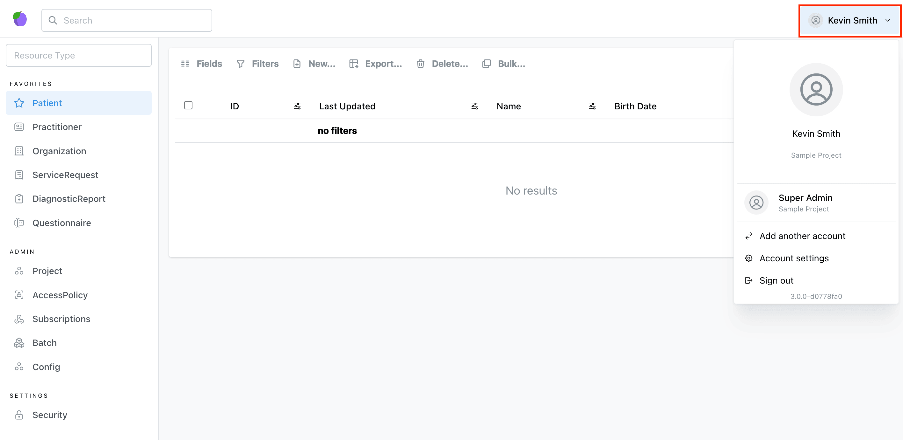

# Projects

Medplum [`Projects`](/docs/api/fhir/medplum/project) are the primary mechanism of access control. [`Projects`](/docs/api/fhir/medplum/project) are isolated containers of FHIR resources that are administered separately, and which can have different settings.

Medplum [`Projects`](/docs/api/fhir/medplum/project) enable the following use cases:

- **Development vs. Production:** A common requirement for development teams to have a separate [`Project`](/docs/api/fhir/medplum/project) , with non-protected data, for testing and debugging, before deploying workflow changes to production. A common Medplum usage pattern is to create a "development", "staging", and "production" [`Project`](/docs/api/fhir/medplum/project).

- **Multi-tenancy:** In [B2B2C environments](https://a16z.com/b2c2b-in-digital-health-a-founders-playbook/), a service provider may partner with multiple healthcare organizations to deliver care to patients. [`Projects`](/docs/api/fhir/medplum/project) can provide each of these partners their own isolated environments, that have their own patient data, log-in flows, and project administrators. Medplum uses a multi-tenant instance for our [hosted offering](/pricing).

## Isolation Model

Medplum [`Projects`](/docs/api/fhir/medplum/project) create a hard boundary between FHIR resources, and resources within one project cannot reference resources in another.

Additionally, [`Projects`](/docs/api/fhir/medplum/project) each have their own user administration. A user can be a member of one, or multiple [`Projects`](/docs/api/fhir/medplum/project), with different privileges in each. See our [User Administration Guide](/docs/auth/user-management-guide) for more information.

[`Projects`](/docs/api/fhir/medplum/project) can each be configured with own global settings and secrets (see [Project Settings](#settings) below).

## Project Linking

Certain Medplum features, including first-party integrations, require access to shared sets of resources, such as [`CodeSystem`](/docs/api/fhir/resources/codesystem), [`ValueSet`](/docs/api/fhir/resources/valueset), and [`Organization`](/docs/api/fhir/resources/organization).

Medplum super administrators can _link_ shared projects into a target project, providing users with a _read-only_ view of all resources in the linked projects.

A common use case for project linking is the Medplum terminology service. When enabled, Medplum links the shared UMLS Project, which contains [`CodeSystem`](/docs/api/fhir/resources/codesystem) resources for major UMLS code systems:

- [ICD-10](/docs/charting/representing-diagnoses)
- [RxNORM](/docs/medications/medication-codes#rxnorm)
- [LOINC](/docs/careplans/loinc)

You can see linked Projects in the Medplum App by:

- Navigating to [app.medplum.com/Project](https://app.medplum.com/Project)
- Selecting your Project
- Selecting the "Details" tab

## The SuperAdmin `Project` {#superadmin}

The main exception to this isolation model is the "Super Admin" project. This is a special project that provides a global view over all the resources on the Medplum server. See our [SuperAdmin Guide](/docs/self-hosting/super-admin-guide) for more information.

The SuperAdmin has the following privileges:

- Access to protected resources.
- Ability to overwrite the `id` of a resource, which is normally server generated.
- Ability to overwrite fields in the `meta` element of resources such as `author`, `lastUpdated`, etc.

:::warning

Logging into the Super Admin project allows for potential dangerous operations and is only intended for server administrators

:::

:::note Checking If You Are In The SuperAdmin Project

To switch to the SuperAdmin project or check if you are already in it, you can use the [**profile selector**](/docs/app/app-introduction/index.md#profile-selector).

:::

## Creating a Project

#### Medplum App

- Visit the https://app.medplum.com/register or visit https://app.medplum.com/signin and click the "Register" link
- Sign in with an existing user, or enter the details for a new user account
- Enter your project name

## Project Settings {#settings}

You can find the full `Project` resource schema [here](/docs/api/fhir/medplum/project)

| Setting                      | Description                                                                                                                                                                                                                                                                                                                                                                                                                                                                                                                                                                                                                                       | Default |
| ---------------------------- | ------------------------------------------------------------------------------------------------------------------------------------------------------------------------------------------------------------------------------------------------------------------------------------------------------------------------------------------------------------------------------------------------------------------------------------------------------------------------------------------------------------------------------------------------------------------------------------------------------------------------------------------------- | ------- |
| `superAdmin`                 | Whether this project is the super administrator project ([see above](#superadmin)).                                                                                                                                                                                                                                                                                                                                                                                                                                                                                                                                                               | `false` |
| `checkReferencesOnWrite`     | If `true`, the the server will reject any create or write operations to a FHIR resource with invalid references.                                                                                                                                                                                                                                                                                                                                                                                                                                                                                                                                  | `false` |
| `features`                   | A list of optional features that are enabled for the project. Allowed values are: <ul><li>`bots`: This [`Project`](/docs/api/fhir/medplum/project) is allowed to create and run [Bots](/docs/bots/bot-basics).</li><li>`email`: Bots in this project can [send emails](/docs/sdk/core.medplumclient.sendemail). </li><li>`cron`: This [`Project`](/docs/api/fhir/medplum/project) can run Bots on [CRON timers](https://www.medplum.com/docs/bots/bot-cron-job)</li><li>`google-auth-required`: [Google authentication](/docs/auth/methods/google-auth) is the only method allowed for this [`Project`](/docs/api/fhir/medplum/project)</li></ul> |         |
| `defaultPatientAccessPolicy` | The default [`AccessPolicy`](/docs/access/access-policies) applied to all [Patient Users](/docs/auth/user-management-guide#project-scoped-users) invited to this [`Project`](/docs/api/fhir/medplum/project). This is required to enable [open patient registration](/docs/auth/open-patient-registration).                                                                                                                                                                                                                                                                                                                                       |         |

## Project Secrets

Each [`Project`](/docs/api/fhir/medplum/project) can store a set of key/value pairs to store configuration values, such as API keys, needed by Bots.

See [Bot Secrets](/docs/bots/bot-secrets) for more information.

## Cloning and Expunging `Projects`

Self-hosted users have two advanced project administration operations available to them:

- `$clone` - Make a copy of an existing [`Project`](/docs/api/fhir/medplum/project) and all its resources.
- `$expunge` - Perform a "hard delete" of [`Project`](/docs/api/fhir/medplum/project) and all its resources. This will remove all the related resource rows from the database.

For more information, refer to the Super Admin [Project Management guide](/docs/self-hosting/super-admin-cli#project-management)

## See Also

- [User management guide](/docs/auth/user-management-guide)
- [Super Admin Guide](/docs/self-hosting/super-admin-guide)
- [Super Admin CLI](/docs/self-hosting/super-admin-cli#project-management)
- [Project Resource Schema](/docs/api/fhir/medplum/project)
