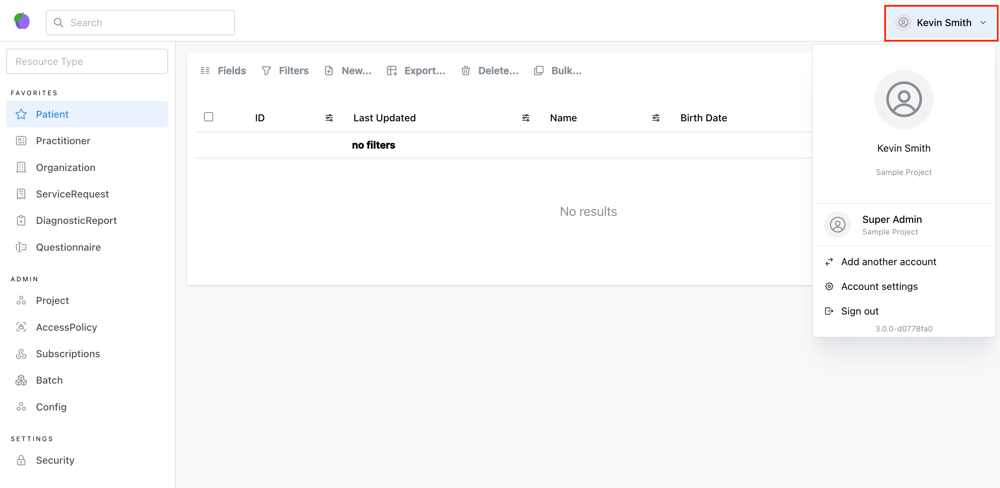

# Projects

Medplum [`Projects`](/docs/api/fhir/medplum/project) are the primary mechanism of access control. [`Projects`](/docs/api/fhir/medplum/project) are isolated containers of FHIR resources that are administered separately, and which can have different settings.

A common requirement for development teams is to have a separate [`Project`](/docs/api/fhir/medplum/project) , with non-protected data, for testing and debugging, before deploying workflow changes to production. A common Medplum usage pattern is to create a "development", "staging", and "production" [`Project`](/docs/api/fhir/medplum/project).

## Isolation Model

Medplum [`Projects`](/docs/api/fhir/medplum/project) create a hard boundary between FHIR resources, and resources within one project cannot reference resources in another.

Additionally, [`Projects`](/docs/api/fhir/medplum/project) each have their own user administration. A user can be a member of one, or multiple [`Projects`](/docs/api/fhir/medplum/project), with different privileges in each. See our [User Administration Guide](/docs/user-management) for more information.

[`Projects`](/docs/api/fhir/medplum/project) can each be configured with own global settings and secrets (see [Project Settings](#settings) below).

## Project Linking

Sometimes it is useful to share a common set of resources with multiple projects.

Medplum super administrators can create shared projects and _link_ them into multiple target projects. Users of those target projects get a _read-only_ view of all resources in the shared projects.

When a project is linked, all resources from the linked project appear alongside the target project's resources in search results and queries.

### Common Use Cases

- Sharing large [`CodeSystems`](/docs/api/fhir/resources/codesystem) and [`ValueSets`](/docs/api/fhir/resources/valueset) for standard terminology. For example the [Medplum UMLS integration](/pricing): [ICD-10](/docs/charting/chart-data-model#diagnoses-and-problem-list), [RxNORM](/docs/medications/medication-codes#rxnorm), [LOINC](/docs/careplans/loinc), SNOMED
- Sharing [FHIR profiles](/docs/fhir-datastore/profiles) (`StructureDefinition` resources) for a specific clinical domain
- Sharing common data sets (e.g. Medplum Payor Directory, Medplum Lab Directory)
- Sharing [Bots](/docs/bots)

Certain Medplum features, including first-party integrations, require access to shared sets of resources, such as [`CodeSystem`](/docs/api/fhir/resources/codesystem), [`ValueSet`](/docs/api/fhir/resources/valueset), and [`Organization`](/docs/api/fhir/resources/organization).

### Setting Up a Shared Project

Configuring project linking is a two-step process that requires super-admin access:

**Step 1: Create the shared project**

Create a new [`Project`](/docs/api/fhir/medplum/project) that will hold the shared resources. This project will not be used directly by end users — it exists solely as a container for shared content.

**Always set `exportedResourceType`** on the shared project to restrict which resource types are visible to linked projects. If `exportedResourceType` is omitted, **all resource types in the shared project are accessible**.

```json
{
  "resourceType": "Project",
  "name": "Shared Terminology",
  "exportedResourceType": ["CodeSystem", "ValueSet"]
}
```

**Step 2: Link the shared project into target projects**

Add a `link` entry to each target [`Project`](/docs/api/fhir/medplum/project) that should have access to the shared resources. This must be done by a super admin.

```json
{
  "resourceType": "Project",
  "name": "My App - Production",
  "link": [
    {
      "project": {
        "reference": "Project/<shared-project-id>"
      }
    }
  ]
}
```

A project can link to multiple shared projects by adding multiple entries to the `link` array.

### Access Control for Linked Projects

- **Read-only**: Users in a target project can read and search resources from linked projects, but cannot create, update, or delete them.
- **Transparent**: Linked resources appear seamlessly in search results alongside local resources — no special handling is required in queries.
- **Scoped by `exportedResourceType`**: If the shared project specifies `exportedResourceType`, only those resource types are visible to linked projects. If `exportedResourceType` is empty or omitted, all resource types are exported.
- **Project-admin resources are excluded**: Administrative resource types (e.g., `ProjectMembership`, `ClientApplication`) from a linked project are never visible to users in the target project, regardless of `exportedResourceType`.

### Viewing Linked Projects

You can see linked Projects in the Medplum App by:

- Navigating to [app.medplum.com/Project](https://app.medplum.com/Project)
- Selecting your Project
- Selecting the "Details" tab

### Distinguishing Local vs. Linked Resources

Because linked resources are returned alongside local resources in search results, you may need to tell them apart. The `_compartment` search parameter filters results to resources that belong to a specific project compartment:

```typescript
// Search only within the current project (exclude linked projects)
const localOnly = await medplum.searchResources('ValueSet', {
  _compartment: 'Project/<current-project-id>',
});

// Search only within the shared project
const sharedOnly = await medplum.searchResources('ValueSet', {
  _compartment: 'Project/<shared-project-id>',
});
```

You can also inspect `resource.meta.project` on any returned resource to determine which project it belongs to.

### Best Practices

:::warning[Always set `exportedResourceType`]

**Always specify `exportedResourceType` on shared projects.** If this field is omitted, _every_ resource type in the shared project is visible to all linked projects — including any resource types added in the future. This is an easy source of unintended data exposure.

Define the exact set of resource types that linked projects need and nothing more:

```json
{
  "resourceType": "Project",
  "name": "Shared Terminology",
  "exportedResourceType": ["CodeSystem", "ValueSet"]
}
```

If you later add a new resource type to the shared project (e.g. `Organization` for a payor directory), update `exportedResourceType` explicitly rather than removing the restriction.

:::

- **Principle of least privilege**: treat `exportedResourceType` the same way you would treat access policy resource restrictions — grant access only to what is needed, and review the list whenever the shared project's contents change.
- **Separate shared projects by domain**: rather than one large shared project with a broad `exportedResourceType` list, consider splitting into focused projects (e.g. one for terminology, one for profiles). This makes it easier to link only the relevant project into each target and limits blast radius if a project is misconfigured.
- Populate shared projects with read-only reference data (terminology, profiles, directories) rather than patient or clinical data.
- Be aware that queries like `medplum.searchResources()` will return the first matching resource across all accessible projects (both local and linked). Use `_compartment` if you need deterministic project-scoped results.

## The SuperAdmin `Project` {/* #superadmin */}

The main exception to this isolation model is the "Super Admin" project. This is a special project that provides a global view over all the resources on the Medplum server. See our [SuperAdmin Guide](/docs/self-hosting/super-admin-guide) for more information.

The SuperAdmin has the following privileges:

- Access to protected resources
- Ability to overwrite the `id` of a resource, which is normally server generated
- Ability to overwrite fields in the `meta` element of resources such as `author`, `lastUpdated`, etc.

:::warning[]

Logging into the Super Admin project allows for potentially dangerous operations and is only intended for server administrators

:::

:::note[Checking If You Are In The SuperAdmin Project]

To switch to the SuperAdmin project or check if you are already in it, you can use the [**profile selector**](/docs/app/app-introduction/index.md#profile-selector).


:::

## Creating a Project

#### Medplum App

- Visit the https://app.medplum.com/register or visit https://app.medplum.com/signin and click the "Register" link
- Sign in with an existing user, or enter the details for a new user account
- Enter your project name

## Project Settings {/* #settings */}

Project-level settings can be used to configure server behavior for different groups of users. A subset of the available
settings related to authentication and access control are shown below; see the full [Project Settings](/docs/self-hosting/project-settings)
documentation for more information.

| Setting                      | Description                                                                                                                                                                                                                                                                                                                                                                                                                                                                                                                                                                                                                                                             | Default |
| ---------------------------- | ----------------------------------------------------------------------------------------------------------------------------------------------------------------------------------------------------------------------------------------------------------------------------------------------------------------------------------------------------------------------------------------------------------------------------------------------------------------------------------------------------------------------------------------------------------------------------------------------------------------------------------------------------------------------- | ------- |
| `superAdmin`                 | Whether this project is the super administrator project ([see above](#superadmin)).                                                                                                                                                                                                                                                                                                                                                                                                                                                                                                                                                                                     | `false` |
| `features`                   | A list of optional features that are enabled for the project. Values related to access control include: <ul><li>`bots`: This [`Project`](/docs/api/fhir/medplum/project) is allowed to create and run [Bots](/docs/bots/bot-basics).</li><li>`email`: Bots in this project can [send emails](/docs/sdk/core.medplumclient.sendemail). </li><li>`cron`: This [`Project`](/docs/api/fhir/medplum/project) can run Bots on [CRON timers](/docs/bots/bot-cron-job)</li><li>`google-auth-required`: [Google authentication](/docs/auth/google-auth) is the only method allowed for this [`Project`](/docs/api/fhir/medplum/project)</li></ul> |         |
| `defaultPatientAccessPolicy` | The default [`AccessPolicy`](/docs/access/access-policies) applied to all [Patient Users](/docs/user-management/project-vs-server-scoped-users#project-scoped-users) invited to this [`Project`](/docs/api/fhir/medplum/project). This is required to enable [open patient registration](/docs/user-management/open-patient-registration).                                                                                                                                                                                                                                                                                                                                                             |         |

## Default Profiles {/* #default-profiles */}

The `defaultProfile` setting automatically applies [FHIR profiles](http://hl7.org/fhir/R4/profiling.html#resources) to resources that do not specify a profile in `meta.profile`. This is useful for enforcing consistent validation across a project without requiring every resource creation call to include profile references.

### How It Works

When a resource is created or updated **without** a `meta.profile` field, the server checks the project's `defaultProfile` configuration. If a matching entry exists for the resource type, the server automatically adds the configured profile(s) to the resource's `meta.profile` array before validation.

If the resource **already** has a `meta.profile` field, default profiles are **not** applied — the resource's explicit profile is preserved.

### Configuration

Set `defaultProfile` on a `Project` resource as an array of objects, each specifying a `resourceType` and the `profile` URLs to apply:

```json
{
  "resourceType": "Project",
  "name": "My Clinical App",
  "defaultProfile": [
    {
      "resourceType": "Observation",
      "profile": [
        "http://hl7.org/fhir/StructureDefinition/vitalsigns"
      ]
    },
    {
      "resourceType": "Patient",
      "profile": [
        "http://hl7.org/fhir/us/core/StructureDefinition/us-core-patient"
      ]
    }
  ]
}
```

### Example: Enforcing Vital Signs Validation

With the configuration above, any `Observation` created without an explicit profile will automatically receive the [Vital Signs profile](https://hl7.org/fhir/R4/observation-vitalsigns.html). This means the server will validate that the observation includes required elements like `subject`, `category`, and the correct value types:

```typescript
// This observation will automatically get the vital-signs profile applied
const observation = await medplum.createResource({
  resourceType: 'Observation',
  status: 'final',
  code: { text: 'Heart rate' },
  effectiveDateTime: '2024-01-01T00:00:00Z',
  valueInteger: 72,
  // No meta.profile specified — defaultProfile kicks in
});

// observation.meta.profile will be:
// ["http://hl7.org/fhir/StructureDefinition/vitalsigns"]
```

If the observation is missing required fields (e.g., `subject`), the server will reject it with a validation error — even though no profile was explicitly specified.

### When to Use `defaultProfile`

- **Clinical data quality**: Enforce that all resources of a given type conform to a specific profile (e.g., US Core, Vital Signs)
- **Multi-tenant applications**: Different projects can enforce different profiles for the same resource type
- **Gradual adoption**: Apply profiles automatically without requiring changes to existing client code

### Notes

- Default profiles are applied **before** resource validation, so profile-based constraints are enforced automatically
- Multiple profiles can be specified per resource type — all will be applied
- This setting is configured by project administrators and is specific to each project

## Project Secrets

Each [`Project`](/docs/api/fhir/medplum/project) can store a set of key/value pairs to store configuration values, such as API keys, needed by Bots.

See [Bot Secrets](/docs/bots/bot-secrets) for more information.

## Cloning and Expunging `Projects`

Self-hosted users have two advanced project administration operations available to them:

- `$clone` - Make a copy of an existing [`Project`](/docs/api/fhir/medplum/project) and all its resources.
- `$expunge` - Perform a "hard delete" of [`Project`](/docs/api/fhir/medplum/project) and all its resources. This will remove all the related resource rows from the database.

For more information, refer to the Super Admin [Project Management guide](/docs/self-hosting/super-admin-cli#project-management)

## See Also

- [User management guide](/docs/user-management)
- [Super Admin Guide](/docs/self-hosting/super-admin-guide)
- [Super Admin CLI](/docs/self-hosting/super-admin-cli#project-management)
- [Project Resource Schema](/docs/api/fhir/medplum/project)
