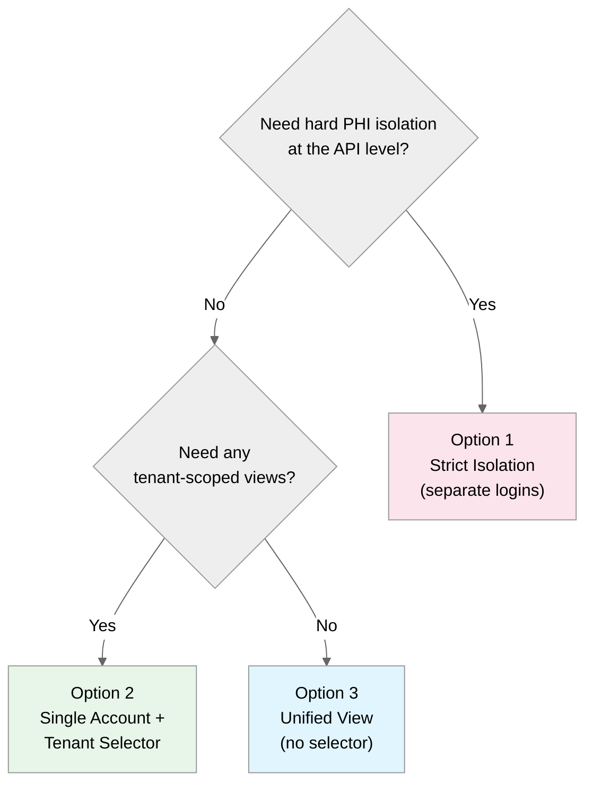
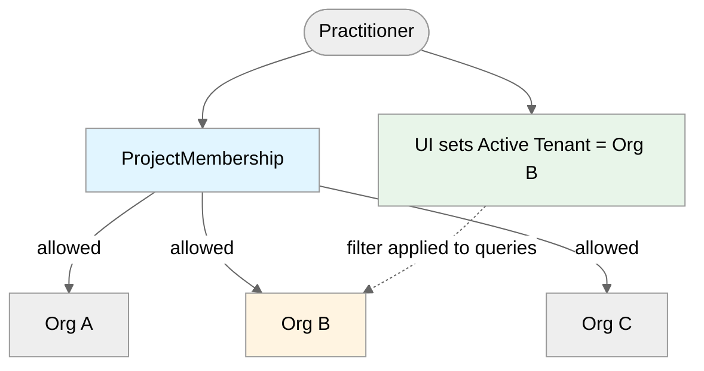
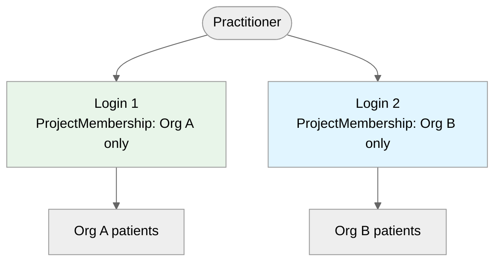
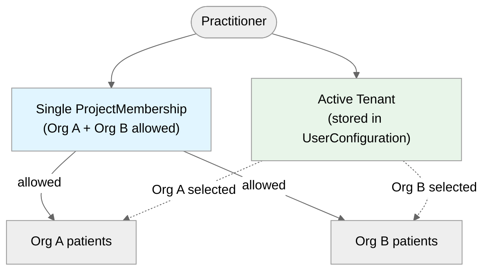

# Building a Tenant Selector

import ExampleCode from '!!raw-loader!../../../examples/src/access/tenant-selector.ts';
import MedplumCodeBlock from '@site/src/components/MedplumCodeBlock';

This document is a follow-up to [Multi-Tenant Access Control](/docs/access/multi-tenant-access-policy).

In an MSO Access Control model, a single practitioner often has access to multiple tenants (for example, multiple `Organization` clinics) within the same Medplum `Project`. After login, most applications need an answer to:

- Which tenant context is the user working in right now?
- When should the UI show a consolidated cross-tenant view vs. a tenant-scoped view?

This guide describes three common approaches and how to implement a tenant selector when you need one.

## At a Glance

Use the decision tree to pick the option that fits your product, then jump to that section for implementation details.



| | Option 1: Strict Isolation | Option 2: Single Account + Selector | Option 3: Unified View |
|---|---|---|---|
| API-level tenant isolation | Strongest (one tenant per token) | Allowed tenants enforced; UI scopes within them | None beyond the project |
| Consolidated cross-tenant views | Difficult | Supported (when UI omits the filter) | Default |
| Tenant-scoped PHI screens | Yes (always) | Yes (when UI applies the filter) | No |
| Login / membership model | One membership per tenant per user | One membership covering multiple tenants | One membership covering all tenants |
| Tenant switching | Re-auth or saved-login swap | UI control (no re-auth) | N/A |
| Implementation complexity | Highest | Medium | Lowest |

## Key Concept: Allowed Tenants vs Active Tenant

- Allowed tenants: The set of tenant references the user is permitted to access (enforced by `ProjectMembership` + `AccessPolicy`).
- Active tenant: A single tenant reference that your application uses as the default filter for PHI (a UI/application concept).



_`ProjectMembership` controls which tenants a user may access (allowed tenants). The application separately tracks which tenant is currently selected (active tenant) and applies it as a filter on PHI queries._

When you build a "tenant selector", you're choosing and persisting the active tenant.

## Option 1: Strict Isolation (Separate Accounts / Separate Projects)

Goal: Hard isolation of PHI at the API level. At any given time, the "active tenant" is the only "allowed tenant" for the user.

### What This Looks Like

- The user has separate logins per tenant.
- Each login/profile has a `ProjectMembership` that only includes access to one tenant.



_Each login is bound to a single tenant. Switching tenants requires switching the active login._

:::note
In Medplum, a user/profile has a single `ProjectMembership` per `Project` (it is resolved by `project` + `profile`). If you want strict separation *within the same project*, you typically use separate user accounts (separate profiles) rather than "two memberships for one profile".
:::

### Switching the Active `ProjectMembership`

In Medplum, the "active membership" is not a client-side flag you can flip on an existing token. The OAuth login flow selects a membership, and the issued access token is bound to that membership.

Practically, "switching memberships" means one of:

- Switching to another existing login (you already authenticated previously and have a saved token pair).
- Starting a new login and selecting a different membership during the login handshake.

#### How Membership Selection Works in the Login Flow

- If a user only has one membership, Medplum selects it automatically.
- If a user has multiple memberships, the client displays a "choose profile" screen and posts the selected membership ID to `POST /auth/profile`.
- After that, the client exchanges the login code for tokens; the token response includes the `project` and `profile` for the selected membership.

#### How Switching Works in the Medplum App / SDK

The Medplum App supports "Add another account" and project switching by storing multiple login states locally and switching the active one. In the TypeScript SDK this is done with:

- `medplum.getLogins()` to list saved logins
- `medplum.setActiveLogin(login)` to switch the active login (and therefore the active membership)


#### How to Configure a User with Multiple Memberships

You need to invite the user once per membership you want in the project (for example one membership per tenant in a strict-isolation MSO model). See the [Invite User endpoint](/docs/api/project-admin/invite).

Parameterized access policy: put the policy and its substitution values on `membership.access`. Each entry is one [`ProjectMembership.access`](/docs/api/fhir/medplum/projectmembership) rule: a `policy` reference plus an optional `parameter` array. The `name` of each parameter must match your policy placeholders (for example `%organization` uses `"name": "organization"`). A single-tenant membership has one access entry and one parameter object.

`forceNewMembership`: set `true` when the user is already a member of this project but you need an additional `ProjectMembership` row (same email address). The first invite for that email in the project does not need it; the second and later ones do, or the server returns a conflict.

Example: invite a practitioner with one organization-scoped policy and a single `organization` parameter (replace ids with your `AccessPolicy` and `Organization`).

#### Creating the First `ProjectMembership`

<MedplumCodeBlock language="ts" selectBlocks="invite-practitioner-first-membership">
  {ExampleCode}
</MedplumCodeBlock>

#### Creating an Additional `ProjectMembership`

<MedplumCodeBlock language="ts" selectBlocks="invite-practitioner-second-membership">
  {ExampleCode}
</MedplumCodeBlock>

### Selector UX

Often resembles the Medplum App profile selector: users switch "logins" to switch tenant context.

## Option 2: Single Account, Multi-Tenant Access + UI-Level Tenant Context

Goal: One login (`ProjectMembership`) can access one or multiple defined tenants, but the FE application chooses an "active tenant".

### What This Looks Like

- One `ProjectMembership` grants access to multiple tenant references (e.g., multiple `Organization` values).
- API level access is still enforced to "allowed tenants" only.
- Your UI applies a tenant-scoping to the "active tenant" by the search parameter `_compartment`, but can intentionally show consolidated views when needed.



_One membership grants access to multiple tenants. The application UI chooses the active tenant and applies it as a query filter._

### How to Grant Access to Multiple Tenants

If your `AccessPolicy` uses `%organization`:

```json
{
  "resourceType": "ProjectMembership",
  "access": [
    {
      "policy": { "reference": "AccessPolicy/mso-policy" },
      "parameter": [
        { "name": "organization", "valueReference": { "reference": "Organization/clinic-a" } },
        { "name": "organization", "valueReference": { "reference": "Organization/clinic-b" } }
      ]
    }
  ]
}
```

With that membership, an access policy criteria like `Patient?_compartment=%organization` can allow access to patients across both tenants.

### Building the Selector

At login (or on first use), your app decides an "active tenant" and persists it. Common patterns:

- URL: `?tenant=Organization/clinic-a` (easy to deep-link, but must be validated server-side against allowed tenants).
- Local storage/session: fast, but not shared across devices.
- FHIR-backed preference: store the active tenant in `UserConfiguration` so it follows the user.

#### Persisting the Active Tenant in `UserConfiguration`

`UserConfiguration` supports per-user options. One common approach is to store a reference-valued option:

```json
{
  "resourceType": "UserConfiguration",
  "option": [
    {
      "id": "activeTenant",
      "valueReference": { "reference": "Organization/clinic-a" }
    }
  ]
}
```

Then reference that `UserConfiguration` from the user's `ProjectMembership` (see [User Configuration](/docs/access/user-configuration)).

#### Enforcing the Active Tenant in Queries

Once you have an active tenant reference (e.g., `Organization/clinic-a`), apply it as a default filter for tenant-scoped screen queries.

Examples (MSO model using `Organization` as tenant):

- Tenant-scoped PHI view: `Patient?_compartment=Organization/clinic-a`
- Consolidated schedule view (cross-tenant): omit tenant filter (or intentionally include multiple tenants)

## Option 3: Unified View (No Tenant Context)

Goal: Treat the project as the only boundary; the user always sees everything they're allowed to see.

### When to Choose It

- Your product model is truly unified (e.g., one clinical ops team across all clinics).
- Your contracts and workflows do not require tenant-scoped PHI screens.

## See Also

- [Multi-Tenant Access Control](/docs/access/multi-tenant-access-policy)
- [Access Policies](/docs/access/access-policies)
- [User Configuration](/docs/access/user-configuration)
