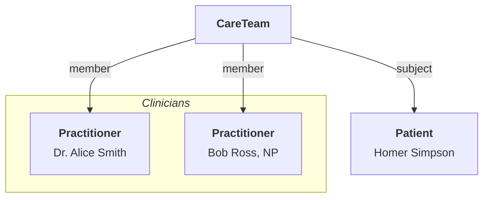

# Modeling your Provider Directory

Provider Directories are critical databases housing essential details about healthcare providers, from individual practitioners to entire organizations. Accurate and standardized modeling of these directories, ensures a better patient experience via improved coordination coordination of care and operational efficiency.

This section provide a series of guides on how to properly model your organization's provider directory. It focuses on a few key challenges:

1. **[How to model the organizational structure of your provider group:](./provider-directory/provider-organizations)** How to represent the clinical divisions and care teams in your clinical organization, including how to represent providers who participate in multiple teams.
1. [**How to model provider participation insurance networks:**](./provider-directory/provider-networks) How to model insurance plans and the in-network/out-of-network status of providers.
1. [**How to model provider qualifications, certifications, and licenses:**](./provider-directory/provider-credentials) How to represent state licensure and specialty certifications for each provider to ensure proper staffing across geography and clinical.

These guides are based on, and compatible with, the [Da Vinci PDEX Payer Network guide](https://build.fhir.org/ig/HL7/davinci-pdex-plan-net/). [The Da Vinci Project](http://www.hl7.org/about/davinci/index.cfm) is a private sector initiative comprised of [industry leaders](https://confluence.hl7.org/display/DVP/Da+Vinci+Project+Members), including Blue Cross Blue Shield, Cigna, and Optum, etc. working together to accelerate the adoption of FHIR as the standard to support and integrate value-based care (VBC) data exchange.

## Key Resources

| **Resource**                                            | **Description**                                                                                              |
| ------------------------------------------------------- | ------------------------------------------------------------------------------------------------------------ |
| [`CareTeam`](/docs/api/fhir/resources/careteam)         | A definition of a group of providers assembled for a specific [`Patient`](/docs/api/fhir/resources/patient). |
| [`Practitioner`](/docs/api/fhir/resources/practitioner) | A resource that defines the profile of each provider (i.e., physician, nurse, administrator, etc.).          |

## Key Code Systems

| **Code System**                   | **Description**                                                                                                                                                               |
| --------------------------------- | ----------------------------------------------------------------------------------------------------------------------------------------------------------------------------- |
| [SNOMED](https://www.snomed.org/) | Used to annotate the roles of [`Practitioner`](/docs/api/fhir/resources/practitioner) resources. Below is a selection of common [SNOMED](https://www.snomed.org/) role codes. |

| Role                    | SNOMED Code |
| ----------------------- | ----------- |
| Primary Care Physician  | 446050000   |
| Registered Nurse        | 224535009   |
| Social Worker           | 106328005   |
| Physical Therapist      | 36682004    |
| Occupational Therapist  | 80546007    |
| Recreational Therapist  | 308191009   |
| Dietitian               | 159033005   |
| Center Manager          | 159441000   |
| Home Care Coordinator   | 768730001   |
| Personal Care Attendant | 768836001   |
| Driver                  | 236320001   |
