# Modeling Provider Organizations

## Introduction

Large digital healthcare organizations frequently employ teams of physicians, organized by specialty, brand, and/or product offering. In this guide, we'll discuss how to model the structure of a large provider organization with multiple divisions and service lines.

We'll cover

- How to model divisions and sub-divisions inside a provider group
- How to model provider care teams
- How to assign practitioners to multiple divisions and teams

## Modeling the Organizational Hierarchy

To model groups, it is recommended to use the `Organization` resource. `Organizations` model how people are grouped, and can be organized in a hierarchical structure by utilizing the `partOf` reference field.

Let's look at the example organization called "Acme Provider Group" with four clinical divisions, "Mental Health", "Dermatology", "Sexual and Reproductive Health", and "Diet and Nutrition". You would create an `Organization` for the top level Acme Provider Group.

Each of the four divisions would then be represented as separate `Organization` entities and connected to the parent organization using the `partOf` reference field. You can further divide each of these divisions, such as "Men's Health" and "Women's Health" divisions within Sexual and Reproductive Health.

**Note:** This hierarchical structure works well for digital health practices with organizational monoliths. To model more complex many-to-many relationships, refer to the `OrganizationAffiliation` resource.

## Modeling Care Teams

At the bottom of the hierarchy, you may have teams of providers that work closely together to provide care. We advise using the the `CareTeam` resource to model these provider teams.

The `CareTeam` resource enables you to easily specify members of a team through the `participant` field and assign roles within the team. The US Core guidelines recommend that `CareTeam.participant.role` be selected from the [Care Team Member Function](https://vsac.nlm.nih.gov/valueset/2.16.840.1.113762.1.4.1099.30/expansion) ValueSet, which is a subset of the SNOMED CT code system.

 

:::tip `Organization` vs. `CareTeam`

`Organization` and `CareTeam` are both FHIR resources that are used to represent different aspects of healthcare providers and teams. While you could use an `Organization` to achieve similar goals, `CareTeam` is more fluid and easier to update.

Some of the other differences between the `Organization` and `CareTeam` resources include:

**Purpose**

- `Organization`: Represents an organization such as a hospital, clinic, or insurance company. It can be any legal entity involved in the provision or management of healthcare services.
- `CareTeam`: Represents a group of healthcare professionals and support staff that work together to provide care for a specific patient. It focuses on the collaborative aspect of care delivery.

**Structure**

- `Organization`: Primarily captures information about the organization itself, such as name, address, contact details, and type (e.g., hospital, laboratory, etc.).
- `CareTeam`: Captures information about the members of the care team, their roles, and responsibilities, as well as the specific patient they are caring for and the period of care.

**Relationship**

- `Organization`: Can be related to other FHIR resources, such as `Practitioner`, `Location`, or `Patient`, to indicate the affiliation of healthcare professionals or the location where care is provided.
- `CareTeam`: Can be related to resources like `Encounter`, `EpisodeOfCare`, or `Condition`, to provide context for the care team's involvement in a specific healthcare scenario or the management of a specific condition.

**Scope**

- `Organization`: Typically represents a broader scope of entities involved in healthcare, including not only care providers but also payers, regulators, and suppliers.
- `CareTeam`: Focuses on the narrower scope of collaboration among healthcare professionals and support staff, specifically in the context of patient care.

**Usage**

- `Organization`: Useful for managing healthcare provider networks, credentialing, and facility management.
- `CareTeam`: Useful for care coordination, case management, and tracking patient-specific care activities.

:::

## Modeling Service Lines

The `Organization` resource is designed to model how a practice is _structured_, while the `HealthcareService` resource focuses on their _function_. In the context of digital health, the `HealthcareService` resource can be thought of as a "service line" or even a "product offering."

Not all digital health companies will require the use of the `HealthcareService` resource. Many practices offer a single service line per division.

However, some practices have providers working on distinct services within the same organization, with certain providers working on multiple services simultaneously. Adding a `HealthcareService` resource can help keep track of which providers are assigned to each service (see diagram in next section)

For instance, in the "Acme Provider Group" example, the "Women's Health" group might offer both STD and fertility services, with some providers working on one or both services. To assign a specific service to a given organization, you can use the `HealthcareService.providedBy` field. This allows you to accurately represent the various services offered by providers within a large physician group or healthcare organization.

## Assigning Providers to Organizations

```mermaid
graph LR
  A["👩🏽‍⚕️ Practitioner: Dr. Alice Smith"] --> B["PractitionerRole1\nspecialty: Ob/Gyn"]
  A --> C["PractitionerRole2\nspecialty: Internal Medicine"]
  E["🏥 Sexual Reproductive Health"]
  F["🏥 Dermatology"]
  G["🩺 HealthcareService: Fertility"]
  H["🩺 HealthcareService: STD"]
  H --providedBy--> E
  G --providedBy--> E
  B -- organization --> E
  C -- organization --> F
  B -- healthcareService --> G
  B -- healthcareService --> H

```

The `Practitioner` resource in FHIR is used to describe the _person_ who is the healthcare provider. Each provider should have only one `Practitioner` resource, which contains their name, demographic information, contact information, and qualifications (refer to our guide on Provider Credentials for more information). This resource is also used as their profile during [authentication and authorization](/docs/auth)

The `PractitionerRole` is used to assign practitioners to `Organizations`, `CareTeams`, and `HealthcareServices`.

Each practitioner should have one `PractitionerRole` per organization. If a practitioner participates in multiple `Organizations`, multiple `PractitionerRoles` should be created. Within each `PractitionerRole`, it is possible to assign a provider to be to multiple `HealthcareServices` to indicate the full scope of work the provider performs.

There are two additional fields that describe _how_ the provider participates in the organization:

- `PractitionerRole.code` describes roles which this practitioner may perform as part of the organization, and uses the same value set as `CareTeam.participant.role` ([Care Team Member Function](https://vsac.nlm.nih.gov/valueset/2.16.840.1.113762.1.4.1099.30/expansion))

- `PractitionerRole.specialty` can be used to indicate which specialty a provider is performing _at a given organization._ For instance, Provider A may act as a Cardiologist at Organization 1, but as an Internal Medicine Doctor at Organization 2. The recommended terminology for this field is the [NUCC Health Care Provider Taxonomy](https://www.nucc.org/index.php/code-sets-mainmenu-41/provider-taxonomy-mainmenu-40)

When adding a practitioner to a `CareTeam`, it is important to add the `PractitionerRole` resource, rather than the `Practitioner` resource itself. This approach makes it easier to keep track of in-network and out-of-network providers for billing purposes (see our guide on Modeling Insurance Networks more information on this topic).

## Conclusion

The `Organization`, `CareTeam`, and `HealthcareService` resources are the primary building blocks for modeling your practice, and the `Practitioner` and `PractitionerRole` resources allow you to flexibly model your provider group.

While the model described works well for an in-house group or PC, more complicated organizations and coordination with 3rd parties might require more complicated models. Consult the [Da Vinci Plan Network Implementation Guide](https://build.fhir.org/ig/HL7/davinci-pdex-plan-net/index.html) or contact the [Medplum team](https://discord.gg/medplum) for more information!
