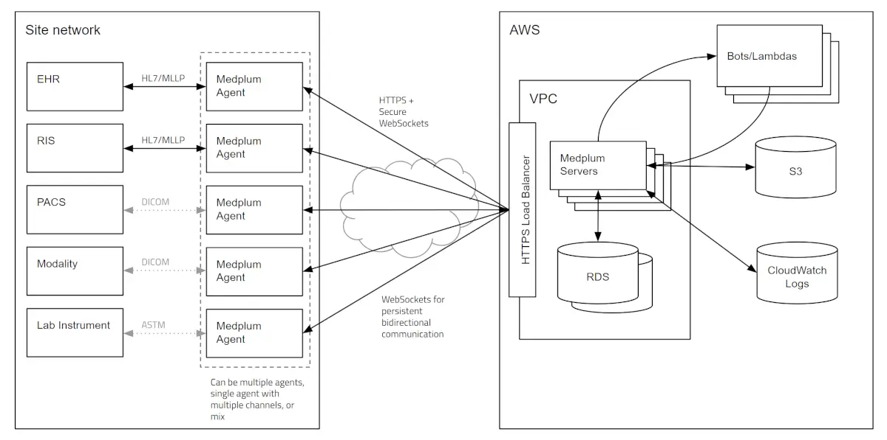

# Intro to Medplum Agent

:::caution

The Medplum Agent is currently in "alpha", and not ready for production use.

Please [contact Medplum](mailto:hello@medplum.com) if you would like to learn more or get involved.

:::

The Medplum Agent is an application that runs inside your firewall and connects to devices over low level protocols such as HL7/MLLP, ASTM, and DICOM. These network protocols are commonly unencrypted, and therefore require an adapter to a secure transport.  The Medplum Agent uses secure HTTPS WebSocket channels to stream messages between devices and a Medplum server cluster in the cloud.

## How it works

The Medplum Agent runs in your local network and connects to devices over low level protocols:

The Medplum Agent securely connects to Medplum servers running in the cloud using HTTPS and WebSockets:

## Installation

TODO

## Setup

TODO

## See also

* [Medplum Agent design discussion](https://github.com/medplum/medplum/discussions/2012)
* [Medplum WebSockets design discussion](https://github.com/medplum/medplum/discussions/1490)
* [FHIR WebSocket Subscriptions](https://build.fhir.org/ig/HL7/fhir-subscription-backport-ig/channels.html#websockets)
* [FHIRCast](https://fhircast.org/)
