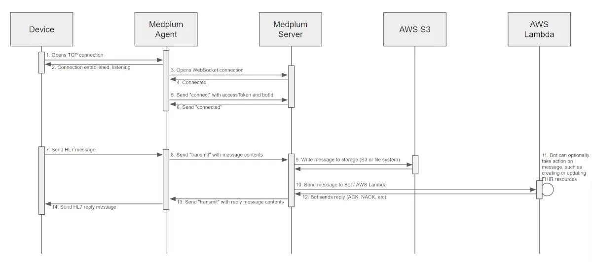

# Intro to Medplum Agent

The Medplum Agent is an application that runs inside your firewall and connects to devices over low level protocols such as HL7/MLLP, ASTM, and DICOM. These network protocols are commonly unencrypted, and therefore require an adapter to a secure transport. The Medplum Agent uses secure HTTPS WebSocket channels to stream messages between devices and a Medplum server cluster in the cloud.

## How it works

The Medplum Agent runs in your local network and connects to devices over low level protocols:


The Medplum Agent securely connects to Medplum servers running in the cloud using HTTPS and WebSockets:



## Installation

The installation of the agent has two parts: first setting up the configurations on the Medplum app, second installing the application on the edge host and then inputting the configurations from the first step into the installer. After completing your install you'll be able to send test transmissions end-to-end.

### Configuration on Medplum App

The Medplum App setup includes creating four resources which represent the configuration of the agent itself. These resources are `Endpoint`, `Bot`, `Agent`, and `ClientApplication`.

**First**, set up the [Endpoint](/docs/api/fhir/resources/endpoint), here is the link to create a [new Endpoint](https://app.medplum.com/Endpoint/new) on the Medplum App. Assuming you want to configure the Endpoint to listen to HL7 v2 over MLLP you'll want set up agent as follows, for example.

```json
{
  "resourceType": "Endpoint",
  "status": "active",
  "connectionType": {
    "system": "http://terminology.hl7.org/CodeSystem/endpoint-connection-type",
    "code": "hl7v2-mllp",
    "display": "HL7 v2 MLLP"
  },
  "name": "Test Endpoint",
  "payloadType": [
    {
      "coding": [
        {
          "system": "http://terminology.hl7.org/CodeSystem/endpoint-payload-type",
          "code": "any",
          "display": "Any"
        }
      ]
    }
  ],
  "address": "mllp://0.0.0.0:56000"
}
```

The way to think about this endpoint is that it represents what the on-site system will connect to. For visibility you may consider linking a `managingOrganization` and related metadata to the `Endpoint` to represent where this is.

**Second**, set up the [Bot](https://app.medplum.com/Bot/new) that transforms the HL7 as needed. The [HL7 Bots documentation](/docs/bots/hl7-into-fhir) applies. Ensure that your Bot can accept HL7 inputs. For an initial setup, the minimal Bot may be helpful.

```js
import { BotEvent, Hl7Message, MedplumClient } from '@medplum/core';

export async function handler(medplum: MedplumClient, event: BotEvent<Hl7Message>): Promise<Hl7Message> {
  return event.input.buildAck();
}
```

**Third**, set up the [Agent](https://app.medplum.com/Agent/new) itself. This identifies the Agent in the field and helps route and manage the traffic from that agent appropriately. Give the `Agent` a descriptive name. You'll want to link the Agent to the Endpoint and Bot you created to support its setup.

```json
{
  "resourceType": "Agent",
  "name": "ACME Hospital Admissions",
  "status": "active",
  "channel": [
    {
      "endpoint": {
        "reference": "Endpoint/my-endpoint-uuid",
        "display": "Test Endpoint"
      },
      "targetReference": {
        "reference": "Bot/my-bot-uuid",
        "display": "HL7 ADT Processing Bot"
      }
    }
  ]
}
```

**Finally**, set up your Client Application. We recommend setting up an AccessPolicy and attaching it to the ClientApplication you can restrict access to the host. The instructions on [setting up access controls](/docs/auth/user-management-guide#creating-memberships) are available in the Admin panel.

At the end of the setup you should have the following items:

- Base Url - The base URL of your Medplum server, or https://api.medplum.com for hosted Medplum
- `ClientId`/`ClientSecret` - obtain these from your [ClientApplication](https://app.medplum.com/ClientApplication/) in the Medplum app
- Agent ID - this is the Agent `id` UUID

You'll need the above to successfully install and connect the agent.

### Install on Host

This guide walks through how to install the agent onto the host. The agent connects to Medplum using [device authentication](/docs/auth/methods).

#### Windows Install

The agent executable for Windows is built with each release, and can be be downloaded from the [releases](https://github.com/medplum/medplum/releases) page.

To install on a Windows Host, remote into the host and download the agent executable to the host filesystem. Double click on the installer executable to start and go through the install screen, inputting the 4 pieces of information from the previous step into the screen.

Once the install is complete you should be able to see the following:

- [ ] The agent running as a Windows Service named "Medplum Agent"
- [ ] Check the Medplum Agent logs typically found at `C:\Program Files\Medplum Agent` in a standard install

#### Linux Install

TODO

#### Docker Image

TODO

## Testing your Setup

Go through the following checklist to ensure that your setup is working.

### Testing a site install

- [ ] When you log into the host, ensure that the agent is running
- [ ] Send a message to the Agent for testing
- [ ] Confirm that the logs on the agent host
- [ ] Navigate to your [`Bot` on the Medplum App](https://app.medplum.com/Bot) and view the `Events` tab, confirm that you see the AuditEvents produced

### Testing HL7 with Medplum CLI

For a simple end-to-end test of HL7 over MLLP, we recommend using [Medplum CLI](/docs/cli) as follows.

Install the Medplum CLI if you have not done so already:

```bash
npm install --global @medplum/cli
```

See [Medplum CLI](/docs/cli) for more detailed installation instructions.

Then send a test message:

```bash
medplum hl7 send localhost 56000 --generate-example
```

There should now be an `AuditEvent` in Medplum for the message.

### Testing HL7 with Sim Hospital

For a more comprehensive end-to-end test of HL7 over MLLP, we recommend using [Sim Hospital](https://github.com/google/simhospital) as follows. (Assumes you have docker installed)

```bash
docker run --rm -it -p 8000:8000 eu.gcr.io/simhospital-images/simhospital:latest health/simulator -output mllp -mllp_destination <ip_address>:<port> -pathways_per_hour 720
```

## Audit Events and Logging

All interactions between a `Bot` and an `Agent`, such as calling `Agent` operations from a `Bot` or calling `Agent` operations that `$execute` a `Bot`, will trigger either the creation of `AuditEvent` resources or the configured logging behavior for the `Bot` (see: [Bot logging configuration](/docs/bots/bots-in-production#configuring-bot-logging)).

:::note

Because a reference to the `Agent` that interacted with the `Bot` is logged in the `AuditEvent` created by the `Bot`, these events will show up in the `Events` tab for both the `Bot` and the `Agent`. 

These are not duplicated `AuditEvent` resources but rather the same resource showing up in both `Event` log views.

:::

## Preparing for Scale

HL7 Feeds can be extremely high volume, and before you go live with a high-volume feed you may want to modify your Bot to log only set the Bot `AuditEventDestination` to `log`.

## Running from source

Testing the setup end-to-end on localhost can be done by doing the following steps. This assumes you are [running Medplum on localhost](/docs/contributing/run-the-stack) as a prerequisite.

Navigate to the `medplum/packages/agent`` folder on your drive and run the following command in your terminal

```bash
npm run agent <base_url> <client_id> <client_secret> <agent_id>
```

Keep the terminal open so that you can see the logs. At this point you can start sending messages to the agent.

## Supported Protocols

- [HL7 v2](https://www.hl7.org): A widely used low-level message protocol for healthcare data exchange.
- [DICOM](https://www.dicomstandard.org/): A protocol used for storing metadata about medical images. Currently, Medplum supports the C-STORE and C-ECHO operations. Support for other DICOM operations such C-FIND, C-GET, and C-MOVE is coming soon.
- [ASTM](https://www.astm.org/): Used to transfer data between clinical instruments and computer systems. ASTM support is still in alpha.

## See also

- [Medplum Agent design discussion](https://github.com/medplum/medplum/discussions/2012)
- [Medplum WebSockets design discussion](https://github.com/medplum/medplum/discussions/1490)
- [FHIR WebSocket Subscriptions](https://build.fhir.org/ig/HL7/fhir-subscription-backport-ig/channels.html#websockets)
- [FHIRCast](https://fhircast.org/)
- [Medplum CLI](/docs/cli)
- [Sim Hospital](https://github.com/google/simhospital) is a useful tool to generate HL7 V2 test messages locally for testing
- [Medplum Agent Demo Video](https://youtu.be/MmE3Dn939B4) on Youtube
