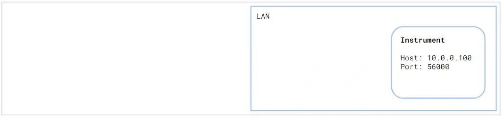
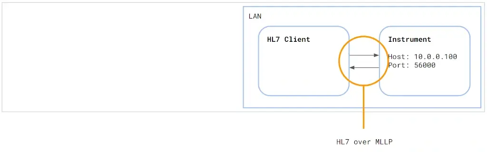
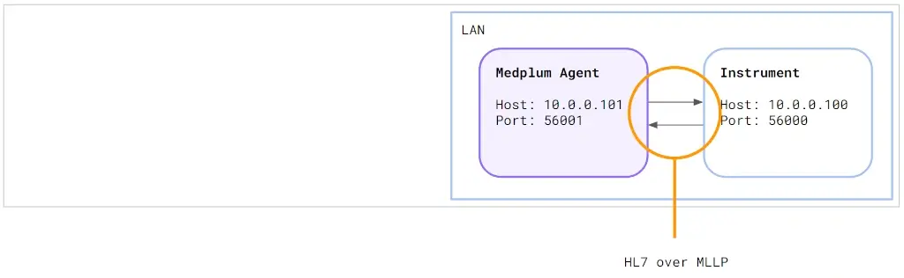
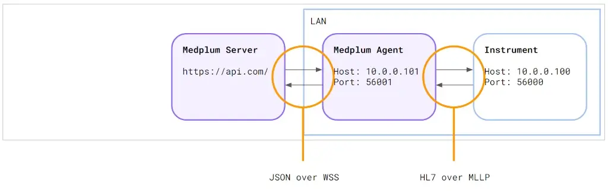
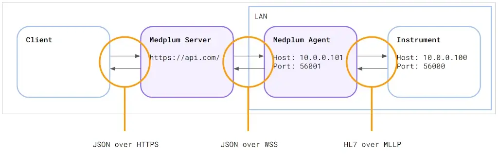

# Push to Agent

## Introduction

While the Medplum Agent traditionally connected healthcare facilities to cloud services by listening to legacy healthcare protocols and forwarding messages securely to the cloud, it also supports pushing messages from the cloud to on-prem devices.

## Feature Overview

1. **Message Push**: Leverage websockets for a persistent connection between the cloud server and on-prem Medplum Agent.
2. **Cloud-Initiated Messages**: With the existing connection, the server can initiate messages to be sent directly to remote devices via the agent.
3. **Use Cases**:
   - Push order details directly to lab instruments using HL7 or ASTM.
   - Send patient details to radiology modalities using DICOM.
   - Relay a DICOM SR to a RIS using DICOM.
4. **Simplified Infrastructure**: Eliminate the need for site-to-site VPNs, making setups more straightforward and secure.

## How it works

First, consider the most simple case: an HL7 device on the network (e.g. a Radiology Information System or Lab Instrument):



We can emulate this setup using the Medplum CLI:

```bash
medplum hl7 listen 56000
```

Next, let's add a simple HL7 client also on the network:



We can emulate this step using the Medplum CLI:

```bash
medplum hl7 send localhost 56000 --generate-example
```

This will send a message and print the reply to the terminal.

The main challenge with HL7 interfaces is the need to be on the local network. Historically, this meant running the EHR software on-premise.

Instead, we will use the Medplum Agent to proxy traffic to the Medplum server hosted in the cloud:



The Medplum Agent connects to the on-premise device the same as any other HL7 client: using HL7 over MLLP.

The power of the Medplum Agent is when connected to a Medplum server:



The Agent connects to the Server using secure WebSockets (WSS). Because WebSockets are a persistent connection, the server can "push" a message to the instrument via the agent.



We can emulate this step using the Medplum CLI. This time, instead of using HL7 over MLLP, we will send a JSON message over HTTPS. The Server forwards the message to the Agent. The Agent forwards the message to the instrument.

```bash
medplum post 'Agent/1080ee82-e4fc-4312-946f-322fbecf9bb9/$push' $'{"destination":"Device/52c9a9de-1081-4fb2-a40a-e62efe1b73b2","contentType":"x-application/hl7-v2+er7","body":"MSH|^~\\\\&|ADTSYS|HOSPITAL|RECEIVER|DEST|20231023235305.516||ADT^A01|1698105185516|P|2.5|\\nEVN|A01|20231023235305.516||\\nPID|1|12345|12345^^^HOSP^MR|123456|DOE^JOHN^MIDDLE^SUFFIX|19800101|M|||123 STREET^APT 4B^CITY^ST^12345-6789||555-555-5555||S|\\nPV1|1|I|2000^2012^01||||12345^DOCTOR^DOC||||||||||1234567^DOCTOR^DOC||AMB|||||||||||||||||||||||||202309280900|"}'
```

This line is intentionally long due to the complexities of escaping new lines. Let's break it down piece by piece:

```bash
medplum post 'Agent/1080ee82-e4fc-4312-946f-322fbecf9bb9/$push' $'{
    "destination": "Device/52c9a9de-1081-4fb2-a40a-e62efe1b73b2",
    "contentType": "x-application/hl7-v2+er7",
    "body": "MSH|^~\\\\&|ADTSYS|HOSPITAL|RECEIVER|DEST|20231023235305.516||ADT^A01|1698105185516|P|2.5|\\n\
EVN|A01|20231023235305.516||\\n\
PID|1|12345|12345^^^HOSP^MR|123456|DOE^JOHN^MIDDLE^SUFFIX|19800101|M|||123 STREET^APT 4B^CITY^ST^12345-6789||555-555-5555||S|\\n\
PV1|1|I|2000^2012^01||||12345^DOCTOR^DOC||||||||||1234567^DOCTOR^DOC||AMB|||||||||||||||||||||||||202309280900|"\
}'
```

## How To Use The Feature

1. **Direct Push**:
   - Send an HTTPS POST request to `/Agent/{id}/$push`.
   - The content body should be a JSON object with the following properties:
     - `destination` - Device reference (i.e., `Device/123`) or a Device search (i.e., `Device?identifier=123`)
       - The `Device` resource must have a `Device.url` property
     - `contentType` - MIME type of the content, `x-application/hl7-v2+er7` for HL7 v2
     - `body` - the actual HL7 message body
   - The Medplum server will forward the message through websockets, and the Medplum Agent will relay it to the intended device.
2. **Using MedplumClient**:
   - MedplumClient, Medplum's JavaScript/TypeScript SDK, simplifies tasks related to connectivity and authentication.
   - To send a message, just use: `medplum.pushToAgent(agent, device, body, contentType)`. The SDK manages the HTTPS POST request for you.
3. **Pushing with Medplum Bots**:
   - Medplum Bots allow users to run custom JavaScript or TypeScript logic based on various triggers.
   - Each Bot invocation has a built-in MedplumClient.
   - To push a message, use: `medplum.pushToAgent(agent, device, body, contentType)`.

## End-To-End Example: Pushing Lab Orders

**Objective**: Push lab orders to a remote device using HL7.

**Trigger**: "Create" or "Update" operations on a FHIR ServiceRequest.

**Steps**:

1. Set up a Medplum Bot.
   - The Bot will receive the FHIR ServiceRequest.
   - It will then convert the required FHIR fields to HL7 using the Medplum HL7 SDK.
2. Save and deploy your Bot.
3. Create a FHIR Subscription:
   - Set the criteria to "ServiceRequest".
   - Choose the Bot as the channel target.
4. Now, any "create" or "update" operation on a FHIR ServiceRequest will trigger the Medplum server to call the Bot. The Bot will process and convert the message to HL7, sending it to the remote device via the Medplum Agent.
