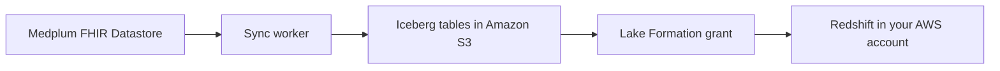

# Amazon Redshift

:::info[Enterprise feature]

Redshift sync is part of Medplum Enterprise. A Medplum team member creates and enables the pipeline for your project. Contact us at [hello@medplum.com](mailto:hello@medplum.com) to get started, or see [pricing](/pricing).

:::

Medplum synchronizes your FHIR data to [Apache Iceberg](https://iceberg.apache.org/) tables in [Amazon S3 Tables](https://docs.aws.amazon.com/AmazonS3/latest/userguide/s3-tables.html) on a schedule, then grants your AWS account access to those tables through [AWS Lake Formation](https://docs.aws.amazon.com/lake-formation/latest/dg/data-filtering.html). [Amazon Redshift](https://docs.aws.amazon.com/redshift/latest/mgmt/serverless-workgroup-namespace.html) in your account queries them in place. There is no export job for your team to build or operate, and no copy of the data lands in a bucket you have to manage.

Use this for population health reporting, quality measure calculation, cohort analysis, and any workload that aggregates across large numbers of resources. [FHIR search](/docs/search/basic-search) is designed for clinical lookups on individual patients, not for aggregation across a population.

Redshift is one of several options. The sync writes open Iceberg tables rather than a Redshift-specific format, so the same tables can be queried from [Snowflake](/docs/analytics/snowflake), Amazon Athena, Apache Spark, or Trino. Two things make Redshift the recommendation when you are staying inside AWS: it can read the tables with no data movement, and it is the only AWS engine that supports the redacted view layer described below. Athena cannot do redaction.

## How it works



1. A sync worker runs on a schedule you choose. It reads from a read replica, so production traffic is not affected.
2. Each run writes only the resource versions created or changed since the previous run.
3. Medplum grants an IAM role you own permission to read the tables for the Medplum projects you name. The grant carries a row filter on `project_id`, so the role cannot see projects outside the grant.
4. Your Redshift workgroup attaches to the shared catalog and queries the tables directly.

Freshness is set by the schedule. Hourly is a common starting point. This pipeline is not built for sub-minute latency: to react to individual resources in real time, use [Bots](/docs/bots) and [Subscriptions](/docs/subscriptions).

## Table layout

Medplum writes one table per FHIR resource type, named after the resource type in lowercase with a `_history` suffix.

| FHIR resource type | Table                 |
| ------------------ | --------------------- |
| Patient            | `patient_history`     |
| Observation        | `observation_history` |
| Encounter          | `encounter_history`   |
| Condition          | `condition_history`   |

Every table has the same five columns.

| Column         | Type      | Description                                               |
| -------------- | --------- | --------------------------------------------------------- |
| `id`           | string    | Resource id. Stable across every version of the resource. |
| `version_id`   | string    | `meta.versionId` for this row.                            |
| `content`      | string    | The complete FHIR resource as JSON.                       |
| `last_updated` | timestamp | `meta.lastUpdated` for this row.                          |
| `project_id`   | string    | The Medplum project that owns the resource.               |

Two things to know about the shape:

**These are history tables.** Every version of every resource is its own row, so a Patient updated ten times contributes ten rows. Queries that want current state select the latest version per `id`. The pattern is below.

**Resources arrive as JSON, not as columns.** `content` holds the whole FHIR resource. This is deliberate. FHIR resources are deeply nested and sparsely populated, so flattening at export time would either drop data or produce thousands of mostly empty columns. You flatten the fields you need in Redshift, where changing your mind costs a view definition instead of a re-export.

## Raw tables or redacted views

The tables in S3 are a raw copy of Medplum's history tables, including the fields that hold secrets. You choose which of two surfaces gets shared with your account:

- **Raw.** The Iceberg tables as written, every field intact.
- **Redacted.** [Late-binding views](https://docs.aws.amazon.com/redshift/latest/dg/r_CREATE_VIEW.html) over the same tables that null out a fixed list of secret fields using [`OBJECT_TRANSFORM`](https://docs.aws.amazon.com/redshift/latest/dg/r_OBJECT_TRANSFORM_function.html). The fields are `User.passwordHash`, `User.mfaSecret`, `ClientApplication.secret`, `IdentityProvider.clientSecret`, `Project.secret`, and `Project.systemSecret`. Everything else passes through untouched, including fields Medplum adds later.

Redaction happens at query time in the view, not in the sync, so the list can change without a re-export and without downtime. Tell us which surface you want when you open the request. Most teams take the redacted views.

This is the full list of what redaction does. It is not de-identification, it does not remove PHI, and it is not a substitute for access control on your side. See [Access control and compliance](#access-control-and-compliance).

## Querying in Redshift

`content` arrives as a JSON string. Parse it into the [`SUPER`](https://docs.aws.amazon.com/redshift/latest/dg/r_SUPER_type.html) type with [`JSON_PARSE`](https://docs.aws.amazon.com/redshift/latest/dg/JSON_PARSE.html) and use [PartiQL navigation](https://docs.aws.amazon.com/redshift/latest/dg/query-super.html) to read into it. In the redacted views `content` is already `SUPER`, so skip the `JSON_PARSE` call.

FHIR field names are camelCase, and Redshift lowercases attribute names in dot notation unless you turn on case-sensitive identifiers. Set this once per session before running anything below:

```sql
SET enable_case_sensitive_identifier TO true;
```

If you would rather not change the session setting, [`JSON_EXTRACT_PATH_TEXT`](https://docs.aws.amazon.com/redshift/latest/dg/JSON_EXTRACT_PATH_TEXT.html) reads the same field and is always case-sensitive. On the raw tables `content` is a JSON string, so read it directly with `JSON_EXTRACT_PATH_TEXT(content, 'birthDate')`. On the redacted views `content` is already `SUPER`, so serialize it first: `JSON_EXTRACT_PATH_TEXT(JSON_SERIALIZE(content), 'birthDate')`.

### Current version of each resource

Redshift has no `QUALIFY` clause, so filter on [`ROW_NUMBER`](https://docs.aws.amazon.com/redshift/latest/dg/r_WF_ROW_NUMBER.html) in an outer query. Views over external tables require `WITH NO SCHEMA BINDING`.

```sql
create or replace view patient_current as
select id, version_id, last_updated, project_id, resource
from (
  select
    id,
    version_id,
    last_updated,
    project_id,
    json_parse(content) as resource,
    row_number() over (partition by id order by last_updated desc) as rn
  from patient_history
)
where rn = 1
with no schema binding;
```

The view examples on this page read the raw tables. On the redacted views `content` is already `SUPER`, so drop `json_parse` and select `content` directly.

Deleted resources still appear, as a tombstone version carrying `meta.deleted`. Filter them out when you want live resources only:

```sql
select *
from patient_current
where resource.meta.deleted is null;
```

See [Deleting Data](/docs/fhir-datastore/deleting-data) for what a tombstone contains. Keeping the tombstones is what lets you answer "when did this resource go away," so filter at the view boundary rather than asking to have them excluded from sync.

### Flattening fields

Pull out the fields your report needs, casting each one to a Redshift type:

```sql
select
  id,
  resource.birthDate::date          as birth_date,
  resource.gender::varchar          as gender,
  resource.name[0].family::varchar  as family_name,
  resource.name[0].given[0]::varchar as given_name
from patient_current
where resource.meta.deleted is null;
```

Repeating elements expand by unnesting the array in the `FROM` clause. This returns one row per identifier:

```sql
select
  p.id,
  i.system::varchar as identifier_system,
  i.value::varchar  as identifier_value
from patient_current p, p.resource.identifier i;
```

### Worked example: numeric lab results

```sql
create or replace view observation_current as
select id, last_updated, project_id, resource
from (
  select
    id,
    last_updated,
    project_id,
    json_parse(content) as resource,
    row_number() over (partition by id order by last_updated desc) as rn
  from observation_history
)
where rn = 1
with no schema binding;

select
  o.id,
  o.resource.subject.reference::varchar    as patient_reference,
  c.code::varchar                          as loinc_code,
  c.display::varchar                       as loinc_display,
  o.resource.valueQuantity.value::float    as result_value,
  o.resource.valueQuantity.unit::varchar   as result_unit,
  o.resource.effectiveDateTime::timestamp  as effective_time
from observation_current o, o.resource.code.coding c
where o.resource.meta.deleted is null
  and c.system::varchar = 'http://loinc.org'
  and o.resource.valueQuantity.value is not null;
```

Reports like this are only as good as the coding in the underlying data. Use [Bots](/docs/bots) and [Subscriptions](/docs/subscriptions) to enforce coding at write time rather than repairing it in the warehouse. See [Analytics](/docs/analytics) for the coding systems involved.

### Multiple projects

If your organization runs more than one Medplum project, filter on `project_id`. Build it into the view so that every downstream query inherits the scope:

```sql
create or replace view patient_current as
select ...
from patient_history
where project_id = '<your-project-id>'
...
with no schema binding;
```

This is a convenience for your own queries, not a security boundary. The Lake Formation row filter on the grant is what actually limits which projects your role can read.

## Getting set up

A Medplum team member configures the sync and the grant. Your team creates the Redshift workgroup and the IAM role that will read the data.

### What to send us

| Item                   | Notes                                                                                             |
| ---------------------- | ------------------------------------------------------------------------------------------------- |
| AWS account and region | Where your Redshift workgroup lives. Matching our region avoids cross-region transfer.            |
| IAM role ARN           | The role you create in step 2 below. Medplum grants it read access.                               |
| Medplum project ids    | The projects you want in the warehouse. The grant is filtered to these.                           |
| Raw or redacted        | Which surface you want shared. See [Raw tables or redacted views](#raw-tables-or-redacted-views). |
| Sync schedule          | Hourly is a good default. Set it by how fresh your reports need to be.                            |
| Resource types         | All types by default. You can name an include list or an exclude list, but not both.              |
| Backfill start date    | The earliest `meta.lastUpdated` to export. Omit it to load all history.                           |

`AuditEvent` is worth a decision rather than a default. It is often the largest history table in a project, and it answers a different set of questions than clinical reporting does. Either exclude it or give it its own schedule.

### Step 1: Create a Redshift workgroup

Create a [Redshift Serverless](https://docs.aws.amazon.com/redshift/latest/mgmt/serverless-workgroup-namespace.html) namespace and workgroup in your account. Defaults are fine. Provisioned RA3 clusters work too. Confirm you can connect and run a query against it before going further, so that any problem you hit later is on the sharing path rather than on the cluster.

### Step 2: Create an IAM role for Redshift

Create one IAM role used only by Redshift. Trust policy:

```json
{
  "Version": "2012-10-17",
  "Statement": [
    {
      "Effect": "Allow",
      "Principal": {
        "Service": ["redshift.amazonaws.com", "redshift-serverless.amazonaws.com"]
      },
      "Action": "sts:AssumeRole"
    }
  ]
}
```

Permissions policy. `AmazonRedshiftAllCommandsFullAccess` is the console default and works. Least privilege is Glue catalog reads plus Lake Formation credential vending:

```json
{
  "Version": "2012-10-17",
  "Statement": [
    {
      "Sid": "GlueCatalogRead",
      "Effect": "Allow",
      "Action": [
        "glue:GetDatabase",
        "glue:GetDatabases",
        "glue:GetTable",
        "glue:GetTables",
        "glue:GetPartition",
        "glue:GetPartitions",
        "glue:BatchGetPartition",
        "glue:GetUserDefinedFunction",
        "glue:GetUserDefinedFunctions"
      ],
      "Resource": "*"
    },
    {
      "Sid": "LakeFormationCredentials",
      "Effect": "Allow",
      "Action": "lakeformation:GetDataAccess",
      "Resource": "*"
    }
  ]
}
```

Attach the role to your namespace under **IAM roles** and mark it default, then send us the role ARN.

### Step 3: Accept the share

Medplum grants your role read access through Lake Formation. The grant arrives in your account as an invitation in [AWS Resource Access Manager](https://docs.aws.amazon.com/ram/latest/userguide/what-is.html), with the catalog details in it. You do not need our AWS account id or our bucket names.

### Step 4: Create a resource link and a database

Create a [resource link](https://docs.aws.amazon.com/lake-formation/latest/dg/resource-links-about.html) in your own Glue catalog pointing at the shared database, then grant `DESCRIBE` on the link to the identities that will query it. If your Redshift workgroup is in a different region from the shared catalog, set `Region` on the target database in the resource link.

Then create the database in Redshift from the resource link ARN:

```sql
CREATE DATABASE medplum_dw
FROM ARN 'arn:aws:glue:<your-region>:<your-account>:database/<resource-link-name>'
WITH DATA CATALOG SCHEMA <schema>
IAM_ROLE '<your-role-arn>';
```

See [`CREATE DATABASE`](https://docs.aws.amazon.com/redshift/latest/dg/r_CREATE_DATABASE.html) for the full syntax. Confirm the tables are visible:

```sql
SHOW TABLES FROM SCHEMA medplum_dw.<schema>;
select project_id, count(*) from medplum_dw.<schema>.patient_history group by 1;
```

Only the project ids in the grant should appear. If they do not, or the database is empty, tell us before changing anything on your side: the fix is almost always a grant on ours.

Two things that will not work, by design. Only principals that can use both Redshift and Lake Formation can query the share, so local Redshift users created with `CREATE USER` and a password cannot see it. Use federated IAM identities. And you cannot create your own unfiltered grant on the shared tables. Project isolation is enforced on the Medplum side.

Self-hosted deployments configure the same sync through the `dataWarehouse` block in [server config](/docs/self-hosting/server-config#datawarehouse).

## Access control and compliance

:::warning[Full replication, no Access Policies]

The warehouse is a full copy of your FHIR data. Every resource and every version in the projects you name is replicated, with no filtering by user, role, or compartment on the way out. Medplum [Access Policies](/docs/access/access-policies) do not apply to it.

Once the data lands in Redshift, securing it is your responsibility. Your own roles, grants, and audit logging are the only controls on it.

:::

Treat the warehouse as a PHI system: put it in scope for your BAA, your access reviews, and your audit logging.

Three practices that follow from this:

- **Grant on views, not on the history tables.** A view that filters `project_id`, drops tombstones, and selects only the fields a team needs is easier to reason about than a policy on raw FHIR JSON.
- **De-identify in Redshift for analytics that do not need identity.** Cohort and quality measure work usually does not need names, addresses, or contact details. Build a de-identified view layer and point most consumers at that.
- **Keep the row filter as the boundary between projects.** If you run separate dev, staging, and production projects, the Lake Formation grant is what separates them. A `WHERE project_id` in a view is a convenience on top of it.

## What this does not do

- **It does not write back.** The sync is one directional. Changes made in Redshift never reach the FHIR datastore.
- **It does not carry attachment bytes.** [Binary](/docs/api/fhir/resources/binary) resources sync as their FHIR JSON. The underlying file content stays in Medplum's storage service.
- **It does not replace real-time workflows.** Anything that needs to happen within seconds of a resource changing belongs in a [Bot](/docs/bots).
- **Redaction is not access control.** The redacted views null out six secret fields. They do not restrict who sees a patient.

## Other warehouses

The tables are open Iceberg, so the engine is your choice. Everything on this page applies except the query syntax and the setup steps: the schedule, the table layout, the five columns, and the history semantics are the same.

- **Snowflake** attaches to the Iceberg catalog directly. See [Snowflake](/docs/analytics/snowflake).
- **[Amazon Athena](https://docs.aws.amazon.com/athena/latest/ug/what-is.html)** reads the same Lake Formation grant with no cluster to run. It cannot apply the redacted view layer, so it is only an option on the raw surface.
- **Apache Spark** and **Amazon EMR** read the tables through the S3 Tables catalog.
- **Trino** connects to the [S3 Tables Iceberg REST endpoint](https://aws.amazon.com/blogs/storage/query-amazon-s3-tables-from-open-source-trino-using-apache-iceberg-rest-endpoint) using its Iceberg connector with SigV4 authentication.

Tell us which engine you are using when you open the request and we will point the catalog at it.

If you are not on Medplum Enterprise, the [Bulk FHIR API](/docs/api/fhir/operations/bulk-fhir) exports resources as NDJSON that you can stage and load yourself. It runs on demand rather than on a schedule, and you own the loading and the incremental logic.

## See also

- [Snowflake](/docs/analytics/snowflake) for the same pipeline read from Snowflake
- [Analytics](/docs/analytics) for program design, coding systems, and standard measures
- [Bulk FHIR API](/docs/api/fhir/operations/bulk-fhir)
- [Access Policies](/docs/access/access-policies)
- [Server config: dataWarehouse](/docs/self-hosting/server-config#datawarehouse)
