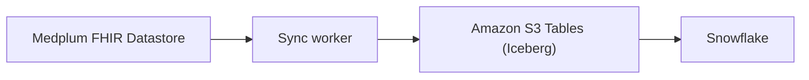

# Snowflake

:::info[Enterprise feature]

Synchronization to [Snowflake](https://www.snowflake.com/) is part of [Medplum Enterprise](https://www.medplum.com/enterprise). A Medplum team member creates and enables the pipeline for your project and uses [Secure Data Sharing](https://docs.snowflake.com/en/user-guide/data-sharing-intro) to share the data with you. Contact us at [hello@medplum.com](mailto:hello@medplum.com) to get started, or see [pricing](/pricing).

:::

Medplum synchronizes your FHIR data to [Apache Iceberg](https://iceberg.apache.org/) tables in [Amazon S3 Tables](https://docs.aws.amazon.com/AmazonS3/latest/userguide/s3-tables.html) on a schedule. Snowflake reads those tables in place, so there is no export job for your team to build or operate.

Use this for population health reporting, quality measure calculation, cohort analysis, and any workload that aggregates across large numbers of resources. [FHIR search](/docs/search/basic-search) is designed for clinical lookups on individual patients, not for aggregation across a population.

Snowflake is one of several options. The sync writes open Iceberg tables rather than a Snowflake-specific format, so the same tables can be queried from Amazon Redshift, Apache Spark, or Trino. This page uses Snowflake for the examples. The setup on the Medplum side is the same for any of them — see [Other warehouses](#other-warehouses) for what differs in how the data is exposed.

## How it works



1. A sync worker runs every five minutes. It reads from a read replica, so production traffic is not affected.
2. Each run writes only the resource versions created or changed since the previous run.
3. Medplum shares the data with your Snowflake account as a private listing. Accepting it creates an imported database in your account, exposing the data as views with redacted secrets — see [View layout](#view-layout) below.

This pipeline is not built for sub-minute latency: to react to individual resources in real time, use [Bots](/docs/bots) and [Subscriptions](/docs/subscriptions).

## View layout

Medplum shares one view per FHIR resource type, in the `SHARE_REDACTED` schema, named after the resource type in lowercase with a `_history` suffix.

| FHIR resource type | View                     |
| ------------------ | ------------------------ |
| Patient             | `patient_history`        |
| Observation         | `observation_history`    |
| Encounter           | `encounter_history`      |
| Condition           | `condition_history`      |
| ServiceRequest      | `servicerequest_history` |

There is one view per [FHIR resource type Medplum supports](https://www.medplum.com/docs/api/fhir/resources). List what you have access to, and inspect any view's columns, with:

```sql
show views in schema share_redacted;
describe view patient_history;
```

Every view has the same five columns.

| Column         | Type          | Description                                                    |
| -------------- |---------------| -------------------------------------------------------------- |
| `id`           | `UUID`        | Resource id. Stable across every version of the resource.       |
| `version_id`   | `UUID`        | `meta.versionId` for this row.                                  |
| `content`      | `VARIANT`     | The complete FHIR resource as JSON.                             |
| `last_updated` | `TIMESTAMPTZ` | `meta.lastUpdated` for this row.                                |
| `project_id`   | `UUID`        | The Medplum project that owns the resource.                     |

Two things to know about the shape:

**These are history views.** Every version of every resource is its own row, so a Patient updated ten times contributes ten rows. Queries that want current state select the latest version per `id`. The pattern is below.

**Resources arrive as JSON, not as columns.** `content` holds the whole FHIR resource. This is deliberate. FHIR resources are deeply nested and sparsely populated, so flattening at export time would either drop data or produce thousands of mostly empty columns. You flatten the fields you need by building your own views on top, where changing your mind costs a view definition instead of a re-export.

**These are views with redacted secrets.** A few of them drop specific fields before Medplum shares the data — see [Redacted fields](#redacted-fields) below.

## Redacted fields

| View                         | Fields removed from `content`   |
| ---------------------------- | -------------------------------- |
| `user_history`               | `passwordHash`, `mfaSecret`      |
| `clientapplication_history`  | `secret`                         |
| `identityprovider_history`   | `clientSecret`                   |
| `project_history`            | `secret`, `systemSecret`         |

All other views keep the full FHIR JSON.

## Querying in Snowflake

`content` type is `VARIANT`, and therefore you can use Snowflake's [semi-structured operators](https://docs.snowflake.com/en/user-guide/querying-semistructured) to read into it.

Want to try these queries before your own sync is live? [Download a synthetic data sample](/examples/medplum-synthetic-data-sample.zip) that contains synthetic FHIR resources shaped the same way real data lands in this pipeline.

### Recent resources

Filter on `last_updated` for a quick look at what changed recently, without building a view first:

```sql
select
  id,
  last_updated,
  content:name[0]:family::string as family_name,
  content:birthDate::date as birth_date
from patient_history
where last_updated >= dateadd(day, -30, current_timestamp())
order by last_updated desc;
```

### Current version of each resource

Use [`QUALIFY`](https://docs.snowflake.com/en/sql-reference/constructs/qualify) to keep the newest row per `id`.

```sql
create or replace view patient_current as
select
  id,
  version_id,
  last_updated,
  project_id,
  content as resource
from patient_history
qualify row_number() over (partition by id order by last_updated desc) = 1;
```

Deleted resources still appear, as a tombstone version carrying `meta.deleted`. Filter them out when you want live resources only:

```sql
select *
from patient_current
where resource:meta:deleted is null;
```

See [Deleting Data](/docs/fhir-datastore/deleting-data) for what a tombstone contains. Keeping the tombstones is what lets you answer "when did this resource go away," so filter at the view boundary rather than asking to have them excluded from sync.

### Flattening fields

Pull out the fields your report needs:

```sql
select
  id,
  resource:birthDate::date         as birth_date,
  resource:gender::string          as gender,
  resource:name[0]:family::string  as family_name,
  resource:name[0]:given[0]::string as given_name
from patient_current
where resource:meta:deleted is null;
```

Repeating elements expand with [`LATERAL FLATTEN`](https://docs.snowflake.com/en/sql-reference/functions/flatten). This returns one row per identifier:

```sql
select
  p.id,
  i.value:system::string as identifier_system,
  i.value:value::string  as identifier_value
from patient_current p,
     lateral flatten(input => p.resource:identifier) i;
```

### Worked example: numeric lab results

```sql
create or replace view observation_current as
select
  id,
  last_updated,
  content as resource
from observation_history
qualify row_number() over (partition by id order by last_updated desc) = 1;

select
  o.id,
  o.resource:subject:reference::string     as patient_reference,
  c.value:code::string                     as loinc_code,
  c.value:display::string                  as loinc_display,
  o.resource:valueQuantity:value::float    as result_value,
  o.resource:valueQuantity:unit::string    as result_unit,
  o.resource:effectiveDateTime::timestamp  as effective_time
from observation_current o,
     lateral flatten(input => o.resource:code:coding) c
where o.resource:meta:deleted is null
  and c.value:system::string = 'http://loinc.org'
  and o.resource:valueQuantity:value is not null;
```

Reports like this are only as good as the coding in the underlying data. Use [Bots](/docs/bots) and [Subscriptions](/docs/subscriptions) to enforce coding at write time rather than repairing it in the warehouse. See [Analytics](/docs/analytics) for the coding systems involved.

### Join across resource types

Join on `project_id` plus a FHIR reference string. Join the `_current` views (not the raw history views) so a resource with many versions doesn't fan out the join:

```sql
select
  o.id as observation_id,
  p.id as patient_id
from observation_current o
join patient_current p
  on p.project_id = o.project_id
 and o.resource:subject:reference::string = 'Patient/' || p.id;
```

### Multiple projects

Rows are limited to the Medplum projects mapped to your listing — you only see your own projects, never another customer's. If your organization runs more than one Medplum project, you might want filter on `project_id`. By default, all your projects are shared with Snowflake.  Build it into the view so that every downstream query inherits the scope:

```sql
create or replace view patient_current as
select ...
from patient_history
where project_id = '<your-project-id>'
qualify row_number() over (partition by id order by last_updated desc) = 1;
```

An empty result set almost always means there are no rows yet for the projects mapped to your listing — not a missing or broken view.

## Getting set up

A Medplum team member configures the sync. To open the request, send us:

| Item                | Notes                                                                                            |
| ------------------- | ------------------------------------------------------------------------------------------------ |
| AWS account and region | Where the S3 table bucket lives. Matching your Snowflake region avoids cross-region transfer.  |
| Sync schedule       | Hourly is a good default. Set it by how fresh your reports need to be.                            |
| Resource types      | All types by default. You can name an include list or an exclude list, but not both.              |
| Backfill start date | The earliest `meta.lastUpdated` to export. Omit it to load all history.                           |
| Snowflake account locator | [your data sharing identifier](https://docs.snowflake.com/en/user-guide/admin-account-identifier#label-account-name-data-sharing), in the form `ORGNAME.ACCOUNT_NAME` |

`AuditEvent` is worth a decision rather than a default. It is often the largest history table in a project, and it answers a different set of questions than clinical reporting does. Either exclude it or give it its own schedule.

On the Snowflake side, your team does the following things:

1. Accept the [Snowflake private listing](https://docs.snowflake.com/en/collaboration/collaboration-listings-about) from Medplum. See [Access and install listings as a consumer](https://docs.snowflake.com/en/collaboration/consumer-listings-access):
   - Sign in to Snowsight with a role that can get listings (`ACCOUNTADMIN`, or a role with `CREATE DATABASE` and `IMPORT SHARE`).
   - Go to **Data sharing** → **External sharing**.
   - On **Shared with you**, under **Privately shared listings**, open the Medplum listing and select **Get**. This creates an imported database in your account.
   - Note the database name Snowsight assigns, then point your session at it before running any of the queries on this page:
     ```sql
     use database <imported_db>;
     use schema share_redacted;
     ```
2. Configure roles and access controls, as per your requirements

If you are not on Medplum Enterprise, the [Bulk FHIR API](/docs/api/fhir/operations/bulk-fhir) exports resources as NDJSON that you can stage and load yourself. It runs on demand rather than on a schedule, and you own the loading and the incremental logic.

## Access control and compliance

:::warning[Full replication, no Access Policies]

The warehouse is a full copy of your FHIR data. Every resource and every version in the projects you name is replicated, with no filtering by user, role, or compartment on the way out. Medplum [Access Policies](/docs/access/access-policies) do not apply to it.

Once the data lands in Snowflake, securing it is your responsibility. Your own roles, grants, and audit logging are the only controls on it.

:::

Treat the warehouse as a PHI system: put it in scope for your BAA, your access reviews, and your audit logging.

Two practices that follow from this:

- **Grant on your own views, not on the shared history views directly.** A view that filters `project_id`, drops tombstones, and selects only the fields a team needs is easier to reason about than a policy on raw FHIR JSON.
- **De-identify in Snowflake for analytics that do not need identity.** Cohort and quality measure work usually does not need names, addresses, or contact details. Build a de-identified view layer and point most consumers at that.

## What this does not do

- **It does not write back.** The sync is one directional. Changes made in Snowflake never reach the FHIR datastore.
- **It does not carry attachment bytes.** [Binary](/docs/api/fhir/resources/binary) resources sync as their FHIR JSON. The underlying file content stays in Medplum's storage service.
- **It does not replace real-time workflows.** Anything that needs to happen within seconds of a resource changing belongs in a [Bot](/docs/bots).

## Other warehouses

The tables are open Iceberg, so the engine is your choice. Everything on this page applies except the query syntax and the redaction: the schedule, the five columns, and the history semantics are the same. Other engines read the raw Iceberg tables directly rather than the redacted views Snowflake gets through the private listing — see [View layout](#view-layout) and [Redacted fields](#redacted-fields).

- **Amazon Redshift** reads S3 Tables through the AWS Glue Data Catalog integration.
- **Apache Spark** and **Amazon EMR** read them through the S3 Tables catalog.
- **Trino** connects to the [S3 Tables Iceberg REST endpoint](https://aws.amazon.com/blogs/storage/query-amazon-s3-tables-from-open-source-trino-using-apache-iceberg-rest-endpoint) using its Iceberg connector with SigV4 authentication.

Tell us which engine you are using when you open the request and we will point the catalog at it.

If you are not on Medplum Enterprise, the [Bulk FHIR API](/docs/api/fhir/operations/bulk-fhir.mdx) exports resources as NDJSON that you can stage and load yourself. It runs on demand rather than on a schedule, and you own the loading and the incremental logic.

## See also

- [Amazon Redshift](/docs/analytics/redshift) for the same pipeline read from Redshift
- [Analytics](/docs/analytics) for program design, coding systems, and standard measures
- [Bulk FHIR API](/docs/api/fhir/operations/bulk-fhir)
- [Access Policies](/docs/access/access-policies)
- [Server config: dataWarehouse](/docs/self-hosting/server-config#datawarehouse)
