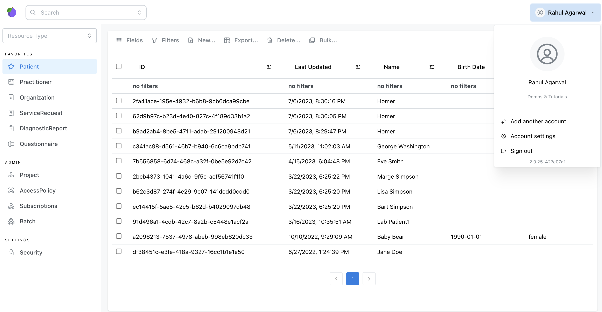

# Medplum App Basics

The Medplum App is the user-facing web application available at <https://app.medplum.com/> targeted towards developers and project administrators. This administrative app is developer entirely from the [Medplum React Components](/docs/ui-components)

This guide will go over how to navigate the core functionality of the Medplum App.

## The App Homepage

When you first log in to the Medplum App, you'll see a page as shown above. This is the main page, which consists of a few primary components:

- **[Search Control:](#search-control)** Displays a list of the currently selected resource type.
- **Sidebar:** Used to quickly navigate to different parts of the Medplum App.
- **Quicksearch Bar:** Used to search for specific resource instances.
- **Profile Selector:** Displays profile information for the currently logged in user.

### Search Control

The Search Control displays a paginated list of all the resources for the select resource type.

The toolbar at the top contains actions that you can use to customize this view.

- **Fields:** Can be used to add/remove columns for resource elements
- **Filters:** Used to filter rows based on search criteria. Only elements with [search parameters](/docs/search/basic-search#search-parameters) can be filtered on. You can also use the filter icon at the top of each column to filter on a specific element. Refer to our [search guide](/docs/search/basic-search) for more information.
- **New:** Create a new resource of the selected type ([See below](#creating-new-resources))
- **Export:** Export the resources in the current view, either as a CSV or as [FHIR Bundle](/docs/api/fhir/resources/bundle)
- **Bulk:** Execute a [Medplum Bot](/docs/bots) on all checked

This search control is also encapsulated as a [medplum React component](https://storybook.medplum.com/?path=/story/medplum-searchcontrol--checkboxes) and can be embedded into your own applications.

### Sidebar

### Quick Search

### Profile

## Filtering resources

## Creating new resources

## Deleting resources
