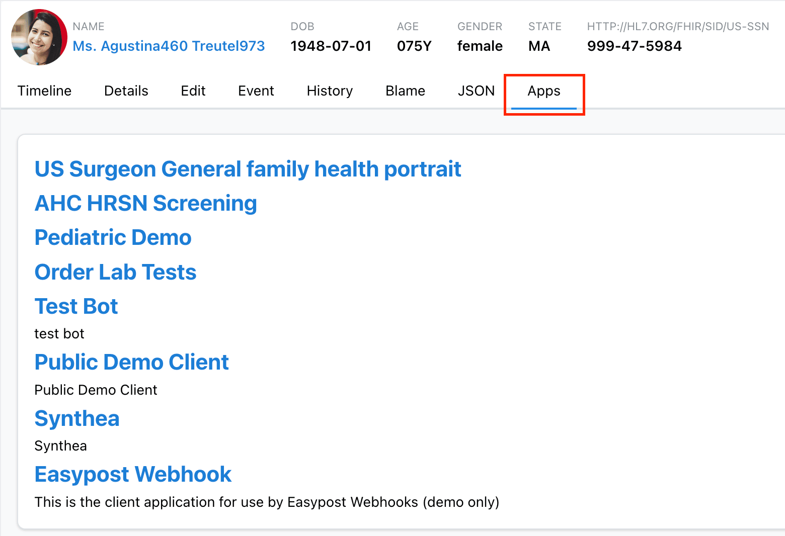

# The `Apps` Tab

The Medplum App allows for easy integration of workflows and third-party applications using the `Apps` tab. It is important to reiterate that the Medplum App is targeted towards developers and the `Apps` tab is primarily a tool to help with developer automation.

The `Apps` tab is available on the resource page of all resource types. At the moment, it serves `Questionnaire` resources and [SMART App Launch](/docs/integration/smart-app-launch), but additional functionality is being worked on to add to it.

## Navigating to the `Apps` Tab

To get to the `Apps` tab of, for example, a patient go to the `Patient` resources page by clicking Patient on the left sidebar of the app or navigating to https://app.medplum.com/Patient. 

Select the patient you would like to view to go to their resource page. From here, select the `Apps` tab from the array of tabs at the top of the page. 

Alternatively, you can navigate directly to this page at https://app.medplum.com/Patient/:id/apps.

## Questionnaires

The `Apps` tab of a resource will display all `Questionnaire` resources that are assigned to that `ResourceType` by the `Questionnaire.subjectType` field. For example, a `Patient` page will display all `Questionnaire` resources that are applicable to patients. 

This can streamline workflows and make it easier for users to find any forms or surveys they may need to complete.

## SMART App Launch

SMART App Launch allows you to easily launch third-party apps from within the Medplum App, while maintaining access to authorized data. This is currently available on the `Apps` tab of all `Patient` and `Encounter` resource pages on the Medplum App. 

When you launch an app from a `Patient` page using SMART, the app will have access to that patient's data. The specific data that the new app has access to can be configured so that only certain data is authorized to be shared. This allows for an easy and user-friendly integration of third-party apps with the Medplum App.

If you have set up an app with SMART, but do not see it in the `Apps` tab, it may not be configured correctly. For details on setup and configuration, see the [SMART App Launch Integration docs](/docs/integration/smart-app-launch).