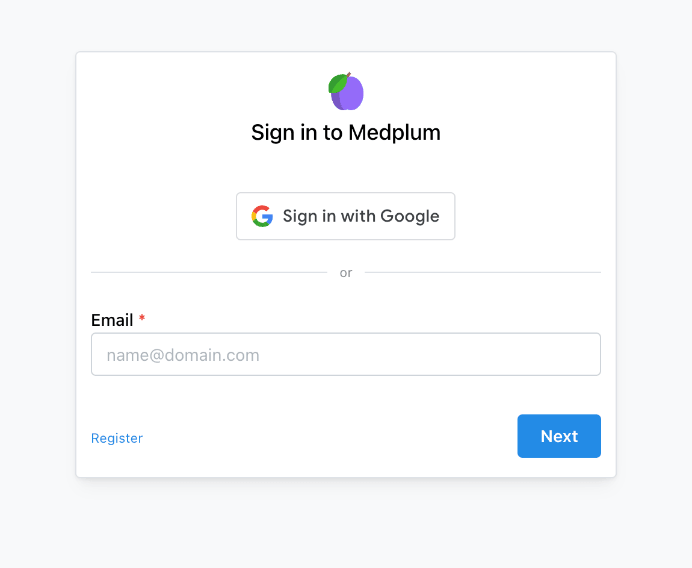

# The Sign In Page

Once a [`User`](/docs/api/fhir/medplum/user) accepts your invite, they will be able to log in to the [Medplum App](https://app.medplum.com) at https://app.medplum.com/signin.

If the [`User`](/docs/api/fhir/medplum/user) is a member of multiple [`Projects`](/docs/api/fhir/medplum/project), logging in will bring them to the Project Selector page. Choose a project to progress to it's homepage.

To switch between projects after you have logged in, you can use the [Profile Selector](/docs/app/app-introduction/index.md#profile-selector).

If the [`User`](/docs/api/fhir/medplum/user) is a member of only one [`Project`](/docs/api/fhir/medplum/project), they will progress directly from the sign in page to that project's homepage.

## Signing In as a Patient

By default the sign in page only allows [`Users`](/docs/api/fhir/medplum/user) to sign in if they are a [`Practitioner`](/docs/api/fhir/resources/practitioner). To allow [`Patients`](/docs/api/fhir/resources/patient) to sign in you will need to add the `project=:id` query param to the url. This ensures that [`Patients`](/docs/api/fhir/resources/patient) can only log in to a single project at a time. The full url will be as follows: https://app.medplum.com/signin?project=:id, where `:id` is the `id` of the [`Project`](/docs/api/fhir/medplum/project) they are logging into.
