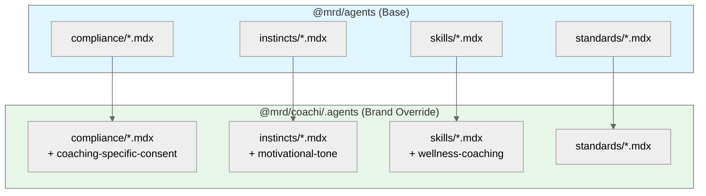

# Agent Configuration

## Overview

Agent configuration uses MDX files to define compliance rules, behavioral instincts, skills, and standards. This approach provides:

- **Rich documentation** with Markdown formatting
- **Interactive components** via JSX
- **Type-safe frontmatter** for metadata
- **Inheritance** from base definitions to brand-specific overrides

## Directory Structure

### Base Agent Definitions

Shared across all brands in `packages/agents/`:

```
packages/agents/
├── compliance/
│   ├── hipaa-phi-detection.mdx
│   ├── gdpr-consent-requirements.mdx
│   └── data-retention-policy.mdx
├── instincts/
│   ├── patient-safety-first.mdx
│   ├── privacy-by-default.mdx
│   └── audit-trail-always.mdx
├── skills/
│   ├── medical-terminology.mdx
│   ├── fhir-resource-mapping.mdx
│   └── clinical-decision-support.mdx
├── standards/
│   ├── hl7-fhir-r4.mdx
│   ├── icd-10-coding.mdx
│   └── snomed-ct-terminology.mdx
├── config.yaml
└── package.json
```

### Brand-Specific Overrides

Each brand can override or extend base definitions in `.agents/`:

```
packages/coachi/.agents/
├── compliance/
│   └── coaching-specific-consent.mdx    # Brand-specific rule
├── instincts/
│   └── motivational-tone.mdx            # Brand-specific behavior
├── skills/
│   └── wellness-coaching.mdx            # Brand-specific skill
├── standards/
│   └── .gitkeep
└── config.yaml                          # Extends base + brand overrides
```

## MDX File Format

### Frontmatter Schema

Every MDX agent file uses standardized frontmatter:

```yaml
---
id: hipaa-phi-detection              # Unique identifier
version: 1.2.0                       # Semantic version
category: compliance                 # compliance | instincts | skills | standards
status: active                       # active | deprecated | draft
triggers:                            # When this agent activates
  - patient-data
  - export
  - sharing
dependencies:                        # Other agents this requires
  - data-retention-policy
  - audit-trail-always
priority: critical                   # critical | high | medium | low
---
```

### Content Structure

```mdx
---
id: hipaa-phi-detection
version: 1.2.0
category: compliance
status: active
triggers:
  - patient-data
  - export
---

# HIPAA PHI Detection

## Purpose

This compliance rule ensures that Protected Health Information (PHI) is properly
identified and handled according to HIPAA regulations.

## Detection Patterns

The following data elements are considered PHI:

- Patient names
- Geographic data smaller than state
- Dates (except year) related to an individual
- Phone numbers, fax numbers, email addresses
- Social Security numbers
- Medical record numbers
- Health plan beneficiary numbers
- Account numbers
- Certificate/license numbers
- Vehicle identifiers and serial numbers
- Device identifiers and serial numbers
- Web URLs
- IP addresses
- Biometric identifiers
- Full-face photographs
- Any other unique identifying number or code

## Implementation

<ComplianceChecklist
  items={[
    { rule: "Scan all outbound data for PHI patterns", required: true },
    { rule: "Log PHI access attempts", required: true },
    { rule: "Encrypt PHI in transit and at rest", required: true },
    { rule: "Implement minimum necessary principle", required: true },
  ]}
/>

## Exceptions

PHI may be shared without patient authorization for:

1. Treatment purposes
2. Payment operations
3. Healthcare operations
4. Public health activities
5. Law enforcement (with proper documentation)

## Related Standards

- [GDPR Consent Requirements](/docs/agents/compliance/gdpr-consent-requirements)
- [Data Retention Policy](/docs/agents/compliance/data-retention-policy)
```

## Configuration YAML

### Base Configuration

`packages/agents/config.yaml`:

```yaml
# Base agent configuration for all brands
version: "1.0.0"
name: "@mrd/agents"

defaults:
  compliance:
    enforcement: strict
    audit: true
  instincts:
    priority: high
  skills:
    enabled: true
  standards:
    validation: required

enabled:
  compliance:
    - hipaa-phi-detection
    - gdpr-consent-requirements
    - data-retention-policy
  instincts:
    - patient-safety-first
    - privacy-by-default
    - audit-trail-always
  skills:
    - medical-terminology
    - fhir-resource-mapping
    - clinical-decision-support
  standards:
    - hl7-fhir-r4
    - icd-10-coding
    - snomed-ct-terminology
```

### Brand Configuration

`packages/coachi/.agents/config.yaml`:

```yaml
# Coachi-specific agent configuration
extends: "@mrd/agents"

brand: coachi
name: "Coachi"

overrides:
  compliance:
    - coaching-specific-consent      # Override with brand-specific rule
  instincts:
    - motivational-tone              # Add brand-specific behavior

enabled:
  skills:
    - wellness-coaching              # Add brand-specific skill

disabled:
  skills:
    - clinical-decision-support      # Not relevant for coaching platform

settings:
  compliance:
    enforcement: moderate            # Less strict for coaching context
  instincts:
    tone: supportive                 # Brand-specific tone setting
```

## Agent Categories

### Compliance

Rules that MUST be enforced for regulatory and legal requirements.

| Agent | Purpose | Triggers |
|-------|---------|----------|
| `hipaa-phi-detection` | Detect and protect PHI | `patient-data`, `export` |
| `gdpr-consent-requirements` | Ensure proper consent | `data-collection`, `sharing` |
| `data-retention-policy` | Enforce retention limits | `storage`, `deletion` |

### Instincts

Behavioral patterns that guide agent responses and decision-making.

| Agent | Purpose | Priority |
|-------|---------|----------|
| `patient-safety-first` | Prioritize patient safety in all decisions | Critical |
| `privacy-by-default` | Default to most private option | High |
| `audit-trail-always` | Log all significant actions | High |

### Skills

Capabilities and knowledge areas the agent can apply.

| Agent | Purpose | Dependencies |
|-------|---------|--------------|
| `medical-terminology` | Understand medical terms and abbreviations | None |
| `fhir-resource-mapping` | Map data to FHIR resources | `hl7-fhir-r4` |
| `clinical-decision-support` | Provide clinical recommendations | `medical-terminology` |

### Standards

Reference standards and specifications the agent follows.

| Agent | Purpose | Version |
|-------|---------|---------|
| `hl7-fhir-r4` | FHIR R4 specification compliance | R4 (4.0.1) |
| `icd-10-coding` | ICD-10 diagnosis coding | 2024 |
| `snomed-ct-terminology` | SNOMED CT clinical terminology | 2024-01 |

## Inheritance Model



The inheritance follows these rules:

1. **Base definitions** are loaded first from `@mrd/agents`
2. **Brand overrides** in `.agents/` replace or extend base definitions
3. **Same ID** in brand folder replaces base definition entirely
4. **New ID** in brand folder adds to available agents
5. **Disabled list** in config.yaml removes agents from availability

## Integration with Applications

Brand applications load agent configuration at runtime:

```typescript
// packages/coachi/lib/agents.ts
import { loadAgentConfig } from '@mrd/agents';

export const agentConfig = loadAgentConfig({
  base: '@mrd/agents',
  brand: './.agents',
});

// Access specific agents
const complianceRules = agentConfig.getCategory('compliance');
const activeSkills = agentConfig.getEnabled('skills');
```

## Best Practices

1. **Keep base agents generic** — Brand-specific logic belongs in `.agents/` overrides
2. **Version all changes** — Update version in frontmatter for audit trail
3. **Document triggers clearly** — Explicit triggers prevent unexpected activation
4. **Use dependencies** — Declare dependencies to ensure correct loading order
5. **Test inheritance** — Verify brand overrides work as expected before deployment
