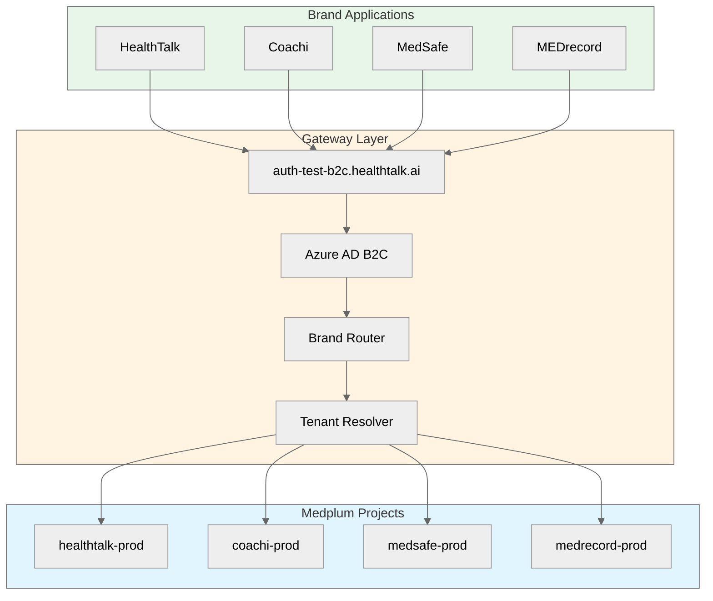
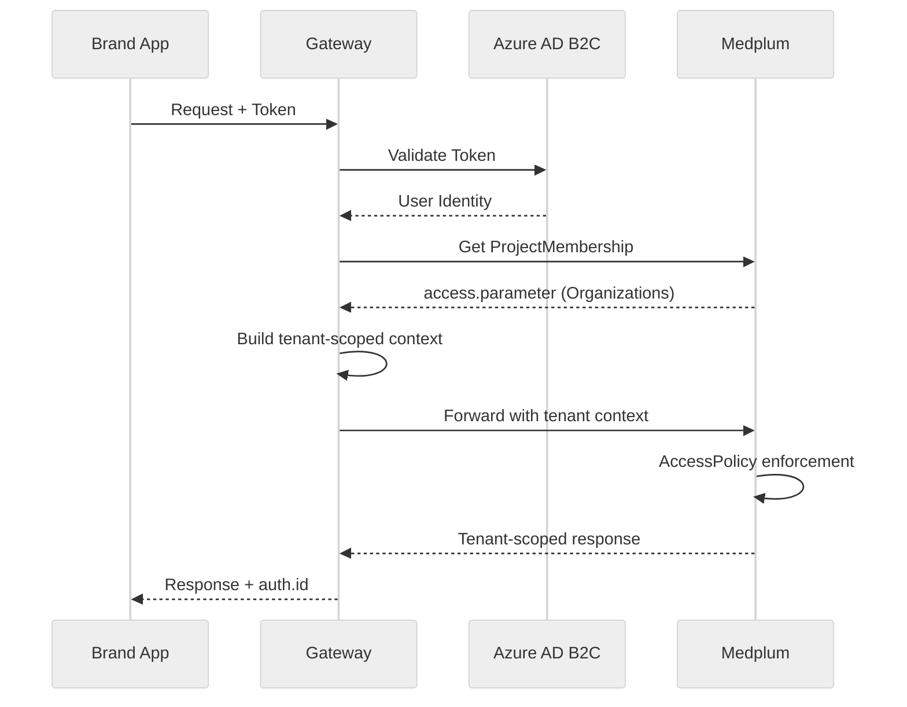

# Gateway Integration

## Overview

The HealthTalk Gateway (`auth-test-b2c.healthtalk.ai`) serves as the central authentication and routing layer for all brand applications. It provides:

- **Azure AD B2C authentication**
- **Brand routing** based on domain or token
- **Tenant resolution** from ProjectMembership
- **Request forwarding** to appropriate Medplum Projects

## Architecture



## Request Flow

### 1. Authentication

Every request must include a valid authentication token:

```typescript
// Server-side only - Next.js Route Handler
import { gatewayClient } from '@mrd/gateway-client';

export async function GET(request: Request) {
  const token = request.headers.get('Authorization');
  
  // Gateway validates token and returns user context
  const { user, brand, tenant } = await gatewayClient.authenticate(token);
  
  // user.id is verified from Gateway - use for all subsequent requests
  // ...
}
```

### 2. Brand Resolution

The Gateway determines the brand from:

1. **Request domain** (e.g., `coachi.healthtalk.ai` → Coachi)
2. **Token claims** (brand identifier in JWT)
3. **Explicit header** (`X-MRD-Brand: coachi`)

### 3. Tenant Resolution

Within a brand, the user's tenant(s) are resolved from their ProjectMembership:



## Gateway Client

The `@mrd/gateway-client` package provides type-safe access to the Gateway:

### Installation

```json
{
  "dependencies": {
    "@mrd/gateway-client": "workspace:*"
  }
}
```

### Server-Side Usage

```typescript
// IMPORTANT: Server-side only - never import in client components
import { createGatewayClient } from '@mrd/gateway-client';

const gateway = createGatewayClient({
  baseUrl: process.env.GATEWAY_URL,
  projectId: process.env.MEDPLUM_PROJECT_ID,
  clientId: process.env.MEDPLUM_CLIENT_ID,
  clientSecret: process.env.MEDPLUM_CLIENT_SECRET, // Server-side only
});

// All requests automatically include auth context
const patients = await gateway.search('Patient', {
  // Tenant scope is automatically applied based on user's ProjectMembership
});
```

### Authentication Verification

Every request MUST verify `auth.id` from the Gateway:

```typescript
// packages/coachi/app/api/patients/route.ts
import { gateway } from '@/lib/gateway';
import { NextResponse } from 'next/server';

export async function GET(request: Request) {
  try {
    // Gateway client automatically extracts and verifies auth.id
    const { auth } = await gateway.authenticate(request);
    
    if (!auth.id) {
      return NextResponse.json({ error: 'Unauthorized' }, { status: 401 });
    }
    
    // auth.id is verified - safe to proceed
    const patients = await gateway.search('Patient');
    
    return NextResponse.json(patients);
  } catch (error) {
    return NextResponse.json({ error: 'Unauthorized' }, { status: 401 });
  }
}
```

## Multi-Tenant Queries

The Gateway automatically applies tenant scope to all queries based on the user's ProjectMembership:

### Single-Tenant User

```typescript
// User belongs to Organization/clinic-amsterdam only
const patients = await gateway.search('Patient');
// Automatically adds: ?_compartment=Organization/clinic-amsterdam
```

### Multi-Tenant User

```typescript
// User belongs to Organization/clinic-amsterdam AND Organization/hospital-rotterdam
const patients = await gateway.search('Patient');
// Returns patients from BOTH organizations
// Based on ProjectMembership.access[].parameter
```

### Explicit Tenant Filter

```typescript
// Override to query specific tenant (must be in user's access list)
const patients = await gateway.search('Patient', {
  tenant: 'Organization/clinic-amsterdam',
});
```

## Security Requirements

### Server-Side Only

All Gateway operations MUST run server-side:

```typescript
// CORRECT: Server Component
async function PatientList() {
  const patients = await gateway.search('Patient');
  return <ul>{patients.map(p => <li key={p.id}>{p.name}</li>)}</ul>;
}

// CORRECT: Route Handler
export async function GET() {
  const patients = await gateway.search('Patient');
  return Response.json(patients);
}

// CORRECT: Server Action
'use server';
export async function getPatients() {
  return await gateway.search('Patient');
}

// WRONG: Client Component - will fail
'use client';
function PatientList() {
  const patients = gateway.search('Patient'); // ERROR: Cannot use on client
}
```

### Environment Variables

```bash
# Server-side only (no NEXT_PUBLIC_ prefix)
GATEWAY_URL=https://auth-test-b2c.healthtalk.ai
MEDPLUM_PROJECT_ID=coachi-prod
MEDPLUM_CLIENT_ID=xxx
MEDPLUM_CLIENT_SECRET=xxx

# Client-safe (with NEXT_PUBLIC_ prefix)
NEXT_PUBLIC_BRAND=coachi
NEXT_PUBLIC_BRAND_NAME="Coachi"
```

### Request Verification Checklist

Every API route MUST verify:

| Check | Implementation |
|-------|----------------|
| Token present | `request.headers.get('Authorization')` |
| Token valid | `gateway.authenticate(request)` |
| User ID verified | `auth.id` is present and not null |
| Tenant in scope | Automatic via Gateway, or explicit check |

## Error Handling

```typescript
import { GatewayError } from '@mrd/gateway-client';

try {
  const result = await gateway.search('Patient');
} catch (error) {
  if (error instanceof GatewayError) {
    switch (error.code) {
      case 'UNAUTHORIZED':
        // Token invalid or expired
        return redirect('/login');
      case 'FORBIDDEN':
        // User lacks access to requested tenant
        return NextResponse.json({ error: 'Access denied' }, { status: 403 });
      case 'TENANT_NOT_FOUND':
        // Requested tenant doesn't exist or user not enrolled
        return NextResponse.json({ error: 'Tenant not found' }, { status: 404 });
      default:
        throw error;
    }
  }
  throw error;
}
```

## Testing

### Mock Gateway for Development

```typescript
// packages/coachi/lib/gateway.ts
import { createGatewayClient, createMockGateway } from '@mrd/gateway-client';

export const gateway = process.env.NODE_ENV === 'development'
  ? createMockGateway({
      mockUser: {
        id: 'dev-user-1',
        name: 'Dev User',
        tenants: ['Organization/dev-clinic'],
      },
    })
  : createGatewayClient({
      baseUrl: process.env.GATEWAY_URL!,
      projectId: process.env.MEDPLUM_PROJECT_ID!,
      clientId: process.env.MEDPLUM_CLIENT_ID!,
      clientSecret: process.env.MEDPLUM_CLIENT_SECRET!,
    });
```

### Integration Tests

```typescript
import { createTestGateway } from '@mrd/gateway-client/testing';

describe('Patient API', () => {
  const gateway = createTestGateway({
    project: 'coachi-test',
    user: { id: 'test-user', tenants: ['Organization/test-clinic'] },
  });

  it('returns only tenant-scoped patients', async () => {
    const patients = await gateway.search('Patient');
    
    patients.forEach(patient => {
      expect(patient.meta?.compartment).toContainEqual({
        reference: 'Organization/test-clinic',
      });
    });
  });
});
```
