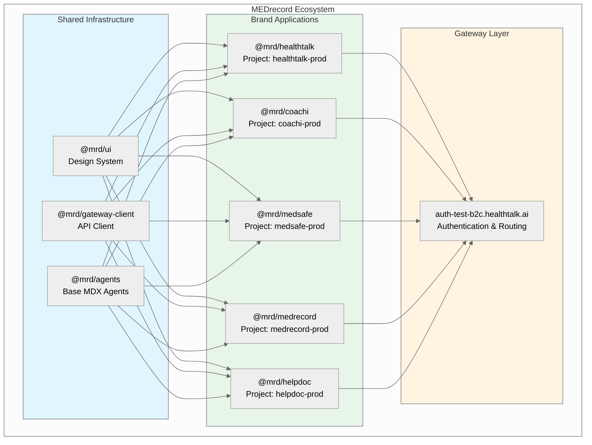
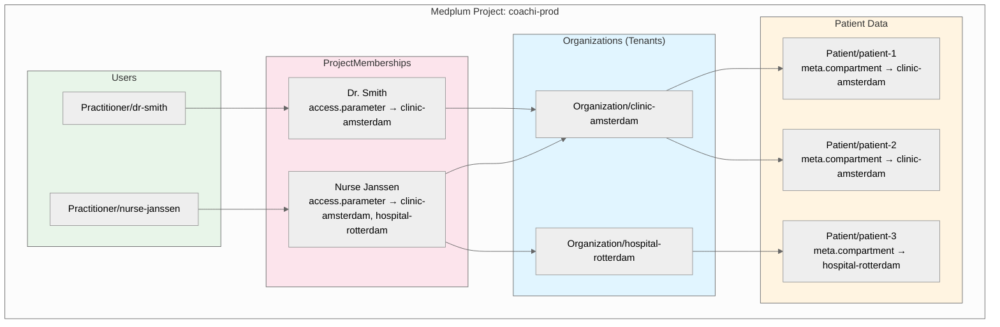
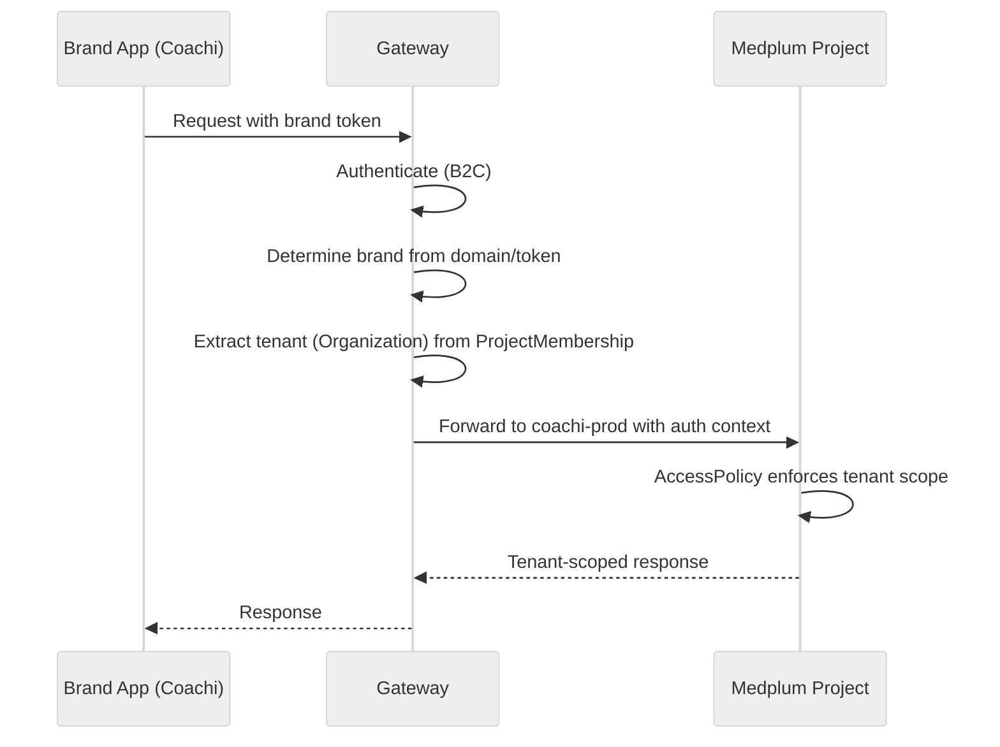

# Multi-Brand Architecture

## Overview

The MEDrecord ecosystem consists of multiple independent brands, each serving different healthcare use cases while sharing common infrastructure. This architecture leverages Medplum's native multi-tenant capabilities to ensure complete data isolation between brands and organizations.

### Brand vs Organization vs Project

Understanding the hierarchy is critical for correct implementation:

| Level | Medplum Concept | MEDrecord Usage | Example |
|-------|-----------------|-----------------|---------|
| **Brand** | Project | Independent application with its own domain, branding, and Medplum Project | HealthTalk, Coachi, MedSafe |
| **Tenant** | Organization | Customer/clinic within a brand, uses `meta.compartment` for data isolation | Clinic Amsterdam, Hospital Rotterdam |
| **User** | ProjectMembership | User access scoped to specific Organizations via `access.parameter` | Dr. Smith at Clinic Amsterdam |



## Package Structure

### Shared Packages (Brand-Agnostic)

```
packages/
├── ui/                              # @mrd/ui
│   ├── src/
│   │   ├── globals.css              # Base design tokens
│   │   ├── themes/
│   │   │   ├── healthtalk.css       # Brand-specific colors
│   │   │   ├── coachi.css
│   │   │   ├── medsafe.css
│   │   │   ├── medrecord.css
│   │   │   └── helpdoc.css
│   │   ├── components/              # shadcn/ui components
│   │   └── lib/
│   │       └── utils.ts             # cn() helper, utilities
│   └── package.json
│
├── gateway-client/                  # @mrd/gateway-client
│   ├── src/
│   │   ├── client.ts                # Server-side fetch wrapper
│   │   ├── auth.ts                  # Authentication utilities
│   │   └── types.ts                 # Shared API types
│   └── package.json
│
└── agents/                          # @mrd/agents
    ├── compliance/
    │   └── *.mdx
    ├── instincts/
    │   └── *.mdx
    ├── skills/
    │   └── *.mdx
    ├── standards/
    │   └── *.mdx
    ├── config.yaml
    └── package.json
```

### Brand Packages (Per-Application)

Each brand follows the same template structure:

```
packages/healthtalk/                 # @mrd/healthtalk
├── app/
│   ├── layout.tsx                   # Imports @mrd/ui + brand theme
│   ├── page.tsx
│   └── api/                         # Server-side route handlers
│       └── [...]/route.ts
├── .agents/                         # Brand-specific agent overrides
│   ├── compliance/
│   │   └── *.mdx
│   ├── instincts/
│   │   └── *.mdx
│   ├── skills/
│   │   └── *.mdx
│   ├── standards/
│   │   └── *.mdx
│   └── config.yaml                  # extends: "@mrd/agents"
├── next.config.ts
├── tailwind.config.ts
├── .env.local                       # Brand-specific environment
└── package.json
```

## Medplum Integration

### Project-Level Isolation (Brands)

Each brand operates within its own Medplum Project. This provides:

- **Complete data isolation** between brands
- **Independent configuration** (AccessPolicies, Bots, Subscriptions)
- **Separate FHIR endpoints** per brand

### Organization-Level Multi-Tenancy (Within Brands)

Within each brand, Organizations represent tenants (clinics, hospitals, departments). This uses Medplum's native multi-tenant access control:



## Gateway Flow

All brand applications communicate through the HealthTalk Gateway for authentication and API routing:



## Environment Configuration

Each brand requires specific environment variables:

```bash
# Brand identification
NEXT_PUBLIC_BRAND=coachi
NEXT_PUBLIC_BRAND_NAME="Coachi"

# Gateway (shared across all brands)
GATEWAY_URL=https://auth-test-b2c.healthtalk.ai

# Medplum Project (brand-specific)
MEDPLUM_PROJECT_ID=coachi-prod
MEDPLUM_CLIENT_ID=xxx
MEDPLUM_CLIENT_SECRET=xxx  # Server-side only, never expose to client
```

## Security Requirements

All brand applications MUST follow these security patterns:

| Requirement | Implementation |
|-------------|----------------|
| Server-side only backend operations | Use Next.js Server Components, Server Actions, Route Handlers |
| No direct client-to-Medplum calls | All requests go through Gateway via `@mrd/gateway-client` |
| Tenant-scoped queries | Every request verified with `auth.id` from Gateway |
| No secrets in client code | Environment variables without `NEXT_PUBLIC_` prefix |

## Creating a New Brand

To create a new brand application:

1. **Copy the template** from an existing brand package
2. **Update package.json** with new brand name (`@mrd/newbrand`)
3. **Create brand theme** in `@mrd/ui/themes/newbrand.css`
4. **Configure environment** with brand-specific Medplum Project
5. **Customize `.agents/`** folder with brand-specific MDX overrides
6. **Create Medplum Project** for the brand with appropriate AccessPolicies

See [Agent Configuration](/docs/architecture/agent-configuration) for details on customizing agent behavior per brand.
