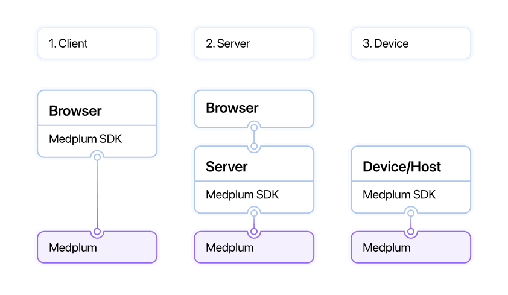
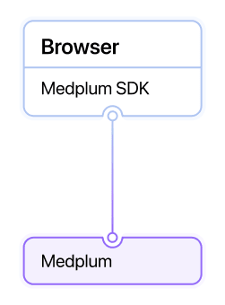
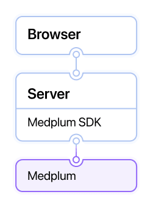
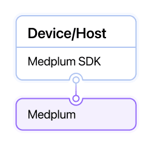

# Auth Integration Patterns

Medplum supports **three primary authentication integration patterns**, summarized by the following diagram. Each has its own use case. An implementation can use multiple or all patterns for different use cases.

This diagram shows a high level summary of the three common patterns. The [Medplum Typescript SDK](/docs/sdk/classes/MedplumClient#authentication) can (optionally) be used in all three patterns.

## Client Side Authentication

Client side authentication is when a **user facing application**, usually running in a web browser connects directly to Medplum to request, create or update data. This integration pattern supports sophisticated configurations and has the best the response times. A summary is shown in the diagram below.

Client side authentication enables the following advanced features:

- Enable [external identity providers](/docs/auth/external-identity-providers), like [Google](/docs/auth/google-auth), [Okta](/docs/auth/okta-auth) and others
- Patient authentication
- [IP Address restriction](/docs/auth/ip-access-rules) for logins
- Use of Medplum [React components](/docs/ui-components) such as the [Signin](https://storybook.medplum.com/?path=/story/medplum-signinform--basic) and [Register](https://storybook.medplum.com/?path=/story/medplum-registerform--basic)
- Rate limits will be enforced for client authentication, as it is assumed that traffic is coming from end users

The [Medplum Typescript SDK](/docs/sdk/classes/MedplumClient#authentication) can be used in the browser to enable client side authentication of different kinds, for example [signInWithExternalAuth](/docs/sdk/classes/MedplumClient#signinwithexternalauth).

## Server Side Authentication

Server side authentication is when a **user facing application proxies through a host** to connect to Medplum. This integration can be useful when adding Medplum functionality to a legacy application.

In an integration of this kind, each server can manage credentials and tokens, and use the Medplum SDK to authenticate. For example, create [Client Credentials](/docs/auth/client-credentials) and store the id and secret with the other secrets used by your application. Using the [Typescript SDK](/docs/sdk/classes/MedplumClient), maintain an instance of MedplumClient as part of your running application and use the [startClientLogin](docs/sdk/classes/MedplumClient#startclientlogin) call to start an [active login](/docs/sdk/classes/MedplumClient#getactivelogin). The client will continue to refresh the connection if it is in active use, storing the access token in local storage on the server.

When looking at resource [history](/docs/sdk/classes/MedplumClient#readhistory) and AuditEvents for this type of implementation, actions will be taken on behalf of the `ClientApplication` that the server is using to connect.

## Device/Host Authentication

Device authentication is designed for true machine connectivity, for example connecting a laboratory analyzer machine, or a CI/CD pipeline to Medplum. This is distinct from server side authentication, in which the server a proxy for a user facing application.

For machine connectivity, we encourage use of [ClientCredentials](/docs/auth/client-credentials) with tightly scoped [access controls](/docs/auth/access-control), giving minimal access to the host at the edge.

If OAuth2 client credentials based authentication is not an option due to device limitations, basic authentication can be used to connect to Medplum. In general, OAuth2 is preferred to basic authentication, and basic authentication should only be used when the edge environment will not tolerate OAuth2. For example, [consuming webhooks](/docs/bots/consuming-webhooks) is a use case where Basic Authentication makes sense.
