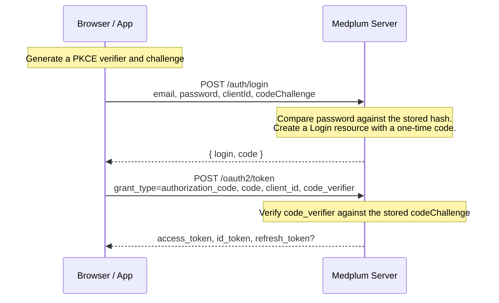

# Embedded Login

## Introduction

[Using Medplum as IDP](/docs/auth/medplum-as-idp) describes the OAuth2 Authorization Code flow using a full browser redirect: your user leaves your application, authenticates on a Medplum-hosted page, and is redirected back with a code.

**Embedded login** is the same underlying OAuth2 Authorization Code flow with PKCE — it just skips the redirect. The email/password form is rendered directly inside your own application, using the `<SignInForm>` React component or the [`startLogin()`](/docs/sdk/core.medplumclient.startlogin) SDK method directly. Your user never sees another domain.

Choose embedded login when you want full control over your login page's branding and don't want a visible navigation away from your app. Choose the [redirect flow](/docs/auth/medplum-as-idp) instead if you'd rather the password never be typed into your own application's code at all — since Medplum's hosted page runs on its own domain, a vulnerability in your app can't expose credentials it never saw.

## How it works

Both variants use the same two-request shape: authenticate to get a one-time code, then redeem that code for tokens. The difference is only in how request 1 happens — as a direct API call instead of a browser navigation.



The password is only ever checked in the first request. The second request never sees it — it only carries the one-time `code` plus the PKCE `code_verifier` needed to redeem it.

## Prerequisites

Embedded login uses the same [`ClientApplication`](/docs/auth/medplum-as-idp#create-a-client-application) setup as the redirect flow. If you haven't created one yet, follow the **Create a Client Application** steps on that page first.

## Request 1: authenticate with credentials

Call `POST /auth/login` with the user's credentials:

| Field                                  | Description                                                     |
| :-------------------------------------- | :---------------------------------------------------------------- |
| `email`                                | The user's email address                                          |
| `password`                             | The user's password                                               |
| `clientId`                             | (Optional) Your `ClientApplication` ID                            |
| `codeChallenge` / `codeChallengeMethod` | The PKCE challenge for this login attempt (see [PKCE](#pkce)) |

On success, the response contains a `login` ID and a one-time `code`:

```json
{
  "login": "1a2b3c4d-...",
  "code": "..."
}
```

If the user has multi-factor authentication enrolled, or belongs to more than one project, the response looks different — see [Multi-factor authentication and multiple projects](#multi-factor-authentication-and-multiple-projects) below.

## Request 2: redeem the code

Call [`POST /oauth2/token`](/docs/api/oauth/token) with the code from request 1:

| Field           | Value                                    |
| :--------------- | :---------------------------------------- |
| `grant_type`    | Fixed value: `authorization_code`         |
| `code`          | The one-time code from request 1          |
| `client_id`     | Your `ClientApplication` ID               |
| `code_verifier` | The PKCE verifier that produced the `codeChallenge` sent in request 1 |

A successful response contains your tokens — see [Tokens](#tokens) below.

## PKCE

Both requests are bound together by [PKCE](https://www.rfc-editor.org/rfc/rfc7636) (Proof Key for Code Exchange), so that the `code` returned by request 1 can only be redeemed by whoever started the login attempt.

1. **Before request 1**, generate a random `code_verifier` and keep it locally. Hash it with SHA-256 to produce the `codeChallenge` sent to `/auth/login`.
2. Medplum stores that `codeChallenge` alongside the `Login` it creates. It never sees the raw verifier at this point.
3. **In request 2**, send the original, un-hashed `code_verifier` in the token request body.
4. Medplum hashes the verifier you just sent and checks it matches the `codeChallenge` stored in step 2. A mismatch is rejected.

If you use the Medplum SDK (`startLogin()` or `<SignInForm>`), this is handled for you automatically — the verifier is generated, stored, and replayed without any code on your part.

:::note[PKCE is required by default]
A `ClientApplication` can opt out of requiring PKCE by setting `pkceOptional: true`, in which case a client secret can be used instead. This isn't recommended for browser-based applications, since a secret embedded in client-side code isn't actually secret.
:::

## Multi-factor authentication and multiple projects

Request 1's response isn't always `{ login, code }`. A few other cases are possible before a code is issued:

| Response field      | Meaning                                                    | What to do next                              |
| :-------------------- | :------------------------------------------------------------ | :---------------------------------------------- |
| `mfaRequired`        | The user has MFA enrolled and must provide a code             | `POST /auth/mfa/verify`                        |
| `mfaEnrollRequired`  | The project requires MFA and the user hasn't enrolled yet      | `POST /auth/mfa/login-enroll` (response includes a TOTP enrollment URI and QR code) |
| `memberships`        | The user belongs to more than one project                     | `POST /auth/profile`, naming which membership to use |

Each of these follow-up calls returns the same shape as request 1 — either another prompt, or the `{ login, code }` you need to move on to request 2.

See [Multi-Factor Authentication](/docs/auth/mfa) for full details on the MFA enrollment and verification flow.

## Tokens

A successful token exchange returns:

| Token           | Contents                                                      |
| :--------------- | :---------------------------------------------------------------- |
| `access_token`  | A JWT used as a `Bearer` token on every subsequent API request      |
| `id_token`      | OpenID Connect identity claims for the logged-in user (`fhirUser`, `auth_time`, and `email` if the `email` scope was requested) |
| `refresh_token` | Present only if requested — see below                             |

A `refresh_token` is included only when one of the following is true: the request included the `offline_access` scope, or your `ClientApplication`'s registered grant types include `refresh_token`. For self-hosted, logins to a super admin project never receive a refresh token regardless of these settings.

## Using the SDK

The `<SignInForm>` React component handles both requests, PKCE, and the multi-factor/multiple-project branches automatically:

```tsx
<SignInForm onSuccess={() => navigate('/')?.catch(console.error)}>
  <Logo size={32} />
  <h1>Sign in to Foo Medical</h1>
</SignInForm>
```

If you're not using React, call [`startLogin()`](/docs/sdk/core.medplumclient.startlogin) directly with the `MedplumClient`, and handle the response cases described above yourself.

## See Also

- [Using Medplum as IDP](/docs/auth/medplum-as-idp) — the full-redirect variant of this same flow
- [Multi-Factor Authentication](/docs/auth/mfa)
- [`/oauth2/token` API reference](/docs/api/oauth/token)
