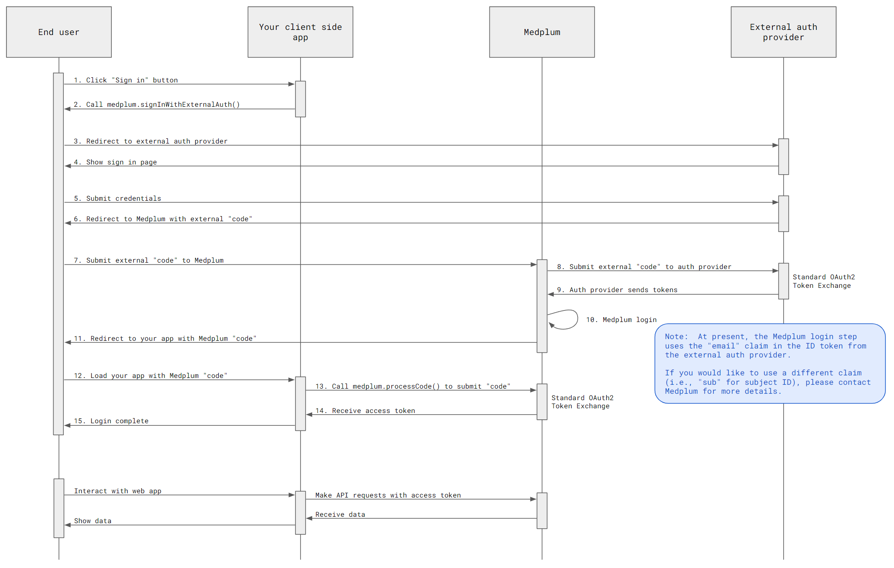

import ExampleCode from '!!raw-loader!@site/../examples/src/auth/external-identity-providers.ts';
import MedplumCodeBlock from '@site/src/components/MedplumCodeBlock';

# External Identity Providers

Along with [Google Authentication](/docs/auth/google-auth), Medplum supports other external identity providers using the OAuth2 protocol such as Auth0 and AWS Cognito for end user authentication. This is sometimes known as "Federated Identities".

## Auth flow

When an end user authenticates with your client-side web application, we will use the following authentication flow:



[Click to enlarge](./external-identity-providers.webp)

## Example repo

Medplum provides a minimal example application which demonstrates using Auth0 as an external identity provider. The example is approximately 100 lines of TypeScript code, and can be used as a starting point for any standard OAuth2/OpenID identity provider.

> [https://github.com/medplum/medplum-client-external-idp-demo](https://github.com/medplum/medplum-client-external-idp-demo)

## Setup

Setup your external authentication provider (Auth0, AWS Cognito, Okta, etc). Use "https://api.medplum.com/auth/external" as the "redirect URI" (also known as the "callback URL" in some systems).

Also make sure that your provider accepts the `profile` OIDC scope.

Note the following details:

- Authorize URL
- Token URL
- UserInfo URL
- Client ID
- Client secret

## Setup your Medplum account

- [Register for a Medplum account](/docs/tutorials/register)
- Create a `ClientApplication`
- Set the "Redirect URI" to "http://localhost:8000/"
- Add an external identity provider with the details from above

## User accounts and project membership

External identity providers authenticate users, but **Medplum still requires a user and project membership** before the login can succeed. Medplum will not automatically create users from external IdP tokens.

When an external token is verified, Medplum:

- Looks up the user by **email** (default), or
- Looks up the user by **external ID** (when `ClientApplication.identityProvider.useSubject` is `true`), matching the IdP `sub` claim to `ProjectMembership.externalId`.

To prepare users for external login:

1. Decide how users will be identified:
   - **By email** (default): make sure your IdP issues an `email` claim and you request the `email` scope.
   - **By external ID/subject**: set `ClientApplication.identityProvider.useSubject` to `true` and ensure you know the IdP subject that will be used for each user (for example, the portion after a prefix like `google-oauth2|`).
2. Invite users to your project using the `/admin/projects/{projectId}/invite` endpoint:
   - Email-based invite:

     ```bash
     curl "https://${baseUrl}/admin/projects/${projectId}/invite" \
       -H "Authorization: Bearer ${accessToken}" \
       -H "Content-Type: application/json" \
       --data-raw '{
         "resourceType": "Patient",
         "firstName": "Alice",
         "lastName": "Example",
         "email": "alice@example.com"
       }'
     ```

   - External ID-based invite (for `useSubject: true`):

     ```bash
     curl "https://${baseUrl}/admin/projects/${projectId}/invite" \
       -H "Authorization: Bearer ${accessToken}" \
       -H "Content-Type: application/json" \
       --data-raw '{
         "resourceType": "Patient",
         "firstName": "Alice",
         "lastName": "Example",
         "externalId": "IDP_SUBJECT_VALUE"
       }'
     ```

See [Using External IDs](/docs/user-management/external-ids) for more details on `useSubject` and how `externalId` is stored on the project membership.

## Start the flow

The [MedplumClient](/docs/sdk/core.medplumclient) TypeScript class provides a [`signInWithExternalAuth`](/docs/sdk/core.medplumclient.signinwithexternalauth) convenience method:

<MedplumCodeBlock language="ts" selectBlocks="signInWithExternalAuth" showLineNumbers>
  {ExampleCode}
</MedplumCodeBlock>

## Handle the code

When the external identity provider flow redirects back to your web application, it will include a `code` query parameter. This code can be exchanged for a Medplum access token.

The [MedplumClient](/docs/sdk/core.medplumclient) TypeScript class provides a [`processCode`](/docs/sdk/core.medplumclient.processcode) convenience method:

<MedplumCodeBlock language="ts" selectBlocks="processCode" showLineNumbers>
  {ExampleCode}
</MedplumCodeBlock>

After the code is processed, the Medplum access token will be stored in the browser's local storage. The `MedplumClient` will automatically use the access token for all subsequent API calls.

## PKCE configuration

External IdP flows can use [PKCE](https://datatracker.ietf.org/doc/html/rfc7636) on either or both of:

- The **Medplum** authorization code flow (`/oauth2/authorize` → `/oauth2/token`), and
- The **external IdP** authorization code flow (`authorizeUrl` → `tokenUrl`).

Medplum has three relevant knobs:

- `MedplumClient.signInWithExternalAuth(authorizeUrl, clientId, redirectUri, baseLogin, pkceEnabled?)`
  - When `pkceEnabled` is omitted or `true`, Medplum generates a `code_challenge` / `code_verifier` pair and stores the verifier in `sessionStorage`.
- `ClientApplication.identityProvider.usePkce`
  - When `true`, Medplum will include `code_verifier` when exchanging the external IdP code at `tokenUrl`.
  - When `false`, Medplum uses a simple client-secret–based code exchange against the external IdP.
- `ClientApplication.pkceOptional`
  - When `true`, Medplum’s own `/oauth2/token` endpoint will accept authorization codes **with or without** PKCE context.
  - When `false`, PKCE is required for the Medplum code exchange.

Common configurations:

- **Simple external IdP (no PKCE at IdP)**:
  - `signInWithExternalAuth(..., false)` (no PKCE sent to the IdP).
  - `identityProvider.usePkce = false`.
  - `ClientApplication.pkceOptional = true` (Medplum will not require PKCE for the internal `/oauth2/token` step).
- **End‑to‑end PKCE**:
  - `signInWithExternalAuth(... /* pkceEnabled defaults to true */)`.
  - `identityProvider.usePkce = true` (if your IdP supports PKCE on the token endpoint).
  - `ClientApplication.pkceOptional = false` (Medplum will enforce PKCE for `/oauth2/token`).

If you see errors such as `"Missing verification context"` or `"Missing code verifier"` from `/oauth2/token`, check that your `pkceEnabled` flag, `identityProvider.usePkce`, and `ClientApplication.pkceOptional` settings are consistent.

## FAQ

### AWS Cognito

- (If using the Cognito's hosted UI) Set the "redirect uri" by navigating to: Amazon Cognito > User Pools > [Your pool] > [Your App Client] > Edit Hosted UI > Allowed callback URLs
- By default, Cognito does not include the `profile` scope. You can add this navigating to: Amazon Cognito > User Pools > [Your pool] > [Your App Client] > Edit Hosted UI > OpenID Connect Scopes
- To disable PKCE for Cognito login, do the following:
  - In your client application, pass in `false` for the `pkceEnabled` parameter of `signInWithExternalAuth`.
  ```ts
  medplum.signInWithExternalAuth(
    EXTERNAL_AUTHORIZE_URL,
    EXTERNAL_CLIENT_ID,
    EXTERNAL_REDIRECT_URI,
    {
      projectId: MEDPLUM_PROJECT_ID,
      clientId: MEDPLUM_CLIENT_ID,
      redirectUri: WEB_APP_REDIRECT_URI,
    },
    false,
  ),
  ```
  - In the Medplum App, navigate to your [ClientApplication](https://app.medplum.com/ClientApplication) > Edit and set "PKCE Optional" to `true`
