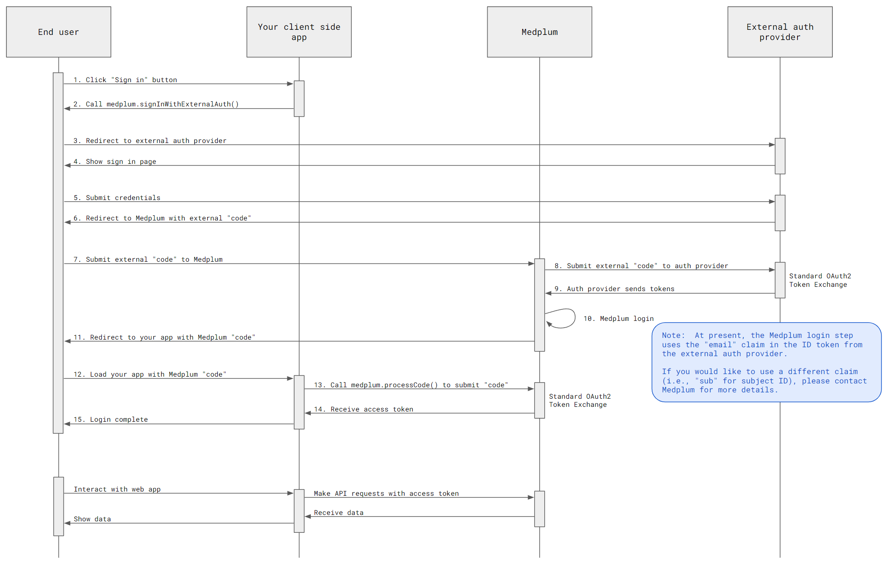

import ExampleCode from '!!raw-loader!@site/../examples/src/auth/external-identity-providers.ts';
import MedplumCodeBlock from '@site/src/components/MedplumCodeBlock';

# External Identity Providers

Along with [Google Authentication](/docs/auth/google-auth), Medplum supports other external identity providers using the OAuth2 protocol such as Auth0 and AWS Cognito for end user authentication. This is sometimes known as "Federated Identities".

## IDP Routing Strategies

When using external identity providers, you need to decide how to route users to the correct IDP. Medplum supports two primary strategies:

### 1. App-based Routing (Client ID)

In this model, the Identity Provider is determined by the application the user is logging into. This is configured on the `ClientApplication` resource.

*   **How it works:** You configure specific IDP details (Authorize URL, Client ID, etc.) on your Medplum `ClientApplication`.
*   **Use Case:** You have a "Patient App" that uses Auth0 for all users, and a separate "Provider App" that uses Okta.
*   **Setup:** Follow the [Setup](#setup) instructions below to configure the IDP on your `ClientApplication`.

### 2. Domain-based Routing (Email Domain)

In this model, the Identity Provider is determined by the user's email address. This is configured using [Domain Configuration](/docs/auth/domain-level-identity-providers).

*   **How it works:** You map an email domain (e.g., `hospital.com`) to an IDP. When a user enters their email, Medplum routes them to that IDP.
*   **Use Case:** You have enterprise customers who want their employees to log in with their corporate credentials (SSO), regardless of which app they are using.
*   **Setup:** See the [Domain-level Identity Providers](/docs/auth/domain-level-identity-providers) guide.

## Auth flow

When an end user authenticates with your client-side web application, we will use the following authentication flow:



[Click to enlarge](./external-identity-providers.webp)

## Example repo

Medplum provides a minimal example application which demonstrates using Auth0 as an external identity provider. The example is approximately 100 lines of TypeScript code, and can be used as a starting point for any standard OAuth2/OpenID identity provider.

> [https://github.com/medplum/medplum-client-external-idp-demo](https://github.com/medplum/medplum-client-external-idp-demo)

## Setup

Setup your external authentication provider (Auth0, AWS Cognito, Okta, etc). Use "https://api.medplum.com/auth/external" as the "redirect URI" (also known as the "callback URL" in some systems).

Also make sure that your provider accepts the `profile` OIDC scope.

Note the following details:

- Authorize URL
- Token URL
- UserInfo URL
- Client ID
- Client secret

Setup your Medplum account:

- [Register for a Medplum account](/docs/tutorials/register)
- Create a `ClientApplication`
- Set the "Redirect URI" to "http://localhost:8000/"
- Add an external identity provider with the details from above

## Start the flow

The [MedplumClient](/docs/sdk/core.medplumclient) TypeScript class provides a [`signInWithExternalAuth`](/docs/sdk/core.medplumclient.signinwithexternalauth) convenience method:

<MedplumCodeBlock language="ts" selectBlocks="signInWithExternalAuth" showLineNumbers>
  {ExampleCode}
</MedplumCodeBlock>

## Handle the code

When the external identity provider flow redirects back to your web application, it will include a `code` query parameter. This code can be exchanged for a Medplum access token.

The [MedplumClient](/docs/sdk/core.medplumclient) TypeScript class provides a [`processCode`](/docs/sdk/core.medplumclient.processcode) convenience method:

<MedplumCodeBlock language="ts" selectBlocks="processCode" showLineNumbers>
  {ExampleCode}
</MedplumCodeBlock>

After the code is processed, the Medplum access token will be stored in the browser's local storage. The `MedplumClient` will automatically use the access token for all subsequent API calls.

## FAQ

### AWS Cognito

- (If using the Cognito's hosted UI) Set the "redirect uri" by navigating to: Amazon Cognito > User Pools > [Your pool] > [Your App Client] > Edit Hosted UI > Allowed callback URLs
- By default, Cognito does not include the `profile` scope. You can add this navigating to: Amazon Cognito > User Pools > [Your pool] > [Your App Client] > Edit Hosted UI > OpenID Connect Scopes
- To disable PKCE for Cognito login, do the following:
  - In your client application, pass in `false` for the `pkceEnabled` parameter of `signInWithExternalAuth`.
  ```ts
  medplum.signInWithExternalAuth(
    EXTERNAL_AUTHORIZE_URL,
    EXTERNAL_CLIENT_ID,
    EXTERNAL_REDIRECT_URI,
    {
      projectId: MEDPLUM_PROJECT_ID,
      clientId: MEDPLUM_CLIENT_ID,
      redirectUri: WEB_APP_REDIRECT_URI,
    },
    false,
  ),
  ```
  - In the Medplum App, navigate to your [ClientApplication](https://app.medplum.com/ClientApplication) > Edit and set "PKCE Optional" to `true`
