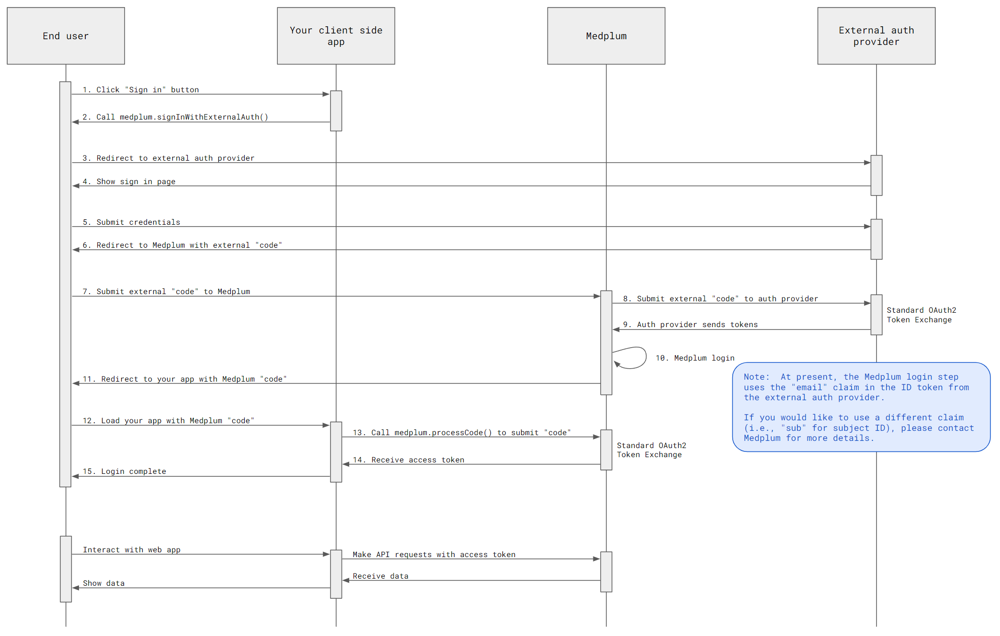

import ExampleCode from '!!raw-loader!@site/../examples/src/auth/external-identity-providers.ts';
import MedplumCodeBlock from '@site/src/components/MedplumCodeBlock';

# External Identity Providers

Medplum supports external identity providers such as Auth0 and AWS Cognito for end user authentication. This is sometimes known as "Federated Identities".

## Auth flow

When an end user authenticates with your client-side web application, we will use the following authentication flow:

[Click to enlarge](./external-identity-providers.webp)

## Example repo

Medplum provides a minimal example application which demonstrates using Auth0 as an external identity provider. The example is approximately 100 lines of TypeScript code, and can be used as a starting point for any standard OAuth2/OpenID identity provider.

> [https://github.com/medplum/medplum-client-external-idp-demo](https://github.com/medplum/medplum-client-external-idp-demo)

## Setup

Setup your external authentication provider (Auth0, AWS Cognito, Okta, etc). Use "https://api.medplum.com/auth/external" as the "redirect URI". Note the following details:

- Authorize URL
- Token URL
- UserInfo URL
- Client ID
- Client secret

Setup your Medplum account:

- [Register for a Medplum account](/docs/tutorials/register)
- Create a `ClientApplication`
- Set the "Redirect URI" to "http://localhost:8000/"
- Add an external identity provider with the details from above

## Start the flow

The [MedplumClient](/docs/sdk/classes/MedplumClient) TypeScript class provides a `signInWithExternalAuth` convenience method:

<MedplumCodeBlock language="ts" selectBlocks="signInWithExternalAuth" showLineNumbers>
  {ExampleCode}
</MedplumCodeBlock>

## Handle the code

When the external identity provider flow redirects back to your web application, it will include a `code` query parameter. This code can be exchanged for a Medplum access token.

The [MedplumClient](/docs/sdk/classes/MedplumClient) TypeScript class provides a `processCode` convenience method:

<MedplumCodeBlock language="ts" selectBlocks="processCode" showLineNumbers>
  {ExampleCode}
</MedplumCodeBlock>

After the code is processed, the Medplum access token will be stored in the browser's local storage. The `MedplumClient` will automatically use the access token for all subsequent API calls.
