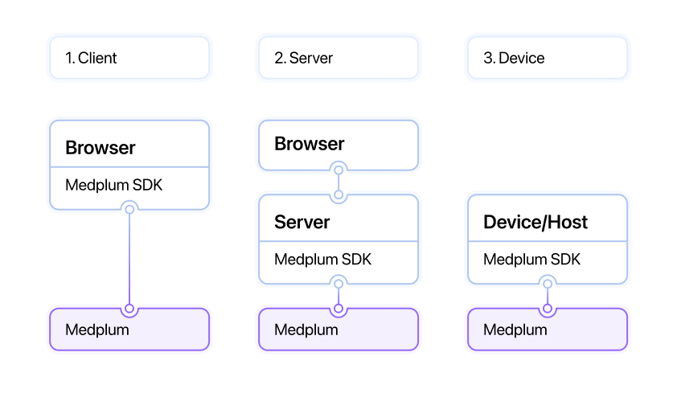
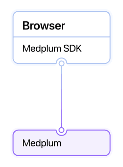
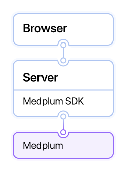
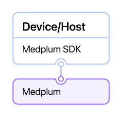

# Authentication Patterns

Medplum supports **three primary authentication integration patterns**, summarized by the following diagram. Each has its own use case, and is supported by various authentication methods. An implementation can use multiple or all patterns for different use cases.

This diagram shows a high level summary of the three common patterns. The [Medplum Typescript SDK](/docs/sdk/classes/MedplumClient#authentication) can (optionally) be used in all three patterns.

There are 3 primary domains of authentication for a Medplum healthcare app:

- **Client-side: ** A user facing application, typically running in a web browser or native app
- **Server-side:** A back-end web server acting as a proxy to Medplum, operating in a trusted environment
- **Device / Host:** A non-web enabled device, such as lab analyzer or on-premise host machine

## Client Side

Client side authentication is when a **user facing application** connects directly to Medplum to request, create or update data. These applications typically operate in untrusted environments, such as web browsers or native mobile applications, and have users (providers or patients) provide user credentials to verify their identity.

Rate limits will be enforced for client authentication, as it is assumed that traffic is coming from end users.

When implementing client side authentication, developers must choose an identity provider. Developers can either use Medplum as their primary identity provider, or use an external identity provider such as [Auth0](https://auth0.com/), [Okta](https://www.okta.com/), or [AWS Cognito](https://aws.amazon.com/cognito/).

### Medplum as Identity Provider

When using Medplum as an identity provider, the recommended client side authentication pattern is to use the [OAuth2 Auth Code](/docs/auth/methods/oauth-auth-code) flow.

You can initiate this in the Medplum Client using the [`startLogin`](/docs/sdk/classes/MedplumClient#startlogin) method.

### External Identity Provider

Another option developers have integrating an external identity provider, such as [Auth0](https://auth0.com/), [Okta](https://www.okta.com/), or [AWS Cognito](https://aws.amazon.com/cognito/), to authenticate users. This is valuable in creating **SSO (single sign on)** experiences or when implementing **alternative log-in flows** (passwordless, SMS, biometric, etc.) .

When integrating an external identity provider, developers have a few additional decisions to make:

#### Application-level vs. Domain-level

Most implementations integrate identity providers at the client application level. This allows different applications to use different identity providers. For example, a patient-facing application may use [google auth](/docs/auth/methods/google-auth), but the provider-facing application may use the company's Okta account.

However, in some cases implementers would like _all_ users with a given domain (e.g. @myhospital.org) to sign in with a given identity provider _regardless of which application they are logging into._ Medplum offers [domain level identity provider](/docs/auth/methods/domain-level-identity-providers) integration for these use cases.

#### Medplum Managed Token vs. Token Exchange

Logging in with an external identity provider will produce an access token issued by that provider (e.g. an Auth0 access token). To use this token with Medplum APIs, your application will need to exchange the identity provider's access token for a _Medplum access token_.

If your application only accesses Medplum APIs, you can handle this token-exchange purely on the server side using **federated identity** login. The benefit of this approach is that your application only needs to maintain a single access token. Our [External Identity Providers](/docs/auth/methods/external-identity-providers) guide describes how to set up this log in flow, and you can use the [`signInWithExternalAuth`](/docs/sdk/classes/MedplumClient#signinwithexternalauth) SDK function to initiate the log in flow from your application.

In some situations, your application might need to store the external access token _as well as_ the Medplum token. This commonly occurs when migrating an existing application onto Medplum. In these cases, you can use the [token exchange method](/docs/auth/methods/token-exchange) to exchange the external token for the Medplum token _from the client_. While this approach is simpler to implement, it requires your application to maintain two separate access tokens in the browser. The corresponding SDK method for this approach is [`exchangeExternalAccessToken`](/docs/sdk/classes/MedplumClient#exchangeexternalaccesstoken).

#### External IDs

When integrating with external identity providers, Medplum needs some way to map users from the external provider to Medplum users (see the [User Management Guide](/docs/auth/user-management-guide#user-administration-via-medplum-app) for more details). **By default, Medplum matches users in both systems using their email addresses.**

For login flows that don't use email address (e.g. phone number login), Medplum allows you to use an external ID supplied by the identity provider as the user's unique ID. See our guide on [Using External IDs](/docs/auth/methods/external-ids) for more information.

:::tip

Medplum provides built-in first party integration with [Google](./google-auth.md). See our [Google Auth Guide](./google-auth.md) for more details.

:::

### See Also

- [IP Address restriction](/docs/access/ip-access-rules) for logins
- Use of Medplum [React components](/docs/ui-components) such as the [Signin](https://storybook.medplum.com/?path=/story/medplum-signinform--basic) and [Register](https://storybook.medplum.com/?path=/story/medplum-registerform--basic)
-

The [Medplum Typescript SDK](/docs/sdk/classes/MedplumClient#authentication) can be used in the browser to enable client side authentication of different kinds, for example [signInWithExternalAuth](/docs/sdk/classes/MedplumClient#signinwithexternalauth).

## Server Side

Server side authentication is when a **user facing application proxies through a host** to connect to Medplum. This integration can be useful when adding Medplum functionality to a legacy application.

For server side authentication, developers should set up a `ClientApplication` to identify the server (see this guide on [Creating a Client Application](/docs/auth/methods/oauth-auth-code#create-a-client-application)). When looking at resource [history](/docs/sdk/classes/MedplumClient#readhistory) and AuditEvents for this type of implementation, actions will be taken on behalf of the `ClientApplication` that the server is using to connect.

The [Client Credentials](/docs/auth/methods/client-credentials) flow is the recommended authentication pattern for this kind of integration. Each server can manage credentials and tokens, and use the Medplum SDK to authenticate. Using the [Typescript SDK](/docs/sdk/classes/MedplumClient), maintain an instance of `MedplumClient` as part of your running application and use the [startClientLogin](docs/sdk/classes/MedplumClient#startclientlogin) call to start an [active login](/docs/sdk/classes/MedplumClient#getactivelogin). The client will continue to refresh the connection if it is in active use, storing the access token in memory on the server.

Client credentials access token should be stored in session state and reused. Client credential flow is rate limited, so frequently requesting tokens will lead to service degradation. This may not be possible in some stateless server environments, and Medplum supports [Basic Auth](https://www.medplum.com/docs/sdk/classes/MedplumClient#setbasicauth) to support these use cases.

## Device/Host

Device authentication is designed for true machine connectivity, for example connecting a laboratory analyzer machine, or a CI/CD pipeline to Medplum. This is distinct from server side authentication, in which the server a proxy for a user facing application.

For machine connectivity, we encourage use of [ClientCredentials](/docs/auth/methods/client-credentials) with tightly scoped [access controls](/docs/access/access-policies), giving minimal access to the host at the edge.

If OAuth2 client credentials based authentication is not an option due to device limitations, [Basic Authentication](https://www.medplum.com/docs/sdk/classes/MedplumClient#setbasicauth) can be used to connect to Medplum. In general, OAuth2 is preferred to basic authentication. [Consuming webhooks](/docs/bots/consuming-webhooks) is an example application where Basic Authentication makes sense.
