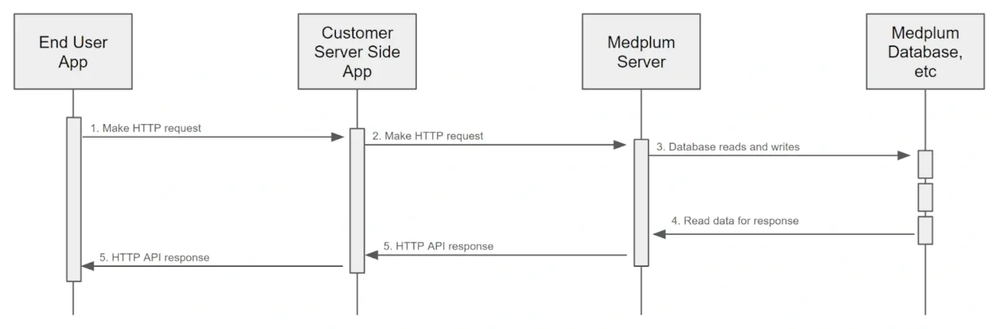

# On-Behalf-Of

The Medplum API supports an "On-Behalf-Of" feature to enable a Customer Server Side App to act on behalf of a Medplum user.

This feature is designed to enable a common Medplum architectural pattern where the Customer Server Side App is the only system component that interacts with Medplum Server.

## Overview

Consider this common Medplum architectural pattern:



Here, the Medplum "Customer" has a custom End User App and a Server Side App to enable their business requirements.

In this model, the Customer Server Side App is the only system component that interacts with Medplum Server. In this model, the Medplum Server is more like an internal data store.

Historically, it was difficult to use this model and take advantage of many Medplum features related to Medplum authentication (author tracking, access policies, etc).

Now, with the "On-Behalf-Of" feature, the Customer Server Side App can act on behalf of a Medplum user.

## How to Use

First, the Customer Server Side App must authenticate with Medplum Server as a `ClientApplication`. This is the same as any other Medplum `ClientApplication`.

The only requirement for the `ClientApplication` is that it has [Project Admin](/docs/access/admin#project-admin) rights. This is because the `ClientApplication` will be acting on behalf of a Medplum ProjectMembership.

Then, when making API requests, the Customer Server Side App must include an `X-Medplum-On-Behalf-Of` HTTP header. The value of this header can be either:

1. A `ProjectMembership` ID - This is the most direct and explicit way to specify the Medplum user. The Customer Server Side App would presumably store this id in its own database.
2. A profile ID such as `Patient` or `Practitioner` - This is a more natural value for the Customer Server Side App to use, but requires a lookup to find the corresponding `ProjectMembership`.

For more information on `ProjectMemberships` and profile resources, see the [User Management Guide](https://www.medplum.com/docs/auth/user-management-guide).

At this time, the `ClientApplication` must use Basic Authentication to authenticate with Medplum Server. This bypasses the need for managing expiring access tokens and refresh tokens.

## How it Works

When the Medplum Server receives a request with the `X-Medplum-On-Behalf-Of` header, it will:

1. Authenticate the `ClientApplication` as normal
2. Check for the `X-Medplum-On-Behalf-Of` header
3. If present, set up the Repository instance accordingly
   - Set `onBehalfOf` to the specified `ProjectMembership` ID
   - Use the `ProjectMembership` access policy
4. Proceed with the request as normal
5. Include the `onBehalfOf` value in the `meta.onBehalfOf` element of the response

## Example

Here is a curl example of using the `X-Medplum-On-Behalf-Of` header:

```bash
curl 'https://api.medplum.com/fhir/R4/Patient' \
  --user $MY_CLIENT_ID:$MY_CLIENT_SECRET \
  -H 'content-type: application/fhir+json' \
  -H 'x-medplum: extended' \
  -H 'x-medplum-on-behalf-of: ProjectMembership/00000000-001a-4722-afa1-0581d2c52a87' \
  --data-raw '{"resourceType":"Patient","name":[{"given":["Homer"],"family":"Simpson"}]}'
```

Note the two extra HTTP request headers:

1. `X-Medplum: extended` - This is required to enable the extended Medplum API features, such as `meta.author` and `meta.onBehalfOf`.
2. `X-Medplum-On-Behalf-Of` - This is the `ProjectMembership` ID that the client is acting on behalf of.

Here is the resulting FHIR JSON:

```json
{
  "resourceType": "Patient",
  "id": "00000000-689b-4e20-a3c2-6f55108b432a",
  "meta": {
    "versionId": "00000000-b58b-47c8-9fc0-f85627d333c9",
    "lastUpdated": "2024-07-13T21:18:45.850Z",
    "author": {
      "reference": "ClientApplication/00000000-d361-46f0-adf4-f56da467dc08",
      "display": "My Client"
    },
    "onBehalfOf": {
      "reference": "Practitioner/00000000-9886-4b83-a25a-3b99563b8127",
      "display": "My Test User"
    }
  },
  "name": [{ "given": ["Homer"], "family": "Simpson" }]
}
```
