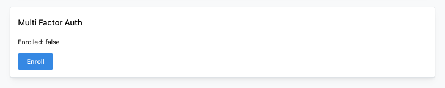

import Tabs from '@theme/Tabs';
import TabItem from '@theme/TabItem';

# Multi-Factor Authentication (MFA)

Multi-Factor Authentication (MFA) adds an extra layer of security to user accounts by requiring a second authentication factor beyond a password. Medplum supports Time-based One-Time Password (TOTP) authentication, which is compatible with authenticator apps like Google Authenticator, Microsoft Authenticator, Authy, and others.

:::note
Users enrolled in MFA will only be asked for an MFA code during a login with Username/Password
:::

## Self-Enrollment

Users can self-enroll in MFA through the Medplum App security settings.

### Steps to Self-Enroll

1. Navigate to the Security page at `https://app.medplum.com/security`
2. You will see the "Multi Factor Auth" section showing your current enrollment status
3. If not enrolled, click the **"Enroll"** button



4. A QR code will be displayed that you can scan with your authenticator app
5. Enter the 6-digit code from your authenticator app to complete enrollment

Once enrolled, you will be required to enter your MFA code during login. The MFA status will show as "Enrolled: true" on the security page, and you can disable MFA at any time by clicking the "Disable MFA" button (you'll need to provide your current MFA code to disable it).

## Requiring MFA for New Users

Administrators can require new users to set up MFA during the invitation process by setting the `mfaRequired` parameter to `true` in the [invite request](/docs/api/project-admin/invite).

When a user is invited with `mfaRequired: true`:

1. A MFA secret is automatically generated for the user
2. During their first login, after entering their password, they will be prompted to enroll in MFA
3. They must complete MFA enrollment before they can access the system

### Example: Inviting a User with MFA Required

<Tabs groupId="language">
  <TabItem value="ts" label="TypeScript">

```ts
await medplum.invite(123, {
  resourceType: 'Practitioner',
  firstName: 'Jane',
  lastName: 'Doe',
  email: 'jane.doe@example.com',
  mfaRequired: true,
});
```

  </TabItem>
  <TabItem value="cli" label="CLI">

```bash
medplum post admin/projects/:projectId/invite \
'{
  "resourceType": "Practitioner",
  "firstName": "Jane",
  "lastName": "Doe",
  "email": "jane.doe@example.com",
  "mfaRequired": true
}'
```

  </TabItem>
  <TabItem value="curl" label="cURL">

```bash
curl https://api.medplum.com/admin/projects/:projectId/invite \
  -H "Authorization: Bearer $TOKEN" \
  -H "Content-Type: application/json" \
  -d '{
  "resourceType": "Practitioner",
  "firstName": "Jane",
  "lastName": "Doe",
  "email": "jane.doe@example.com",
  "mfaRequired": true
}'
```

  </TabItem>
</Tabs>

For more details on the invite endpoint, see the [Invite User Endpoint](/docs/api/project-admin/invite) documentation.


## Using Medplum's SignInForm Component

**We recommend using Medplum's [`SignInForm`](https://storybook.medplum.com/?path=/story/medplum-auth-signinform--basic) React component** for handling authentication flows that include MFA. The `SignInForm` component automatically handles all MFA-related UI and flows, including:

- **MFA Enrollment**: Automatically detects when a user needs to enroll in MFA (e.g., when `mfaRequired: true` was set during invitation) and displays the enrollment screen with QR code
- **MFA Verification**: Automatically prompts for MFA codes when users with enrolled MFA attempt to log in

