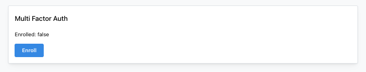

import Tabs from '@theme/Tabs';
import TabItem from '@theme/TabItem';

# Multi-Factor Authentication (MFA)

Multi-Factor Authentication (MFA) adds an extra layer of security to user accounts by requiring a second authentication factor beyond a password. Medplum supports two MFA methods:

- **Authenticator app (TOTP)** — a Time-based One-Time Password compatible with authenticator apps like Google Authenticator, Microsoft Authenticator, Authy, and others.
- **Email** — a single-use 6-digit code emailed to the user's address each time it is needed.

By default, only the authenticator app (TOTP) method is offered. Email-based MFA must be enabled per [`Project`](/docs/api/fhir/medplum/project) via the [`allowedMfaMethods`](#configuring-allowed-mfa-methods) setting. Users may enroll in more than one method and choose which to use at login.

:::note[]
Users enrolled in MFA will only be asked for an MFA code during a login with Username/Password
:::

## Configuring allowed MFA methods

The MFA methods that users in a Project can enroll in are controlled by the `allowedMfaMethods` setting on the [`Project`](/docs/api/fhir/medplum/project) resource. It is stored as a single [`Project.setting`](/docs/self-hosting/project-settings) entry whose `valueString` is a comma-delimited list of method codes:

| Value         | Methods offered                                                  |
| ------------- | ---------------------------------------------------------------- |
| _(unset)_     | Authenticator app (TOTP) only — the historical default           |
| `totp`        | Authenticator app (TOTP) only                                    |
| `email`       | Email codes only                                                 |
| `totp,email`  | Both — users choose which to enroll in and which to use at login |

When the setting is missing, empty, or contains no recognized value, Medplum falls back to `totp` only.

### Enabling email-based MFA

To allow users in a Project to use email-based MFA, set the `allowedMfaMethods` setting to include `email`. `Project` settings can be edited by a Project Admin, or in the Medplum App by a Super Admin on the Project edit page.

<Tabs groupId="language">
  <TabItem value="ts" label="TypeScript">

```ts
const project = await medplum.readResource('Project', projectId);
await medplum.updateResource({
  ...project,
  setting: [
    // Preserve any other settings, replacing allowedMfaMethods if it exists
    ...(project.setting ?? []).filter((s) => s.name !== 'allowedMfaMethods'),
    { name: 'allowedMfaMethods', valueString: 'totp,email' },
  ],
});
```

  </TabItem>
  <TabItem value="cli" label="CLI">

```bash
# Add the setting to the Project resource (replace <projectId> and merge with
# any existing settings)
medplum patch Project/<projectId> \
'[{
  "op": "add",
  "path": "/setting/-",
  "value": { "name": "allowedMfaMethods", "valueString": "totp,email" }
}]'
```

  </TabItem>
</Tabs>

Use `valueString: 'email'` to offer email codes only, or `valueString: 'totp'` (or remove the setting) to restrict users to authenticator apps.

:::note[]
Changing `allowedMfaMethods` affects which methods users can **newly enroll** in. Users already enrolled in a method that is later disallowed keep that method until they remove it.
:::

## Self-Enrollment

Users can self-enroll in MFA through the Medplum App security settings. The methods offered depend on the Project's [`allowedMfaMethods`](#configuring-allowed-mfa-methods) setting.

### Steps to Self-Enroll

1. Navigate to the Security page at `https://app.medplum.com/security`
2. You will see the "Multi Factor Auth" section showing your current enrollment status
3. Choose a method to enroll in:

**Authenticator app (TOTP)**



- A QR code will be displayed that you can scan with your authenticator app
- Enter the 6-digit code from your authenticator app to complete enrollment

**Email**

- Click **"Add email-based MFA"** — a 6-digit code is emailed to your account's address
- Enter the code to verify control of your email and complete enrollment

Once enrolled, you will be required to provide an MFA code during login. When both methods are allowed, a user can enroll in both and add or remove individual methods from the Security page. You can disable MFA at any time by clicking the "Disable MFA" button (you'll need to provide a current MFA code to disable it).

## Requiring MFA for New Users

Administrators can require new users to set up MFA during the invitation process by setting the `mfaRequired` parameter to `true` in the [invite request](/docs/api/project-admin/invite).

When a user is invited with `mfaRequired: true`:

1. A MFA secret is automatically generated for the user
2. During their first login, after entering their password, they will be prompted to enroll in MFA
3. They must complete MFA enrollment before they can access the system

### Example: Inviting a User with MFA Required

<Tabs groupId="language">
  <TabItem value="ts" label="TypeScript">

```ts
await medplum.invite(123, {
  resourceType: 'Practitioner',
  firstName: 'Jane',
  lastName: 'Doe',
  email: 'jane.doe@example.com',
  mfaRequired: true,
});
```

  </TabItem>
  <TabItem value="cli" label="CLI">

```bash
medplum post admin/projects/:projectId/invite \
'{
  "resourceType": "Practitioner",
  "firstName": "Jane",
  "lastName": "Doe",
  "email": "jane.doe@example.com",
  "mfaRequired": true
}'
```

  </TabItem>
  <TabItem value="curl" label="cURL">

```bash
curl https://api.medplum.com/admin/projects/:projectId/invite \
  -H "Authorization: Bearer $TOKEN" \
  -H "Content-Type: application/json" \
  -d '{
  "resourceType": "Practitioner",
  "firstName": "Jane",
  "lastName": "Doe",
  "email": "jane.doe@example.com",
  "mfaRequired": true
}'
```

  </TabItem>
</Tabs>

For more details on the invite endpoint, see the [Invite User Endpoint](/docs/api/project-admin/invite) documentation.


## Admin MFA Reset

Project admins can reset MFA for members who have lost access to a factor via the `POST /admin/projects/:projectId/members/:membershipId/mfa/reset` endpoint. In the Medplum App, this is available from the **Account Security** section of a member's detail page (**Admin → Users → _member_**), and as a bulk action on the users table.

The request body accepts an optional `method` field:

| `method`       | Effect                                                                 |
| -------------- | ---------------------------------------------------------------------- |
| _(omitted)_    | Resets `totp` — the backwards-compatible default                       |
| `totp`         | Resets the authenticator app factor and rotates the TOTP secret        |
| `email`        | Resets the email factor; the TOTP secret is left untouched             |

Only the selected factor is reset; any other enrolled factors remain active. When reset:

- The selected method is removed from the user's enrolled methods (`mfaMethod`), and `mfaEnrolled` is cleared once no factors remain.
- Resetting `totp` rotates the TOTP secret, so the old authenticator app entry cannot be reused.
- The user receives an email notification.
- If no factors remain, the user must re-enroll in MFA on their next login (if `mfaRequired` is set) or via the Security settings page.

The endpoint returns `400` if the member is not enrolled in the requested method. Unlike self-service MFA disable, an admin reset does not require an MFA code and can remove a required user's last factor (forcing re-enrollment at next login).

<Tabs groupId="language">
  <TabItem value="ts" label="TypeScript">

```ts
// Reset the authenticator app (TOTP) factor — the default
await medplum.resetMemberMfa(projectId, membershipId);

// Reset the email factor instead
await medplum.resetMemberMfa(projectId, membershipId, 'email');
```

  </TabItem>
  <TabItem value="cli" label="CLI">

```bash
# Reset TOTP (default)
medplum post admin/projects/:projectId/members/:membershipId/mfa/reset '{}'

# Reset the email factor
medplum post admin/projects/:projectId/members/:membershipId/mfa/reset '{"method":"email"}'
```

  </TabItem>
  <TabItem value="curl" label="cURL">

```bash
curl -X POST https://api.medplum.com/admin/projects/:projectId/members/:membershipId/mfa/reset \
  -H "Authorization: Bearer $TOKEN" \
  -H "Content-Type: application/json" \
  -d '{"method":"totp"}'
```

  </TabItem>
</Tabs>

## Admin Password Reset

Project admins can send a member a password reset email via the `POST /admin/projects/:projectId/members/:membershipId/resetpassword` endpoint. This creates a single-use reset link and emails it to the member, mirroring the self-service reset flow but scoped to a known member. The member's current password remains valid until they complete the reset. This action is also available from the **Account Security** section of a member's detail page and as a bulk action on the users table.

<Tabs groupId="language">
  <TabItem value="ts" label="TypeScript">

```ts
await medplum.sendMemberPasswordReset(projectId, membershipId);
```

  </TabItem>
  <TabItem value="cli" label="CLI">

```bash
medplum post admin/projects/:projectId/members/:membershipId/resetpassword '{}'
```

  </TabItem>
  <TabItem value="curl" label="cURL">

```bash
curl -X POST https://api.medplum.com/admin/projects/:projectId/members/:membershipId/resetpassword \
  -H "Authorization: Bearer $TOKEN" \
  -H "Content-Type: application/json" \
  -d '{}'
```

  </TabItem>
</Tabs>

To set a member's password directly (without emailing them), use the [`POST /admin/projects/setpassword`](/docs/api/project-admin) endpoint with the member's email — also surfaced as **Set password** in the Account Security section.

## How email-based MFA works

Unlike the authenticator app method, which derives codes from a shared secret stored on the user, email-based MFA issues a fresh single-use code each time one is needed.

When a code is required, Medplum:

1. Generates a random 6-digit code.
2. Stores a hash of the code (never the code itself) on the user's `Login`, along with an expiration timestamp.
3. Emails the code to the user's address with the subject `Your Medplum verification code: <code>`.

The code is **valid for 20 minutes**. Each code is single-use — it is cleared once verified — and submitting an expired or incorrect code is rejected, so the user must request a new one.

### At login

When a user enrolled in email-based MFA signs in with their username and password:

1. After the password is accepted, Medplum recognizes that the login still needs a second factor.
2. If email is the user's only enrolled method, the code is **sent automatically** and the sign-in form goes straight to the code-entry step. If the user also has an authenticator app, they can choose to receive a code by email instead.
3. The user enters the 6-digit code from their email to complete the login.

If a code expires or is lost, the user can request a new one from the sign-in form, which sends a fresh code and resets the 20-minute window.

### At enrollment

Enrolling in email-based MFA requires the user to prove control of their email address. When the user starts enrollment, Medplum emails a code; the user enters it to verify and finish enrolling. The same emailed-code verification is required when an enrolled user adds, removes, or disables an email factor.

## Using Medplum's SignInForm Component

**We recommend using Medplum's [`SignInForm`](https://storybook.medplum.com/?path=/story/medplum-auth-signinform--basic) React component** for handling authentication flows that include MFA. The `SignInForm` component automatically handles all MFA-related UI and flows, including:

- **MFA Enrollment**: Automatically detects when a user needs to enroll in MFA (e.g., when `mfaRequired: true` was set during invitation) and displays the enrollment screen with QR code
- **MFA Verification**: Automatically prompts for MFA codes when users with enrolled MFA attempt to log in

